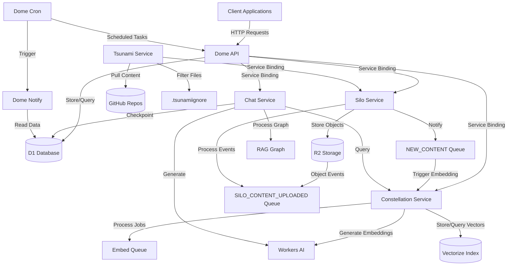
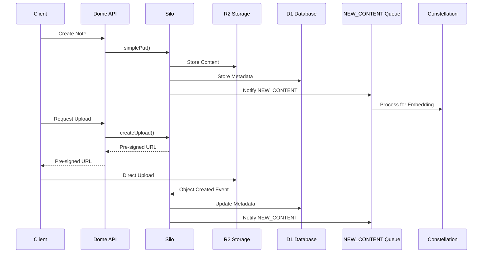
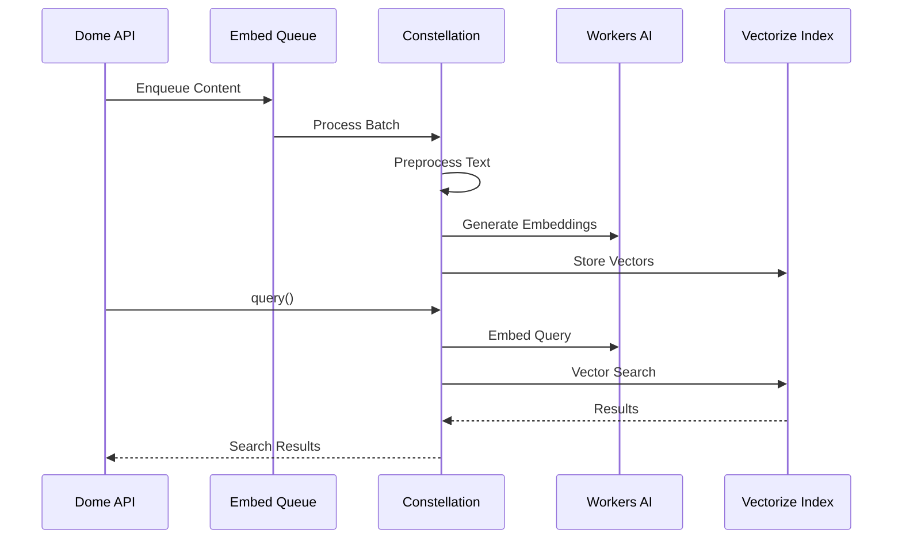
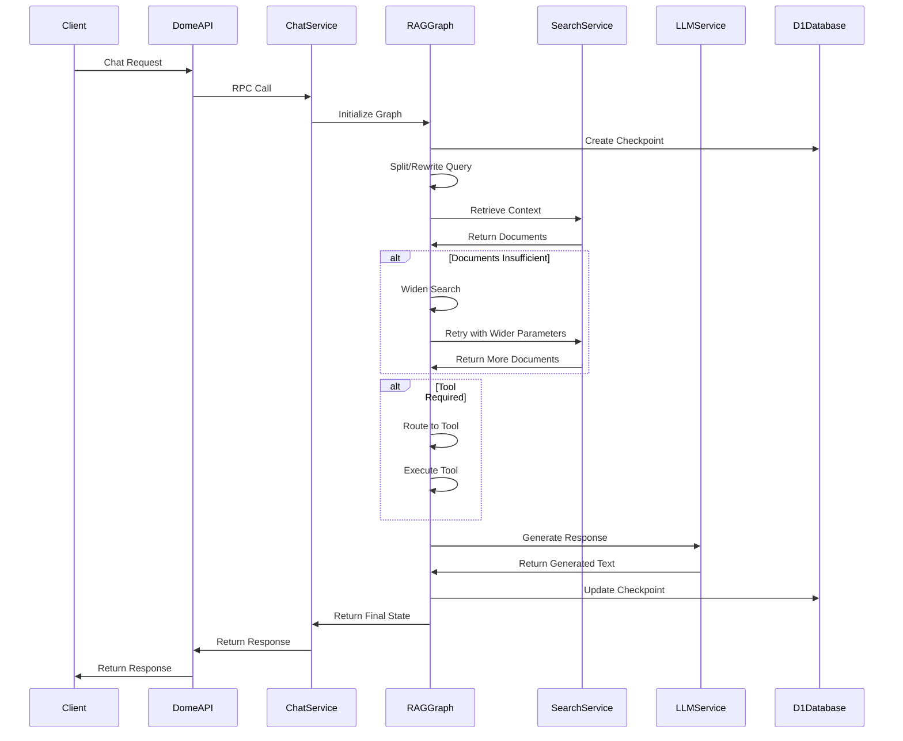
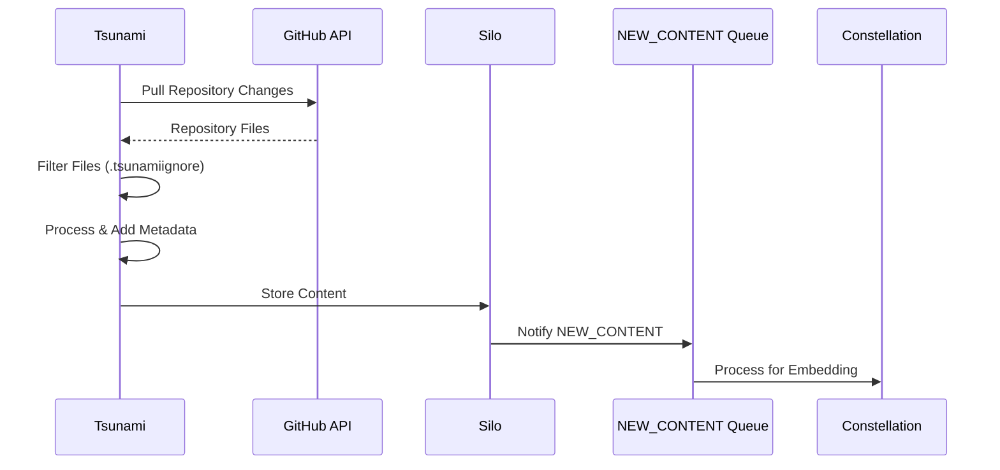

# Dome: AI-Powered Exobrain Platform

Dome is a modern, cloud-native platform for personal knowledge management, built on Cloudflare's edge infrastructure. It provides a secure, scalable, and efficient way to store, search, and interact with your personal knowledge base.

## System Architecture

Dome follows a microservices architecture built on Cloudflare Workers, with specialized services communicating through typed interfaces, queues, and shared data stores.



### Key Components

#### 1. Dome API Service

The primary entry point for client applications, handling HTTP requests and coordinating with other services.

- Built with Hono framework
- Provides RESTful API endpoints for notes, search, and chat
- Handles authentication and authorization
- Coordinates with other services via service bindings

#### 2. Silo Service

A unified content storage service designed to ingest, catalog, and serve user-generated content.

- Persists content bodies in R2 and metadata in D1
- Supports multiple content types (notes, code, articles, etc.)
- Provides multiple upload paths (small sync API, direct-to-R2 POST)
- Enables event-driven updates to downstream services



#### 3. Constellation Service

A dedicated service for handling all embedding and vector search operations.

- Consumes text from queues and generates embeddings using Workers AI
- Stores vectors in Vectorize index
- Provides typed RPC interface for vector search
- Handles preprocessing and chunking of content



#### 4. Chat Service

A Retrieval-Augmented Generation (RAG) system that enhances AI responses with relevant context from the user's knowledge base.

- Uses a directed graph architecture for flexible processing flow
- Retrieves relevant context from Constellation service
- Manages token usage and context prioritization
- Supports streaming responses and state persistence
- Implements tools for specialized operations



#### 5. Tsunami Service

A specialized service for ingesting content from external sources, particularly code repositories.

- Pulls content from GitHub repositories
- Filters files based on `.tsunamiignore` patterns (similar to `.gitignore`)
- Injects metadata headers into content before sending to Silo
- Supports incremental syncing with external sources
- Provides configurable file filtering to reduce noise and improve search quality



#### 6. Supporting Services

- **Dome Cron**: Handles scheduled tasks and periodic operations
- **Dome Notify**: Manages notifications and alerts
- **CLI**: Command-line interface for interacting with the platform

#### 7. Infrastructure Components

- **D1 Database**: SQL database for structured data
- **R2 Storage**: Object storage for content bodies
- **Vectorize**: Vector database for embeddings
- **Workers AI**: AI models for embeddings and text processing
- **Workers Queues**: Asynchronous processing of jobs

## Technology Stack

- **Runtime**: Cloudflare Workers (JavaScript/TypeScript)
- **API Framework**: Hono
- **Database ORM**: Drizzle
- **Graph Processing**: LangGraph.js (for RAG workflows)
- **Package Management**: pnpm workspaces
- **Type Safety**: TypeScript, Zod
- **Logging**: Structured logging with @dome/logging
- **Metrics**: Custom metrics collection and reporting
- **Infrastructure**: Pulumi for infrastructure as code

## Repository Structure

```
dome/
├── services/               # Microservices
│   ├── dome-api/           # Main API service
│   ├── constellation/      # Embedding service
│   ├── silo/               # Content storage service
│   ├── chat/               # RAG chat service
│   ├── tsunami/            # External content ingestion
│   ├── dome-cron/          # Scheduled tasks
│   └── dome-notify/        # Notifications
├── packages/               # Shared libraries
│   ├── common/             # Common utilities and types
│   ├── logging/            # Logging infrastructure
│   ├── metrics/            # Metrics collection
│   └── cli/                # Command-line interface
├── docs/                   # Documentation
├── infra/                  # Infrastructure as code
└── scripts/                # Utility scripts
```

## Development Workflow

Dome uses a monorepo approach with pnpm workspaces:

- Install dependencies: `pnpm install`
- Build all packages: `pnpm build`
- Run tests: `pnpm test`
- Deploy services: `pnpm deploy`

## Service Communication

Services communicate through:

1. **Service Bindings**: Direct, typed RPC calls between workers
2. **Queues**: Asynchronous job processing
3. **Shared Data Stores**: D1, R2, and Vectorize

Example of service binding usage:

```typescript
// In dome-api
const results = await env.CONSTELLATION.query(searchText, { userId }, 10);

// In dome-api
const uploadUrl = await env.SILO.createUpload({
  contentType: 'note',
  size: content.length,
});

// Chat service example
const chatResponse = await env.CHAT.generateResponse({
  userId,
  messages: [{ role: 'user', content: userQuery }],
  stream: false,
});
```

## Error Handling and Observability

Dome implements comprehensive error handling and observability:

- Structured logging with consistent fields across services
- Error categorization and propagation
- Custom metrics collection for performance monitoring
- Distributed tracing with trace and span IDs
- Standard error response format for client applications

## Future Enhancements

- **Hybrid Search**: Combining vector search with traditional text search
- **Re-ranking**: Implementing re-ranking of search results
- **Multi-Modal Support**: Handling images and other media types
- **Summarization**: Adding summarization capabilities
- **Multi-model Support**: Supporting multiple embedding models
- **Cross-user Search**: Implementing secure cross-user search
- **Advanced Tool Integration**: More sophisticated tool execution

## Getting Started

See [docs/DEV_SETUP.md](docs/DEV_SETUP.md) for detailed setup instructions.

# TODOS

- retrieval tools more complex input parameters (i.e. todo priority)
- chat history handling
