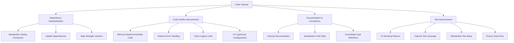

# Code Cleanup Plan for Dome-CF Project

After analyzing the codebase and test files, I've identified several areas that would benefit from a thorough code cleanup. This plan outlines the issues found and proposes specific improvements for each area, with a strong focus on ensuring tests pass.

## 1. Project Structure Analysis

The project is a Cloudflare Workers-based monorepo with:

- **Packages**: Shared libraries (cli, common, logging)
- **Services**: Microservices (dome-api, dome-cron, dome-notify)
- **Infrastructure**: Deployment configurations

## 2. Issues Identified

### 2.1. Dependency Management
- Inconsistent dependency versions across packages
- Mix of Jest and Vitest for testing
- Outdated dependencies in some packages
- Inconsistent Wrangler versions (v3 in dome-cron, v4 in dome-api)

### 2.2. Code Quality Issues
- Commented-out code in logging package
- Inconsistent error handling patterns
- Legacy compatibility code in embeddingService.ts
- Inconsistent TypeScript configurations
- Path aliases in root tsconfig.json reference "@communicator/common" but packages use "@dome/common"

### 2.3. Documentation and Consistency
- Missing or incomplete documentation in some files
- Inconsistent code formatting and style
- Inconsistent use of async/await patterns
- Duplicate type definitions across files

### 2.4. Test Issues
- Mocking inconsistencies in test files
- Potential issues with Cloudflare Workers environment mocking
- Incomplete test coverage for some components
- Inconsistent test patterns across packages

## 3. Cleanup Plan

### 3.1. Dependency Standardization

1. **Standardize Testing Framework**
   - Choose Vitest consistently across all packages (already used in logging package)
   - Update test scripts and configurations in packages using Jest
   - Ensure consistent test patterns and mocking approaches

2. **Update Dependencies**
   - Update all dependencies to their latest compatible versions
   - Ensure consistent versions across packages for shared dependencies
   - Audit and fix security vulnerabilities
   - Update pino from v8 to v9 in logging package to match dome-api

3. **Align Wrangler Versions**
   - Standardize on Wrangler v4 across all services
   - Update configurations to match the latest Wrangler requirements
   - Update dome-cron from Wrangler v3 to v4

### 3.2. Code Quality Improvements

1. **Remove Dead/Commented Code**
   - Clean up commented code in base.ts and other files
   - Remove unused functions and variables
   - Clean up the browser configuration in base.ts

2. **Refactor Error Handling**
   - Implement consistent error handling patterns across services
   - Improve error messages and context
   - Standardize error handling in try/catch blocks

3. **Clean Legacy Code**
   - Remove deprecated methods in embeddingService.ts
   - Refactor to use modern patterns
   - Remove legacy compatibility wrappers

4. **Fix TypeScript Configurations**
   - Correct path aliases in tsconfig.json
   - Ensure consistent TypeScript settings across packages
   - Update paths from "@communicator/common" to "@dome/common"

### 3.3. Documentation & Consistency

1. **Improve Documentation**
   - Add JSDoc comments to all exported functions and classes
   - Update README files with clear usage instructions
   - Document error handling patterns

2. **Standardize Code Style**
   - Apply consistent formatting rules
   - Standardize import ordering
   - Ensure consistent naming conventions

3. **Consolidate Type Definitions**
   - Move shared types to common package
   - Eliminate duplicate type definitions
   - Improve type safety across the codebase

### 3.4. Test Improvements

1. **Fix Mocking Patterns**
   - Standardize mocking approach for Hono context
   - Improve mocking of Cloudflare Workers environment
   - Ensure consistent mocking patterns across test files

2. **Improve Test Coverage**
   - Add tests for error handling paths
   - Ensure all exported functions have test coverage
   - Add integration tests where appropriate

3. **Standardize Test Setup**
   - Create consistent test setup files across packages
   - Standardize mocking of external dependencies
   - Improve the Cloudflare Workers environment mocking in setup.js

4. **Ensure Tests Pass**
   - Fix any failing tests
   - Address test warnings
   - Ensure tests are reliable and not flaky

## 4. Implementation Strategy

To implement this cleanup effectively, I recommend:

1. **Phased Approach**: Tackle each area separately to minimize disruption
   - Start with test improvements to establish a reliable baseline
   - Then address code quality issues
   - Finally, update dependencies and documentation

2. **Automated Testing**: Ensure all tests pass after each change
   - Run tests frequently during cleanup
   - Fix failing tests immediately
   - Add new tests for uncovered code paths

3. **Code Reviews**: Have team members review changes to catch any issues
   - Focus on readability and maintainability
   - Ensure consistent patterns are followed
   - Verify that tests pass consistently

4. **Documentation Updates**: Update documentation alongside code changes
   - Keep README files up to date
   - Add JSDoc comments to all exported functions
   - Document any breaking changes

## 5. Specific Files to Target

### 5.1. Logging Package

1. **Base Logger (base.ts)**
   - Clean up commented code
   - Standardize browser configuration
   - Improve error handling
   - Add proper JSDoc documentation

2. **Helper Functions (helper.ts)**
   - Improve error handling in getLogger function
   - Add more context to error messages
   - Enhance type safety

3. **Middleware (middleware.ts)**
   - Standardize type definitions
   - Improve error handling
   - Enhance documentation

4. **Run With Logger (runWithLogger.ts)**
   - Fix error handling in catch block
   - Improve type definitions
   - Add better documentation

5. **Tests**
   - Standardize mocking patterns
   - Improve test coverage
   - Fix any failing tests

### 5.2. EmbeddingService

1. **Clean Legacy Code**
   - Remove deprecated methods (generateEmbedding, generateEmbeddings)
   - Improve error handling in generate and generateBatch methods
   - Enhance documentation

2. **Improve Type Safety**
   - Add proper type definitions for API responses
   - Improve error handling with more specific types
   - Add JSDoc comments to all methods

### 5.3. Configuration Files

1. **TypeScript Configuration**
   - Fix path aliases in tsconfig.json
   - Standardize TypeScript settings across packages
   - Update paths from "@communicator/common" to "@dome/common"

2. **Wrangler Configuration**
   - Standardize wrangler.toml configurations
   - Update to latest Wrangler features
   - Ensure consistent settings across services

3. **Package.json Files**
   - Update dependencies to latest versions
   - Standardize on Vitest for testing
   - Ensure consistent script names and behaviors

## 6. Test Improvement Details

Based on the analysis of test files, here are specific improvements to make:

1. **Standardize Mocking**
   - Create consistent mocks for Hono context
   - Standardize mocking of Cloudflare Workers environment
   - Use consistent patterns for mocking external dependencies

2. **Improve Test Coverage**
   - Add tests for error paths in helper.ts
   - Add tests for edge cases in middleware.ts
   - Ensure all exported functions have test coverage

3. **Fix Test Setup**
   - Enhance the Cloudflare Workers environment mocking in setup.js
   - Add missing global mocks for Cloudflare Workers
   - Ensure consistent test environment across packages

4. **Address Specific Test Issues**
   - Fix potential issues with context mocking in helper.test.ts
   - Improve mocking of ExecutionContext in runWithLogger.test.ts
   - Enhance test assertions to be more specific

By implementing these improvements, we'll ensure that the codebase is clean, well-tested, and maintainable.