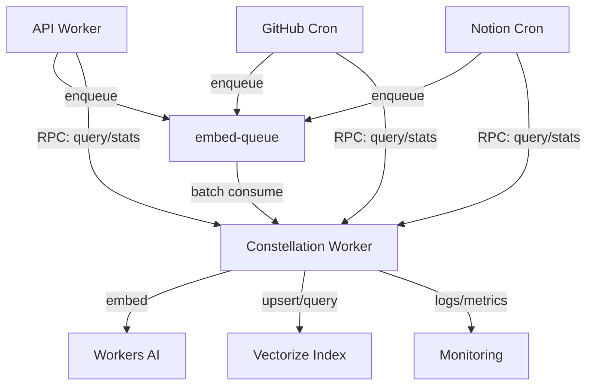

# Constellation Embedding Service Implementation Plan

## 1. Overall Architecture and Components

Constellation is a dedicated Cloudflare Worker that provides embedding and vector search capabilities for the Dome application. The service has two main responsibilities:

1. **Asynchronous Embedding Processing**:

   - Consumes raw text jobs from a Workers Queue
   - Converts text into vector embeddings using Workers AI
   - Upserts embeddings into a shared Vectorize index

2. **RPC Interface**:
   - Provides a typed service binding for other workers
   - Exposes methods for embedding, querying, and retrieving stats



### Key Components:

1. **Queue Consumer**: Processes batches of embedding jobs from the embed-queue
2. **Embedding Service**: Interfaces with Workers AI to generate embeddings
3. **Vector Storage**: Manages interactions with the Vectorize index
4. **RPC Interface**: Exposes typed methods for other workers
5. **Monitoring & Logging**: Tracks performance metrics and errors

## 2. Specific Files and Modules

### Service Structure

```
services/
└── constellation/
    ├── .dev.vars                  # Local development variables
    ├── package.json               # Service dependencies
    ├── tsconfig.json              # TypeScript configuration
    ├── vitest.config.ts           # Test configuration
    ├── wrangler.toml              # Cloudflare Worker configuration
    ├── worker-configuration.d.ts  # Environment type definitions
    ├── src/
    │   ├── index.ts               # Main entry point
    │   ├── constellation.ts       # Main worker implementation
    │   ├── types.ts               # Service-specific type definitions
    │   ├── utils/
    │   │   ├── preprocessing.ts   # Text preprocessing utilities
    │   │   ├── logging.ts         # Logging utilities
    │   │   └── metrics.ts         # Metrics utilities
    │   └── services/
    │       ├── embedding.ts       # Workers AI embedding service
    │       └── vectorize.ts       # Vectorize index service
    └── tests/
        ├── constellation.test.ts  # Main worker tests
        ├── utils/
        │   └── preprocessing.test.ts  # Preprocessing utility tests
        └── services/
            ├── embedding.test.ts  # Embedding service tests
            └── vectorize.test.ts  # Vectorize service tests
```

### Common Package Updates

```
packages/
└── common/
    └── src/
        └── types/
            └── embedding.ts       # Shared embedding types
```

## 3. Interfaces and Data Models

### Common Types (packages/common/src/types/embedding.ts)

```typescript
/**
 * Job structure for embedding queue messages
 */
export interface EmbedJob {
  userId: string;
  noteId: string;
  text: string; // ≤ 8 kB preferred
  created: number; // ms since epoch
  version: number; // embedding version
}

/**
 * Metadata structure for vector storage
 */
export interface NoteVectorMeta {
  userId: string;
  noteId: string;
  createdAt: number; // s since epoch
  version: number;
}

/**
 * Vector search result
 */
export interface VectorSearchResult {
  id: string;
  score: number;
  metadata: NoteVectorMeta;
}

/**
 * Vector index statistics
 */
export interface VectorIndexStats {
  vectors: number;
  dimension: number;
}
```

### Service Types (services/constellation/src/types.ts)

```typescript
import { NoteVectorMeta } from '../../../packages/common/src/types/embedding';

/**
 * Environment bindings for the Constellation worker
 */
export interface Env {
  VECTORIZE: VectorizeNamespace;
  AI: AINamespace;
  EMBED_QUEUE: Queue<EmbedJob>; // Binding name remains uppercase
  EMBED_DEAD?: Queue<EmbedJob>; // Optional dead letter queue
}

/**
 * Vector with metadata for upsert operations
 */
export interface VectorWithMetadata {
  id: string;
  values: number[];
  metadata: NoteVectorMeta;
}

/**
 * Vectorize namespace interface
 */
export interface VectorizeNamespace {
  upsert(vectors: VectorWithMetadata[]): Promise<void>;
  query(
    text: string,
    options: { topK: number; filter?: Partial<NoteVectorMeta> },
  ): Promise<VectorSearchResult[]>;
  info(): Promise<{ vectorCount: number; dimensions: number }>;
}

/**
 * AI namespace interface
 */
export interface AINamespace {
  run(model: string, options: { text: string[] }): Promise<{ data: number[][] }>;
}
```

## 4. Implementation Sequence

### Phase 1: Setup and Infrastructure (Week 1)

1. **Project Setup**

   - Create the constellation service directory structure
   - Set up package.json with dependencies
   - Configure tsconfig.json
   - Create wrangler.toml with queue consumer configuration
   - Set up worker-configuration.d.ts with environment bindings

2. **Common Types**

   - Create embedding.ts in common package with shared types
   - Update common package index.ts to export new types

3. **Vectorize Index Setup**
   - Create metadata indexes for the Vectorize index
   - Set up the Vectorize binding in wrangler.toml

### Phase 2: Core Implementation (Week 1-2)

4. **Text Preprocessing**

   - Implement preprocessing.ts with text normalization functions
   - Add unit tests for preprocessing functions

5. **Embedding Service**

   - Implement embedding.ts with Workers AI integration
   - Add unit tests with mocked AI service

6. **Vectorize Service**

   - Implement vectorize.ts with Vectorize index operations
   - Add unit tests with mocked Vectorize service

7. **Main Worker Implementation**
   - Implement constellation.ts with queue consumer and RPC methods
   - Add unit tests for the main worker

### Phase 3: Integration and Testing (Week 2)

8. **Integration Testing**

   - Set up integration tests with mocked services
   - Test the full embedding pipeline
   - Test the RPC interface

9. **Logging and Metrics**
   - Implement logging.ts with structured logging
   - Implement metrics.ts for performance tracking
   - Add logging and metrics to all components

### Phase 4: Deployment and Integration (Week 3)

10. **Deployment**

    - Deploy the Constellation worker
    - Verify the worker is functioning correctly
    - Set up monitoring and alerts

11. **Client Integration**

    - Update API worker to use the Constellation service
    - Update import workers to use the Constellation service
    - Test the integration with real data

12. **Documentation**
    - Update documentation with usage examples
    - Document operational procedures
    - Create runbooks for common issues

## 5. Testing Strategy

### Unit Testing

1. **Preprocessing Utilities**

   - Test text normalization functions
   - Test handling of edge cases (empty text, very long text)
   - Test character encoding handling

2. **Embedding Service**

   - Test embedding generation with mocked AI service
   - Test error handling for AI service failures
   - Test batch size limits and chunking

3. **Vectorize Service**

   - Test upsert operations with mocked Vectorize service
   - Test query operations with mocked Vectorize service
   - Test metadata filtering

4. **Main Worker**
   - Test queue consumer with mocked messages
   - Test RPC methods with mocked services
   - Test error handling and retries

### Integration Testing

5. **End-to-End Pipeline**

   - Test the full embedding pipeline with mocked services
   - Test queue consumer with real queue messages
   - Test RPC interface with real service bindings

6. **Performance Testing**
   - Test throughput with varying batch sizes
   - Test handling of high queue depths
   - Test response times for queries

### Production Testing

7. **Canary Deployment**

   - Deploy to a subset of traffic
   - Monitor for errors and performance issues
   - Gradually increase traffic

8. **Load Testing**
   - Test with production-like load
   - Verify scaling capabilities
   - Identify bottlenecks

## 6. Monitoring and Observability

1. **Metrics to Track**

   - Queue depth and processing time
   - Embedding generation time
   - Vectorize upsert and query time
   - Error rates by type
   - RPC method usage and latency

2. **Logging Strategy**

   - Structured logs with consistent fields
   - Error logs with detailed context
   - Performance logs for slow operations
   - Queue consumer logs for batch processing

3. **Alerts**
   - High queue depth
   - High error rate
   - Slow embedding or query operations
   - AI service rate limiting

## 7. Migration Plan

1. **Deploy Constellation Worker**

   - Deploy the worker with queue consumer enabled
   - Verify the worker is functioning correctly with `/stats` RPC method
   - Set up monitoring and alerts

2. **Update Producers**

   - Update API worker to enqueue embedding jobs
   - Update import workers to enqueue embedding jobs
   - Verify jobs are being processed correctly

3. **Update Consumers**

   - Replace direct Vectorize calls with Constellation RPC calls
   - Verify queries are returning expected results
   - Monitor for any performance issues

4. **Scale and Optimize**

   - Monitor queue depth and adjust batch size/concurrency
   - Optimize preprocessing for better performance
   - Fine-tune error handling and retry strategies

5. **Clean Up**
   - Remove legacy embedding code paths
   - Update documentation
   - Conduct final review and validation
