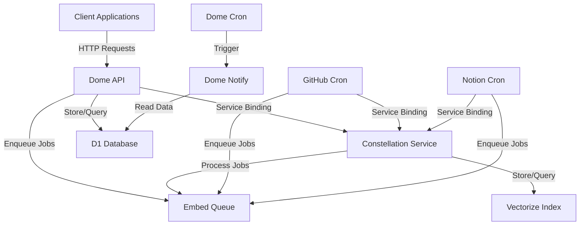
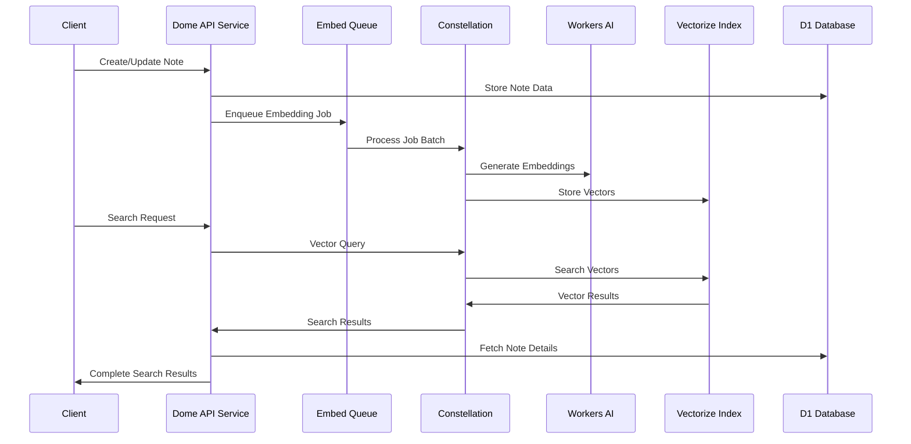
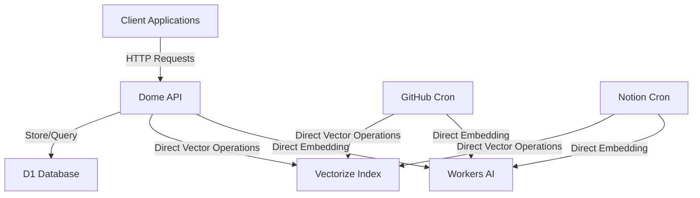
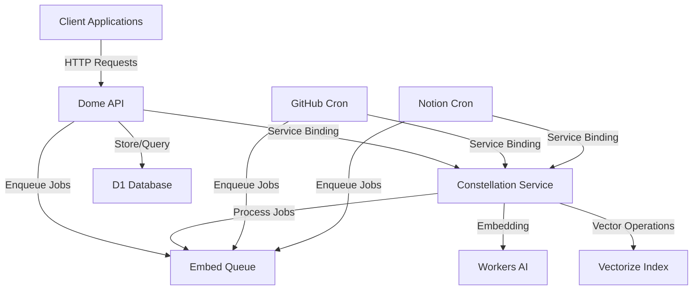
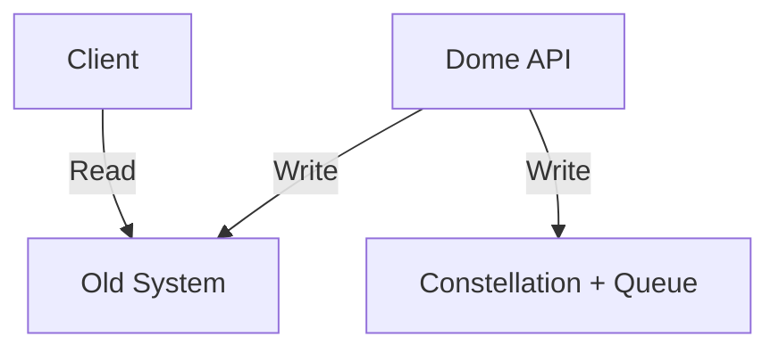
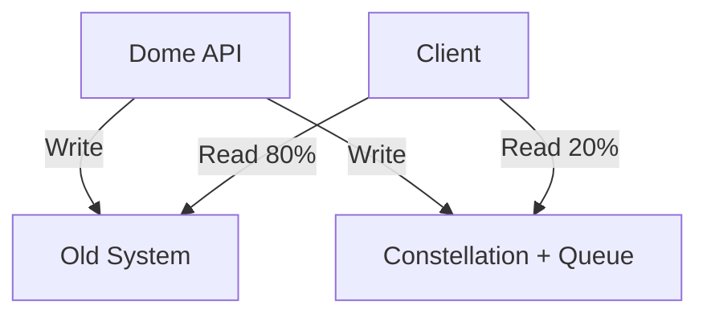
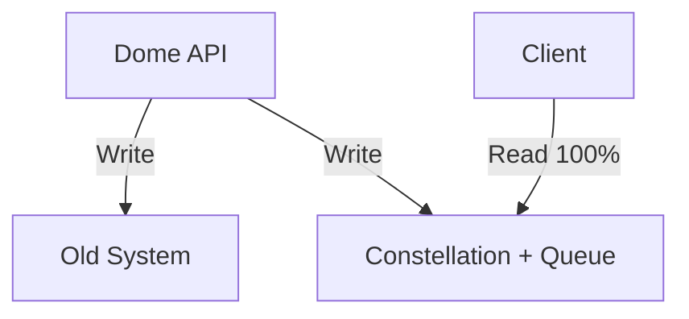
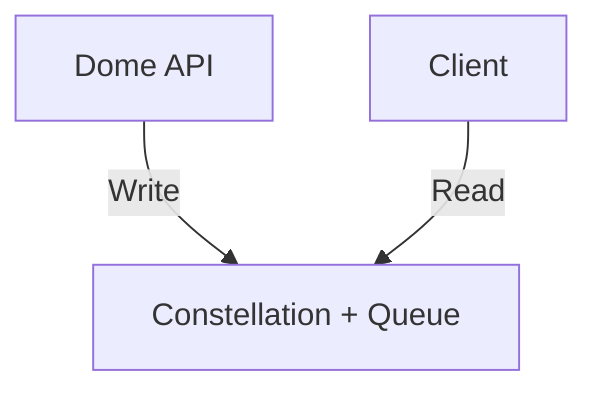

# Dome Architecture Documentation

## Overview

This document provides a comprehensive overview of the Dome application architecture, with a specific focus on the integration between the Dome API service and the Constellation embedding service. It explains the current architecture, the migration path from the previous architecture, and the benefits of the new design.

## System Architecture

The Dome application follows a microservices architecture built on Cloudflare Workers. The system consists of several specialized services that communicate through typed interfaces, queues, and shared data stores.

### High-Level Architecture



### Key Components

1. **Dome API Service**: The primary entry point for client applications, handling HTTP requests and coordinating with other services.
2. **Constellation Service**: A dedicated service for embedding and vector search operations, providing a typed RPC interface.
3. **Embed Queue**: A Workers Queue for asynchronous processing of embedding jobs.
4. **D1 Database**: A SQL database for storing structured data like notes, users, and metadata.
5. **Vectorize Index**: A vector database for storing and querying embeddings.
6. **Import Services**: Cron workers for importing content from external sources (GitHub, Notion).
7. **Notification Services**: Services for handling notifications and scheduled tasks.

## Dome API and Constellation Integration

The integration between the Dome API service and the Constellation service is a key architectural feature that enables efficient embedding and vector search operations.

### Data Flow



### Service Binding

The Dome API service communicates with the Constellation service through a typed service binding, which provides a clean, RPC-style interface:

```typescript
// In Dome API's wrangler.toml
[[services]];
binding = 'CONSTELLATION';
service = 'constellation';
environment = 'production';

// In Dome API code
const results = await env.CONSTELLATION.query(searchText, { userId: currentUser.id }, 10);
```

### Asynchronous Processing

For embedding operations, which can be resource-intensive, the Dome API service uses an asynchronous approach:

```typescript
// When a note is created or updated
await env.EMBED_QUEUE.send({
  userId: note.userId,
  noteId: note.id,
  text: note.content,
  created: Date.now(),
  version: 1,
});
```

The Constellation service processes these jobs in batches, optimizing for throughput and resource utilization.

## Previous vs. Current Architecture

### Previous Architecture

In the previous architecture, embedding and vector search operations were handled directly by the Dome API service:



**Limitations of the Previous Architecture:**

1. **Resource Contention**: The Dome API service had to handle both user requests and resource-intensive embedding operations.
2. **Code Duplication**: Embedding and vector search logic was duplicated across multiple services.
3. **Limited Scalability**: No mechanism for handling high volumes of embedding requests.
4. **Inconsistent Error Handling**: Each service implemented its own error handling for embedding operations.
5. **Maintenance Challenges**: Changes to embedding logic required updates to multiple services.

### Current Architecture

The current architecture addresses these limitations by centralizing embedding and vector search operations in the dedicated Constellation service:



**Benefits of the Current Architecture:**

1. **Separation of Concerns**: Each service has a clear, focused responsibility.
2. **Centralized Embedding Logic**: Embedding and vector search logic is centralized in one service.
3. **Asynchronous Processing**: Heavy operations are offloaded to background processing.
4. **Improved Scalability**: The queue-based approach allows for better handling of high volumes.
5. **Consistent Error Handling**: Robust error handling with retries and dead letter queues.
6. **Easier Maintenance**: Changes to embedding logic only need to be made in one place.

## Migration Path

The migration from the previous architecture to the current one followed a phased approach to minimize risk and ensure continuity of service.

### Phase 1: Parallel Write (1 week)

During this phase, both architectures operated in parallel for write operations:

1. **Deploy Constellation Service**: The Constellation service was deployed and configured.
2. **Update Producer Services**: The Dome API and import services were updated to write to both the old system and the new Embed Queue.
3. **Monitor**: Queue depth, processing rates, and data consistency were monitored.



### Phase 2: Read Migration (1 week)

During this phase, read operations were gradually migrated to the new system:

1. **Update Consumer Services**: Services were updated to read from both systems and compare results.
2. **Gradual Traffic Shift**: Traffic was gradually shifted from the old system to the new system (20% → 50% → 80%).
3. **Monitor**: Query performance, result quality, and any discrepancies were monitored.



### Phase 3: Full Cutover (1 day)

During this phase, all operations were migrated to the new system:

1. **Complete Migration**: All reads were switched to the new system.
2. **Continue Parallel Writes**: Writes continued to both systems temporarily.
3. **Verify**: All functionality was verified to be working correctly.



### Phase 4: Cleanup (1 week)

During this phase, the old system was decommissioned:

1. **Stop Writing to Old System**: Writes to the old system were stopped.
2. **Archive Old Data**: Old data was archived if needed.
3. **Remove Old Code Paths**: Old code paths were removed from all services.
4. **Update Documentation**: All documentation was updated to reflect the new system.



## Performance Considerations

The current architecture offers several performance benefits:

1. **Batch Processing**: The Constellation service processes embedding jobs in batches, optimizing for throughput.
2. **Concurrency Control**: The queue consumer is configured with appropriate concurrency settings for each environment.
3. **Resource Optimization**: Heavy operations are offloaded from user-facing services.
4. **Caching**: The Constellation service can implement caching strategies for frequently accessed vectors.
5. **Metadata Filtering**: Vector searches can be optimized with metadata filters.

## Monitoring and Observability

The current architecture includes comprehensive monitoring and observability features:

1. **Metrics**: Key metrics are tracked for queue depth, processing time, error rates, etc.
2. **Structured Logging**: All services use structured logging with consistent fields.
3. **Alerts**: Alerts are configured for high queue depth, high error rates, etc.
4. **Dashboards**: Monitoring dashboards provide visibility into system performance.

## Security Considerations

The current architecture includes several security features:

1. **Service Isolation**: Each service has a clear boundary and limited access to resources.
2. **Typed Interfaces**: All service interfaces are strongly typed, reducing the risk of errors.
3. **Error Handling**: Robust error handling prevents cascading failures.
4. **Rate Limiting**: Services implement rate limiting to prevent abuse.

## Future Enhancements

Potential future enhancements to the architecture include:

1. **Hybrid Search**: Combining vector search with traditional text search for better results.
2. **Re-ranking**: Implementing re-ranking of search results for improved relevance.
3. **Summarization**: Adding summarization capabilities for search results.
4. **Multi-model Support**: Supporting multiple embedding models for different use cases.
5. **Cross-user Search**: Implementing secure cross-user search capabilities.

## Conclusion

The integration between the Dome API service and the Constellation service represents a significant architectural improvement for the Dome application. By centralizing embedding and vector search operations in a dedicated service, the architecture achieves better separation of concerns, improved scalability, and easier maintenance.

The phased migration approach ensured a smooth transition from the previous architecture to the current one, with minimal disruption to users. The current architecture provides a solid foundation for future enhancements and scaling.
