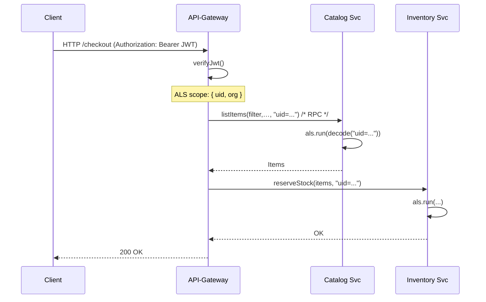

**Creating design doc structure**

The user needs a design document for implementing ALS and baggage propagation in Cloudflare worker microservices. I'll organize it into clear sections: context, goals, scope, high-level architecture, and detailed implementation.

The doc should include configuration (like wrangler.toml), code snippets, deployment needs, security, and performance considerations. I'll keep explanations concise while ensuring clarity for junior engineers. I’ll consider mentioning relevant Cloudflare doc references and OpenTelemetry baggage spec. Hopefully, this provides the right balance of clarity and depth!

Thought for 9 seconds

# Design Doc: Identity Propagation with AsyncLocalStorage + W3C Baggage in Cloudflare Workers

|                 |                            |
| --------------- | -------------------------- |
| **Author**      | _\<your-name>_             |
| **Reviewers**   | Platform team              |
| **Created**     | 2 May 2025                 |
| **Status**      | Draft → Review → Approved  |
| **Target date** | <T-N weeks after approval> |

---

## 1 Background

- Every request enters the **API-Gateway Worker** with a bearer-JWT.
- Gateway verifies the token, then makes tens of RPC calls (`serviceBinding.method()`) to downstream Workers.
- Today we hand-thread `userId` (JWT `sub`) through every method signature → boiler-plate and frequent omissions.

**Goal:** verify the token **once** and make `currentUser` available transparently everywhere in the call-graph—without shipping a heavy session object or re-checking signatures downstream.

---

## 2 Objectives

- **Stateless:** No shared session cache.
- **Minimal coupling:** Existing method signatures stay unchanged (or gain _one_ optional `baggage` param).
- **Edge-secure:** JWT verified only at the edge; downstream Workers trust Gateway-signed context.
- **Traceable:** User ID appears in OpenTelemetry traces for correlation.
- **Under 100 µs overhead** per internal call.

### Non-goals

- Token refresh or rotation logic (unchanged).
- Multi-factor / role-based authorization logic inside services.

---

## 3 Solution Summary

```
Gateway Worker
   ├── verify JWT once
   ├── als.run(identity)        ← AsyncLocalStorage scope
   └── encodeBaggage(identity)  ← "uid=123,org=acme"
            │
serviceBinding RPC (structuredClone)
            │   baggage string
            ▼
Downstream Worker
   ├── decodeBaggage(headerOrArg)
   ├── als.run(identity)        ← re-hydrate scope
   └── business logic (+ nested calls)
```

- **AsyncLocalStorage (ALS)** keeps `identity` alive **within** one Worker.
- **W3C `baggage`** header (or RPC argument) carries the same data **between** Workers/HTTP hops.

---

## 4 Architecture & Data Flow



---

## 5 Detailed Design

### 5.1 Common Context Module (`context.ts`)

```ts
import { AsyncLocalStorage } from 'node:async_hooks';
import { context as otCtx, propagation, baggage, ROOT_CONTEXT } from '@opentelemetry/api';

export interface Identity {
  uid: string;
  org?: string;
}

export const als = new AsyncLocalStorage<Identity>();

export function encodeBaggage(id: Identity): string {
  const bag = baggage.create({
    uid: { value: id.uid },
    ...(id.org && { org: { value: id.org } }),
  });
  const carrier: Record<string, string> = {};
  propagation.inject(otCtx.setBaggage(ROOT_CONTEXT, bag), carrier);
  return carrier.baggage!;
}

export function decodeBaggage(raw: string | null): Identity | undefined {
  if (!raw) return;
  const ctx = propagation.extract(ROOT_CONTEXT, { baggage: raw });
  const bag = propagation.getBaggage(ctx);
  if (!bag) return;
  return {
    uid: bag.getEntry('uid')?.value ?? '',
    org: bag.getEntry('org')?.value,
  };
}
```

### 5.2 Gateway Worker Skeleton

```ts
import { als, encodeBaggage } from './context';
import { verifyJwt } from './auth';

export default {
  async fetch(req: Request, env: Env): Promise<Response> {
    const { sub, org } = await verifyJwt(req, env.JWT_SECRET); // heavy op
    const id = { uid: sub, org };

    return als.run(id, async () => {
      const bag = encodeBaggage(id);
      // Forward original Request if you still need the token downstream
      return env.CHECKOUT_SVC.processOrder(await req.json(), bag);
    });
  },
};
```

### 5.3 Downstream Service Pattern

```ts
import { WorkerEntrypoint } from 'cloudflare:workers';
import { als, decodeBaggage, Identity } from './context';

export default class CatalogService extends WorkerEntrypoint {
  async listItems(filter: Filter, baggage?: string | null): Promise<Item[]> {
    return withCtx(baggage, async () => {
      const uid = als.getStore()!.uid; // fast lookup
      return queryD1(/* …where owner = uid … */);
    });
  }
}

function withCtx<T>(baggage: string | null, fn: () => Promise<T>): Promise<T> {
  const id: Identity = decodeBaggage(baggage) ?? { uid: 'anon' };
  return als.run(id, fn);
}
```

### 5.4 Calling HTTP Services (optional)

```ts
const bag = encodeBaggage(als.getStore()!);
await fetch(envPDF.SVC_URL, { headers: { baggage: bag } });
```

### 5.5 Wrangler Configuration

```toml
# wrangler.toml (shared snippet)
compatibility_date = "2025-03-15"
compatibility_flags = ["nodejs_als"]   # or "nodejs_compat" if you need full Node polyfills
```

---

## 6 Security Considerations

| Risk                            | Mitigation                                                                                                                                                                        |
| ------------------------------- | --------------------------------------------------------------------------------------------------------------------------------------------------------------------------------- |
| **Token replay** across tenants | JWT audience + issuer locked to the gateway; downstream only sees `uid`, not the token.                                                                                           |
| **Tampered baggage**            | Gateway signs JWT, _not_ the baggage. Downstream logic must treat `uid` as _trusted only if_ the RPC originates from an internal service binding (enforced by account isolation). |
| **Oversharing PII**             | We pass only `uid` (and optional `org`), no email or full JWT payload.                                                                                                            |

---

## 7 Testing Strategy

1. **Unit tests** for `encodeBaggage / decodeBaggage`.
2. **Integration test**:

   - Spin up Gateway → Catalog in `miniflare`.
   - Send request with valid JWT.
   - Assert `als.getStore()?.uid === expected` inside Catalog.

3. **Load test** (k6): ensure < 200 µs added p95 latency vs baseline.
4. **Chaos**: remove `baggage` on select calls; verify fallback identity = `anon`.

---

## 8 Roll-out Plan

1. **Phase 0:** ship `context.ts`, wrangler flag changes behind `compatibility_flags` but _do not_ use in prod path.
2. **Phase 1:** migrate one low-traffic service; monitor error rate & latency.
3. **Phase 2:** migrate remaining services; remove deprecated `userId` parameters.
4. **Phase 3:** enforce lint rule that forbids manual `userId` arguments outside the gateway.

Rollback = flip environment variable `USE_BAGGAGE=false`; gateway reverts to old signature pattern.

---

## 9 Open Questions

1. Do we also propagate short-lived **session feature flags** (A/B) via baggage?
2. Should we encrypt baggage if we start including more PII?
3. Adopt full OpenTelemetry Cloudflare exporter now or later?

---

## 10 Appendix A – Reference Implementations

- Cloudflare Workers `serviceBindings` RFC (2024-11) – structured-clone of arguments.
- OpenTelemetry JS API `W3CBaggagePropagator`.
- W3C Trace Context Level 2 (§ 8 Baggage header).

---

### 🎯 Hand-off checklist for a junior engineer

- [ ] Add `compatibility_flags` to **every** `wrangler.toml`.
- [ ] Copy `context.ts` into shared lib.
- [ ] Update Gateway Worker exactly like § 5.2.
- [ ] For each downstream Worker:

  - add optional `baggage` param to public RPCs,
  - wrap entry functions with `withCtx()`.

- [ ] `npm run test:e2e` passes.
- [ ] Observability dashboard shows `baggage.uid` in traces.

Once this is merged, any new microservice automatically inherits context propagation without extra code.
