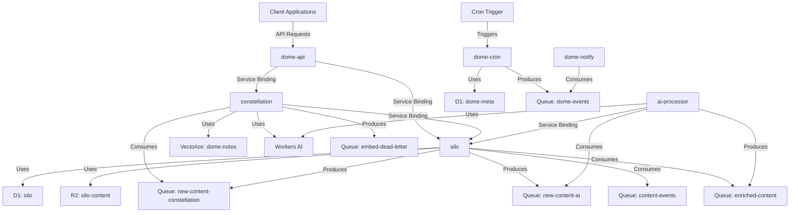
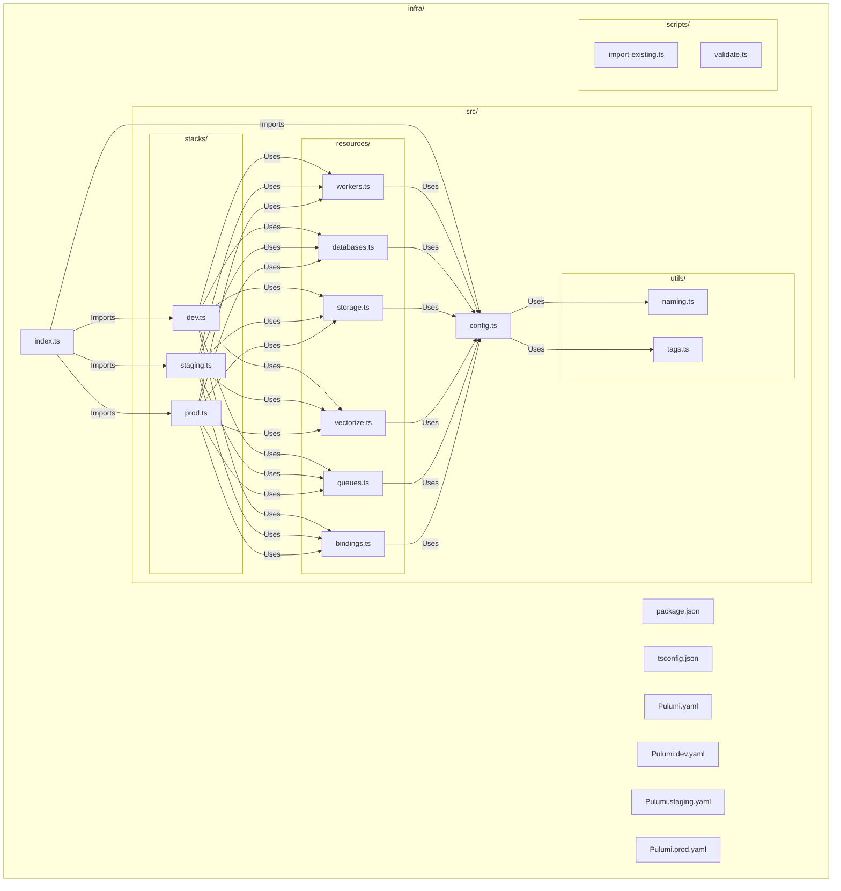
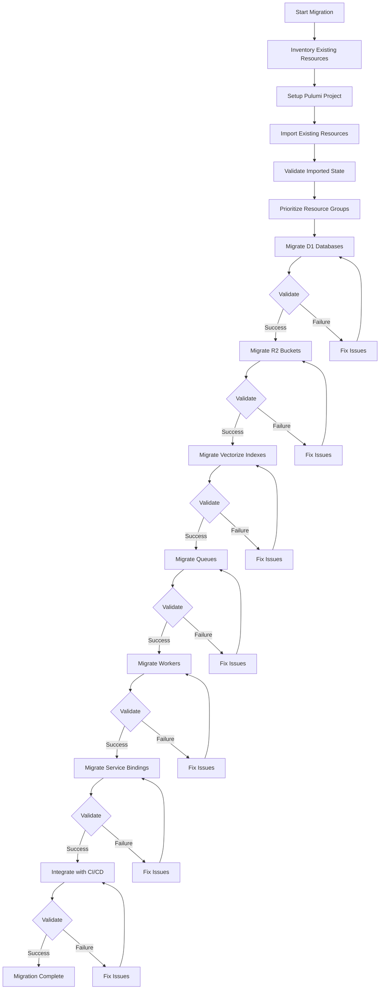
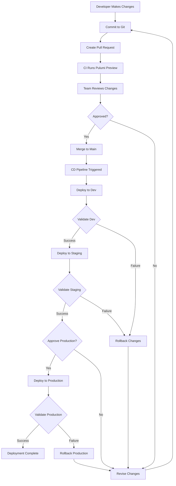

# Cloudflare Infrastructure Diagram

This document provides visual diagrams of the Cloudflare infrastructure that will be managed by Pulumi.

## Overall Architecture

```mermaid
graph TD
    subgraph "Pulumi Infrastructure as Code"
        Pulumi[Pulumi Project]
        PulumiState[Pulumi State]
        PulumiConfig[Configuration]
    end

    subgraph "Cloudflare Resources"
        subgraph "Workers"
            DomeAPI[dome-api]
            Silo[silo]
            Constellation[constellation]
            AIProcessor[ai-processor]
            DomeCron[dome-cron]
            DomeNotify[dome-notify]
        end

        subgraph "Storage"
            D1DB1[D1: dome-meta]
            D1DB2[D1: silo]
            R2B1[R2: dome-raw]
            R2B2[R2: silo-content]
            VectorizeIndex[Vectorize: dome-notes]
        end

        subgraph "Messaging"
            Q1[Queue: new-content-constellation]
            Q2[Queue: new-content-ai]
            Q3[Queue: content-events]
            Q4[Queue: enriched-content]
            Q5[Queue: dome-events]
            Q6[Queue: embed-dead-letter]
        end

        subgraph "Bindings"
            AI[Workers AI]
            ServiceBindings[Service Bindings]
        end

        subgraph "Triggers"
            CronTrigger[Cron Trigger]
        end
    end

    Pulumi -->|Manages| DomeAPI
    Pulumi -->|Manages| Silo
    Pulumi -->|Manages| Constellation
    Pulumi -->|Manages| AIProcessor
    Pulumi -->|Manages| DomeCron
    Pulumi -->|Manages| DomeNotify

    Pulumi -->|Manages| D1DB1
    Pulumi -->|Manages| D1DB2
    Pulumi -->|Manages| R2B1
    Pulumi -->|Manages| R2B2
    Pulumi -->|Manages| VectorizeIndex

    Pulumi -->|Manages| Q1
    Pulumi -->|Manages| Q2
    Pulumi -->|Manages| Q3
    Pulumi -->|Manages| Q4
    Pulumi -->|Manages| Q5
    Pulumi -->|Manages| Q6

    Pulumi -->|Manages| AI
    Pulumi -->|Manages| ServiceBindings
    Pulumi -->|Manages| CronTrigger

    PulumiConfig -->|Configures| Pulumi
    Pulumi -->|Updates| PulumiState
```

## Service Relationships

## Pulumi Project Structure

## Migration Process

## Deployment Workflow

These diagrams provide a visual representation of the Cloudflare infrastructure, the Pulumi project structure, the migration process, and the deployment workflow. They can be used to better understand the relationships between different components and the overall architecture of the system.
