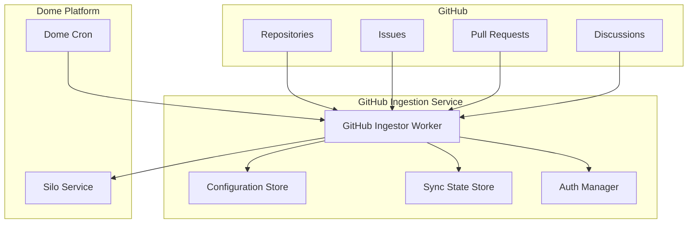
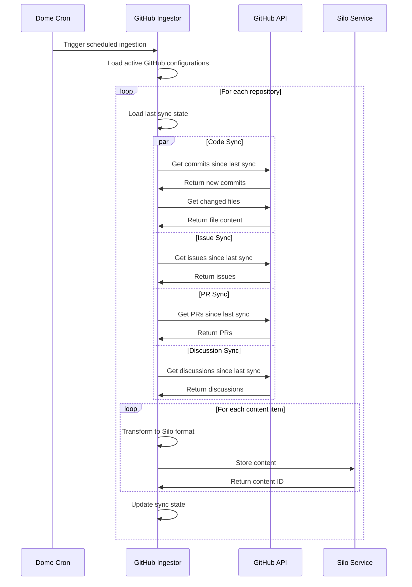

# GitHub Ingestion Service

## 1. Overview

The GitHub Ingestion Service is the first implementation of the Dome platform's ingestion services suite. It pulls content from GitHub repositories (code, issues, pull requests, discussions) and ingests them into the Silo service for further processing, embedding, and retrieval.

This document provides a detailed specification for the GitHub Ingestion Service, including its architecture, data models, API interactions, and implementation plan.



## 2. Core Components

### 2.1 GitHub API Client

The GitHub API Client handles all interactions with the GitHub API:

- **Authentication**: Supports OAuth tokens and GitHub App installations
- **Rate Limiting**: Implements intelligent backoff strategies
- **Pagination**: Handles GitHub's cursor-based pagination
- **Error Handling**: Gracefully handles API errors and retries

### 2.2 Configuration Store

Stores GitHub source configurations in D1:

- **Repository Configurations**: Which repositories to track
- **Content Types**: What types of content to ingest (code, issues, PRs, discussions)
- **Sync Frequency**: How often to check for updates
- **Visibility Settings**: Public vs. private content mapping

### 2.3 Sync State Tracker

Tracks the state of each sync operation:

- **Last Sync Time**: When the repository was last synced
- **Commit Pointers**: Latest commit SHA for each branch
- **Issue/PR Cursors**: Pagination cursors for incremental syncs
- **Error States**: Details of any failed sync operations

### 2.4 Content Transformer

Transforms GitHub content into Silo-compatible formats:

- **Code Transformer**: Processes code files with language detection
- **Markdown Transformer**: Processes README files, wikis, and other markdown
- **Issue/PR Transformer**: Converts issues and PRs to structured content
- **Discussion Transformer**: Processes GitHub discussions

## 3. Data Models

### 3.1 GitHub Source Configuration

```typescript
interface GitHubSourceConfig {
  id: string;                     // Unique identifier for this source
  name: string;                   // Display name
  type: 'github';                 // Source type
  userId: string | null;          // Associated user ID (null for public/org)
  
  // Authentication
  authType: 'oauth' | 'app';      // Authentication type
  authDetails: {                  // Auth details (encrypted)
    token?: string;               // OAuth token
    appId?: string;               // GitHub App ID
    installationId?: string;      // Installation ID
    privateKey?: string;          // Private key for GitHub App
  };
  
  // Content Selection
  repositories: {
    owner: string;                // Repository owner
    name: string;                 // Repository name
    branches: string[];           // Branches to track (empty = default branch)
    contentTypes: {
      code: boolean;              // Whether to ingest code
      issues: boolean;            // Whether to ingest issues
      pullRequests: boolean;      // Whether to ingest PRs
      discussions: boolean;       // Whether to ingest discussions
      wiki: boolean;              // Whether to ingest wiki
    };
    codeFilters: {
      includePaths: string[];     // Glob patterns to include
      excludePaths: string[];     // Glob patterns to exclude
      maxFileSize: number;        // Maximum file size in bytes
    };
  }[];
  
  // Sync Settings
  syncFrequency: number;          // Minutes between syncs
  syncEnabled: boolean;           // Whether sync is enabled
  
  // Visibility
  contentVisibility: 'public' | 'private' | 'mixed';
  
  // Metadata
  createdAt: number;              // Creation timestamp
  updatedAt: number;              // Last update timestamp
}
```

### 3.2 GitHub Sync State

```typescript
interface GitHubSyncState {
  sourceId: string;               // Reference to source config
  repositoryId: string;           // GitHub repository ID
  
  // Code sync state
  lastCommitSHA: {                // Last commit SHA by branch
    [branch: string]: string;
  };
  
  // Issues sync state
  issuesCursor: string | null;    // Pagination cursor for issues
  lastIssueTimestamp: number;     // Timestamp of last synced issue
  
  // PR sync state
  prCursor: string | null;        // Pagination cursor for PRs
  lastPRTimestamp: number;        // Timestamp of last synced PR
  
  // Discussions sync state
  discussionsCursor: string | null; // Pagination cursor for discussions
  lastDiscussionTimestamp: number;  // Timestamp of last synced discussion
  
  // Overall sync state
  lastSyncStarted: number;        // When last sync started
  lastSyncCompleted: number;      // When last sync completed
  lastSyncStatus: 'success' | 'partial' | 'failed';
  lastSyncError: string | null;   // Error message if failed
  
  // Metrics
  itemsSynced: {                  // Count of items synced
    code: number;
    issues: number;
    pullRequests: number;
    discussions: number;
    wiki: number;
  };
}
```

### 3.3 Content Mapping

How GitHub content maps to Silo content:

| GitHub Content | Silo Content Type | Metadata |
|----------------|-------------------|----------|
| Code File | `code` | language, path, repository, branch |
| README/Markdown | `article` | repository, path |
| Issue | `note` | repository, issue number, author, labels |
| Pull Request | `note` | repository, PR number, author, branch |
| Discussion | `note` | repository, discussion ID, category |
| Wiki Page | `article` | repository, page name |

## 4. Authentication Mechanisms

### 4.1 OAuth Authentication

For user-specific repositories:

1. **OAuth Flow**:
   - User initiates GitHub connection in Dome UI
   - Redirect to GitHub OAuth authorization
   - Callback stores token in D1

2. **Token Usage**:
   - Stored tokens used for API requests
   - Automatic refresh when needed
   - Scope limited to necessary permissions

3. **Permission Scopes**:
   - `repo`: For private repositories
   - `public_repo`: For public repositories
   - `read:discussion`: For discussions
   - `read:user`: For user information

### 4.2 GitHub App Authentication

For organizational repositories:

1. **App Installation**:
   - Create GitHub App in GitHub organization
   - Install in target repositories
   - Store installation ID and private key

2. **JWT Authentication**:
   - Generate JWT for GitHub App
   - Exchange for installation token
   - Refresh tokens as needed

3. **Permission Configuration**:
   - Repository contents: Read
   - Issues: Read
   - Pull requests: Read
   - Discussions: Read

## 5. Ingestion Process

### 5.1 Scheduled Ingestion



### 5.2 Webhook-Based Updates

For real-time updates (future enhancement):

1. **Webhook Registration**:
   - Register webhooks for tracked repositories
   - Configure event types (push, issues, pull_request, discussion)

2. **Event Processing**:
   - Receive webhook payload
   - Determine affected content
   - Trigger targeted sync

3. **Optimized Updates**:
   - Only process changed content
   - Avoid full repository scans

## 6. Content Processing

### 6.1 Code Processing

1. **File Selection**:
   - Apply include/exclude patterns
   - Check file size limits
   - Identify file type and language

2. **Content Extraction**:
   - Fetch raw file content
   - Extract meaningful code (skip binaries, etc.)
   - Preserve structure and formatting

3. **Metadata Extraction**:
   - Language detection
   - Last modified information
   - Contributor information

### 6.2 Issue/PR Processing

1. **Content Formatting**:
   - Combine title, description, and comments
   - Preserve markdown formatting
   - Include relevant metadata

2. **Metadata Extraction**:
   - Status (open/closed)
   - Labels and assignees
   - Creation and update times

3. **Relationship Tracking**:
   - Link PRs to issues
   - Track related discussions

### 6.3 Content Deduplication

1. **Unique Identifiers**:
   - Repository + path + commit for code
   - Repository + number for issues/PRs
   - Repository + ID for discussions

2. **Update Detection**:
   - Compare content hashes
   - Only update if content changed

3. **Version Tracking**:
   - Increment version on updates
   - Maintain history of changes

## 7. Implementation Plan

### 7.1 Phase 1: Core Infrastructure

1. **Setup Project Structure**:
   - Create GitHub Ingestor service
   - Set up D1 tables for configuration and state
   - Implement authentication manager

2. **Implement GitHub API Client**:
   - Basic authentication and rate limiting
   - Repository and file content fetching
   - Error handling and retries

3. **Implement Code Ingestion**:
   - Repository cloning/fetching
   - File filtering and processing
   - Storage in Silo

### 7.2 Phase 2: Extended Content Types

1. **Implement Issue Ingestion**:
   - Issue fetching and pagination
   - Comment inclusion
   - Metadata extraction

2. **Implement PR Ingestion**:
   - PR fetching and pagination
   - Diff processing
   - Relationship tracking

3. **Implement Discussion Ingestion**:
   - Discussion fetching
   - Comment threading
   - Category handling

### 7.3 Phase 3: Advanced Features

1. **Implement Webhook Support**:
   - Webhook registration
   - Event processing
   - Targeted updates

2. **Enhance Error Handling**:
   - Detailed error reporting
   - Automatic recovery
   - Admin notifications

3. **Implement Monitoring**:
   - Sync status dashboard
   - Performance metrics
   - Error tracking

## 8. Technical Considerations

### 8.1 Performance Optimization

1. **Incremental Syncs**:
   - Use GitHub's GraphQL API for efficient queries
   - Track commit SHAs for code changes
   - Use cursors for issues/PRs/discussions

2. **Parallel Processing**:
   - Process multiple repositories concurrently
   - Fetch different content types in parallel
   - Batch Silo storage operations

3. **Caching**:
   - Cache repository metadata
   - Cache API responses where appropriate
   - Use ETags for conditional requests

### 8.2 Error Handling

1. **API Errors**:
   - Handle rate limiting (429 responses)
   - Implement exponential backoff
   - Detect and report authentication issues

2. **Content Processing Errors**:
   - Isolate errors to specific content items
   - Continue processing other items
   - Log detailed error information

3. **Recovery Mechanisms**:
   - Automatic retry for transient errors
   - Manual retry for failed syncs
   - Partial sync completion

### 8.3 Security Considerations

1. **Token Security**:
   - Encrypt tokens at rest
   - Minimal permission scopes
   - Regular token rotation

2. **Content Security**:
   - Sanitize content before storage
   - Respect repository visibility settings
   - Enforce user-specific access controls

3. **Rate Limit Protection**:
   - Respect GitHub's rate limits
   - Implement client-side throttling
   - Monitor usage patterns

## 9. Integration with Dome Platform

### 9.1 Silo Integration

1. **Content Storage**:
   - Use appropriate content types
   - Include source-specific metadata
   - Set correct visibility (public/private)

2. **Content Updates**:
   - Update existing content when changed
   - Preserve content IDs for continuity
   - Track version history

3. **Deletion Handling**:
   - Detect deleted GitHub content
   - Mark as deleted in Silo
   - Preserve historical versions

### 9.2 User Interface Integration

1. **Configuration UI**:
   - Repository selection interface
   - Content type toggles
   - Sync frequency settings

2. **Status Reporting**:
   - Sync status dashboard
   - Error reporting and resolution
   - Content statistics

3. **Authentication UI**:
   - OAuth flow initiation
   - GitHub App installation guide
   - Token management

## 10. Future Enhancements

1. **Content Filtering**:
   - Advanced inclusion/exclusion rules
   - Content quality filters
   - Duplicate detection

2. **Real-time Updates**:
   - Webhook-based immediate updates
   - Push notifications for changes
   - Live content streaming

3. **Advanced GitHub Features**:
   - GitHub Actions workflow ingestion
   - GitHub Packages metadata
   - GitHub Projects integration

4. **Cross-Source Relationships**:
   - Link GitHub issues to Notion pages
   - Connect Linear items to GitHub PRs
   - Create unified knowledge graph