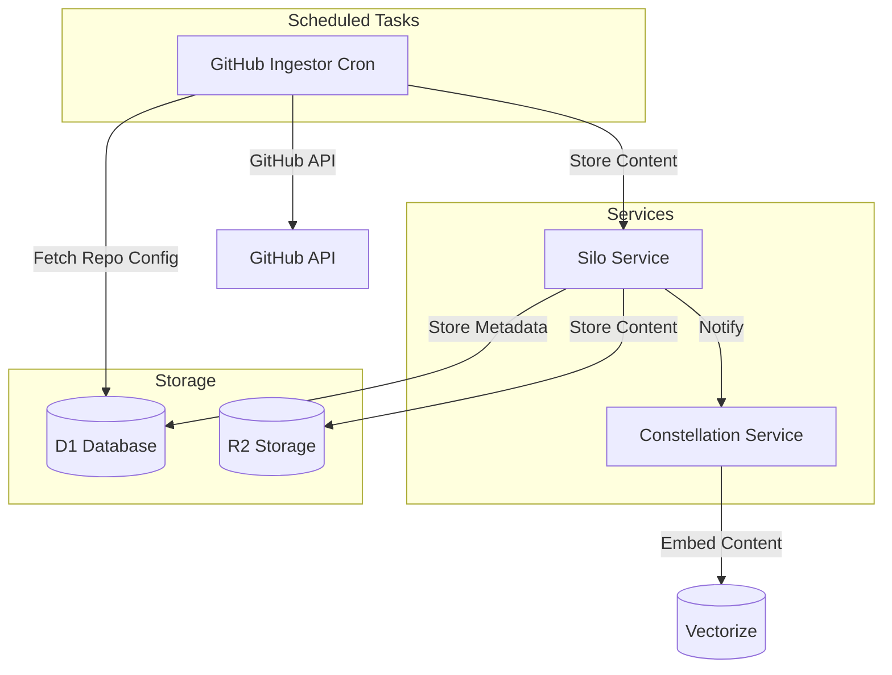

# GitHub Code Ingestion Worker Design

Based on our discussion and the existing architecture, I'll design a new worker called `github-ingestor` that will periodically fetch code from GitHub repositories and store it in the Silo service, with the ability to extend to other sources like Notion and Linear in the future.

## 1. High-Level Architecture



## 2. Database Schema

We'll need to add a new table to the D1 database to store repository configurations:

```sql
CREATE TABLE github_repositories (
  id TEXT PRIMARY KEY,                -- ulid/uuid
  userId TEXT,                        -- NULL for public repos, user ID for private repos
  owner TEXT NOT NULL,                -- GitHub repository owner/organization
  repo TEXT NOT NULL,                 -- GitHub repository name
  branch TEXT NOT NULL DEFAULT 'main',-- Branch to monitor
  lastSyncedAt INTEGER,               -- Last successful sync timestamp (epoch seconds)
  lastCommitSha TEXT,                 -- Last processed commit SHA
  isPrivate BOOLEAN NOT NULL DEFAULT false, -- Whether the repo is private
  includePatterns TEXT,               -- JSON array of glob patterns to include (null = all)
  excludePatterns TEXT,               -- JSON array of glob patterns to exclude
  createdAt INTEGER NOT NULL,         -- When this config was created (epoch seconds)
  updatedAt INTEGER NOT NULL          -- When this config was last updated (epoch seconds)
);

CREATE UNIQUE INDEX idx_github_repositories_owner_repo ON github_repositories(owner, repo);
CREATE INDEX idx_github_repositories_userId ON github_repositories(userId);
```

## 3. Worker Components

### 3.1 Main Worker Structure

```typescript
// src/index.ts
import { WorkerEntrypoint } from 'cloudflare:workers';
import { getLogger, metrics } from '@dome/logging';
import { createServices, Services } from './services';
import { GithubIngestorEnv } from './types';

export default class GithubIngestor extends WorkerEntrypoint<GithubIngestorEnv> {
  private services: Services;

  constructor(ctx: ExecutionContext, env: GithubIngestorEnv) {
    super(ctx, env);
    this.services = createServices(env);
  }

  /**
   * Scheduled handler that runs every hour to check for repository updates
   */
  async scheduled(event: ScheduledEvent, env: GithubIngestorEnv, ctx: ExecutionContext) {
    const logger = getLogger();
    logger.info('Starting scheduled GitHub repository sync');
    
    try {
      // Process all repositories
      await this.services.github.syncAllRepositories();
      
      logger.info('Completed scheduled GitHub repository sync');
    } catch (error) {
      logger.error({ error }, 'Error during scheduled GitHub repository sync');
      metrics.increment('github_ingestor.scheduled.errors', 1);
    }
  }

  /**
   * RPC methods for managing repository configurations
   */
  async addRepository(data: AddRepositoryInput): Promise<AddRepositoryResponse> {
    return await this.services.config.addRepository(data);
  }

  async updateRepository(data: UpdateRepositoryInput): Promise<UpdateRepositoryResponse> {
    return await this.services.config.updateRepository(data);
  }

  async removeRepository(data: RemoveRepositoryInput): Promise<RemoveRepositoryResponse> {
    return await this.services.config.removeRepository(data);
  }

  async listRepositories(data: ListRepositoriesInput): Promise<ListRepositoriesResponse> {
    return await this.services.config.listRepositories(data);
  }

  async getRepository(data: GetRepositoryInput): Promise<GetRepositoryResponse> {
    return await this.services.config.getRepository(data);
  }

  /**
   * Manual trigger to sync a specific repository
   */
  async syncRepository(data: SyncRepositoryInput): Promise<SyncRepositoryResponse> {
    return await this.services.github.syncRepository(data.id);
  }
}
```

### 3.2 Services Structure

```typescript
// src/services/index.ts
import { GithubIngestorEnv } from '../types';
import { ConfigService } from './config';
import { GithubService } from './github';
import { ContentService } from './content';

export interface Services {
  config: ConfigService;
  github: GithubService;
  content: ContentService;
}

export function createServices(env: GithubIngestorEnv): Services {
  const config = new ConfigService(env);
  const content = new ContentService(env);
  const github = new GithubService(env, config, content);

  return {
    config,
    github,
    content
  };
}
```

### 3.3 GitHub Service

```typescript
// src/services/github.ts
import { getLogger, metrics } from '@dome/logging';
import { GithubIngestorEnv } from '../types';
import { ConfigService } from './config';
import { ContentService } from './content';
import { minimatch } from 'minimatch';

export class GithubService {
  private env: GithubIngestorEnv;
  private configService: ConfigService;
  private contentService: ContentService;
  private logger = getLogger();

  constructor(env: GithubIngestorEnv, configService: ConfigService, contentService: ContentService) {
    this.env = env;
    this.configService = configService;
    this.contentService = contentService;
  }

  /**
   * Sync all repositories in the database
   */
  async syncAllRepositories(): Promise<void> {
    const timer = metrics.startTimer('github_ingestor.sync_all.duration_ms');
    const repositories = await this.configService.getAllRepositories();
    
    this.logger.info({ count: repositories.length }, 'Syncing all repositories');
    
    // Process repositories in parallel with a concurrency limit
    const concurrencyLimit = 5;
    for (let i = 0; i < repositories.length; i += concurrencyLimit) {
      const batch = repositories.slice(i, i + concurrencyLimit);
      await Promise.all(batch.map(repo => this.syncRepository(repo.id)));
    }
    
    timer.stop();
  }

  /**
   * Sync a specific repository
   */
  async syncRepository(repoId: string): Promise<void> {
    const timer = metrics.startTimer('github_ingestor.sync_repo.duration_ms');
    
    try {
      // Get repository configuration
      const repo = await this.configService.getRepositoryById(repoId);
      if (!repo) {
        throw new Error(`Repository with ID ${repoId} not found`);
      }
      
      this.logger.info({ repoId, owner: repo.owner, repo: repo.repo }, 'Syncing repository');
      
      // Check if there are new commits
      const latestCommit = await this.getLatestCommit(repo.owner, repo.repo, repo.branch);
      
      if (latestCommit.sha === repo.lastCommitSha) {
        this.logger.info({ repoId, sha: latestCommit.sha }, 'Repository already up to date');
        
        // Update last synced timestamp even if no changes
        await this.configService.updateLastSynced(repoId, latestCommit.sha);
        return;
      }
      
      // Get repository contents
      const contents = await this.getRepositoryContents(repo.owner, repo.repo, repo.branch);
      
      // Filter contents based on include/exclude patterns
      const filteredContents = this.filterContents(contents, repo);
      
      // Process each file
      let processedCount = 0;
      for (const file of filteredContents) {
        if (await this.processFile(file, repo)) {
          processedCount++;
        }
      }
      
      // Update last synced timestamp and commit SHA
      await this.configService.updateLastSynced(repoId, latestCommit.sha);
      
      this.logger.info({ repoId, processedCount }, 'Repository sync completed');
      metrics.increment('github_ingestor.files_processed', processedCount);
      
    } catch (error) {
      this.logger.error({ repoId, error }, 'Error syncing repository');
      metrics.increment('github_ingestor.sync_repo.errors', 1);
      throw error;
    } finally {
      timer.stop();
    }
  }

  /**
   * Get the latest commit for a repository branch
   */
  private async getLatestCommit(owner: string, repo: string, branch: string): Promise<{ sha: string, date: string }> {
    const url = `https://api.github.com/repos/${owner}/${repo}/commits/${branch}`;
    const response = await this.githubApiRequest(url);
    
    if (!response.ok) {
      throw new Error(`Failed to get latest commit: ${response.status} ${response.statusText}`);
    }
    
    const data = await response.json();
    return {
      sha: data.sha,
      date: data.commit.committer.date
    };
  }

  /**
   * Get all files in a repository
   */
  private async getRepositoryContents(owner: string, repo: string, branch: string): Promise<GithubFile[]> {
    // Use the Git Tree API to get all files in one request
    const url = `https://api.github.com/repos/${owner}/${repo}/git/trees/${branch}?recursive=1`;
    const response = await this.githubApiRequest(url);
    
    if (!response.ok) {
      throw new Error(`Failed to get repository contents: ${response.status} ${response.statusText}`);
    }
    
    const data = await response.json();
    
    // Filter to only include blob objects (files)
    return data.tree
      .filter((item: any) => item.type === 'blob')
      .map((item: any) => ({
        path: item.path,
        sha: item.sha,
        size: item.size,
        url: item.url
      }));
  }

  /**
   * Filter repository contents based on include/exclude patterns
   */
  private filterContents(contents: GithubFile[], repo: RepositoryConfig): GithubFile[] {
    // Parse include/exclude patterns
    const includePatterns = repo.includePatterns ? JSON.parse(repo.includePatterns) : null;
    const excludePatterns = repo.excludePatterns ? JSON.parse(repo.excludePatterns) : [];
    
    return contents.filter(file => {
      // Skip files larger than 10MB
      if (file.size > 10 * 1024 * 1024) {
        return false;
      }
      
      // Skip binary files and images based on extension
      const extension = file.path.split('.').pop()?.toLowerCase();
      if (this.isBinaryOrImageExtension(extension)) {
        return false;
      }
      
      // Check exclude patterns first
      for (const pattern of excludePatterns) {
        if (minimatch(file.path, pattern)) {
          return false;
        }
      }
      
      // If include patterns are specified, file must match at least one
      if (includePatterns && includePatterns.length > 0) {
        return includePatterns.some((pattern: string) => minimatch(file.path, pattern));
      }
      
      // If no include patterns, include all files that weren't excluded
      return true;
    });
  }

  /**
   * Check if a file extension is likely a binary or image file
   */
  private isBinaryOrImageExtension(extension?: string): boolean {
    if (!extension) return false;
    
    const binaryExtensions = [
      // Images
      'png', 'jpg', 'jpeg', 'gif', 'bmp', 'tiff', 'webp', 'svg', 'ico',
      // Binaries
      'exe', 'dll', 'so', 'dylib', 'bin', 'obj', 'o',
      // Archives
      'zip', 'tar', 'gz', 'rar', '7z', 'jar',
      // Media
      'mp3', 'mp4', 'avi', 'mov', 'flv', 'wav', 'ogg',
      // Documents
      'pdf', 'doc', 'docx', 'xls', 'xlsx', 'ppt', 'pptx'
    ];
    
    return binaryExtensions.includes(extension);
  }

  /**
   * Process a single file from GitHub
   */
  private async processFile(file: GithubFile, repo: RepositoryConfig): Promise<boolean> {
    try {
      // Get file content
      const content = await this.getFileContent(file.url);
      
      // Store in Silo
      await this.contentService.storeContent({
        path: file.path,
        content,
        metadata: {
          repoId: repo.id,
          owner: repo.owner,
          repo: repo.repo,
          branch: repo.branch,
          sha: file.sha,
          size: file.size,
          userId: repo.userId
        }
      });
      
      return true;
    } catch (error) {
      this.logger.error({ file, error }, 'Error processing file');
      metrics.increment('github_ingestor.process_file.errors', 1);
      return false;
    }
  }

  /**
   * Get the content of a file from GitHub
   */
  private async getFileContent(url: string): Promise<string> {
    const response = await this.githubApiRequest(url);
    
    if (!response.ok) {
      throw new Error(`Failed to get file content: ${response.status} ${response.statusText}`);
    }
    
    const data = await response.json();
    
    // GitHub API returns content as base64 encoded
    return atob(data.content);
  }

  /**
   * Make a request to the GitHub API with authentication
   */
  private async githubApiRequest(url: string): Promise<Response> {
    const headers = new Headers({
      'Accept': 'application/vnd.github.v3+json',
      'User-Agent': 'Dome-GitHub-Ingestor'
    });
    
    // Add authentication token if available
    if (this.env.GITHUB_TOKEN) {
      headers.append('Authorization', `token ${this.env.GITHUB_TOKEN}`);
    }
    
    return fetch(url, { headers });
  }
}

interface GithubFile {
  path: string;
  sha: string;
  size: number;
  url: string;
}

interface RepositoryConfig {
  id: string;
  userId: string | null;
  owner: string;
  repo: string;
  branch: string;
  lastSyncedAt: number | null;
  lastCommitSha: string | null;
  isPrivate: boolean;
  includePatterns: string | null;
  excludePatterns: string | null;
}
```

### 3.4 Content Service

```typescript
// src/services/content.ts
import { getLogger, metrics } from '@dome/logging';
import { GithubIngestorEnv } from '../types';
import { ulid } from 'ulid';

export class ContentService {
  private env: GithubIngestorEnv;
  private logger = getLogger();

  constructor(env: GithubIngestorEnv) {
    this.env = env;
  }

  /**
   * Store content in Silo
   */
  async storeContent(data: StoreContentInput): Promise<string> {
    const timer = metrics.startTimer('github_ingestor.store_content.duration_ms');
    
    try {
      // Generate a unique ID for the content
      const contentId = ulid();
      
      // Store in Silo using the simplePut RPC method
      await this.env.SILO.simplePut({
        id: contentId,
        userId: data.metadata.userId,
        contentType: 'code',
        body: data.content,
        metadata: {
          source: 'github',
          path: data.path,
          repoId: data.metadata.repoId,
          owner: data.metadata.owner,
          repo: data.metadata.repo,
          branch: data.metadata.branch,
          sha: data.metadata.sha,
          size: data.metadata.size
        }
      });
      
      this.logger.debug({ contentId, path: data.path }, 'Content stored in Silo');
      metrics.increment('github_ingestor.content_stored', 1);
      
      return contentId;
    } catch (error) {
      this.logger.error({ path: data.path, error }, 'Error storing content in Silo');
      metrics.increment('github_ingestor.store_content.errors', 1);
      throw error;
    } finally {
      timer.stop();
    }
  }
}

interface StoreContentInput {
  path: string;
  content: string;
  metadata: {
    repoId: string;
    owner: string;
    repo: string;
    branch: string;
    sha: string;
    size: number;
    userId: string | null;
  };
}
```

### 3.5 Config Service

```typescript
// src/services/config.ts
import { getLogger, metrics } from '@dome/logging';
import { GithubIngestorEnv } from '../types';
import { ulid } from 'ulid';
import { drizzle } from 'drizzle-orm/d1';
import { eq } from 'drizzle-orm';
import { githubRepositories } from '../db/schema';

export class ConfigService {
  private env: GithubIngestorEnv;
  private logger = getLogger();
  private db: ReturnType<typeof drizzle>;

  constructor(env: GithubIngestorEnv) {
    this.env = env;
    this.db = drizzle(env.DB);
  }

  /**
   * Add a new repository configuration
   */
  async addRepository(data: AddRepositoryInput): Promise<AddRepositoryResponse> {
    const timer = metrics.startTimer('github_ingestor.add_repository.duration_ms');
    
    try {
      const now = Math.floor(Date.now() / 1000);
      const id = ulid();
      
      // Insert repository configuration
      await this.db.insert(githubRepositories).values({
        id,
        userId: data.userId,
        owner: data.owner,
        repo: data.repo,
        branch: data.branch || 'main',
        isPrivate: data.isPrivate || false,
        includePatterns: data.includePatterns ? JSON.stringify(data.includePatterns) : null,
        excludePatterns: data.excludePatterns ? JSON.stringify(data.excludePatterns) : null,
        createdAt: now,
        updatedAt: now
      });
      
      this.logger.info({ id, owner: data.owner, repo: data.repo }, 'Repository configuration added');
      metrics.increment('github_ingestor.repositories_added', 1);
      
      return { id };
    } catch (error) {
      this.logger.error({ data, error }, 'Error adding repository configuration');
      metrics.increment('github_ingestor.add_repository.errors', 1);
      throw error;
    } finally {
      timer.stop();
    }
  }

  /**
   * Update an existing repository configuration
   */
  async updateRepository(data: UpdateRepositoryInput): Promise<UpdateRepositoryResponse> {
    const timer = metrics.startTimer('github_ingestor.update_repository.duration_ms');
    
    try {
      const now = Math.floor(Date.now() / 1000);
      
      // Update repository configuration
      await this.db.update(githubRepositories)
        .set({
          owner: data.owner,
          repo: data.repo,
          branch: data.branch,
          isPrivate: data.isPrivate,
          includePatterns: data.includePatterns ? JSON.stringify(data.includePatterns) : null,
          excludePatterns: data.excludePatterns ? JSON.stringify(data.excludePatterns) : null,
          updatedAt: now
        })
        .where(eq(githubRepositories.id, data.id));
      
      this.logger.info({ id: data.id }, 'Repository configuration updated');
      metrics.increment('github_ingestor.repositories_updated', 1);
      
      return { success: true };
    } catch (error) {
      this.logger.error({ data, error }, 'Error updating repository configuration');
      metrics.increment('github_ingestor.update_repository.errors', 1);
      throw error;
    } finally {
      timer.stop();
    }
  }

  /**
   * Remove a repository configuration
   */
  async removeRepository(data: RemoveRepositoryInput): Promise<RemoveRepositoryResponse> {
    const timer = metrics.startTimer('github_ingestor.remove_repository.duration_ms');
    
    try {
      // Delete repository configuration
      await this.db.delete(githubRepositories)
        .where(eq(githubRepositories.id, data.id));
      
      this.logger.info({ id: data.id }, 'Repository configuration removed');
      metrics.increment('github_ingestor.repositories_removed', 1);
      
      return { success: true };
    } catch (error) {
      this.logger.error({ data, error }, 'Error removing repository configuration');
      metrics.increment('github_ingestor.remove_repository.errors', 1);
      throw error;
    } finally {
      timer.stop();
    }
  }

  /**
   * List repository configurations
   */
  async listRepositories(data: ListRepositoriesInput): Promise<ListRepositoriesResponse> {
    const timer = metrics.startTimer('github_ingestor.list_repositories.duration_ms');
    
    try {
      // Query repository configurations
      let query = this.db.select().from(githubRepositories);
      
      // Filter by user ID if provided
      if (data.userId) {
        query = query.where(eq(githubRepositories.userId, data.userId));
      }
      
      const repositories = await query;
      
      return { repositories };
    } catch (error) {
      this.logger.error({ data, error }, 'Error listing repository configurations');
      metrics.increment('github_ingestor.list_repositories.errors', 1);
      throw error;
    } finally {
      timer.stop();
    }
  }

  /**
   * Get a repository configuration by ID
   */
  async getRepository(data: GetRepositoryInput): Promise<GetRepositoryResponse> {
    const timer = metrics.startTimer('github_ingestor.get_repository.duration_ms');
    
    try {
      // Query repository configuration
      const repository = await this.db.select()
        .from(githubRepositories)
        .where(eq(githubRepositories.id, data.id))
        .limit(1);
      
      if (repository.length === 0) {
        throw new Error(`Repository with ID ${data.id} not found`);
      }
      
      return { repository: repository[0] };
    } catch (error) {
      this.logger.error({ data, error }, 'Error getting repository configuration');
      metrics.increment('github_ingestor.get_repository.errors', 1);
      throw error;
    } finally {
      timer.stop();
    }
  }

  /**
   * Get all repository configurations
   */
  async getAllRepositories(): Promise<any[]> {
    return await this.db.select().from(githubRepositories);
  }

  /**
   * Get a repository configuration by ID
   */
  async getRepositoryById(id: string): Promise<any> {
    const repositories = await this.db.select()
      .from(githubRepositories)
      .where(eq(githubRepositories.id, id))
      .limit(1);
    
    return repositories.length > 0 ? repositories[0] : null;
  }

  /**
   * Update the last synced timestamp and commit SHA for a repository
   */
  async updateLastSynced(id: string, commitSha: string): Promise<void> {
    const now = Math.floor(Date.now() / 1000);
    
    await this.db.update(githubRepositories)
      .set({
        lastSyncedAt: now,
        lastCommitSha: commitSha,
        updatedAt: now
      })
      .where(eq(githubRepositories.id, id));
  }
}

interface AddRepositoryInput {
  userId: string | null;
  owner: string;
  repo: string;
  branch?: string;
  isPrivate?: boolean;
  includePatterns?: string[];
  excludePatterns?: string[];
}

interface AddRepositoryResponse {
  id: string;
}

interface UpdateRepositoryInput {
  id: string;
  owner?: string;
  repo?: string;
  branch?: string;
  isPrivate?: boolean;
  includePatterns?: string[];
  excludePatterns?: string[];
}

interface UpdateRepositoryResponse {
  success: boolean;
}

interface RemoveRepositoryInput {
  id: string;
}

interface RemoveRepositoryResponse {
  success: boolean;
}

interface ListRepositoriesInput {
  userId?: string;
}

interface ListRepositoriesResponse {
  repositories: any[];
}

interface GetRepositoryInput {
  id: string;
}

interface GetRepositoryResponse {
  repository: any;
}
```

### 3.6 Database Schema

```typescript
// src/db/schema.ts
import { sqliteTable, text, integer } from 'drizzle-orm/sqlite-core';

export const githubRepositories = sqliteTable('github_repositories', {
  id: text('id').primaryKey(),
  userId: text('userId'),
  owner: text('owner').notNull(),
  repo: text('repo').notNull(),
  branch: text('branch').notNull().default('main'),
  lastSyncedAt: integer('lastSyncedAt'),
  lastCommitSha: text('lastCommitSha'),
  isPrivate: integer('isPrivate', { mode: 'boolean' }).notNull().default(false),
  includePatterns: text('includePatterns'),
  excludePatterns: text('excludePatterns'),
  createdAt: integer('createdAt').notNull(),
  updatedAt: integer('updatedAt').notNull()
});
```

### 3.7 Types

```typescript
// src/types.ts
export interface GithubIngestorEnv {
  // D1 Database
  DB: D1Database;
  
  // Service bindings
  SILO: any; // Silo service binding
  
  // Secrets
  GITHUB_TOKEN: string;
}
```

## 4. Wrangler Configuration

```toml
# wrangler.toml
name = "github-ingestor"
main = "src/index.ts"
compatibility_date = "2023-10-30"
compatibility_flags = ["nodejs_als"]

# Trigger the worker every hour
[triggers]
crons = ["0 * * * *"]

# D1 Database
[[d1_databases]]
binding = "DB"
database_name = "github-ingestor"
database_id = "your-database-id"

# Service bindings
[[services]]
binding = "SILO"
service = "silo"
environment = "production"

# Environment variables
[vars]
LOG_LEVEL = "info"
VERSION = "1.0.0"
ENVIRONMENT = "prod"

# Development environment
[env.dev]
name = "github-ingestor-dev"
[env.dev.vars]
LOG_LEVEL = "debug"
ENVIRONMENT = "dev"

# Staging environment
[env.staging]
name = "github-ingestor-staging"
[env.staging.vars]
LOG_LEVEL = "info"
ENVIRONMENT = "staging"

# Observability
[observability]
enabled = true
head_sampling_rate = 1
```

## 5. Metrics and Monitoring

The worker will emit the following metrics:

| Metric | Type | Description |
|--------|------|-------------|
| `github_ingestor.sync_all.duration_ms` | timing | Time taken to sync all repositories |
| `github_ingestor.sync_repo.duration_ms` | timing | Time taken to sync a single repository |
| `github_ingestor.store_content.duration_ms` | timing | Time taken to store content in Silo |
| `github_ingestor.files_processed` | counter | Number of files processed |
| `github_ingestor.content_stored` | counter | Number of content items stored in Silo |
| `github_ingestor.scheduled.errors` | counter | Number of errors during scheduled execution |
| `github_ingestor.sync_repo.errors` | counter | Number of errors during repository sync |
| `github_ingestor.process_file.errors` | counter | Number of errors during file processing |
| `github_ingestor.store_content.errors` | counter | Number of errors during content storage |
| `github_ingestor.repositories_added` | counter | Number of repository configurations added |
| `github_ingestor.repositories_updated` | counter | Number of repository configurations updated |
| `github_ingestor.repositories_removed` | counter | Number of repository configurations removed |

## 6. Extension Points for Future Sources

The worker is designed to be extensible for other content sources like Notion and Linear in the future:

1. The database schema can be extended with new tables for other source configurations
2. New service classes can be added for each source (e.g., `NotionService`, `LinearService`)
3. The main worker can be extended with new scheduled handlers and RPC methods for each source
4. The content service can be reused for storing content from any source in Silo

## 7. Implementation Plan

1. **Stage 1: Setup and Infrastructure**
   - Create the `github-ingestor` service directory
   - Configure wrangler.toml with required bindings
   - Create D1 database and apply schema migrations
   - Set up logging and metrics

2. **Stage 2: Core Services**
   - Implement the Config Service for managing repository configurations
   - Implement the Content Service for storing content in Silo
   - Implement the GitHub Service for fetching repository contents

3. **Stage 3: Worker Implementation**
   - Implement the main worker class with scheduled handler
   - Implement RPC methods for managing repository configurations
   - Add error handling and metrics

4. **Stage 4: Testing and Deployment**
   - Write unit tests for all components
   - Test with real GitHub repositories
   - Deploy to staging environment
   - Monitor performance and fix any issues

5. **Stage 5: Integration with Dome API**
   - Add RPC methods to Dome API for managing repository configurations
   - Create UI for adding and managing GitHub repositories
   - Test end-to-end flow