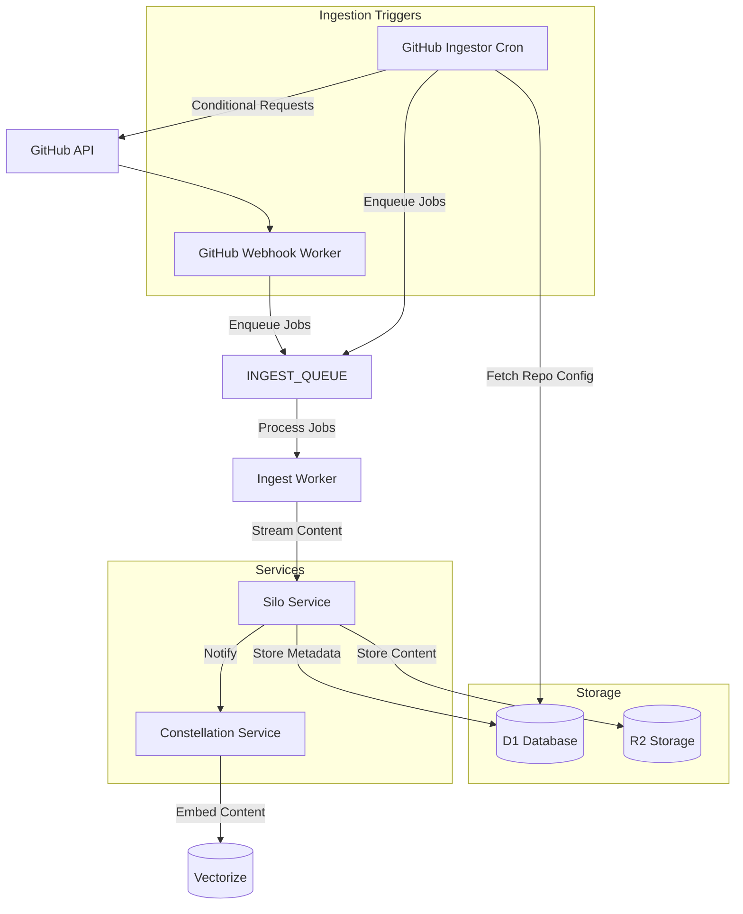

# GitHub Code Ingestion Worker Design (Revised)

Based on our discussion and feedback, this is a revised design for the `github-ingestor` worker that will fetch code from GitHub repositories and store it in the Silo service, with the ability to extend to other sources like Notion and Linear in the future.

## 1. High-Level Architecture



## 2. Key Improvements

Based on feedback, the revised design includes these key improvements:

1. **Webhook-First Approach**: Primary ingestion via GitHub webhooks for near real-time updates and API quota savings
2. **Streaming & Chunking**: Process large repositories in chunks to stay within Worker limits
3. **Content Deduplication**: Use Git blob SHA-1 for deduplication in Silo/R2
4. **ETag & Conditional Requests**: Reduce API usage with proper caching
5. **Back-Pressure & Yielding**: Handle long-running operations gracefully
6. **Per-User Auth**: Proper GitHub App integration for private repository access
7. **Improved Schema**: Better table design with tenant isolation
8. **Common Ingestion Contract**: Abstract interface for all content sources
9. **Enhanced Error Handling**: Proper retries and dead-letter queues
10. **Better Metrics**: Consistent tagging across providers

## 3. Database Schema

```sql
-- Main repository configuration table
CREATE TABLE provider_repositories (
  id TEXT PRIMARY KEY,                -- ulid/uuid
  userId TEXT NOT NULL,               -- User who added this repository (NULL for system repos)
  provider TEXT NOT NULL,             -- 'github', 'linear', 'notion'
  owner TEXT NOT NULL,                -- Repository owner/organization
  repo TEXT NOT NULL,                 -- Repository name
  branch TEXT NOT NULL DEFAULT 'main',-- Branch to monitor (GitHub only)
  lastSyncedAt INTEGER,               -- Last successful sync timestamp (epoch seconds)
  lastCommitSha TEXT,                 -- Last processed commit SHA (GitHub only)
  etag TEXT,                          -- ETag for conditional requests
  rateLimitReset INTEGER,             -- When rate limit resets (epoch seconds)
  retryCount INTEGER DEFAULT 0,       -- Number of failed attempts
  nextRetryAt INTEGER,                -- When to retry after failure (epoch seconds)
  isPrivate BOOLEAN NOT NULL DEFAULT false, -- Whether the repo is private
  includePatterns TEXT,               -- JSON array of glob patterns to include (null = all)
  excludePatterns TEXT,               -- JSON array of glob patterns to exclude
  createdAt INTEGER NOT NULL,         -- When this config was created (epoch seconds)
  updatedAt INTEGER NOT NULL,         -- When this config was last updated (epoch seconds)
  UNIQUE (userId, provider, owner, repo) -- Prevent duplicates per user
);

-- Authentication credentials for providers
CREATE TABLE provider_credentials (
  id TEXT PRIMARY KEY,                -- ulid/uuid
  userId TEXT NOT NULL,               -- User who owns these credentials
  provider TEXT NOT NULL,             -- 'github', 'linear', 'notion'
  installationId TEXT,                -- GitHub App installation ID
  accessToken TEXT,                   -- User access token (encrypted)
  refreshToken TEXT,                  -- Refresh token (encrypted)
  tokenExpiry INTEGER,                -- When the token expires (epoch seconds)
  createdAt INTEGER NOT NULL,         -- When these credentials were created (epoch seconds)
  updatedAt INTEGER NOT NULL,         -- When these credentials were last updated (epoch seconds)
  UNIQUE (userId, provider)           -- One credential set per user per provider
);

-- Content blob deduplication table
CREATE TABLE content_blobs (
  sha TEXT PRIMARY KEY,               -- Content SHA-1 hash
  size INTEGER NOT NULL,              -- Content size in bytes
  r2Key TEXT NOT NULL UNIQUE,         -- R2 storage key
  mimeType TEXT NOT NULL,             -- Content MIME type
  createdAt INTEGER NOT NULL          -- When this blob was created (epoch seconds)
);
```

## 4. Common Ingestion Contract

To support multiple content providers (GitHub, Linear, Notion), we'll define a common ingestion contract:

```typescript
// src/ingestors/base.ts
export interface ItemMetadata {
  id: string;
  path: string;
  sha: string;
  size: number;
  mimeType: string;
  provider: string;
  repoId: string;
  userId: string | null;
  [key: string]: any; // Additional provider-specific metadata
}

export interface ContentItem {
  metadata: ItemMetadata;
  getContent(): Promise<ReadableStream | string>;
}

export interface IngestorConfig {
  id: string;
  userId: string | null;
  provider: string;
  [key: string]: any; // Provider-specific configuration
}

export interface Ingestor {
  // Get configuration for this ingestor
  getConfig(): IngestorConfig;
  
  // List all items that need to be ingested
  listItems(): Promise<ItemMetadata[]>;
  
  // Get content for a specific item
  fetchContent(metadata: ItemMetadata): Promise<ContentItem>;
  
  // Check if an item has changed since last sync
  hasChanged(metadata: ItemMetadata): Promise<boolean>;
  
  // Update sync status after successful ingestion
  updateSyncStatus(metadata: ItemMetadata): Promise<void>;
}
```

## 5. Webhook-First Approach

The revised design prioritizes webhooks for real-time updates:

1. **GitHub App**: Register a GitHub App that can receive webhook events
2. **Webhook Worker**: Dedicated worker to handle webhook events
3. **Event Processing**: Process push events to detect file changes
4. **Job Enqueuing**: Enqueue specific changed files for processing
5. **Fallback Cron**: Use scheduled cron as a fallback for missed webhooks

Benefits:
- Near real-time updates
- Significant API quota savings
- Processes only changed files instead of scanning entire repositories

## 6. Content Deduplication

The revised design implements content deduplication:

1. **Content Hashing**: Use Git blob SHA-1 as the content identifier
2. **Blob Storage**: Store unique content blobs in R2 once
3. **Reference Tracking**: Track references to blobs from multiple files
4. **Storage Efficiency**: Dramatically reduce R2 storage usage for repositories with shared code

## 7. Streaming & Back-Pressure

To handle large repositories and stay within Worker limits:

1. **Chunked Processing**: Process repositories in batches with yielding between chunks
2. **Streaming Content**: Use ReadableStream for large files
3. **Graceful Yielding**: Implement proper yielding to avoid CPU time limits
4. **Concurrency Control**: Limit parallel operations to avoid memory issues

Example:
```typescript
// Process repositories in chunks with yielding
for (let i = 0; i < repositories.length; i += BATCH_SIZE) {
  const batch = repositories.slice(i, i + BATCH_SIZE);
  await Promise.all(batch.map(repo => processRepository(repo)));
  
  // Yield to avoid CPU time limit
  await scheduler.wait(1);
}
```

## 8. Error Handling & Retries

Enhanced error handling:

1. **Error Classification**: Distinguish between transient and permanent errors
2. **Exponential Backoff**: Implement exponential backoff for retries
3. **Rate Limit Handling**: Track and respect GitHub API rate limits
4. **Dead-Letter Queue**: Send persistently failing jobs to a dead-letter queue
5. **Monitoring**: Track error rates and types for alerting

## 9. Wrangler Configuration

```toml
# wrangler.toml
name = "github-ingestor"
main = "src/index.ts"
compatibility_date = "2023-10-30"

# Trigger the worker every hour as fallback
[triggers]
crons = ["0 * * * *"]

# D1 Database
[[d1_databases]]
binding = "DB"
database_name = "github-ingestor"
database_id = "your-database-id"

# Service bindings
[[services]]
binding = "SILO"
service = "silo"
environment = "production"

# Queues
[[queues.producers]]
binding = "INGEST_QUEUE"
queue = "ingest-queue"

[[queues.consumers]]
binding = "INGEST_QUEUE"
queue = "ingest-queue"
max_batch_size = 10
max_batch_timeout = 30
max_retries = 5

[[queues.producers]]
binding = "DEAD_LETTER_QUEUE"
queue = "ingest-dead-letter"

# Secrets
# - GITHUB_APP_ID
# - GITHUB_PRIVATE_KEY
# - GITHUB_WEBHOOK_SECRET
# - GITHUB_TOKEN (service account)

# Environment variables
[vars]
LOG_LEVEL = "info"
VERSION = "1.0.0"
ENVIRONMENT = "prod"

# Observability
[observability]
enabled = true
head_sampling_rate = 1
```

## 10. Implementation Plan

1. **Stage 1: GitHub App & Webhook Setup**
   - Register GitHub App with webhook capabilities
   - Implement webhook worker to receive events
   - Set up authentication flow for private repositories

2. **Stage 2: Schema & Database Setup**
   - Create D1 database with improved schema
   - Implement repository and credential management

3. **Stage 3: Common Ingestion Contract**
   - Define and implement the common ingestion interface
   - Create the GitHub ingestor implementation

4. **Stage 4: Content Deduplication**
   - Implement content blob storage and reference tracking
   - Modify Silo integration to use content deduplication

5. **Stage 5: Streaming & Error Handling**
   - Implement streaming for large files
   - Add proper error handling, retries, and dead-letter queue

6. **Stage 6: Integration & Testing**
   - Integrate with Dome API for repository management
   - Comprehensive testing with real repositories
   - Performance and load testing

7. **Stage 7: Monitoring & Deployment**
   - Set up monitoring dashboards and alerts
   - Staged deployment to production
