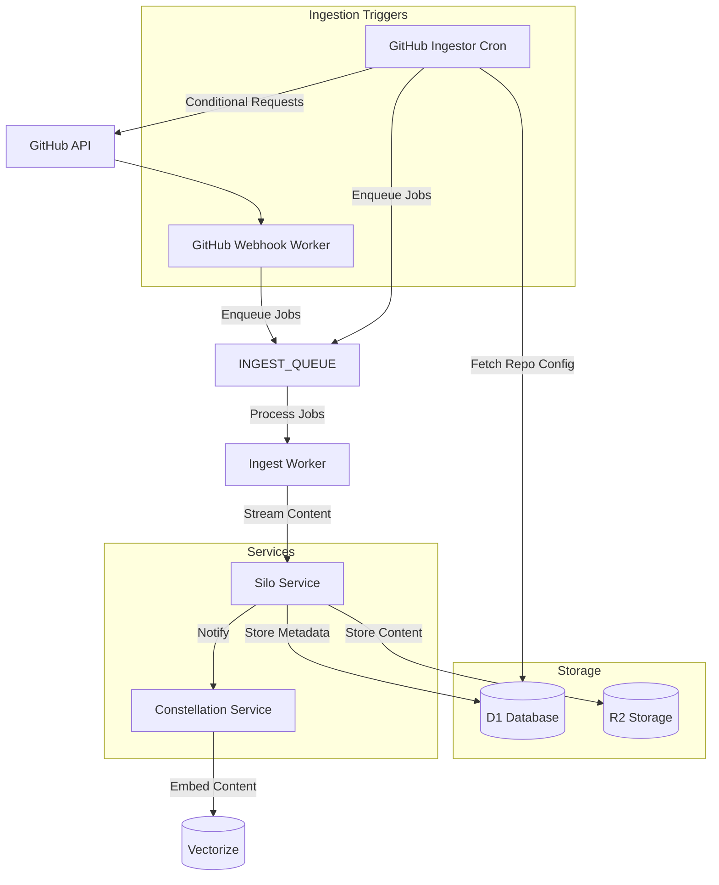
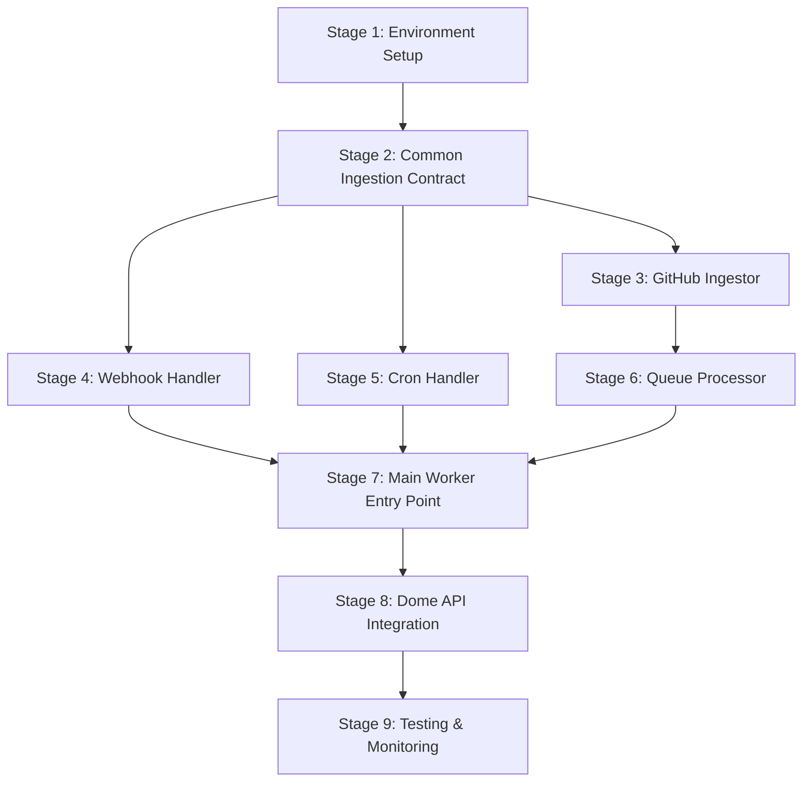

# Implementation Plan for GitHub Ingestor Worker

## 1. Executive Summary

The GitHub Ingestor is a Cloudflare Worker responsible for ingesting code repositories from GitHub, processing them, and storing them in the Silo service. This worker is a critical component in the content ingestion pipeline that enables:

- Efficient ingestion of GitHub repositories via webhooks and scheduled fallback
- Processing of repository content to make it suitable for embedding
- Deduplication of content to optimize storage usage
- Streaming and chunking of large repositories to stay within Worker limits
- Proper error handling and retry mechanisms

This implementation plan outlines a step-by-step approach to building the GitHub Ingestor worker, ensuring each stage delivers a working component with clear acceptance criteria.



## 2. Stage Breakdown

### Stage 1: Environment Setup & Project Scaffolding

**Goal**
Set up the project structure, configure Cloudflare resources, and establish the foundation for the GitHub Ingestor worker.

**Technical Tasks**

1. Create service directory structure:

   ```
   services/github-ingestor/
   ├── src/
   │   ├── index.ts                # Main entry point
   │   ├── webhook/
   │   │   └── handler.ts          # Webhook event handler
   │   ├── cron/
   │   │   └── handler.ts          # Scheduled cron handler
   │   ├── queue/
   │   │   └── processor.ts        # Queue message processor
   │   ├── ingestors/
   │   │   ├── base.ts             # Common ingestion contract
   │   │   └── github.ts           # GitHub-specific implementation
   │   ├── github/
   │   │   ├── api.ts              # GitHub API client
   │   │   └── auth.ts             # GitHub authentication
   │   ├── db/
   │   │   ├── schema.ts           # Database schema
   │   │   └── migrations/         # Database migrations
   │   └── utils/
   │       ├── metrics.ts          # Metrics collection
   │       └── logging.ts          # Structured logging
   ├── tests/
   │   └── index.test.ts           # Test suite
   ├── wrangler.toml               # Worker configuration
   └── package.json                # Dependencies
   ```

2. Configure `wrangler.toml` with required bindings:

   ```toml
   name = "github-ingestor"
   main = "src/index.ts"
   compatibility_date = "2023-10-30"

   # Trigger the worker every hour as fallback
   [triggers]
   crons = ["0 * * * *"]

   # D1 Database
   [[d1_databases]]
   binding = "DB"
   database_name = "github-ingestor"
   database_id = "your-database-id"

   # Service bindings
   [[services]]
   binding = "SILO"
   service = "silo"
   environment = "production"

   # Queues
   [[queues.producers]]
   binding = "INGEST_QUEUE"
   queue = "ingest-queue"

   [[queues.consumers]]
   binding = "INGEST_QUEUE"
   queue = "ingest-queue"
   max_batch_size = 10
   max_batch_timeout = 30
   max_retries = 5

   [[queues.producers]]
   binding = "DEAD_LETTER_QUEUE"
   queue = "ingest-dead-letter"

   # Environment variables
   [vars]
   LOG_LEVEL = "info"
   VERSION = "1.0.0"
   ENVIRONMENT = "prod"
   ```

3. Create D1 database schema migration:

   ```sql
   -- Main repository configuration table
   CREATE TABLE provider_repositories (
     id TEXT PRIMARY KEY,                -- ulid/uuid
     userId TEXT NOT NULL,               -- User who added this repository (NULL for system repos)
     provider TEXT NOT NULL,             -- 'github', 'linear', 'notion'
     owner TEXT NOT NULL,                -- Repository owner/organization
     repo TEXT NOT NULL,                 -- Repository name
     branch TEXT NOT NULL DEFAULT 'main',-- Branch to monitor (GitHub only)
     lastSyncedAt INTEGER,               -- Last successful sync timestamp (epoch seconds)
     lastCommitSha TEXT,                 -- Last processed commit SHA (GitHub only)
     etag TEXT,                          -- ETag for conditional requests
     rateLimitReset INTEGER,             -- When rate limit resets (epoch seconds)
     retryCount INTEGER DEFAULT 0,       -- Number of failed attempts
     nextRetryAt INTEGER,                -- When to retry after failure (epoch seconds)
     isPrivate BOOLEAN NOT NULL DEFAULT false, -- Whether the repo is private
     includePatterns TEXT,               -- JSON array of glob patterns to include (null = all)
     excludePatterns TEXT,               -- JSON array of glob patterns to exclude
     createdAt INTEGER NOT NULL,         -- When this config was created (epoch seconds)
     updatedAt INTEGER NOT NULL,         -- When this config was last updated (epoch seconds)
     UNIQUE (userId, provider, owner, repo) -- Prevent duplicates per user
   );

   -- Authentication credentials for providers
   CREATE TABLE provider_credentials (
     id TEXT PRIMARY KEY,                -- ulid/uuid
     userId TEXT NOT NULL,               -- User who owns these credentials
     provider TEXT NOT NULL,             -- 'github', 'linear', 'notion'
     installationId TEXT,                -- GitHub App installation ID
     accessToken TEXT,                   -- User access token (encrypted)
     refreshToken TEXT,                  -- Refresh token (encrypted)
     tokenExpiry INTEGER,                -- When the token expires (epoch seconds)
     createdAt INTEGER NOT NULL,         -- When these credentials were created (epoch seconds)
     updatedAt INTEGER NOT NULL,         -- When these credentials were last updated (epoch seconds)
     UNIQUE (userId, provider)           -- One credential set per user per provider
   );

   -- Content blob deduplication table
   CREATE TABLE content_blobs (
     sha TEXT PRIMARY KEY,               -- Content SHA-1 hash
     size INTEGER NOT NULL,              -- Content size in bytes
     r2Key TEXT NOT NULL UNIQUE,         -- R2 storage key
     mimeType TEXT NOT NULL,             -- Content MIME type
     createdAt INTEGER NOT NULL          -- When this blob was created (epoch seconds)
   );
   ```

4. Set up Drizzle ORM schema in `src/db/schema.ts`
5. Configure TypeScript and dependencies in `package.json`
6. Set up logging and metrics utilities

**Dependencies**

- Cloudflare Workers account with access to D1, R2, and Queues
- pnpm workspace setup
- Drizzle ORM for D1 database operations
- Hono for RPC routing

**Acceptance Criteria**

- Project structure is set up correctly
- `wrangler.toml` is configured with all required bindings
- D1 database schema can be applied with `wrangler d1 migrations apply`
- TypeScript compilation works with `pnpm build`
- Basic tests pass with `pnpm test`

**Estimated Effort**: 2 days

### Stage 2: Common Ingestion Contract & GitHub API Client

**Goal**
Implement the common ingestion contract and GitHub API client to establish the foundation for repository processing.

**Technical Tasks**

1. Implement the common ingestion contract in `src/ingestors/base.ts`:

   ```typescript
   // src/ingestors/base.ts
   export interface ItemMetadata {
     id: string;
     path: string;
     sha: string;
     size: number;
     mimeType: string;
     provider: string;
     repoId: string;
     userId: string | null;
     [key: string]: any; // Additional provider-specific metadata
   }

   export interface ContentItem {
     metadata: ItemMetadata;
     getContent(): Promise<ReadableStream | string>;
   }

   export interface IngestorConfig {
     id: string;
     userId: string | null;
     provider: string;
     [key: string]: any; // Provider-specific configuration
   }

   export interface Ingestor {
     // Get configuration for this ingestor
     getConfig(): IngestorConfig;

     // List all items that need to be ingested
     listItems(): Promise<ItemMetadata[]>;

     // Get content for a specific item
     fetchContent(metadata: ItemMetadata): Promise<ContentItem>;

     // Check if an item has changed since last sync
     hasChanged(metadata: ItemMetadata): Promise<boolean>;

     // Update sync status after successful ingestion
     updateSyncStatus(metadata: ItemMetadata): Promise<void>;
   }
   ```

2. Implement the GitHub API client in `src/github/api.ts`:

   ```typescript
   // src/github/api.ts
   export class GitHubClient {
     constructor(private token: string) {}

     async getRepository(owner: string, repo: string) {
       // Implement GitHub API call to get repository details
     }

     async getCommit(owner: string, repo: string, ref: string) {
       // Implement GitHub API call to get commit details
     }

     async getTree(owner: string, repo: string, sha: string, recursive: boolean = true) {
       // Implement GitHub API call to get repository tree
     }

     async getBlob(owner: string, repo: string, sha: string) {
       // Implement GitHub API call to get file blob
     }

     async compareCommits(owner: string, repo: string, base: string, head: string) {
       // Implement GitHub API call to compare commits
     }
   }
   ```

3. Implement GitHub authentication in `src/github/auth.ts`:

   ```typescript
   // src/github/auth.ts
   export async function getInstallationToken(
     appId: string,
     privateKey: string,
     installationId: string,
   ) {
     // Implement GitHub App authentication to get installation token
   }

   export async function getUserToken(userId: string, env: Env) {
     // Retrieve user's GitHub token from provider_credentials table
   }
   ```

4. Create test stubs for GitHub API client

**Dependencies**

- Stage 1 completion
- GitHub API documentation
- JWT library for GitHub App authentication

**Acceptance Criteria**

- Common ingestion contract is properly defined
- GitHub API client can make authenticated requests to GitHub API
- GitHub App authentication works for installation tokens
- User token retrieval works from database
- Unit tests pass for API client methods

**Estimated Effort**: 3 days

### Stage 3: GitHub Ingestor Implementation

**Goal**
Implement the GitHub-specific ingestor that conforms to the common ingestion contract.

**Technical Tasks**

1. Implement the GitHub ingestor in `src/ingestors/github.ts`:

   ```typescript
   // src/ingestors/github.ts
   import { Ingestor, IngestorConfig, ItemMetadata, ContentItem } from './base';
   import { GitHubClient } from '../github/api';

   export class GitHubIngestor implements Ingestor {
     private client: GitHubClient;
     private config: GitHubIngestorConfig;

     constructor(config: GitHubIngestorConfig, token: string) {
       this.config = config;
       this.client = new GitHubClient(token);
     }

     getConfig(): IngestorConfig {
       return this.config;
     }

     async listItems(): Promise<ItemMetadata[]> {
       // Implement listing all files in the repository
       // Use conditional requests with ETags when possible
     }

     async fetchContent(metadata: ItemMetadata): Promise<ContentItem> {
       // Implement fetching file content from GitHub
       // Return as a ReadableStream for large files
     }

     async hasChanged(metadata: ItemMetadata): Promise<boolean> {
       // Check if file has changed since last sync
       // Use SHA comparison for efficiency
     }

     async updateSyncStatus(metadata: ItemMetadata): Promise<void> {
       // Update lastSyncedAt and lastCommitSha in database
     }
   }

   export interface GitHubIngestorConfig extends IngestorConfig {
     owner: string;
     repo: string;
     branch: string;
     lastCommitSha?: string;
     etag?: string;
     includePatterns?: string[];
     excludePatterns?: string[];
   }
   ```

2. Implement file filtering with glob patterns
3. Implement content streaming for large files
4. Add unit tests for the GitHub ingestor

**Dependencies**

- Stage 2 completion
- Glob pattern matching library
- Streaming utilities

**Acceptance Criteria**

- GitHub ingestor correctly implements the common ingestion contract
- File listing works with conditional requests
- Content fetching works for both small and large files
- File filtering works with include/exclude patterns
- Sync status updates correctly in the database
- Unit tests pass for all methods

**Estimated Effort**: 4 days

### Stage 4: Webhook Handler Implementation

**Goal**
Implement the webhook handler to process GitHub webhook events and enqueue jobs for processing.

**Technical Tasks**

1. Implement the webhook handler in `src/webhook/handler.ts`:

   ```typescript
   // src/webhook/handler.ts
   import { Env } from '../types';
   import { verifyGitHubWebhook } from '../github/auth';
   import { logger } from '../utils/logging';
   import { metrics } from '../utils/metrics';

   export async function handleWebhook(request: Request, env: Env): Promise<Response> {
     const startTime = Date.now();

     try {
       // Verify webhook signature
       const payload = await request.json();
       const signature = request.headers.get('x-hub-signature-256');

       if (!signature || !verifyGitHubWebhook(payload, signature, env.GITHUB_WEBHOOK_SECRET)) {
         return new Response('Invalid signature', { status: 401 });
       }

       // Process webhook event
       const event = request.headers.get('x-github-event');

       switch (event) {
         case 'push':
           await handlePushEvent(payload, env);
           break;
         case 'installation':
           await handleInstallationEvent(payload, env);
           break;
         default:
           logger.info({ event }, 'Ignoring unsupported event type');
       }

       metrics.timing('github.webhook.process_time_ms', Date.now() - startTime);
       return new Response('OK');
     } catch (error) {
       metrics.counter('github.webhook.errors', 1);
       logger.error({ error }, 'Error processing webhook');
       return new Response('Error processing webhook', { status: 500 });
     }
   }
   ```

2. Implement webhook signature verification
3. Add support for different webhook event types (push, installation, etc.)
4. Implement unit tests for webhook handler

**Dependencies**

- Stage 2 completion
- GitHub webhook documentation
- Crypto library for signature verification

**Acceptance Criteria**

- Webhook handler correctly verifies webhook signatures
- Push events are processed and changed files are enqueued
- Installation events update the credentials database
- Repository configuration is updated with latest commit SHA
- Unit tests pass for all webhook event types

**Estimated Effort**: 3 days

### Stage 5: Cron Handler Implementation

**Goal**
Implement the cron handler to periodically check for repository updates and enqueue jobs for processing.

**Technical Tasks**

1. Implement the cron handler in `src/cron/handler.ts`:

   ```typescript
   // src/cron/handler.ts
   import { Env } from '../types';
   import { logger } from '../utils/logging';
   import { metrics } from '../utils/metrics';
   import { GitHubClient } from '../github/api';
   import { getInstallationToken, getUserToken } from '../github/auth';

   export async function handleCron(env: Env): Promise<void> {
     const startTime = Date.now();

     try {
       // Get repositories due for sync
       const now = Math.floor(Date.now() / 1000);
       const repos = await env.DB.prepare(
         `
         SELECT id, userId, owner, repo, branch, lastSyncedAt, lastCommitSha, etag, 
                isPrivate, includePatterns, excludePatterns, retryCount
         FROM provider_repositories
         WHERE provider = 'github'
         AND (
           lastSyncedAt IS NULL
           OR lastSyncedAt < ?
           OR (nextRetryAt IS NOT NULL AND nextRetryAt < ?)
         )
         LIMIT 50
       `,
       )
         .bind(now - 3600, now) // Sync repos not updated in the last hour
         .all();

       // Process repositories in batches with yielding
       for (const repo of repos.results) {
         try {
           await processRepository(repo, env);
         } catch (error) {
           // Handle error and update retry count with exponential backoff
         }
       }
     } catch (error) {
       metrics.counter('github.cron.errors', 1);
       logger.error({ error }, 'Error in cron handler');
     }
   }
   ```

2. Implement repository processing with conditional requests
3. Add support for rate limit handling and backoff
4. Implement unit tests for cron handler

**Dependencies**

- Stage 2 and 3 completion
- GitHub API rate limit documentation

**Acceptance Criteria**

- Cron handler correctly identifies repositories due for sync
- Conditional requests are used to minimize API usage
- Changed files are correctly identified and enqueued
- File filtering works with include/exclude patterns
- Rate limits are respected with proper backoff
- Repository status is updated after processing
- Unit tests pass for all scenarios

**Estimated Effort**: 4 days

### Stage 6: Queue Processor Implementation

**Goal**
Implement the queue processor to handle ingestion jobs and store content in the Silo service.

**Technical Tasks**

1. Implement the queue processor in `src/queue/processor.ts`:

   ```typescript
   // src/queue/processor.ts
   import { Env, IngestJob, MessageBatch } from '../types';
   import { logger } from '../utils/logging';
   import { metrics } from '../utils/metrics';
   import { GitHubIngestor, GitHubIngestorConfig } from '../ingestors/github';
   import { getUserToken } from '../github/auth';

   export async function processQueue(batch: MessageBatch<IngestJob>, env: Env): Promise<void> {
     const startTime = Date.now();
     metrics.gauge('github.queue.batch_size', batch.messages.length);

     try {
       // Process messages in parallel with concurrency limit
       const concurrencyLimit = 5;
       const messages = [...batch.messages];

       for (let i = 0; i < messages.length; i += concurrencyLimit) {
         const chunk = messages.slice(i, i + concurrencyLimit);
         await Promise.all(chunk.map(message => processMessage(message.body, env)));

         // Yield to avoid CPU time limit
         if (i + concurrencyLimit < messages.length) {
           await new Promise(resolve => setTimeout(resolve, 1));
         }
       }
     } catch (error) {
       metrics.counter('github.queue.errors', 1);
       logger.error({ error }, 'Error processing queue batch');
       throw error; // Allow retry
     }
   }
   ```

2. Implement message processing with content deduplication
3. Add support for streaming content to Silo
4. Implement error handling and dead-letter queue

**Dependencies**

- Stage 2 and 3 completion
- Silo service API documentation

**Acceptance Criteria**

- Queue processor correctly handles ingestion jobs
- Content is properly deduplicated using SHA-1 hashes
- Large files are streamed to Silo
- Error handling works with proper retries and dead-letter queue
- Metrics are recorded for queue processing
- Unit tests pass for all scenarios

**Estimated Effort**: 4 days

### Stage 7: Main Worker Entry Point

**Goal**
Implement the main worker entry point to handle HTTP requests, cron events, and queue messages.

**Technical Tasks**

1. Implement the main worker entry point in `src/index.ts`:

   ```typescript
   // src/index.ts
   import { Env, IngestJob, MessageBatch } from './types';
   import { handleWebhook } from './webhook/handler';
   import { handleCron } from './cron/handler';
   import { processQueue } from './queue/processor';
   import { logger } from './utils/logging';
   import { metrics } from './utils/metrics';

   export default {
     async fetch(request: Request, env: Env, ctx: ExecutionContext): Promise<Response> {
       const url = new URL(request.url);

       // Handle webhook requests
       if (url.pathname === '/webhook') {
         return handleWebhook(request, env);
       }

       // Handle health check
       if (url.pathname === '/health') {
         return new Response('OK');
       }

       // Handle other API endpoints

       return new Response('Not found', { status: 404 });
     },

     async scheduled(event: ScheduledEvent, env: Env, ctx: ExecutionContext): Promise<void> {
       try {
         await handleCron(env);
       } catch (error) {
         logger.error({ error }, 'Error in scheduled handler');
       }
     },

     async queue(batch: MessageBatch<IngestJob>, env: Env): Promise<void> {
       await processQueue(batch, env);
     },
   };
   ```

2. Implement health check endpoint
3. Add support for additional API endpoints (repository management, etc.)
4. Implement unit tests for the main worker

**Dependencies**

- Stages 4, 5, and 6 completion

**Acceptance Criteria**

- Main worker correctly routes HTTP requests
- Scheduled events trigger the cron handler
- Queue messages are processed by the queue processor
- Health check endpoint works correctly
- Unit tests pass for all entry points

**Estimated Effort**: 2 days

### Stage 8: Integration with Dome API

**Goal**
Integrate the GitHub Ingestor with the Dome API for repository management.

**Technical Tasks**

1. Implement repository management endpoints in Dome API:

   ```typescript
   // In Dome API
   app.post('/api/repositories/github', async c => {
     const userId = c.get('userId');
     const { owner, repo, branch, isPrivate, includePatterns, excludePatterns } =
       await c.req.json();

     // Create repository configuration in GitHub Ingestor
     const response = await c.env.GITHUB_INGESTOR.fetch(
       new Request('http://github-ingestor/repositories', {
         method: 'POST',
         headers: {
           'Content-Type': 'application/json',
         },
         body: JSON.stringify({
           userId,
           owner,
           repo,
           branch,
           isPrivate,
           includePatterns,
           excludePatterns,
         }),
       }),
     );

     return c.json(await response.json());
   });
   ```

2. Implement GitHub App installation flow
3. Add support for repository listing and management
4. Implement unit tests for API integration

**Dependencies**

- Stage 7 completion
- Access to Dome API codebase

**Acceptance Criteria**

- Dome API can create and manage GitHub repository configurations
- GitHub App installation flow works correctly
- Repository listing and management works correctly
- Unit tests pass for all API endpoints

**Estimated Effort**: 3 days

### Stage 9: Testing and Monitoring

**Goal**
Implement comprehensive testing and monitoring for the GitHub Ingestor.

**Technical Tasks**

1. Implement integration tests using Miniflare
2. Set up monitoring dashboards for:

   - Webhook event processing
   - Cron job execution
   - Queue depth and processing time
   - Error rates
   - GitHub API rate limit usage

3. Implement structured logging:

   ```typescript
   // In src/utils/logging.ts
   export const logger = {
     info: (data, message) =>
       console.log(
         JSON.stringify({
           level: 'info',
           service: 'github-ingestor',
           timestamp: new Date().toISOString(),
           message,
           ...data,
         }),
       ),
     error: (data, message) =>
       console.error(
         JSON.stringify({
           level: 'error',
           service: 'github-ingestor',
           timestamp: new Date().toISOString(),
           message,
           ...data,
         }),
       ),
   };
   ```

4. Set up alerts for critical errors

**Dependencies**

- Stages 1-8 completion
- Miniflare for testing
- Cloudflare dashboard for monitoring

**Acceptance Criteria**

- Integration tests pass for all components
- Monitoring dashboards provide visibility into service performance
- Structured logging works correctly
- Alerts trigger on critical errors

**Estimated Effort**: 3 days

## 3. Dependencies & Critical Path



**Critical Path**: S1 → S2 → S3 → S6 → S7 → S8 → S9

## 4. Technical Recommendations

### Content Deduplication Strategy

- **Content Hashing**:

  - Use Git blob SHA-1 as the content identifier
  - Store unique content blobs in R2 once
  - Track references to blobs from multiple files
  - Dramatically reduce R2 storage usage for repositories with shared code

- **Storage Structure**:
  - Use a prefix-based structure: `github/{userId}/{repoId}/{sha}`
  - Store metadata in object headers for queue processing
  - Implement lifecycle rules for automatic cleanup of old objects

### Error Handling & Retries

- **Error Classification**:

  - Distinguish between transient and permanent errors
  - Implement exponential backoff for retries
  - Track and respect GitHub API rate limits
  - Send persistently failing jobs to a dead-letter queue

- **Rate Limit Handling**:
  - Store rate limit information in database
  - Prioritize webhook processing over cron jobs
  - Implement token bucket algorithm for fair distribution of API calls

### Performance Optimization

- **Batch Processing**:

  - Process repositories and files in batches
  - Use parallel processing with concurrency limits
  - Implement proper yielding to avoid CPU time limits

- **Conditional Requests**:
  - Use ETags for conditional requests to GitHub API
  - Track last commit SHA for efficient change detection
  - Use If-None-Match headers to minimize API usage

### Security Considerations

- **Authentication**:

  - Use GitHub App for webhook authentication
  - Encrypt user tokens in database
  - Implement proper token rotation and refresh

- **Access Control**:
  - Validate repository ownership before processing
  - Implement proper ACLs for repository management
  - Sanitize and validate all user input

## 5. Roll-out Strategy

1. **Development Phase**:

   - Set up development environment with test repositories
   - Implement and test each stage sequentially
   - Conduct code reviews and unit testing

2. **Staging Deployment**:

   - Deploy to staging environment
   - Test with real GitHub repositories
   - Verify webhook processing and event flow
   - Load test with simulated traffic

3. **Production Rollout**:

   - Register GitHub App for production
   - Configure webhook endpoints
   - Deploy GitHub Ingestor worker with feature flag
   - Gradually enable for internal repositories
   - Monitor performance and error rates
   - Expand to all repositories after successful validation

4. **Post-Deployment**:
   - Monitor webhook events and processing
   - Verify content is correctly stored in Silo
   - Ensure Constellation receives notifications
   - Optimize based on real-world usage patterns

## 6. Conclusion

The GitHub Ingestor worker provides a robust solution for ingesting code repositories from GitHub, processing them, and storing them in the Silo service. By implementing this worker, we achieve:

- Near real-time updates via webhooks
- Efficient API usage with conditional requests
- Content deduplication for storage efficiency
- Proper error handling and retries
- Scalable architecture for handling large repositories

This implementation plan provides a clear roadmap for building the GitHub Ingestor worker, with each stage delivering a working component that can be tested and validated independently.

## Document Status

This implementation plan has been reviewed and is current as of April 21, 2025. It accurately reflects the implementation approach for the GitHub Ingestor service.
