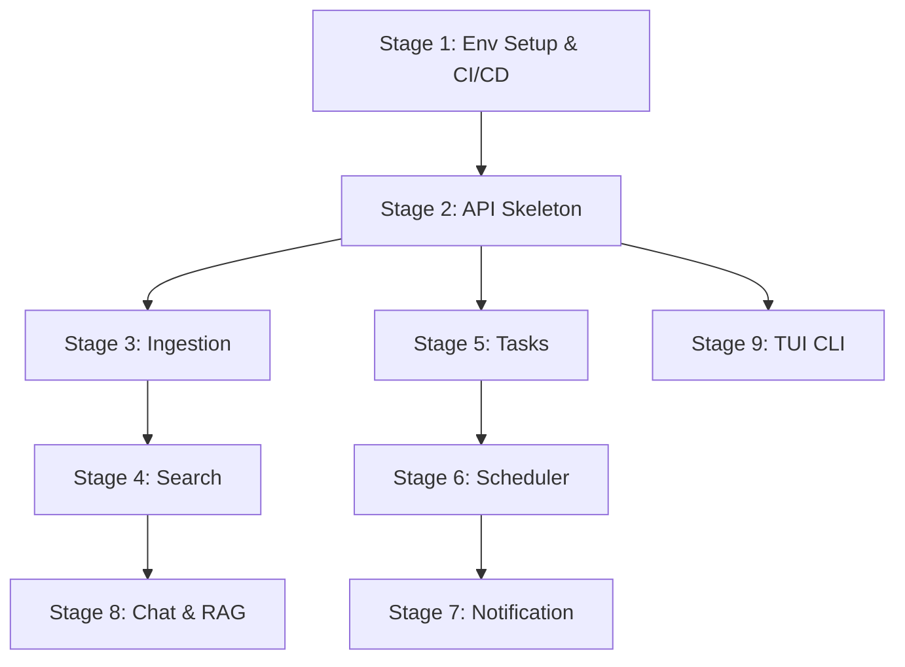

# Implementation Plan for "dome" AI‑Powered Exobrain

## 1. High‑Level Overview
"dome" will be built as a fully serverless, globally distributed system on Cloudflare's edge network.  
Key principles:
- **Incremental delivery**: each stage produces a working component with tests.  
- **Serverless-first**: Workers (HTTP APIs, scheduled jobs, queue consumers), D1 for structured data, Vectorize for embeddings, R2 for raw objects, Queues + schedules for background jobs, Workers AI for ML tasks.  
- **TypeScript + Hono + Zod + Drizzle**: type‑safe, modular, testable.  
- **CI/CD**: pnpm, just, wrangler CLI, Miniflare unit/integration tests, GitHub Actions.

---

## 2. Stage Breakdown

### Stage 1: Environment Setup & CI/CD
**Goal**  
Scaffold the monorepo, configure all Cloudflare resources in `wrangler.toml`, and establish a build/test/deploy pipeline.

**Technical Tasks**  
- Initialize pnpm workspace, configure `pnpm-workspace.yaml`.  
- Create root `wrangler.toml` with bindings:  
  - `D1_DATABASE = "dome_meta"`  
  - `VECTORIZE = "dome_notes"`  
  - `RAW` → R2 bucket `dome_raw`  
  - `EVENTS` → queue `dome_events`  
  - Optional Durable Object binding for session manager.  
- Add Justfile commands: `just build`, `just test`, `just deploy`.  
- Write initial GitHub Actions workflow:  
  - Install pnpm & dependencies  
  - Lint (ESLint/Prettier)  
  - Unit tests (Miniflare + Jest/Vitest)  
  - `wrangler publish --dry-run` on main.  
- Document environment variables and developer setup in `docs/DEV_SETUP.md`.
- Set up schema migration system for D1 database.

**Acceptance Criteria**  
- `pnpm install`, `just build`, `just test` pass locally.  
- `wrangler publish --dry-run` validates.  
- CI pipeline passes on a sample PR.
- Schema migrations can be applied with `wrangler d1 migrations apply`.

---

### Stage 2: API Worker Skeleton
**Goal**  
Stand up a Hono‑based Worker with router, validation, error handling and D1 connectivity.  

**Components**  
- `services/dome-api/src/worker/api.ts`  
- Hono router with stub handlers for:  
  - `GET /health`  
  - `POST /ingest`, `GET /search`, `POST /tasks`, `GET /tasks`, `POST /tasks/:id/complete`, `POST /chat`.  
- Auth middleware (API key header) to avoid open endpoints from day 1.
- Central Error → JSON mapper to keep handlers minimal.
- Drizzle D1 config file for SQL & TS type generation.

**Cloudflare Resources**  
All from Stage 1 (D1, Vectorize, R2, Queue, AI).

**Key Endpoints**  
- `/health` → 200 with `{ ok: true, version }` (version from wrangler.toml[vars]).
- Other endpoints return 501 or a JSON `{ error: "Not implemented" }`.
- Any unknown route → 404 JSON.

**Data Models & Schemas**  
- Load D1 table definitions via Drizzle migrations (notes, tasks, reminders).  
- Zod schemas for request bodies.

**Integration Points**  
- Environment bindings to D1, Vectorize, R2, Queue.  
- Drizzle client instantiation.

**Testing Approach**  
- Miniflare integration test:  
  - `GET /health` returns 200.  
  - Stub calls to other endpoints return 501.

---

### Stage 3: Ingestion Flow (`POST /ingest`)
**Goal**  
Accept natural‑language text or files, classify intent, extract entities, store metadata, raw blob, generate & store embedding.

**Technical Tasks**  
1. Classifier + extractor using Workers AI (`@cf/meta/llama-3-8b-instruct`).  
2. Insert note/task/reminder row into D1 via Drizzle.  
3. If file/blob >32 kB, upload to R2 (`RAW.put`).
   - Handle Workers CPU limit (10 ms) on PDF parse by having client upload raw file to R2 with signed URL, then hit /ingest with key + metadata; Worker only streams first 32 KB for embedding.
   - For large embedding batches, chunk pages and store page-level embeddings in note_pages table.
4. Generate embedding (Workers AI or AI Gateway).
   - Use AI Gateway URL for OpenAI fallback if Workers AI not yet whitelisted for required model.
5. `VECTORIZE.put(embedding, { user_id, note_id, created_at })`.
6. Implement idempotency key header to skip double uploads.

**Acceptance Criteria**  
- Posting JSON/text → new row in D1 with correct shape.  
- R2 store invoked for file input.  
- Vectorize API called with right metadata (can be mocked).  
- Integration test asserts D1, R2 and Vectorize calls.
- Unit test with text → row in D1 + vectorize call recorded.
- E2E (Miniflare) with file path: signed URL flow mocked & passes.

---

### Stage 4: Search Endpoint (`GET /search`)
**Goal**  
Perform semantic search over user's notes: embed query, vector database lookup, fetch bodies.

**Technical Tasks**  
1. Embed query text.  
2. `VECTORIZE.query(embedding, { topK: 10, filter: { user_id } })`.  
3. Fetch note body from D1 for each hit.  
4. Return JSON array of `{ id, context, body, score }`.
5. Create helper function `embedAndQuery(text, userId) → {matches}` to be reused by Chat.
6. Implement response streaming as ND-JSON for first-result-fast UX.
7. Add 429 guard if embedding QPS > free tier (track via KV counter).

**Acceptance Criteria**  
- Miniflare test with mocked Vectorize returns expected JSON.  
- Query parameter validation.
- Search for seeded note returns correct ID & score in <200 ms in Miniflare stub.
- Jest snapshot test for JSON shape.

---

### Stage 5: Task Management
**Goal**  
CRUD for tasks and reminders via REST.

**Technical Tasks**  
- `POST /tasks` → insert into `tasks` and optional `reminders`.  
- `GET /tasks?status=` → select tasks.  
- `POST /tasks/:id/complete` → update status.  
- (Optional) `POST /tasks/:id/remind` → insert reminder.
- Add Zod validation; return 400 on bad ISO dates.
- Add calendar webhook stub behind feature flag (to be updated later).

**Acceptance Criteria**  
- Unit tests for each endpoint (success & error cases).  
- D1 contents reflect operations.

---

### Stage 6: Scheduler Worker (`dome‑cron`)
**Goal**  
Periodically scan due reminders and enqueue events.

**Technical Tasks**  
- Scheduled worker (cron "*/5 * * * *").  
- SQL join `tasks` & `reminders` where `remind_at <= now AND delivered=0`.  
- For each row, `EVENTS.send({ kind: 'reminder_due', … })`.
- Handle edge cases:
  - >10k due rows: Paginate with LIMIT 500 + cursor
  - Delivery failures: Push retry event with attempt counter

**Acceptance Criteria**  
- Simulated cron event test enqueues correct messages.  
- Code coverage for scheduled logic.

---

### Stage 7: Notification Worker (`dome‑notify`)
**Goal**  
Consume `dome_events` queue, send notifications, mark reminders delivered.

**Technical Tasks**  
- Queue consumer on `reminder_due` events.  
- Send email (MailChannels) or Slack Webhook.
  - Use MailChannels batch API to send multiple reminders per invocation.
  - Create generic Notifier interface for future SMS/push modules.
  - Store Slack token in wrangler secret.
- `UPDATE reminders SET delivered=1`.

**Acceptance Criteria**  
- Event-driven test with mock MailChannels/Slack verifies D1 update.  
- Error handling & retries validated.

---

### Stage 8: Chat & RAG (`POST /chat`)
**Goal**  
Enable conversational retrieval‑augmented generation.

**Technical Tasks**  
1. Embed user query.  
2. Vectorize.query → top K IDs.  
3. Fetch bodies from D1.  
4. Assemble prompt + context & call LLM (Workers AI or AI Gateway).  
5. Stream response back to client.
6. Enhancements:
   - Use transformStream() to chunk OpenAI/Workers-AI response.
   - Add footnotes for each returned paragraph to include note IDs for UI highlight.
   - Inject "/add" suggestions when user asks to remember something.

**Acceptance Criteria**  
- Streaming integration test with mocked LLM returns expected chunks.  
- Prompt assembly logic verified.

---

### Stage 9: TUI CLI Client
**Goal**  
Provide a terminal UI for `/add`, `/note`, `/list`, `/show`, `/search`, `/chat`, etc.

**Technical Tasks**  
- New package `packages/cli` using Node.js + Inquirer/Commander.  
- Commands map to HTTP calls against deployed API.  
- Authentication (API key or token per user).
- Use Node + Ink (React TUI) for nicer UI.
- Store user token in ~/.config/dome/config.json.
- Support --prod flag for switching base URL.

**Acceptance Criteria**  
- Local CLI can add a note and list it via API (mock or real).  
- CLI tests (Jest) for command parsing and HTTP mocking.

---

### Stage 10: External Integrations & GraphQL (Optional)
**Goal**  
Add Slack bot, browser extension, and GraphQL playground.

**Technical Tasks**  
- Slack Worker for slash commands & notifications.  
- Browser extension sending API requests.  
- Hono GraphQL route with GraphiQL UI.
- Implement Slack Worker (slash /dome ...).
- Create browser extension (Manifest v3 + Cloudflare Access token).
- Add GraphQL route (Yoga) behind /gql.

**Acceptance Criteria**  
- Sample Slack slash command → note ingested.  
- Browser extension UI demo.  
- GraphQL schema matches REST.

---

## 3. Dependencies & Critical Path

- **Critical path**: S1 → S2 → S3 → S4 → S8  
- **Parallel work**: Task management (S5‑S7) can proceed alongside search/chat after skeleton.

---

## 4. Development Workflow & Tooling
- **Package management**: pnpm workspace  
- **Build/test**: `just build`, `just test` (Miniflare + Jest/Vitest)  
- **Cloudflare CLI**: wrangler for create, build, deploy  
- **Lint & formatting**: ESLint, Prettier  
- **CI**: GitHub Actions  
- **Branching**: feature branches, conventional commits, PR reviews  
- **Testing**:
  - Unit: Vitest with JSDOM stubs
  - Edge runtime: Miniflare v3 (includes Vectorize + D1 stubs)
  - Contract tests (TUI ↔ API): Dredd against OpenAPI spec
  - Load test search: k6 cloud hitting /search endpoint with Vectorize KV stub
- **Observability**:
  - Live logs: wrangler tail (per-worker)
  - Metrics: Vectorize dashboard + Queues / Scheduler metrics
  - Errors: Workers Trace flag ("exceptions")
  - Cost guardrails: AI Gateway daily spend cap; Vectorize op soft-limit alert

---

## 5. Security & Secrets
- Workers JWT issued per user; stored in TUI config; checked by middleware.
- Secrets (MAILCHANNELS_KEY, SLACK_WEBHOOK) via wrangler secret.
- R2 pre-signed URLs expire in 15 min; objects ACL = private.

Every stage includes:
- Schema migration (d1/migrations/*.sql)
- Types regenerated (pnpm drizzle-kit push)
- CI step running wrangler d1 migrations apply --dry-run

This ensures we never break production during incremental delivery.