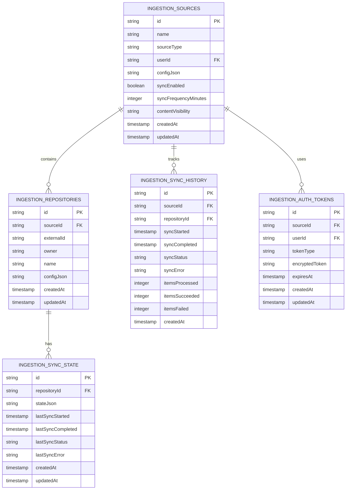

# Ingestion Services Data Models

## 1. Overview

This document defines the data models and database schema for the Dome platform's ingestion services. It covers the D1 database tables, relationships, and schemas required to support the configuration, state tracking, and operation of the ingestion services.



## 2. Database Tables

### 2.1 INGESTION_SOURCES

Stores the configuration for each content source.

```sql
CREATE TABLE ingestion_sources (
  id TEXT PRIMARY KEY,
  name TEXT NOT NULL,
  source_type TEXT NOT NULL,
  user_id TEXT,
  config_json TEXT NOT NULL,
  sync_enabled BOOLEAN NOT NULL DEFAULT true,
  sync_frequency_minutes INTEGER NOT NULL DEFAULT 60,
  content_visibility TEXT NOT NULL DEFAULT 'private',
  created_at INTEGER NOT NULL,
  updated_at INTEGER NOT NULL
);

CREATE INDEX idx_ingestion_sources_user_id ON ingestion_sources(user_id);
CREATE INDEX idx_ingestion_sources_source_type ON ingestion_sources(source_type);
```

#### Field Descriptions

- `id`: Unique identifier for the source (ULID)
- `name`: Display name for the source
- `source_type`: Type of source (github, notion, linear, blog, etc.)
- `user_id`: Associated user ID (null for organization/public sources)
- `config_json`: JSON configuration specific to the source type
- `sync_enabled`: Whether sync is enabled for this source
- `sync_frequency_minutes`: How often to sync this source (in minutes)
- `content_visibility`: Whether content is public, private, or mixed
- `created_at`: Creation timestamp (epoch seconds)
- `updated_at`: Last update timestamp (epoch seconds)

### 2.2 INGESTION_REPOSITORIES

Stores information about individual repositories or content containers.

```sql
CREATE TABLE ingestion_repositories (
  id TEXT PRIMARY KEY,
  source_id TEXT NOT NULL REFERENCES ingestion_sources(id) ON DELETE CASCADE,
  external_id TEXT NOT NULL,
  owner TEXT NOT NULL,
  name TEXT NOT NULL,
  config_json TEXT NOT NULL,
  created_at INTEGER NOT NULL,
  updated_at INTEGER NOT NULL,
  UNIQUE(source_id, external_id)
);

CREATE INDEX idx_ingestion_repositories_source_id ON ingestion_repositories(source_id);
```

### 2.3 INGESTION_SYNC_STATE

Tracks the current sync state for each repository.

```sql
CREATE TABLE ingestion_sync_state (
  id TEXT PRIMARY KEY,
  repository_id TEXT NOT NULL REFERENCES ingestion_repositories(id) ON DELETE CASCADE,
  state_json TEXT NOT NULL,
  last_sync_started INTEGER,
  last_sync_completed INTEGER,
  last_sync_status TEXT,
  last_sync_error TEXT,
  created_at INTEGER NOT NULL,
  updated_at INTEGER NOT NULL,
  UNIQUE(repository_id)
);

CREATE INDEX idx_ingestion_sync_state_repository_id ON ingestion_sync_state(repository_id);
```

### 2.4 INGESTION_SYNC_HISTORY

Records the history of sync operations.

```sql
CREATE TABLE ingestion_sync_history (
  id TEXT PRIMARY KEY,
  source_id TEXT NOT NULL REFERENCES ingestion_sources(id) ON DELETE CASCADE,
  repository_id TEXT REFERENCES ingestion_repositories(id) ON DELETE CASCADE,
  sync_started INTEGER NOT NULL,
  sync_completed INTEGER NOT NULL,
  sync_status TEXT NOT NULL,
  sync_error TEXT,
  items_processed INTEGER NOT NULL DEFAULT 0,
  items_succeeded INTEGER NOT NULL DEFAULT 0,
  items_failed INTEGER NOT NULL DEFAULT 0,
  created_at INTEGER NOT NULL
);

CREATE INDEX idx_ingestion_sync_history_source_id ON ingestion_sync_history(source_id);
CREATE INDEX idx_ingestion_sync_history_repository_id ON ingestion_sync_history(repository_id);
CREATE INDEX idx_ingestion_sync_history_sync_started ON ingestion_sync_history(sync_started);
```

### 2.5 INGESTION_AUTH_TOKENS

Securely stores authentication tokens for external services.

```sql
CREATE TABLE ingestion_auth_tokens (
  id TEXT PRIMARY KEY,
  source_id TEXT NOT NULL REFERENCES ingestion_sources(id) ON DELETE CASCADE,
  user_id TEXT,
  token_type TEXT NOT NULL,
  encrypted_token TEXT NOT NULL,
  expires_at INTEGER,
  created_at INTEGER NOT NULL,
  updated_at INTEGER NOT NULL
);

CREATE INDEX idx_ingestion_auth_tokens_source_id ON ingestion_auth_tokens(source_id);
CREATE INDEX idx_ingestion_auth_tokens_user_id ON ingestion_auth_tokens(user_id);
```

## 3. Source-Specific Configuration Examples

### 3.1 GitHub Configuration

```json
{
  "authType": "oauth",
  "authId": "auth123",
  "repositories": [
    {
      "owner": "dome-labs",
      "name": "dome",
      "branches": ["main", "develop"],
      "contentTypes": {
        "code": true,
        "issues": true,
        "pullRequests": true,
        "discussions": true,
        "wiki": false
      },
      "codeFilters": {
        "includePaths": ["**/*.ts", "**/*.js", "**/*.md"],
        "excludePaths": ["**/node_modules/**", "**/dist/**"],
        "maxFileSize": 1048576
      }
    }
  ]
}
```

### 3.2 Notion Configuration

```json
{
  "authType": "oauth",
  "authId": "auth456",
  "spaces": [
    {
      "id": "space123",
      "name": "Workspace",
      "contentTypes": {
        "pages": true,
        "databases": true
      },
      "filters": {
        "includePaths": ["/Projects/*", "/Documentation/*"],
        "excludePaths": ["/Personal/*"]
      }
    }
  ]
}
```

## 4. Sync State Examples

### 4.1 GitHub Sync State

```json
{
  "branches": {
    "main": {
      "lastCommitSha": "abc123",
      "lastSyncedAt": 1650000000
    },
    "develop": {
      "lastCommitSha": "def456",
      "lastSyncedAt": 1650000000
    }
  },
  "issues": {
    "cursor": "Y3Vyc29yOnYyOpK5MjAyMy0wMS0wMVQwMDowMDowMFo=",
    "lastSyncedAt": 1650000000
  },
  "pullRequests": {
    "cursor": "Y3Vyc29yOnYyOpK5MjAyMy0wMS0wMVQwMDowMDowMFo=",
    "lastSyncedAt": 1650000000
  },
  "discussions": {
    "cursor": "Y3Vyc29yOnYyOpK5MjAyMy0wMS0wMVQwMDowMDowMFo=",
    "lastSyncedAt": 1650000000
  }
}
```

### 4.2 Notion Sync State

```json
{
  "pages": {
    "cursor": "abc123",
    "lastSyncedAt": 1650000000
  },
  "databases": {
    "cursor": "def456",
    "lastSyncedAt": 1650000000
  }
}
```

## 5. Migration Script

```sql
-- Migration: 001_create_ingestion_tables

-- Create ingestion_sources table
CREATE TABLE ingestion_sources (
  id TEXT PRIMARY KEY,
  name TEXT NOT NULL,
  source_type TEXT NOT NULL,
  user_id TEXT,
  config_json TEXT NOT NULL,
  sync_enabled BOOLEAN NOT NULL DEFAULT true,
  sync_frequency_minutes INTEGER NOT NULL DEFAULT 60,
  content_visibility TEXT NOT NULL DEFAULT 'private',
  created_at INTEGER NOT NULL,
  updated_at INTEGER NOT NULL
);

CREATE INDEX idx_ingestion_sources_user_id ON ingestion_sources(user_id);
CREATE INDEX idx_ingestion_sources_source_type ON ingestion_sources(source_type);

-- Create ingestion_repositories table
CREATE TABLE ingestion_repositories (
  id TEXT PRIMARY KEY,
  source_id TEXT NOT NULL REFERENCES ingestion_sources(id) ON DELETE CASCADE,
  external_id TEXT NOT NULL,
  owner TEXT NOT NULL,
  name TEXT NOT NULL,
  config_json TEXT NOT NULL,
  created_at INTEGER NOT NULL,
  updated_at INTEGER NOT NULL,
  UNIQUE(source_id, external_id)
);

CREATE INDEX idx_ingestion_repositories_source_id ON ingestion_repositories(source_id);

-- Create ingestion_sync_state table
CREATE TABLE ingestion_sync_state (
  id TEXT PRIMARY KEY,
  repository_id TEXT NOT NULL REFERENCES ingestion_repositories(id) ON DELETE CASCADE,
  state_json TEXT NOT NULL,
  last_sync_started INTEGER,
  last_sync_completed INTEGER,
  last_sync_status TEXT,
  last_sync_error TEXT,
  created_at INTEGER NOT NULL,
  updated_at INTEGER NOT NULL,
  UNIQUE(repository_id)
);

CREATE INDEX idx_ingestion_sync_state_repository_id ON ingestion_sync_state(repository_id);

-- Create ingestion_sync_history table
CREATE TABLE ingestion_sync_history (
  id TEXT PRIMARY KEY,
  source_id TEXT NOT NULL REFERENCES ingestion_sources(id) ON DELETE CASCADE,
  repository_id TEXT REFERENCES ingestion_repositories(id) ON DELETE CASCADE,
  sync_started INTEGER NOT NULL,
  sync_completed INTEGER NOT NULL,
  sync_status TEXT NOT NULL,
  sync_error TEXT,
  items_processed INTEGER NOT NULL DEFAULT 0,
  items_succeeded INTEGER NOT NULL DEFAULT 0,
  items_failed INTEGER NOT NULL DEFAULT 0,
  created_at INTEGER NOT NULL
);

CREATE INDEX idx_ingestion_sync_history_source_id ON ingestion_sync_history(source_id);
CREATE INDEX idx_ingestion_sync_history_repository_id ON ingestion_sync_history(repository_id);
CREATE INDEX idx_ingestion_sync_history_sync_started ON ingestion_sync_history(sync_started);

-- Create ingestion_auth_tokens table
CREATE TABLE ingestion_auth_tokens (
  id TEXT PRIMARY KEY,
  source_id TEXT NOT NULL REFERENCES ingestion_sources(id) ON DELETE CASCADE,
  user_id TEXT,
  token_type TEXT NOT NULL,
  encrypted_token TEXT NOT NULL,
  expires_at INTEGER,
  created_at INTEGER NOT NULL,
  updated_at INTEGER NOT NULL
);

CREATE INDEX idx_ingestion_auth_tokens_source_id ON ingestion_auth_tokens(source_id);
CREATE INDEX idx_ingestion_auth_tokens_user_id ON ingestion_auth_tokens(user_id);
