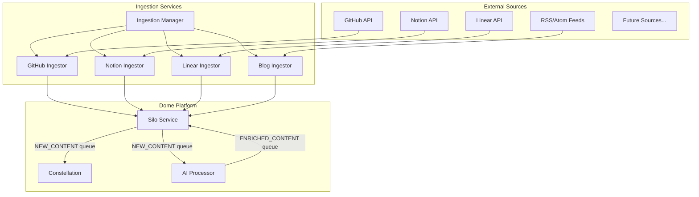
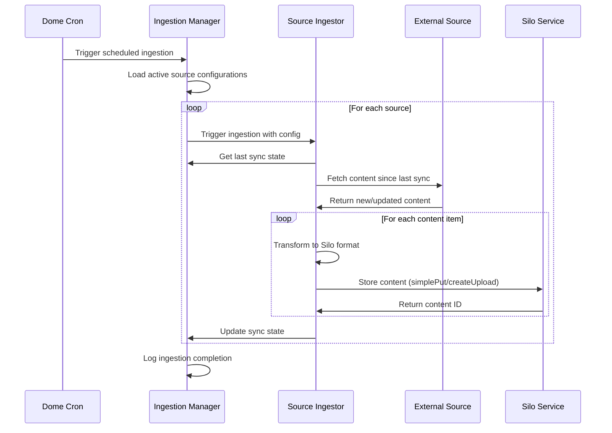
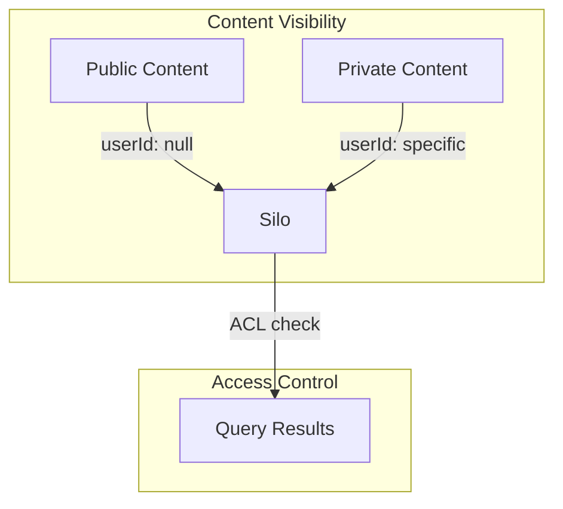

# Ingestion Services Architecture

## 1. Overview

The Ingestion Services are a suite of specialized workers designed to pull data from various external sources (GitHub, Notion, Linear, blogs, etc.) and ingest them into the Silo service. These services enable the Dome platform to maintain an up-to-date knowledge base from diverse content sources, which can then be processed, embedded, and made available for RAG operations.

This document outlines the architecture of the ingestion system, its integration with the existing Dome platform, data flows, authentication mechanisms, and extensibility patterns for adding new data sources.



## 2. Core Components

### 2.1 Ingestion Manager

The Ingestion Manager is a central service responsible for:

- Scheduling and coordinating ingestion jobs
- Managing source configurations
- Tracking ingestion history and status
- Providing a unified API for configuring content sources
- Handling authentication with external services
- Implementing rate limiting and backoff strategies

### 2.2 Source-Specific Ingestors

Each external source has a dedicated ingestor service optimized for that particular API:

1. **GitHub Ingestor**
   - Pulls repositories, issues, pull requests, and discussions
   - Handles GitHub-specific pagination and rate limits
   - Processes markdown and code content

2. **Notion Ingestor**
   - Pulls pages, databases, and blocks
   - Handles Notion's hierarchical content structure
   - Converts Notion blocks to structured content

3. **Linear Ingestor**
   - Pulls issues, projects, and comments
   - Handles Linear's GraphQL API
   - Processes work items and their relationships

4. **Blog Ingestor**
   - Pulls content from RSS/Atom feeds
   - Handles HTML parsing and cleaning
   - Extracts metadata (authors, dates, categories)

### 2.3 Shared Components

All ingestors share common components:

1. **Source Configuration Store**
   - D1 database for storing source configurations
   - Includes credentials, sync frequency, and content filters

2. **Ingestion State Tracker**
   - Tracks last sync time, cursor positions, and sync status
   - Enables incremental updates

3. **Content Transformer**
   - Converts source-specific formats to Silo-compatible formats
   - Handles content normalization and metadata extraction

4. **Authentication Manager**
   - Manages OAuth tokens and service accounts
   - Handles token refresh and rotation

## 3. System Integration

### 3.1 Integration with Silo

The ingestion services integrate with Silo through:

1. **Direct API Calls**
   - Using `simplePut` for small content items
   - Using `createUpload` for larger content items

2. **Content Metadata**
   - Each ingested item includes source-specific metadata
   - Metadata includes origin URL, author, timestamp, etc.

3. **Content Ownership**
   - Public content is stored with `userId: null`
   - Private content is associated with specific user IDs

### 3.2 Integration with Dome API

The ingestion services expose configuration endpoints through the Dome API:

1. **Source Configuration**
   - Add/remove/update content sources
   - Configure sync frequency and content filters

2. **Authentication**
   - OAuth flow initiation and callback handling
   - Service account credential management

3. **Status Reporting**
   - View ingestion history and status
   - Troubleshoot failed ingestions

## 4. Data Flow

### 4.1 Ingestion Flow



### 4.2 Content Processing Flow

Once content is ingested into Silo, it follows the existing Dome platform flow:

1. Silo sends notifications to the NEW_CONTENT queue
2. Constellation service embeds the content for vector search
3. AI Processor service enriches the content with metadata
4. Enriched content is stored back in Silo

## 5. Authentication Mechanisms

### 5.1 GitHub Authentication

Two authentication methods are supported:

1. **OAuth for User-Specific Content**
   - Users authorize access to their repositories
   - OAuth tokens stored securely in D1
   - Scoped to specific repositories and permissions

2. **Service Account (GitHub App)**
   - For organizational repositories
   - Installation tokens with defined permissions
   - Supports webhook-based updates

### 5.2 Authentication for Other Services

Similar dual-approach for other services:

1. **OAuth for User-Specific Content**
   - User-authorized access to their private content
   - Service-specific OAuth implementation

2. **Service Accounts/API Keys**
   - For organizational or public content
   - API keys stored securely in D1

### 5.3 Token Management

Secure token handling:

1. **Token Storage**
   - Encrypted at rest in D1
   - Access controlled through service bindings

2. **Token Refresh**
   - Automatic refresh of expiring tokens
   - Notification of authentication failures

3. **Revocation Handling**
   - Detection of revoked tokens
   - User notification for re-authentication

## 6. Public vs. Private Content

### 6.1 Content Visibility Model



### 6.2 Public Content

- Available to all users for RAG operations
- Stored with `userId: null` in Silo
- Examples: public repositories, public blogs, documentation

### 6.3 Private Content

- Associated with specific user IDs
- Only accessible to authorized users
- Examples: private repositories, personal Notion pages

### 6.4 Mixed Visibility

- Organizations can have mixed public/private content
- Configurable at the source level
- Can be overridden for specific content items

## 7. Extensibility Patterns

### 7.1 New Source Integration

Adding a new data source follows this pattern:

1. **Create Source-Specific Ingestor**
   - Implement source-specific API client
   - Define content transformation logic
   - Handle pagination and rate limiting

2. **Register with Ingestion Manager**
   - Add source type to configuration schema
   - Implement source-specific configuration UI

3. **Implement Authentication**
   - Add OAuth flow if needed
   - Define service account structure

### 7.2 Ingestor Interface

All ingestors implement a common interface:

```typescript
interface ContentIngestor {
  // Initialize the ingestor with configuration
  initialize(config: SourceConfig): Promise<void>;
  
  // Fetch content since last sync
  fetchContent(lastSyncState: SyncState): Promise<IngestorResult>;
  
  // Test connection and credentials
  testConnection(): Promise<ConnectionStatus>;
  
  // Get source-specific configuration schema
  getConfigSchema(): z.ZodSchema;
}
```

### 7.3 Plugin Architecture

Future extensibility through a plugin architecture:

1. **Dynamic Loading**
   - Load ingestor implementations at runtime
   - Support for community-contributed ingestors

2. **Versioned Interfaces**
   - Backward compatibility for ingestor interfaces
   - Gradual migration path for updates

3. **Sandboxed Execution**
   - Security boundaries for third-party ingestors
   - Resource limits and monitoring

## 8. Implementation Plan

### 8.1 Phase 1: Core Infrastructure

1. Implement Ingestion Manager service
2. Create shared components (auth, state tracking)
3. Define common interfaces and schemas
4. Implement GitHub Ingestor as reference

### 8.2 Phase 2: Additional Sources

1. Implement Notion Ingestor
2. Implement Blog Ingestor
3. Implement Linear Ingestor
4. Enhance Ingestion Manager with scheduling

### 8.3 Phase 3: Advanced Features

1. Implement webhook receivers for real-time updates
2. Add content filtering and transformation rules
3. Implement advanced error handling and retry logic
4. Add monitoring and alerting

## 9. Technical Considerations

### 9.1 Performance Considerations

1. **Incremental Syncs**
   - Only fetch new or changed content
   - Use API-specific mechanisms (etags, cursors)

2. **Batch Processing**
   - Process content in batches to optimize throughput
   - Balance between latency and efficiency

3. **Rate Limiting**
   - Respect API rate limits
   - Implement backoff strategies

### 9.2 Scalability Considerations

1. **Independent Scaling**
   - Each ingestor can scale independently
   - Based on source-specific load patterns

2. **Stateless Design**
   - Store state in D1/R2, not in worker memory
   - Enable horizontal scaling

3. **Queue-Based Processing**
   - Use queues for high-volume ingestion
   - Decouple fetching from processing

### 9.3 Error Handling

1. **Graceful Degradation**
   - Continue with available sources if some fail
   - Log detailed error information

2. **Retry Strategies**
   - Exponential backoff for transient errors
   - Circuit breaker for persistent failures

3. **Monitoring**
   - Track success rates and latencies
   - Alert on critical failures

## 10. Security Considerations

### 10.1 Data Security

1. **Content Isolation**
   - Strict separation between user data
   - Access control at the Silo level

2. **Credential Protection**
   - Encrypted storage of API keys and tokens
   - Minimal permission scopes

3. **Content Validation**
   - Sanitize incoming content
   - Protect against injection attacks

### 10.2 API Security

1. **Rate Limiting**
   - Prevent abuse of external APIs
   - Protect against denial of service

2. **Authentication**
   - Secure token handling
   - Regular rotation of service account credentials

3. **Audit Logging**
   - Track all authentication events
   - Log access to sensitive operations