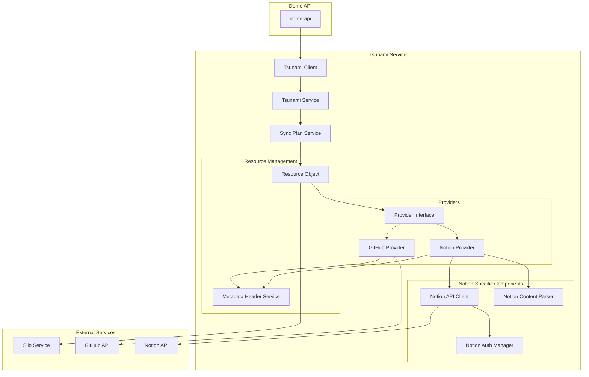
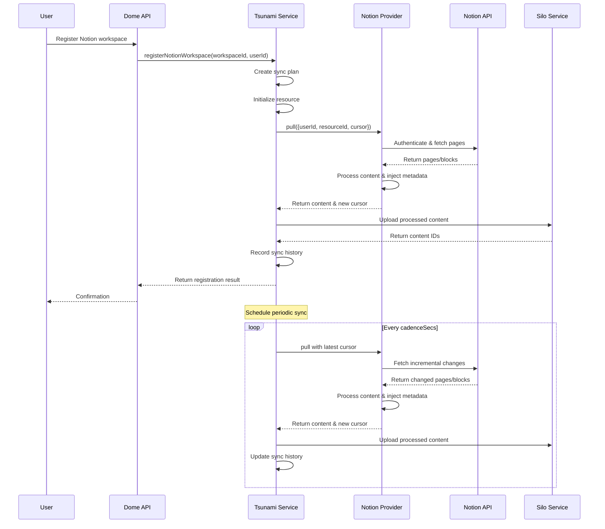

# Notion Ingestor Architecture

This document outlines the architecture for the Notion Ingestor system which extends the existing Tsunami service to support syncing content from Notion workspaces.

## 1. Overview

The Notion Ingestor is designed to integrate with the existing Tsunami service architecture, providing a parallel implementation to the GitHub ingestor. It enables users to connect their Notion workspaces, sync content incrementally, and make it available for searching, analysis, and other operations within the Dome ecosystem.

## 2. Component Diagram



## 3. Data Flow



## 4. Key Components

### 4.1 Notion Provider (`NotionProvider`)

Implements the existing Provider interface to pull content from Notion workspaces.

```typescript
export class NotionProvider implements Provider {
  private log = getLogger();
  private notionClient: NotionClient;
  private ignorePatternProcessor: IgnorePatternProcessor;
  private filterConfig = DEFAULT_FILTER_CONFIG;

  constructor(env: Env) {
    const apiKey = env.NOTION_API_KEY ?? '';
    this.notionClient = new NotionClient(apiKey);
    this.ignorePatternProcessor = new IgnorePatternProcessor();
  }

  async pull({ userId, resourceId, cursor }: PullOpts): Promise<PullResult> {
    // Get workspace ID from resourceId
    const workspaceId = resourceId;
    this.log.info({ workspaceId, cursor }, 'notion: pull start');

    // Get pages changed since cursor
    const pages = await this.notionClient.getUpdatedPages(workspaceId, cursor);
    if (!pages.length) return { contents: [], newCursor: null };

    // Process pages and convert to storable format
    const puts: SiloSimplePutInput[] = [];
    let latestUpdate = cursor;

    for (const page of pages) {
      // Check if page should be filtered
      if (this.shouldIgnorePage(page)) continue;

      // Get page content (blocks)
      const content = await this.notionClient.getPageContent(page.id);

      // Create metadata for the page
      const metadata = createNotionMetadata(
        workspaceId,
        page.id,
        page.last_edited_time,
        page.title,
        content.length,
      );

      // Inject metadata header into content
      const contentWithMetadata = injectMetadataHeader(content, metadata);

      puts.push({
        content: contentWithMetadata,
        category: this.determineCategory(page),
        mimeType: this.determineMimeType(page),
        userId,
        metadata: {
          workspace: workspaceId,
          pageId: page.id,
          title: page.title,
          lastEditedTime: page.last_edited_time,
          url: page.url,
        },
      });

      // Track latest update for cursor
      if (page.last_edited_time > latestUpdate) {
        latestUpdate = page.last_edited_time;
      }
    }

    this.log.info({ resourceId, pages: puts.length }, 'notion: pull done');

    return { contents: puts, newCursor: latestUpdate };
  }

  // Helper methods
  private shouldIgnorePage(page: any): boolean {
    // Implementation for filtering pages
  }

  private determineCategory(page: any): ContentCategory {
    // Logic to determine content category based on page properties
  }

  private determineMimeType(page: any): MimeType {
    // Logic to determine MIME type based on page content
  }
}
```

### 4.2 Notion API Client

Handles direct communication with Notion's API, including authentication, rate limiting, and error handling.

```typescript
export class NotionClient {
  private headers: Record<string, string>;
  private log = getLogger();
  private API_BASE = 'https://api.notion.com/v1';

  constructor(apiKey: string) {
    this.headers = {
      Authorization: `Bearer ${apiKey}`,
      'Notion-Version': '2022-06-28',
      'Content-Type': 'application/json',
    };
  }

  async getUpdatedPages(workspaceId: string, cursor: string | null): Promise<any[]> {
    // Implementation to fetch pages updated since cursor
  }

  async getPageContent(pageId: string): Promise<string> {
    // Implementation to get page content
  }

  async getDatabase(databaseId: string): Promise<any> {
    // Implementation to get database content
  }

  // Additional methods for different Notion object types
}
```

### 4.3 Notion Authentication Manager

Manages API keys and OAuth integration with Notion.

```typescript
export class NotionAuthManager {
  private log = getLogger();
  private clientId: string;
  private clientSecret: string;
  private redirectUri: string;

  constructor(env: Env) {
    this.clientId = env.NOTION_CLIENT_ID;
    this.clientSecret = env.NOTION_CLIENT_SECRET;
    this.redirectUri = env.NOTION_REDIRECT_URI;
  }

  getAuthUrl(state: string): string {
    // Generate OAuth authorization URL
  }

  async exchangeCodeForToken(code: string): Promise<{
    accessToken: string;
    workspaceId: string;
    workspaceName: string;
    botId: string;
  }> {
    // Exchange authorization code for access token
  }

  async storeUserToken(userId: string, workspaceId: string, token: string): Promise<void> {
    // Store user token in secure storage
  }

  async getUserToken(userId: string, workspaceId: string): Promise<string | null> {
    // Retrieve user token from secure storage
  }
}
```

### 4.4 Notion Content Parser

Handles parsing and transforming Notion content into a standardized format for storage.

```typescript
export class NotionContentParser {
  parse(blocks: any[]): string {
    // Convert Notion blocks to a standardized text format
  }

  extractTextContent(blocks: any[]): string {
    // Extract plain text from blocks
  }

  parseDatabase(database: any): string {
    // Convert Notion database to structured text
  }

  convertRichText(richText: any[]): string {
    // Convert Notion rich text to plain text
  }
}
```

### 4.5 Notion Metadata Service

Creates specific metadata for Notion content.

```typescript
export function createNotionMetadata(
  workspaceId: string,
  pageId: string,
  updatedAt: string,
  title: string,
  sizeBytes: number,
): DomeMetadata {
  return {
    source: {
      type: 'notion',
      workspace: workspaceId,
      page_id: pageId,
      updated_at: updatedAt,
    },
    content: {
      type: 'document',
      title,
      size_bytes: sizeBytes,
    },
    ingestion: {
      timestamp: new Date().toISOString(),
      version: '1.0',
    },
  };
}
```

## 5. API Specifications

### 5.1 Tsunami Service API Extension

Add a new method to the Tsunami service to register a Notion workspace:

```typescript
/**
 * Register and initialize a Notion workspace for syncing
 *
 * @param workspaceId - Notion workspace ID
 * @param userId - Optional user ID to associate with the sync plan
 * @param cadenceSecs - Optional sync frequency in seconds (defaults to 3600 - 1 hour)
 * @returns Object containing the ID, resourceId, and initialization status
 */
async registerNotionWorkspace(
  workspaceId: string,
  userId?: string,
  cadenceSecs: number = 3600
): Promise<{ id: string; resourceId: string; wasInitialised: boolean }> {
  const resourceId = workspaceId;
  const requestId = crypto.randomUUID();

  logger.info({
    event: 'notion_workspace_registration_start',
    workspaceId,
    resourceId,
    userId,
    requestId
  }, 'Starting Notion workspace registration');

  // Try to create a brand‑new sync‑plan or get existing one
  let syncPlanId: string;
  try {
    // Try to create a brand‑new sync‑plan
    syncPlanId = await this.createSyncPlan('notion', resourceId, userId);
    logger.info({
      event: 'sync_plan_created',
      syncPlanId,
      resourceId,
      requestId
    }, 'Sync‑plan created successfully');
  } catch (err) {
    if (err instanceof ConflictError) {
      // Plan exists – fetch its id
      const plan = await this.getSyncPlan(resourceId);
      syncPlanId = plan.id;
      logger.info({
        event: 'sync_plan_exists',
        syncPlanId,
        resourceId,
        requestId
      }, 'Sync‑plan already exists');
    } else {
      throw toDomeError(err, 'Failed to create or retrieve sync plan', {
        resourceId,
        userId,
        requestId
      });
    }
  }

  // Always attach the user if supplied (idempotent if already attached)
  if (userId) {
    await this.attachUser(syncPlanId, userId);
    logger.info({
      event: 'user_attached',
      syncPlanId,
      userId,
      requestId
    }, 'User attached to sync‑plan successfully');
  }

  const created = await this.initializeResource(
    { resourceId, providerType: 'NOTION', userId },
    cadenceSecs,
  );

  logger.info(
    {
      event: 'notion_workspace_initialized',
      syncPlanId,
      resourceId,
      created,
      requestId
    },
    'Notion workspace initialised & synced successfully',
  );

  metrics.trackOperation('notion_workspace_registration', true, { created: String(created) });

  return {
    id: syncPlanId,
    resourceId,
    wasInitialised: created,
  };
}
```

### 5.2 Client API Extension

Extend the Tsunami client with methods for interacting with Notion workspaces:

```typescript
/**
 * Register a Notion workspace and initialize syncing
 *
 * @param workspaceId Notion workspace ID
 * @param userId Optional user ID to associate with the sync plan
 * @param cadenceSecs Optional sync frequency in seconds (defaults to 3600 - 1 hour)
 * @returns Object containing the ID, resourceId, and initialization status
 */
async registerNotionWorkspace(
  workspaceId: string,
  userId?: string,
  cadenceSecs: number = 3600
): Promise<{ id: string; resourceId: string; wasInitialised: boolean }> {
  const startTime = performance.now();

  try {
    this.logger.info({
      event: 'notion_workspace_registration_start',
      workspaceId,
      userId,
      cadenceSecs
    }, 'Starting Notion workspace registration');

    const result = await this.binding.registerNotionWorkspace(workspaceId, userId, cadenceSecs);

    metrics.increment(`${this.metricsPrefix}.notion_workspace_registration.success`);
    metrics.timing(`${this.metricsPrefix}.notion_workspace_registration.latency_ms`, performance.now() - startTime);

    return result;
  } catch (error) {
    metrics.increment(`${this.metricsPrefix}.notion_workspace_registration.errors`);
    logError(error, 'Error registering Notion workspace');
    throw error;
  }
}

/**
 * Get sync history for a Notion workspace
 *
 * @param workspaceId Notion workspace ID
 * @param limit Maximum number of history records to return
 * @returns Workspace history with metadata
 */
async getNotionWorkspaceHistory(workspaceId: string, limit: number = 10): Promise<{
  workspaceId: string;
  resourceId: string;
  history: unknown[];
}> {
  const startTime = performance.now();
  const resourceId = workspaceId;

  try {
    this.logger.info({
      event: 'get_notion_workspace_history',
      workspaceId,
      resourceId,
      limit
    }, 'Fetching Notion workspace history');

    const history = await this.binding.getHistoryByResourceId(resourceId, limit);

    metrics.increment(`${this.metricsPrefix}.get_notion_workspace_history.success`);
    metrics.timing(`${this.metricsPrefix}.get_notion_workspace_history.latency_ms`, performance.now() - startTime);

    return {
      workspaceId,
      resourceId,
      history
    };
  } catch (error) {
    metrics.increment(`${this.metricsPrefix}.get_notion_workspace_history.errors`);
    logError(error, 'Error fetching Notion workspace history');
    throw error;
  }
}
```

## 6. Integration with Existing Systems

### 6.1 ResourceObject Updates

Update the ResourceObject to support the Notion provider type:

```typescript
private makeProvider(pt: ProviderType): Provider {
  switch (pt) {
    case ProviderType.GITHUB:
      return new GithubProvider(this.env);
    case ProviderType.NOTION:
      return new NotionProvider(this.env);
    default:
      throw new Error(`Provider ${pt} not implemented`);
  }
}
```

### 6.2 SyncPlanService Updates

Update the validateResourceId method to support Notion workspace IDs:

```typescript
private validateResourceId(pt: ProviderType, id: string) {
  assertValid(id && id.trim().length > 0, 'ResourceId cannot be empty', {
    providerType: pt,
    operation: 'validateResourceId'
  });

  if (pt === ProviderType.GITHUB) {
    assertValid(/^[^/]+\/[^/]+$/.test(id),
      `Invalid GitHub resourceId "${id}" (owner/repo required)`, {
      providerType: pt,
      resourceId: id,
      operation: 'validateResourceId',
      pattern: 'owner/repo'
    });
  } else if (pt === ProviderType.NOTION) {
    // Notion workspace IDs are UUIDs (with hyphens)
    assertValid(
      /^[0-9a-f]{8}-[0-9a-f]{4}-[0-9a-f]{4}-[0-9a-f]{4}-[0-9a-f]{12}$/.test(id),
      `Invalid Notion resourceId "${id}" (workspace UUID required)`, {
        providerType: pt,
        resourceId: id,
        operation: 'validateResourceId',
        pattern: 'workspace-uuid'
      }
    );
  }
}
```

### 6.3 Environment Configuration

The following environment variables will be needed:

```
NOTION_API_KEY: API key for Notion API
NOTION_CLIENT_ID: OAuth client ID (for integration setup)
NOTION_CLIENT_SECRET: OAuth client secret
NOTION_REDIRECT_URI: OAuth redirect URI
```

## 7. Error Handling Strategy

The Notion ingestor will use the same error handling patterns as the existing system:

1. **Domain-Specific Errors**: Create specific error types for Notion integration issues.
2. **Error Propagation**: Use the existing `toDomeError` utility to transform errors.
3. **Logging**: Use the existing logging framework to log errors with appropriate context.
4. **Metrics**: Track error metrics to monitor system health.

```typescript
// Example error handling in NotionProvider
try {
  const pages = await this.notionClient.getUpdatedPages(workspaceId, cursor);
  // Process pages...
} catch (error) {
  // Transform to domain error
  const domeError = toDomeError(error, 'Failed to fetch updated pages from Notion', {
    workspaceId,
    cursor,
    operation: 'notion.pull',
  });

  // Log the error with context
  logError(domeError, 'Error pulling content from Notion');

  // Track metric
  metrics.increment('notion.pull.errors');

  // Propagate
  throw domeError;
}
```

## 8. Testing Strategy

1. **Unit Tests**: Test each component in isolation with mocked dependencies.
2. **Integration Tests**: Test the Notion provider with mocked API responses.
3. **End-to-End Tests**: Test the complete flow with a test Notion workspace.

## 9. Deployment Considerations

1. **Environment Variables**: Add Notion-specific environment variables to all deployment environments.
2. **API Limits**: Implement rate limiting to respect Notion API constraints.
3. **Monitoring**: Set up monitoring for Notion API health and integration status.
4. **Rollout Plan**: Deploy incrementally, starting with internal testing, then beta users, then general availability.

## 10. Future Enhancements

1. **Advanced Filtering**: Support for advanced filtering of Notion content.
2. **Support for Databases**: Enhanced support for Notion databases.
3. **Custom Properties**: Support for custom properties in Notion pages.
4. **Content Relationships**: Track and maintain relationships between Notion pages.
5. **Workspace Settings**: User-configurable settings for each workspace.
