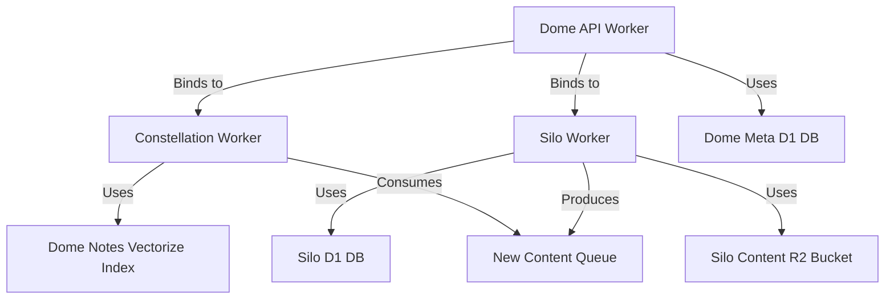

# Pulumi Migration Guide

## Table of Contents

- [Introduction](#introduction)
- [Migration Overview](#migration-overview)
- [Prerequisites](#prerequisites)
- [Phase 1: Resource Discovery and Documentation](#phase-1-resource-discovery-and-documentation)
- [Phase 2: Initial Pulumi Setup](#phase-2-initial-pulumi-setup)
- [Phase 3: Resource Import](#phase-3-resource-import)
- [Phase 4: Incremental Migration](#phase-4-incremental-migration)
- [Phase 5: Complete Transition](#phase-5-complete-transition)
- [Handling Existing Resources](#handling-existing-resources)
- [Validating Migration Success](#validating-migration-success)
- [Rollback Procedures](#rollback-procedures)
- [Common Migration Issues](#common-migration-issues)
- [Post-Migration Best Practices](#post-migration-best-practices)

## Introduction

This guide provides a comprehensive approach for migrating from manual Cloudflare resource deployments to an infrastructure as code (IaC) approach using Pulumi. The migration process is designed to be incremental and safe, minimizing disruption to existing services while transitioning to a more maintainable and automated infrastructure management approach.

## Migration Overview

The migration from manual deployments to Pulumi-managed infrastructure follows these key phases:

1. **Resource Discovery and Documentation**: Inventory existing resources and document their configurations
2. **Initial Pulumi Setup**: Set up the Pulumi project and configure stacks
3. **Resource Import**: Import existing resources into Pulumi state
4. **Incremental Migration**: Gradually transition resource management to Pulumi
5. **Complete Transition**: Finalize the migration and implement advanced features

Each phase is designed to be completed sequentially, with validation steps between phases to ensure a smooth transition.

## Prerequisites

Before beginning the migration, ensure the following prerequisites are met:

1. **Pulumi CLI** is installed (version 3.0.0 or higher)
2. **Node.js** is installed (version 18.x or higher)
3. **pnpm** is installed
4. **Cloudflare API Token** with appropriate permissions is configured
5. **Environment variables** are properly set:
   - `CLOUDFLARE_API_TOKEN`
   - `CLOUDFLARE_ACCOUNT_ID`
6. **Pulumi login** has been performed
7. **Project dependencies** have been installed (`pnpm install` in the infra directory)
8. **Access to Cloudflare Dashboard** to verify resource configurations
9. **Documentation of existing deployment processes**

## Phase 1: Resource Discovery and Documentation

The first phase involves creating a comprehensive inventory of all existing Cloudflare resources and documenting their configurations.

### Step 1: Inventory Existing Resources

Create a spreadsheet or document with the following information for each resource type:

#### Workers

| Worker Name | Script Path | Compatibility Date | Compatibility Flags | Bindings | Environment Variables | Cron Triggers |
|-------------|-------------|-------------------|---------------------|----------|----------------------|---------------|
| dome-api | services/dome-api/src/index.ts | 2025-04-15 | nodejs_als | CONSTELLATION, SILO, AI | VERSION=0.1.0, LOG_LEVEL=debug | - |
| silo | services/silo/src/index.ts | 2025-04-15 | nodejs_als | BUCKET, DB, Queues | LOG_LEVEL=info, VERSION=1.0.0 | - |
| ... | ... | ... | ... | ... | ... | ... |

#### D1 Databases

| Database Name | Database ID | Used By |
|---------------|-------------|---------|
| dome-meta | ac198406-1036-495e-b0f1-b61f7c9ecbdf | dome-api, dome-cron |
| silo | baf652ea-e575-4019-b95c-c9d44d02c1aa | silo |
| ... | ... | ... |

#### R2 Buckets

| Bucket Name | Used By |
|-------------|---------|
| dome-raw | Multiple services |
| silo-content | silo |
| ... | ... |

#### Vectorize Indexes

| Index Name | Dimensions | Metric | Used By |
|------------|------------|--------|---------|
| dome-notes | 1536 | cosine | constellation |
| ... | ... | ... | ... |

#### Queues

| Queue Name | Producers | Consumers |
|------------|-----------|-----------|
| new-content-constellation | silo | constellation |
| new-content-ai | silo | ai-processor |
| ... | ... | ... |

#### Service Bindings

| Service | Binds To | Environment |
|---------|----------|-------------|
| dome-api | constellation | production, staging |
| dome-api | silo | production, staging |
| ... | ... | ... |

### Step 2: Document Resource Relationships

Create a diagram showing the relationships between resources. This can be done using a tool like Mermaid:



### Step 3: Document Current Deployment Processes

Document the current manual deployment processes, including:

- Who performs deployments
- How often deployments occur
- What tools are used
- What steps are followed
- What verification is performed

This documentation will help identify potential challenges and ensure all aspects of the current process are captured in the new automated approach.

## Phase 2: Initial Pulumi Setup

The second phase involves setting up the Pulumi project and configuring stacks for each environment.

### Step 1: Create Pulumi Project Structure

Create the Pulumi project structure in the `infra/` directory:

```bash
mkdir -p infra/src/{resources,stacks,utils}
mkdir -p infra/scripts
```

### Step 2: Initialize Pulumi Project

Initialize the Pulumi project:

```bash
cd infra
pulumi new typescript
```

When prompted, provide the following information:
- Project name: `dome-infrastructure`
- Description: `Dome Cloudflare infrastructure`
- Stack name: `dev`

### Step 3: Configure Pulumi Stacks

Create stack configuration files for each environment:

```bash
# Create dev stack configuration
cat > Pulumi.dev.yaml << EOF
config:
  cloudflare:accountId: \${CLOUDFLARE_ACCOUNT_ID}
  dome-infrastructure:environment: dev
  dome-infrastructure:logLevel: debug
EOF

# Create staging stack configuration
pulumi stack init staging
cat > Pulumi.staging.yaml << EOF
config:
  cloudflare:accountId: \${CLOUDFLARE_ACCOUNT_ID}
  dome-infrastructure:environment: staging
  dome-infrastructure:logLevel: info
EOF

# Create production stack configuration
pulumi stack init prod
cat > Pulumi.prod.yaml << EOF
config:
  cloudflare:accountId: \${CLOUDFLARE_ACCOUNT_ID}
  dome-infrastructure:environment: prod
  dome-infrastructure:logLevel: info
EOF
```

### Step 4: Install Dependencies

Install the required dependencies:

```bash
pnpm add @pulumi/pulumi @pulumi/cloudflare dotenv
```

### Step 5: Create Basic Configuration

Create the basic configuration file:

```typescript
// src/config.ts
import * as pulumi from '@pulumi/pulumi';

// Configuration for the stack
const config = new pulumi.Config();

// Environment (dev, staging, prod)
export const environment = config.require('environment');

// Common configuration
export const commonConfig = {
  logLevel: config.get('logLevel') || 'info',
  version: config.get('version') || '1.0.0',
};

// Environment-specific configurations
export const environmentConfigs: Record<string, any> = {
  dev: {
    workerSuffix: '-dev',
    observabilityEnabled: true,
    headSamplingRate: 1,
  },
  staging: {
    workerSuffix: '-staging',
    observabilityEnabled: true,
    headSamplingRate: 1,
  },
  prod: {
    workerSuffix: '',
    observabilityEnabled: true,
    headSamplingRate: 1,
  },
};

// Get current environment configuration
export const envConfig = environmentConfigs[environment];

// Resource naming utility
export function resourceName(baseName: string): string {
  return environment === 'prod' ? baseName : `${baseName}${envConfig.workerSuffix}`;
}
```

### Step 6: Create Main Entry Point

Create the main entry point file:

```typescript
// index.ts
import * as pulumi from '@pulumi/pulumi';
import { environment } from './src/config';
import { createDevStack } from './src/stacks/dev';
import { createStagingStack } from './src/stacks/staging';
import { createProdStack } from './src/stacks/prod';

// Select the appropriate stack based on the environment
let resources: Record<string, any>;

switch (environment) {
  case 'dev':
    resources = createDevStack();
    break;
  case 'staging':
    resources = createStagingStack();
    break;
  case 'prod':
    resources = createProdStack();
    break;
  default:
    throw new Error(`Unknown environment: ${environment}`);
}

// Export outputs
export const d1Databases = resources.d1Databases;
export const r2Buckets = resources.r2Buckets;
export const vectorizeIndexes = resources.vectorizeIndexes;
export const queues = resources.queues;
export const workers = resources.workers;
export const serviceBindings = resources.serviceBindings;

// Export environment information
export const currentEnvironment = environment;
```

## Phase 3: Resource Import

The third phase involves importing existing resources into Pulumi state.

### Step 1: Create Resource Definitions

Create resource definition files for each resource type:

```typescript
// src/resources/databases.ts
import * as cloudflare from '@pulumi/cloudflare';
import { resourceName } from '../config';

export function createD1Databases(): Record<string, cloudflare.D1Database> {
  const databases: Record<string, cloudflare.D1Database> = {};
  
  // Define databases without creating them yet
  // These will be imported in the next step
  databases.domeMeta = new cloudflare.D1Database("dome-meta", {
    name: resourceName("dome-meta"),
  }, { import: "ac198406-1036-495e-b0f1-b61f7c9ecbdf" });
  
  databases.silo = new cloudflare.D1Database("silo", {
    name: resourceName("silo"),
  }, { import: "baf652ea-e575-4019-b95c-c9d44d02c1aa" });
  
  return databases;
}
```

Create similar files for other resource types.

### Step 2: Create Import Script

Create a script to import existing resources:

```typescript
// scripts/import-existing.ts
import * as pulumi from '@pulumi/pulumi';
import * as fs from 'fs';
import * as path from 'path';
import { execSync } from 'child_process';

// Get command line arguments
const stack = process.argv[2] || 'dev';

// Validate stack name
const validStacks = ['dev', 'staging', 'prod'];
if (!validStacks.includes(stack)) {
  console.error(`Invalid stack: ${stack}. Must be one of: ${validStacks.join(', ')}`);
  process.exit(1);
}

// Select the stack
console.log(`Selecting stack: ${stack}`);
execSync(`pulumi stack select ${stack}`, { 
  cwd: path.join(__dirname, '..'),
  stdio: 'inherit'
});

// Import resources
console.log('Importing resources...');

// Import D1 databases
console.log('Importing D1 databases...');
execSync(`pulumi import cloudflare:index/d1Database:D1Database dome-meta ac198406-1036-495e-b0f1-b61f7c9ecbdf`, {
  cwd: path.join(__dirname, '..'),
  stdio: 'inherit'
});
execSync(`pulumi import cloudflare:index/d1Database:D1Database silo baf652ea-e575-4019-b95c-c9d44d02c1aa`, {
  cwd: path.join(__dirname, '..'),
  stdio: 'inherit'
});

// Import R2 buckets
console.log('Importing R2 buckets...');
execSync(`pulumi import cloudflare:index/r2Bucket:R2Bucket dome-raw dome-raw`, {
  cwd: path.join(__dirname, '..'),
  stdio: 'inherit'
});
execSync(`pulumi import cloudflare:index/r2Bucket:R2Bucket silo-content silo-content`, {
  cwd: path.join(__dirname, '..'),
  stdio: 'inherit'
});

// Continue with other resource types...

console.log('Import completed successfully');
```

### Step 3: Run Import Script

Run the import script for each environment:

```bash
cd infra
pnpm exec ts-node scripts/import-existing.ts dev
pnpm exec ts-node scripts/import-existing.ts staging
pnpm exec ts-node scripts/import-existing.ts prod
```

### Step 4: Verify Imported Resources

Verify that the resources were imported correctly:

```bash
cd infra
pulumi stack select dev
pulumi preview
```

Ensure that no changes are reported, which indicates that the imported resources match the defined resources.

## Phase 4: Incremental Migration

The fourth phase involves gradually transitioning resource management to Pulumi.

### Step 1: Prioritize Resources

Prioritize resources for migration based on:
- Criticality
- Complexity
- Frequency of changes
- Dependencies

Create a migration schedule with target dates for each resource group.

### Step 2: Migrate Resource Groups

Migrate one resource group at a time, following this process:

1. Update resource definitions in Pulumi code
2. Preview changes to ensure they match expectations
3. Apply changes
4. Verify resources are correctly managed
5. Update documentation

Example migration order:
1. D1 Databases
2. R2 Buckets
3. Vectorize Indexes
4. Queues
5. Workers
6. Service Bindings

### Step 3: Update Deployment Processes

As resources are migrated, update deployment processes to use Pulumi:

1. Document new deployment procedures
2. Train team members on the new processes
3. Update CI/CD pipelines to include Pulumi deployments
4. Implement approval workflows for production changes

### Step 4: Validate Each Migration Step

After each resource group is migrated, perform validation:

1. Verify resources are correctly configured
2. Test functionality
3. Monitor for any issues
4. Document any discrepancies or challenges

## Phase 5: Complete Transition

The final phase involves completing the transition to Pulumi-managed infrastructure.

### Step 1: Finalize All Resources

Ensure all resources are managed by Pulumi:

1. Verify all resources are included in Pulumi code
2. Check for any remaining manually managed resources
3. Import any missed resources
4. Update documentation to reflect the complete infrastructure

### Step 2: Implement Advanced Features

Implement advanced features to enhance the infrastructure management:

1. Set up drift detection
2. Implement policy as code
3. Enhance automation
4. Implement monitoring and alerting

### Step 3: Document Final Architecture

Update documentation to reflect the final architecture:

1. Create comprehensive resource diagrams
2. Document all configuration settings
3. Create runbooks for common operations
4. Establish governance processes

## Handling Existing Resources

When migrating existing resources to Pulumi, follow these guidelines:

### Resource Naming

Maintain consistent resource naming:

1. Use the `resourceName()` function to ensure environment-specific naming
2. Document any resources that don't follow the naming convention
3. Consider renaming resources to follow conventions where possible

### Resource Configuration

Ensure resource configurations match existing settings:

1. Document all configuration settings for each resource
2. Verify Pulumi-defined configurations match existing settings
3. Use Pulumi's import functionality to capture existing configurations

### Resource Dependencies

Manage resource dependencies carefully:

1. Document all dependencies between resources
2. Ensure dependencies are correctly defined in Pulumi code
3. Migrate dependent resources together when possible

### Resource Ownership

Establish clear ownership of resources:

1. Document which resources are managed by Pulumi
2. Implement safeguards to prevent manual changes to Pulumi-managed resources
3. Consider using tags to indicate resource ownership

## Validating Migration Success

To validate the success of the migration, perform the following checks:

### Resource Validation

Verify all resources are correctly configured:

1. Compare resource configurations before and after migration
2. Use Cloudflare API or dashboard to verify settings
3. Run validation scripts to check for discrepancies

### Functional Validation

Verify all functionality works correctly:

1. Test all services that depend on the migrated resources
2. Verify integrations between services
3. Monitor for any errors or performance issues

### Process Validation

Verify the new deployment processes work correctly:

1. Test the complete deployment workflow
2. Verify rollback procedures
3. Test disaster recovery scenarios

### Documentation Validation

Verify all documentation is up to date:

1. Review all documentation for accuracy
2. Ensure all team members understand the new processes
3. Update any outdated information

## Rollback Procedures

In case of migration issues, follow these rollback procedures:

### Resource-Level Rollback

To roll back individual resources:

1. Use Pulumi's rollback functionality:
   ```bash
   pulumi stack select <stack>
   pulumi update --target-version <version>
   ```

2. Manually restore resources if necessary:
   - Use Cloudflare dashboard or API
   - Document all manual changes
   - Update Pulumi state to match reality

### Complete Rollback

To roll back the entire migration:

1. Revert to manual deployment processes
2. Document the rollback decision and reasons
3. Create a new migration plan addressing the issues

## Common Migration Issues

### Resource Import Failures

**Issue**: Pulumi fails to import existing resources.

**Possible Causes**:
- Resource ID mismatch
- Resource doesn't exist
- Permission issues

**Resolution**:
1. Verify resource IDs
2. Check resource existence
3. Verify API token permissions
4. Manually create resource definitions

### Configuration Discrepancies

**Issue**: Pulumi-defined configurations don't match existing settings.

**Possible Causes**:
- Manual changes to resources
- Incomplete documentation
- Default values applied by Pulumi

**Resolution**:
1. Update Pulumi definitions to match reality
2. Run `pulumi refresh` to update state
3. Document discrepancies

### Dependency Issues

**Issue**: Resource dependencies cause deployment failures.

**Possible Causes**:
- Incorrect dependency order
- Missing dependencies
- Circular dependencies

**Resolution**:
1. Review dependency graph
2. Update resource definitions
3. Split deployments if necessary

### State Management Issues

**Issue**: Pulumi state doesn't match reality.

**Possible Causes**:
- Manual changes to resources
- Failed deployments
- Concurrent deployments

**Resolution**:
1. Run `pulumi refresh` to update state
2. Manually fix discrepancies
3. Consider reimporting resources

## Post-Migration Best Practices

After completing the migration, follow these best practices:

### Continuous Improvement

1. Regularly review and update infrastructure code
2. Implement automated testing
3. Gather feedback from team members
4. Identify opportunities for optimization

### Knowledge Sharing

1. Conduct training sessions
2. Create comprehensive documentation
3. Establish mentorship programs
4. Encourage collaboration

### Governance

1. Establish approval processes
2. Implement policy as code
3. Conduct regular audits
4. Monitor compliance

### Monitoring and Maintenance

1. Implement infrastructure monitoring
2. Set up alerts for drift detection
3. Regularly update dependencies
4. Conduct security reviews