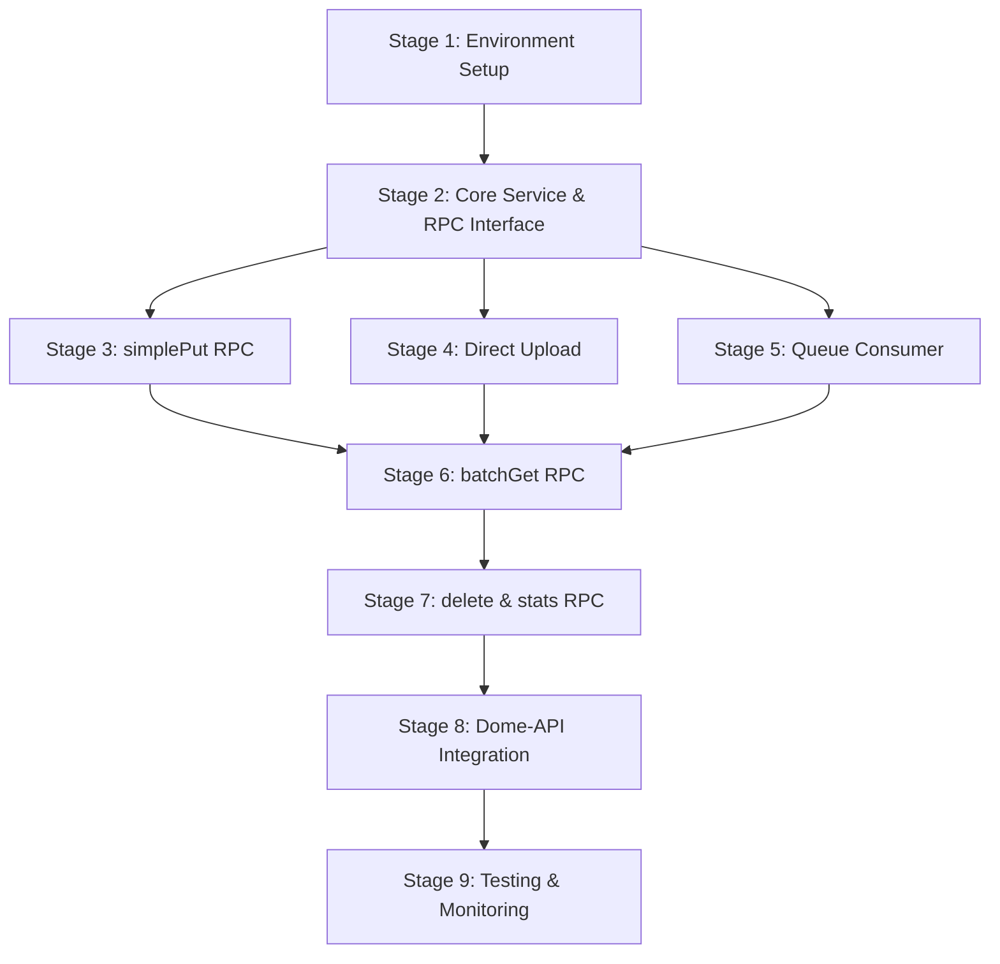

# Implementation Plan for Silo Service

## 1. Executive Summary

The Silo service is a unified content storage worker designed to ingest, catalog, and serve user-generated and public content. It acts as a centralized storage layer that:

- Persists content bodies (≤ 100 MiB) in R2 and metadata in D1
- Supports multiple content kinds (`note`, `code`, `article`, etc.)
- Provides multiple upload paths (small sync API, direct-to-R2 POST, async bulk via queue)
- Enables event-driven updates to downstream services like Constellation (for embeddings)
- Offers fast batch reads for RAG operations

This implementation plan outlines a step-by-step approach to building the Silo service, ensuring each stage delivers a working component with clear acceptance criteria.

```mermaid
graph TD
  subgraph Client
    A1[User / Browser] -- small note -->|simplePut| G(Dome‑API)
    A2 -- big file -->|pre‑signed form<br>PUT /r2| R2[(Bucket)]
  end

  subgraph Gateway
    G -- auth+rate‑limit --> SiloHTTP[/Silo · RPC bridge/]
  end

  subgraph Silo
    SiloHTTP -- write D1 · sign form --> D1[(SQLite)] & R2
    R2 -- object-create --> OCQ[CONTENT_EVENTS queue]
    OCQ -- worker.consume --> OCW(ObjectCreated handler)
    OCW -->|INSERT| D1
    OCW -->|send| FanOutQ[NEW_CONTENT queue]
  end

  subgraph Constellation
    FanOutQ --> Embeder
    D1 <--> Embeder
  end
```

## 2. Stage Breakdown

### Stage 1: Environment Setup & Project Scaffolding

**Goal**
Set up the project structure, configure Cloudflare resources, and establish the foundation for the Silo service.

**Technical Tasks**

1. Create service directory structure:

   ```
   services/silo/
   ├── src/
   │   ├── index.ts
   │   ├── rpc/
   │   │   └── handlers.ts
   │   ├── queue/
   │   │   └── content-events.ts
   │   ├── db/
   │   │   ├── schema.ts
   │   │   └── migrations/
   │   └── utils/
   │       ├── metrics.ts
   │       └── logging.ts
   ├── tests/
   │   ├── rpc.test.ts
   │   └── queue.test.ts
   ├── wrangler.toml
   └── package.json
   ```

2. Configure `wrangler.toml` with required bindings:

   ```toml
   name = "silo"
   main = "src/index.ts"

   [[kv_namespaces]]
   binding = "CACHE"
   id = "..."

   [[r2_buckets]]
   binding = "BUCKET"
   bucket_name = "silo-content"

   [[d1_databases]]
   binding = "DB"
   database_name = "silo"

   [[queues.producers]]
   binding = "NEW_CONTENT"
   queue = "new-content"

   [[queues.consumers]]
   binding = "CONTENT_EVENTS"
   queue = "content-events"

   [vars]
   LOG_LEVEL = "info"
   VERSION = "1.0.0"
   ENVIRONMENT = "prod"
   ```

3. Create D1 database schema migration:

   ```sql
   CREATE TABLE contents (
     id          TEXT PRIMARY KEY,      -- ulid / uuid
     userId      TEXT,                  -- NULL for public objects
     contentType TEXT NOT NULL,         -- 'note'|'code'|'article'…
     size        INTEGER NOT NULL,
     r2Key       TEXT NOT NULL UNIQUE,
     sha256      TEXT,                  -- optional integrity / de‑dup
     createdAt   INTEGER NOT NULL,      -- epoch s
     version     INTEGER DEFAULT 1
   );
   CREATE INDEX idx_contents_userId        ON contents(userId);
   CREATE INDEX idx_contents_contentType   ON contents(contentType);
   CREATE INDEX idx_contents_createdAt     ON contents(createdAt);
   ```

4. Set up Drizzle ORM schema in `src/db/schema.ts`
5. Configure TypeScript and dependencies in `package.json`
6. Set up logging and metrics utilities

**Dependencies**

- Cloudflare Workers account with access to D1, R2, and Queues
- pnpm workspace setup
- Drizzle ORM for D1 database operations
- Hono for RPC routing

**Acceptance Criteria**

- Project structure is set up correctly
- `wrangler.toml` is configured with all required bindings
- D1 database schema can be applied with `wrangler d1 migrations apply`
- TypeScript compilation works with `pnpm build`
- Basic tests pass with `pnpm test`

### Stage 2: Core Service & RPC Interface

**Goal**
Implement the core Silo service with cloudflare worker entrypoint interface and basic error handling.

**Technical Tasks**

1. Create the main worker entry point in `src/index.ts`:

   ```typescript
   import { handle } from 'hono/cloudflare-workers';
   import { rpcHandlers } from './rpc/handlers';
   import { getLogger, withLogger } from '@dome/loggnig';

    export default class Silo extends WorkerEntrypoint<Env> {

    public async put(..) {
    }

     async queue(batch, env) {
       // Queue consumer logic will be implemented in Stage 3
     }
   }

   ```

2. Implement RPC handlers in `src/rpc/handlers.ts`:

   ```typescript
   import { Env } from '../index';
   import { logger } from '../utils/logging';
   import { metrics } from '../utils/metrics';
   import { ulid } from 'ulid';

   export const rpcHandlers = {
     async simplePut(data, env: Env) {
       // Implement in Stage 3
     },

     async createUpload(data, env: Env) {
       // Implement in Stage 4
     },

     async batchGet(data, env: Env) {
       // Implement in Stage 5
     },

     async delete(data, env: Env) {
       // Implement in Stage 6
     },

     async stats(data, env: Env) {
       // Implement in Stage 7
     },
   };
   ```

3. Set up basic logging and metrics utilities in `src/utils/`
4. Create test stubs for RPC handlers

**Dependencies**

- Stage 1 completion
- Hono framework
- ULID library for ID generation

**Acceptance Criteria**

- Worker compiles and can be deployed
- RPC interface returns 404 for non-existent methods
- Error handling works correctly
- Logging and metrics are properly set up

### Stage 3: Implement `simplePut` RPC Method

**Goal**
Implement the `simplePut` RPC method for synchronously storing small content items.

**Technical Tasks**

1. Implement the `simplePut` handler in `src/rpc/handlers.ts`:

   ```typescript
   async simplePut(data, env: Env) {
     const startTime = Date.now();
     const { body, contentType = 'note', id = ulid() } = data;

     if (!body) {
       throw new Error('Body is required');
     }

     // Get user ID from headers
     const userId = data.userId || null;

     // Calculate size
     const size = typeof body === 'string' ?
       new TextEncoder().encode(body).length :
       body.byteLength;

     // Store in R2
     const r2Key = `content/${id}`;
     await env.BUCKET.put(r2Key, body, {
       httpMetadata: {
         contentType: 'application/octet-stream',
         headers: new Headers({
           'x-user-id': userId || '',
           'x-content-type': contentType,
         }),
       },
     });

     // Store metadata in D1
     const now = Math.floor(Date.now() / 1000);
     await env.DB.prepare(`
       INSERT INTO contents (id, userId, contentType, size, r2Key, createdAt)
       VALUES (?, ?, ?, ?, ?, ?)
     `)
     .bind(id, userId, contentType, size, r2Key, now)
     .run();

     // Record metrics
     metrics.counter('silo.upload.bytes', size);
     metrics.timing('silo.db.write.latency_ms', Date.now() - startTime);

     return { id };
   }
   ```

2. Add validation using Zod schema
3. Implement unit tests for the `simplePut` handler
4. Add error handling for R2 and D1 operations

**Dependencies**

- Stage 2 completion
- Zod for request validation

**Acceptance Criteria**

- `simplePut` successfully stores content in R2
- Metadata is correctly stored in D1
- Proper error handling for invalid requests
- Metrics are recorded for uploads and DB operations
- Unit tests pass for various scenarios (success, validation errors, DB errors)

### Stage 4: Implement Direct Upload with Pre-signed Forms

**Goal**
Implement the `createUpload` RPC method to generate pre-signed forms for direct browser-to-R2 uploads.

**Technical Tasks**

1. Implement the `createUpload` handler in `src/rpc/handlers.ts`:

   ```typescript
   async createUpload(data, env: Env) {
     const { contentType = 'note', size, sha256 } = data;

     if (!size || size <= 0) {
       throw new Error('Valid size is required');
     }

     // Get user ID from headers
     const userId = data.userId || null;

     // Generate content ID
     const contentId = ulid();
     const r2Key = `upload/${contentId}`;

     // Create pre-signed POST policy
     const url = env.BUCKET.createPresignedPost({
       key: r2Key,
       metadata: {
         'x-user-id': userId || '',
         'x-content-type': contentType,
         'x-sha256': sha256 || '',
       },
       conditions: [
         ['content-length-range', 0, 104857600], // Max 100 MiB
       ],
       expiration: 900, // 15 minutes
     });

     return {
       id: contentId,
       uploadUrl: url.url,
       formData: url.formData,
     };
   }
   ```

2. Add validation using Zod schema
3. Implement unit tests for the `createUpload` handler
4. Add documentation for client usage

**Dependencies**

- Stage 2 completion
- R2 pre-signed POST policy support

**Acceptance Criteria**

- `createUpload` generates valid pre-signed POST policies
- Form data includes necessary metadata fields
- Size limits are enforced
- Expiration is set correctly
- Unit tests pass for various scenarios

### Stage 5: Implement Queue Consumer for Object-Created Events

**Goal**
Implement the queue consumer to process object-created events from R2 and update the D1 database.

**Technical Tasks**

1. Implement the queue consumer in `src/index.ts`:

   ```typescript
   export default {
     fetch: handle(app),
     async queue(batch, env: Env) {
       const startTime = Date.now();
       metrics.gauge('silo.queue.batch_size', batch.messages.length);

       try {
         for (const message of batch.messages) {
           await processObjectCreatedEvent(message.body, env);
         }
       } catch (error) {
         metrics.counter('silo.queue.errors', 1);
         logger.error({ error }, 'Queue processing error');
         throw error; // Allow retry
       }

       metrics.timing('silo.queue.process_time_ms', Date.now() - startTime);
     },
   };
   ```

2. Implement the event processing function in `src/queue/content-events.ts`:

   ```typescript
   export async function processObjectCreatedEvent(event: R2Event, env: Env) {
     const {
       object: { key, size },
       eventTime,
     } = event;

     // Extract content ID from key
     const [prefix, contentId] = key.split('/');
     if (!contentId || (prefix !== 'content' && prefix !== 'upload')) {
       logger.warn({ key }, 'Invalid key format');
       return;
     }

     // Get object metadata
     const obj = await env.BUCKET.head(key);
     const headers = obj.httpMetadata?.headers ?? new Headers();

     // Insert or ignore into D1
     await env.DB.prepare(
       `
       INSERT OR IGNORE INTO contents
       (id, userId, contentType, size, r2Key, createdAt, sha256)
       VALUES (?, ?, ?, ?, ?, ?, ?)
     `,
     )
       .bind(
         contentId,
         headers.get('x-user-id') || null,
         headers.get('x-content-type') || 'note',
         size,
         key,
         Math.floor(Date.parse(eventTime) / 1000),
         headers.get('x-sha256') || null,
       )
       .run();

     // Send to NEW_CONTENT queue for downstream processing
     await env.NEW_CONTENT.send({
       id: contentId,
       userId: headers.get('x-user-id') || null,
       contentType: headers.get('x-content-type') || 'note',
     });
   }
   ```

3. Implement unit tests for the queue consumer
4. Add error handling and retries

**Dependencies**

- Stage 2 completion
- R2 object-created event configuration

**Acceptance Criteria**

- Queue consumer correctly processes object-created events
- Metadata is extracted from object headers
- D1 database is updated with content metadata
- NEW_CONTENT queue receives notifications
- Error handling works correctly
- Metrics are recorded for queue processing

### Stage 6: Implement `batchGet` RPC Method

**Goal**
Implement the `batchGet` RPC method for efficiently retrieving multiple content items.

**Technical Tasks**

1. Implement the `batchGet` handler in `src/rpc/handlers.ts`:

   ```typescript
   async batchGet(data, env: Env) {
     const { ids } = data;

     if (!ids || !Array.isArray(ids) || ids.length === 0) {
       throw new Error('Valid ids array is required');
     }

     // Get user ID from headers for ACL check
     const requestUserId = data.userId || null;

     // Fetch metadata from D1
     const placeholders = ids.map(() => '?').join(',');
     const metadataResult = await env.DB.prepare(`
       SELECT id, userId, contentType, size, r2Key, createdAt
       FROM contents
       WHERE id IN (${placeholders})
     `)
     .bind(...ids)
     .all();

     const results = {};
     const fetchPromises = [];

     // Process metadata and prepare R2 fetches
     for (const item of metadataResult.results) {
       // ACL check: only return if public (userId is null) or owned by requester
       if (item.userId !== null && item.userId !== requestUserId) {
         continue;
       }

       results[item.id] = {
         id: item.id,
         userId: item.userId,
         contentType: item.contentType,
         size: item.size,
         createdAt: item.createdAt,
         body: null, // Will be populated from R2
       };

       // Prepare R2 fetch
       const startTime = Date.now();
       fetchPromises.push(
         env.BUCKET.get(item.r2Key)
           .then(async (obj) => {
             if (!obj) return;

             metrics.timing('silo.r2.get.latency_ms', Date.now() - startTime);

             // For small objects, include body directly
             if (item.size <= 1048576) { // 1 MiB
               results[item.id].body = await obj.text();
             } else {
               // For large objects, provide a signed URL
               results[item.id].url = await env.BUCKET.createPresignedUrl(
                 obj, { expiresIn: 3600 } // 1 hour
               );
             }
           })
       );
     }

     // Wait for all R2 fetches to complete
     await Promise.all(fetchPromises);

     return { items: Object.values(results) };
   }
   ```

2. Add validation using Zod schema
3. Implement unit tests for the `batchGet` handler
4. Add caching for frequently accessed content (optional)

**Dependencies**

- Stage 2 completion
- R2 object retrieval

**Acceptance Criteria**

- `batchGet` efficiently retrieves multiple content items
- ACL checks prevent unauthorized access
- Small content is returned directly, large content via signed URLs
- Metrics are recorded for R2 operations
- Unit tests pass for various scenarios

### Stage 7: Implement `delete` and `stats` RPC Methods

**Goal**
Implement the remaining RPC methods for content management and service statistics.

**Technical Tasks**

1. Implement the `delete` handler in `src/rpc/handlers.ts`:

   ```typescript
   async delete(data, env: Env) {
     const { id } = data;

     if (!id) {
       throw new Error('Valid id is required');
     }

     // Get user ID from headers for ACL check
     const requestUserId = data.userId || null;

     // Fetch metadata from D1
     const metadataResult = await env.DB.prepare(`
       SELECT id, userId, r2Key
       FROM contents
       WHERE id = ?
     `)
     .bind(id)
     .first();

     if (!metadataResult) {
       throw new Error('Content not found');
     }

     // ACL check: only allow deletion if owned by requester
     if (metadataResult.userId !== requestUserId) {
       throw new Error('Unauthorized');
     }

     // Delete from R2
     await env.BUCKET.delete(metadataResult.r2Key);

     // Delete from D1
     await env.DB.prepare(`
       DELETE FROM contents
       WHERE id = ?
     `)
     .bind(id)
     .run();

     // Notify about deletion (optional)
     await env.NEW_CONTENT.send({
       id,
       userId: requestUserId,
       deleted: true,
     });

     return { success: true };
   }
   ```

2. Implement the `stats` handler in `src/rpc/handlers.ts`:

   ```typescript
   async stats(data, env: Env) {
     // Get total count from D1
     const countResult = await env.DB.prepare(`
       SELECT COUNT(*) as total, SUM(size) as totalSize
       FROM contents
     `)
     .first();

     // Get counts by content type
     const typeCountsResult = await env.DB.prepare(`
       SELECT contentType, COUNT(*) as count
       FROM contents
       GROUP BY contentType
     `)
     .all();

     const typeCounts = {};
     for (const row of typeCountsResult.results) {
       typeCounts[row.contentType] = row.count;
     }

     return {
       total: countResult.total || 0,
       totalSize: countResult.totalSize || 0,
       byType: typeCounts,
     };
   }
   ```

3. Add validation using Zod schema
4. Implement unit tests for both handlers

**Dependencies**

- Stage 2 completion

**Acceptance Criteria**

- `delete` correctly removes content from R2 and D1
- ACL checks prevent unauthorized deletions
- `stats` provides accurate service statistics
- Unit tests pass for various scenarios

### Stage 8: Integration with Dome-API

**Goal**
Integrate the Silo service with the Dome-API gateway.

**Technical Tasks**

1. Update Dome-API's `wrangler.toml` to add Silo service binding:

   ```toml
   [[services]]
   binding = "SILO"
   service = "silo"
   environment = "production"
   ```

2. Implement RPC client in Dome-API:

   ```typescript
   // In Dome-API
   async function callSiloRPC(method, data, env) {
     return await env.SILO.fetch(
       new Request(`http://silo/rpc/${method}`, {
         method: 'POST',
         headers: {
           'Content-Type': 'application/json',
           'x-user-id': data.userId || '',
         },
         body: JSON.stringify(data),
       }),
     ).then(res => res.json());
   }
   ```

3. Update Dome-API endpoints to use Silo RPC:

   - `/api/notes` → `simplePut`
   - `/api/upload` → `createUpload`
   - `/api/notes/:id` → `batchGet`
   - `/api/notes/:id/delete` → `delete`

4. Add feature flag for gradual rollout

**Dependencies**

- Stages 1-7 completion
- Access to Dome-API codebase

**Acceptance Criteria**

- Dome-API successfully communicates with Silo service
- All RPC methods work correctly through the gateway
- Feature flag allows for gradual rollout
- Error handling works correctly

### Stage 9: Testing and Monitoring

**Goal**
Implement comprehensive testing and monitoring for the Silo service.

**Technical Tasks**

1. Implement integration tests using Miniflare
2. Set up monitoring dashboards for:

   - Queue depth and processing time
   - R2 storage usage
   - D1 query performance
   - Error rates

3. Implement structured logging:

   ```typescript
   // In src/utils/logging.ts
   export const logger = {
     info: (data, message) =>
       console.log(
         JSON.stringify({
           level: 'info',
           service: 'silo',
           timestamp: new Date().toISOString(),
           message,
           ...data,
         }),
       ),
     error: (data, message) =>
       console.error(
         JSON.stringify({
           level: 'error',
           service: 'silo',
           timestamp: new Date().toISOString(),
           message,
           ...data,
         }),
       ),
     // ...
   };
   ```

4. Set up alerts for critical errors

**Dependencies**

- Stages 1-8 completion
- Miniflare for testing
- Cloudflare dashboard for monitoring

**Acceptance Criteria**

- Integration tests pass for all RPC methods
- Monitoring dashboards provide visibility into service performance
- Structured logging works correctly
- Alerts trigger on critical errors

## 3. Dependencies & Critical Path



**Critical Path**: S1 → S2 → S3 → S6 → S7 → S8 → S9

## 4. Technical Recommendations

### Data Storage Strategy

- **R2 Storage Structure**:

  - Use a prefix-based structure: `content/{id}` for direct uploads, `upload/{id}` for browser uploads
  - Store metadata in object headers for queue processing
  - Consider implementing lifecycle rules for automatic cleanup of old objects

- **D1 Database Optimization**:
  - Use prepared statements for all database operations
  - Create appropriate indexes for common query patterns
  - Consider implementing a caching layer for frequently accessed metadata

### Security Considerations

- **ACL Enforcement**:

  - Rely on Dome-API for authentication
  - Implement strict ACL checks in all RPC methods
  - Use `userId IS NULL` for public objects (readable by any authenticated user)
  - Ensure write/delete operations always require ownership

- **Pre-signed URLs**:
  - Set short expiration times (15 minutes for uploads, 1 hour for downloads)
  - Include content-length-range conditions to prevent abuse
  - Validate content types and sizes

### Performance Optimization

- **Batch Processing**:

  - Process queue messages in batches for efficiency
  - Use parallel processing for R2 operations in `batchGet`
  - Consider implementing a LRU cache for frequently accessed content

- **Error Handling**:
  - Implement idempotent operations to handle retries
  - Use `INSERT OR IGNORE` for queue consumer to handle duplicate events
  - Add circuit breakers for downstream services

## 5. Roll-out Strategy

1. **Development Phase**:

   - Set up development environment with test data
   - Implement and test each stage sequentially
   - Conduct code reviews and unit testing

2. **Staging Deployment**:

   - Deploy to staging environment
   - Test integration with Dome-API
   - Verify queue processing and event flow
   - Load test with simulated traffic

3. **Production Rollout**:

   - Create production R2 bucket and D1 database
   - Configure R2 notification rule to content-events queue
   - Deploy Silo worker with feature flag
   - Update Dome-API to route upload endpoints to Silo RPC (behind feature flag)
   - Gradually increase traffic to Silo service
   - Monitor performance and error rates
   - Enable browser direct upload UI after successful validation

4. **Post-Deployment**:
   - Monitor queue depth and processing time
   - Verify Constellation still receives NEW_CONTENT events
   - Remove legacy EMBED_QUEUE after successful bake period

## 6. Conclusion

The Silo service provides a unified solution for content storage in the Dome application, separating storage concerns from application logic. By implementing this service, we achieve:

- Cleaner separation of concerns
- Improved scalability for content storage
- Multiple upload paths for different use cases
- Event-driven architecture for downstream processing
- Simplified content retrieval for RAG operations

This implementation plan provides a clear roadmap for building the Silo service, with each stage delivering a working component that can be tested and validated independently.

