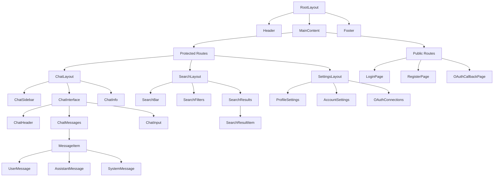
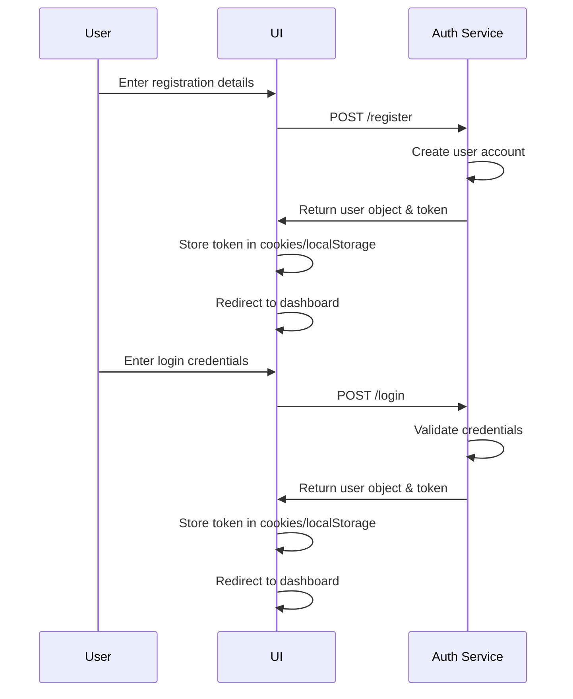
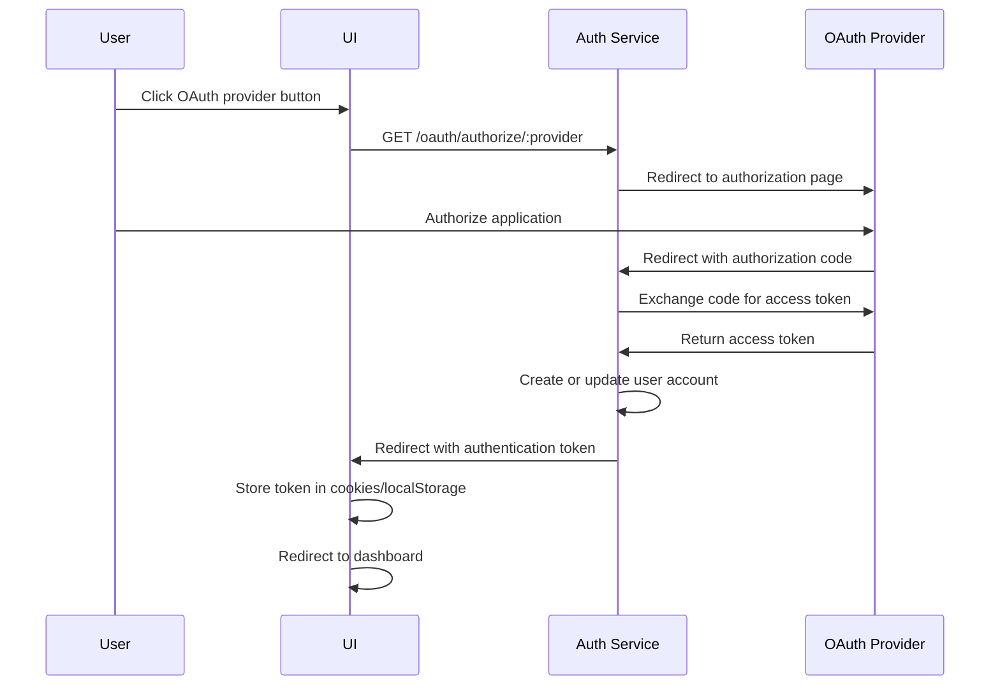

# Next.js UI Application Architecture

## 1. Overview

The UI application is a modern web application built with Next.js that provides a user interface for interacting with the Dome platform. It integrates with existing services including the Auth Service for authentication and the Chat Service for conversational AI capabilities.

### Key Features

- **Authentication**: User registration, login, and profile management
- **OAuth Integration**: Sign in with GitHub and Notion
- **Chat Interface**: Real-time conversation with AI assistant
- **Search Functionality**: Find relevant information from user's knowledge base
- **Responsive Design**: Works on desktop and mobile devices

### Goals and Non-Goals

|               | ✅ In Scope                                        | ❌ Out of Scope                               |
| ------------- | -------------------------------------------------- | --------------------------------------------- |
| Functionality | Authentication, chat, search, OAuth integration    | Offline support, push notifications           |
| Performance   | Optimized loading times, streaming chat responses  | Complex animations, video processing          |
| Integration   | Auth service, Chat service                         | Direct database access                        |
| Security      | Token-based auth, secure OAuth flows, CSRF         | E2E encryption, advanced threat detection     |

## 2. Application Structure

```
services/ui/
├── app/                   # Next.js App Router structure
│   ├── api/               # API routes for server-side operations
│   │   ├── auth/          # Authentication API routes
│   │   └── chat/          # Chat API routes
│   ├── (auth)/            # Authentication-related routes
│   │   ├── login/         # Login page
│   │   ├── register/      # Registration page
│   │   └── oauth/         # OAuth callback routes
│   ├── chat/              # Chat interface
│   ├── search/            # Search interface
│   ├── settings/          # User settings
│   └── layout.tsx         # Root layout component
├── components/            # Shared UI components
│   ├── auth/              # Authentication components
│   ├── chat/              # Chat interface components
│   ├── common/            # Common UI elements
│   ├── layout/            # Layout components
│   └── search/            # Search components
├── lib/                   # Utilities and shared code
│   ├── api/               # API client libraries
│   │   ├── auth.ts        # Auth service client
│   │   └── chat.ts        # Chat service client
│   ├── hooks/             # Custom React hooks
│   ├── state/             # State management
│   │   ├── auth/          # Authentication state
│   │   ├── chat/          # Chat state
│   │   └── search/        # Search state
│   └── utils/             # Utility functions
├── public/                # Static assets
├── styles/                # Global styles and theme
├── middleware.ts          # Next.js middleware for auth protection
├── next.config.js         # Next.js configuration
├── package.json           # Dependencies and scripts
└── tsconfig.json          # TypeScript configuration
```

## 3. Component Hierarchy



## 4. State Management Approach

The application will use a combination of state management approaches for different concerns:

### Authentication State
- **React Context + Zustand**: Store authentication state, user profile, and session data
- **Server Components**: Fetch initial auth state and user data
- **Cookies and Local Storage**: Securely store tokens and session information

```typescript
// Auth state store
interface AuthState {
  user: User | null;
  isAuthenticated: boolean;
  isLoading: boolean;
  error: string | null;
  login: (email: string, password: string) => Promise<void>;
  register: (email: string, password: string, name?: string) => Promise<void>;
  logout: () => Promise<void>;
  refreshToken: () => Promise<void>;
  connectOAuth: (provider: string) => Promise<void>;
}
```

### Chat State
- **Zustand**: Manage chat sessions, messages, and UI state
- **React Query**: Handle streaming responses and optimistic updates
- **Server Actions**: Process chat interactions

```typescript
// Chat state store
interface ChatState {
  activeChatId: string | null;
  chats: Record<string, ChatSession>;
  messages: Record<string, Message[]>;
  isLoading: boolean;
  error: string | null;
  sendMessage: (chatId: string, content: string) => Promise<void>;
  createChat: () => Promise<string>;
  deleteChat: (chatId: string) => Promise<void>;
  loadChatHistory: (chatId: string) => Promise<void>;
}
```

### Search State
- **URL Query Parameters**: Store search terms and filters
- **React Query**: Handle search requests and cache results
- **Zustand**: Manage UI state for search interface

```typescript
// Search state store
interface SearchState {
  query: string;
  filters: SearchFilters;
  results: SearchResult[];
  isLoading: boolean;
  error: string | null;
  search: (query: string, filters?: SearchFilters) => Promise<void>;
  clearSearch: () => void;
  updateFilters: (filters: Partial<SearchFilters>) => void;
}
```

## 5. API Integration Strategy

The UI application will integrate with backend services through a combination of service bindings and REST API calls.

### Service Clients

The application will use typed API clients to interact with each service:

```typescript
// Auth Service Client
export class AuthClient {
  constructor(private baseUrl: string, private fetch: typeof fetch) {}

  async register(email: string, password: string, name?: string): Promise<User>;
  async login(email: string, password: string): Promise<{ user: User; token: string }>;
  async validate(token: string): Promise<User>;
  async logout(token: string): Promise<void>;
  async refreshToken(refreshToken: string): Promise<{ token: string; refreshToken: string }>;
  
  // OAuth methods
  async initiateOAuth(provider: string): Promise<string>; // Returns authorization URL
  async handleOAuthCallback(provider: string, code: string): Promise<{ user: User; token: string }>;
}

// Chat Service Client
export class ChatClient {
  constructor(private baseUrl: string, private fetch: typeof fetch) {}

  async generateResponse(request: ChatRequest): Promise<ChatResponse>;
  async streamResponse(request: ChatRequest): Promise<ReadableStream>;
  async resumeChatSession(request: ResumeChatRequest): Promise<ChatResponse>;
  async getChatHistory(userId: string): Promise<ChatSession[]>;
}
```

### Next.js API Routes

For operations that require additional processing or should not be exposed directly to the client, the application will use Next.js API routes:

```
/api/auth/register        # Handle user registration
/api/auth/login           # Handle user login
/api/auth/logout          # Handle user logout
/api/auth/refresh         # Refresh authentication token
/api/auth/oauth/:provider # Handle OAuth flows

/api/chat/send            # Send message to chat service
/api/chat/history         # Get chat history
/api/chat/stream          # Stream chat responses

/api/search              # Handle search requests
```

### Server Actions

For form submissions and data mutations, the application will use Next.js Server Actions:

```typescript
'use server'

export async function loginAction(formData: FormData) {
  // Validate form data
  // Call auth service
  // Set cookies
  // Redirect user
}

export async function sendMessageAction(formData: FormData) {
  // Extract message content
  // Call chat service
  // Return response or stream ID
}
```

## 6. Authentication Flow

The authentication flow will integrate with the existing Auth Service and support both email/password and OAuth authentication.

### Registration and Login Flow



### OAuth Flow



### Token Management

- **Access Token**: Short-lived JWT token stored in memory and HTTP-only cookies
- **Refresh Token**: Longer-lived token stored in HTTP-only cookies for token refreshing
- **Token Validation**: All authenticated requests include token validation through middleware

```typescript
// middleware.ts
export function middleware(request: NextRequest) {
  const token = request.cookies.get('token')?.value;
  
  // Public routes that don't require authentication
  if (
    request.nextUrl.pathname.startsWith('/login') ||
    request.nextUrl.pathname.startsWith('/register') ||
    request.nextUrl.pathname.startsWith('/oauth')
  ) {
    return NextResponse.next();
  }
  
  // Check if the route requires authentication
  if (!token) {
    return NextResponse.redirect(new URL('/login', request.url));
  }
  
  // Validate token (can be done in-memory or via API call)
  try {
    // Token validation logic
    return NextResponse.next();
  } catch (error) {
    // Clear invalid token
    const response = NextResponse.redirect(new URL('/login', request.url));
    response.cookies.delete('token');
    return response;
  }
}
```

## 7. Routing Structure

The application will use Next.js App Router for routing, with the following structure:

```
/ (Root)
├── (auth)/ (Auth group - public)
│   ├── login/ (Login page)
│   ├── register/ (Registration page)
│   └── oauth/
│       ├── github/callback/ (GitHub OAuth callback)
│       └── notion/callback/ (Notion OAuth callback)
├── chat/ (Chat interface - protected)
│   └── [chatId]/ (Specific chat session)
├── search/ (Search interface - protected)
│   └── [query]/ (Search results for specific query)
└── settings/ (User settings - protected)
    ├── profile/ (Profile settings)
    ├── account/ (Account settings)
    └── integrations/ (OAuth integrations)
```

### Route Protection

Routes will be protected using Next.js middleware, which will check for a valid authentication token and redirect unauthenticated users to the login page.

### Layout Structure

Each route group will have its own layout component that inherits from the root layout:

- **Root Layout**: Provides global context, theme, and basic structure
- **Auth Layout**: Centered form layout for authentication pages
- **App Layout**: Dashboard-style layout with sidebar navigation
- **Chat Layout**: Chat-specific layout with conversation sidebar and chat interface
- **Settings Layout**: Settings-specific layout with navigation tabs

## 8. Recommended Libraries

### Core Libraries

- **Next.js**: Framework for server-rendered React applications
- **React**: UI library
- **TypeScript**: Type-safe JavaScript

### State Management and Data Fetching

- **Zustand**: Lightweight state management
- **React Query (TanStack Query)**: Data fetching, caching, and state management
- **SWR**: React Hooks for data fetching with stale-while-revalidate strategy

### UI Components and Styling

- **shadcn/ui**: UI component collection based on Radix UI
- **Tailwind CSS**: Utility-first CSS framework
- **Framer Motion**: Animation library

### Form Management

- **React Hook Form**: Form state management and validation
- **Zod**: TypeScript-first schema validation

### Authentication and Security

- **jose**: JSON Web Token (JWT) implementation
- **next-auth**: Authentication for Next.js (if additional OAuth providers are needed)

### Communication

- **EventSource**: For server-sent events (chat streaming)
- **Socket.io**: For real-time bidirectional communication (if needed)

## 9. Implementation Considerations

### Progressive Enhancement

The application will follow a progressive enhancement approach:

1. **Core Functionality**: Works without JavaScript using server components
2. **Enhanced Experience**: Adds interactivity and transitions with client components
3. **Advanced Features**: Implements real-time updates and streaming with client-side JavaScript

### Error Handling Strategy

- **Server-side Errors**: Captured and logged, with graceful fallbacks
- **Client-side Errors**: React Error Boundaries with retry mechanisms
- **Network Errors**: Automatic retries with exponential backoff
- **Form Validation Errors**: Immediate feedback with clear error messages

### Performance Optimization

- **Server Components**: Use server components for data-heavy components
- **Code Splitting**: Automatic code splitting with Next.js
- **Image Optimization**: Next.js Image component for optimized images
- **Font Optimization**: Next.js Font module for optimized font loading
- **Streaming SSR**: Stream page content for faster time-to-first-byte

### Accessibility

- **ARIA Attributes**: Proper ARIA attributes for interactive elements
- **Keyboard Navigation**: Full keyboard navigation support
- **Screen Reader Support**: Semantic HTML and descriptive text
- **Color Contrast**: WCAG 2.1 AA compliant color contrast
- **Focus Management**: Visible focus indicators and proper focus management

## 10. Conclusion

This architecture provides a solid foundation for a modern, performant, and maintainable Next.js UI application that integrates with existing Auth and Chat services. The modular structure allows for future extension and enhancement while maintaining a clean separation of concerns.

The approach leverages the best features of Next.js App Router, modern React patterns, and a thoughtful state management strategy to create a seamless user experience while ensuring code quality and maintainability.