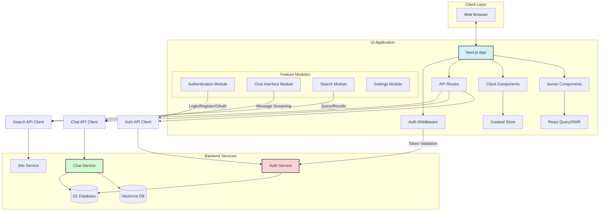
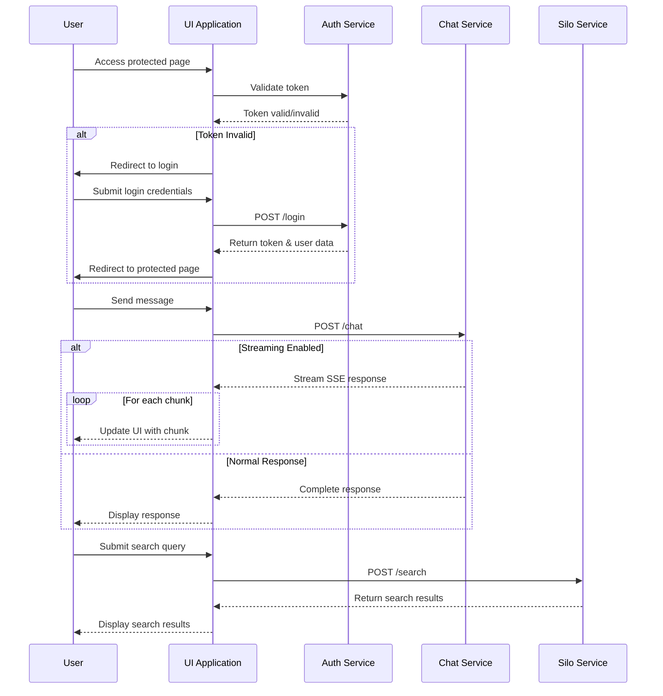
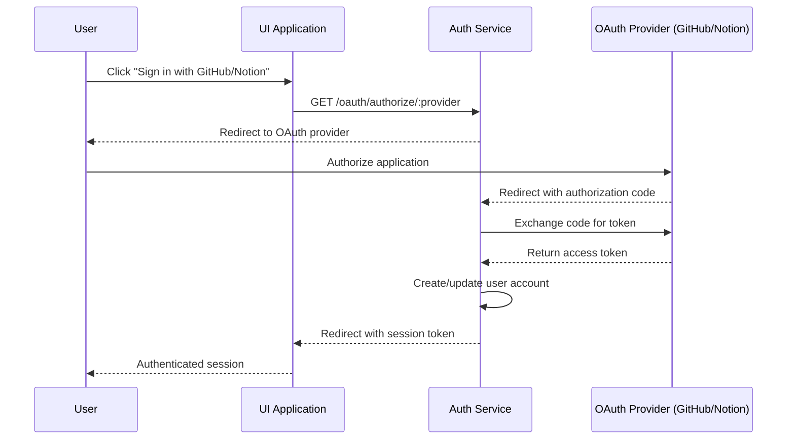

# UI Integration with Existing Services

## System Architecture Diagram



## Communication Flow



## OAuth Integration Flow



## State Management

```mermaid
flowchart TD
    subgraph "Authentication State"
        AuthStore[Auth Store]
        AuthStore --> UserProfile[User Profile]
        AuthStore --> AuthStatus[Auth Status]
        AuthStore --> AuthActions[Auth Actions]
    end
    
    subgraph "Chat State"
        ChatStore[Chat Store]
        ChatStore --> ActiveChat[Active Chat]
        ChatStore --> Messages[Messages]
        ChatStore --> ChatActions[Chat Actions]
    end
    
    subgraph "Search State"
        SearchStore[Search Store]
        SearchStore --> Query[Search Query]
        SearchStore --> Filters[Search Filters]
        SearchStore --> Results[Search Results]
        SearchStore --> SearchActions[Search Actions]
    end
    
    subgraph "UI State"
        UIStore[UI Store]
        UIStore --> Theme[Theme]
        UIStore --> Sidebar[Sidebar State]
        UIStore --> Notifications[Notifications]
    end
    
    ServerState[Server State\nReact Query/SWR] --> RemoteData[Remote Data Cache]
    
    AuthStore --> ServerState
    ChatStore --> ServerState
    SearchStore --> ServerState
    
    style AuthStore fill:#f9d4d4,stroke:#333,stroke-width:2px
    style ChatStore fill:#d4f9d4,stroke:#333,stroke-width:2px
    style SearchStore fill:#d4d4f9,stroke:#333,stroke-width:2px
    style UIStore fill:#f9f9d4,stroke:#333,stroke-width:2px
    style ServerState fill:#d4f1f9,stroke:#333,stroke-width:2px