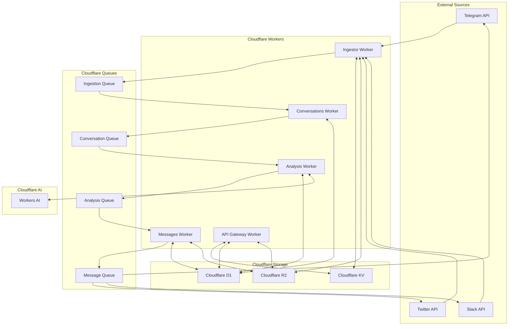

# Communicator Cloudflare Architecture

This document outlines the architecture, implementation details, and development workflow for the Communicator Cloudflare project.

## Table of Contents

1. [System Overview](#system-overview)
2. [Architecture](#architecture)
3. [Directory Structure](#directory-structure)
4. [Service Implementation](#service-implementation)
5. [Infrastructure as Code](#infrastructure-as-code)
6. [Development Workflow](#development-workflow)
7. [Deployment Strategy](#deployment-strategy)
8. [Testing Approach](#testing-approach)
9. [Scaling Considerations](#scaling-considerations)

## System Overview

The Communicator Cloudflare project is designed to scrape messages from various platforms (Telegram, Twitter, Slack, etc.), process them through an LLM pipeline to categorize, prioritize, summarize, and generate responses based on user feedback. The system is built as a microservices monorepo using Cloudflare Workers, with infrastructure managed by Pulumi.

### Key Features

- Message ingestion from multiple platforms
- Conversation grouping and analysis
- LLM-based processing for categorization and prioritization
- Response generation and delivery
- Multi-user support
- Reproducible infrastructure configuration
- Local development and testing capabilities

## Architecture



### Component Descriptions

1. **External Sources**:
   - Telegram API, Twitter API, Slack API: External messaging platforms from which messages are ingested.

2. **Cloudflare Workers**:
   - **Ingestor Worker**: Periodically polls external APIs to fetch new messages and places them in the Ingestion Queue.
   - **Push Message Ingestor Worker**: Accepts messages pushed from external sources and publishes them to the Ingestion Queue.
   - **Conversations Worker**: Groups messages into conversations based on various criteria and stores them in D1.
   - **Analysis Worker**: Processes conversations using Workers AI for categorization, prioritization, and summarization.
   - **Messages Worker**: Drafts and sends responses back to the original platforms.
   - **API Gateway Worker**: Provides a unified API for frontend applications and administrative interfaces.

3. **Cloudflare Storage**:
   - **KV**: For fast access to configuration, user settings, and caching.
   - **D1**: SQL database for structured data like conversations, analysis results, and user information.
   - **R2**: Object storage for message attachments, large content, and backups.

4. **Cloudflare Queues**:
   - **Ingestion Queue**: Buffers incoming messages for processing.
   - **Conversation Queue**: Holds grouped messages ready for analysis.
   - **Analysis Queue**: Contains analyzed conversations ready for response generation.
   - **Message Queue**: Stores responses ready to be sent back to platforms.

5. **Cloudflare AI**:
   - **Workers AI**: Provides LLM capabilities for message analysis and response generation.

### Data Flow

1. **Message Ingestion Flow**:
   - **Pull-based ingestion**:
     - Ingestor Worker polls external APIs at configured intervals
     - Messages are normalized into a common structure
     - Message metadata is stored in D1 and attachments in R2
     - Normalized messages are pushed to the Ingestion Queue
   - **Push-based ingestion**:
     - Push Message Ingestor Worker provides endpoints for external systems to push messages
     - Incoming messages are validated and normalized
     - Messages are published directly to the Ingestion Queue
     - Supports multiple platforms (currently Telegram, with extensibility for others)

2. **Conversation Processing Flow**:
   - Conversations Worker groups messages based on thread IDs, time proximity, etc.
   - Conversation metadata and relationships are stored in D1
   - Conversation IDs are pushed to the Conversation Queue

3. **Analysis Flow**:
   - Analysis Worker retrieves conversation data from D1
   - Workers AI is used for categorization, prioritization, and summarization
   - Analysis results are stored in D1
   - Conversations requiring responses are pushed to the Analysis Queue

4. **Response Generation Flow**:
   - Messages Worker drafts responses using Workers AI
   - Responses are stored in D1
   - Responses are sent back to original platforms
   - Delivery status is recorded

## Directory Structure

```
communicator-cloudflare/
├── .github/                          # GitHub configuration
│   └── workflows/                    # CI/CD workflows
│       └── ci.yml                    # Continuous Integration workflow
├── docs/                             # Documentation
│   └── architecture.md               # This architecture document
├── infrastructure/                   # Pulumi infrastructure code
│   ├── src/
│   │   ├── index.ts                  # Main Pulumi program
│   │   ├── workers.ts                # Workers infrastructure
│   │   └── environments/
│   │       └── dev.ts                # Development environment configuration
│   ├── package.json
│   └── tsconfig.json
├── packages/                         # Shared packages
│   └── common/                       # Shared code, types, utilities
│       ├── src/
│       │   └── types/
│       ├── package.json
│       └── tsconfig.json
├── services/                         # Microservices
│   ├── ingestor/                     # Ingestor service (pull-based)
│   │   ├── src/
│   │   │   └── index.ts              # Service entry point
│   │   ├── wrangler.toml             # Wrangler configuration
│   │   ├── package.json
│   │   └── tsconfig.json
│   └── push-message-ingestor/        # Push-based message ingestor service
│       ├── src/
│       │   ├── index.ts              # Service entry point
│       │   ├── types.ts              # Type definitions
│       │   ├── controllers/          # Request handlers
│       │   ├── models/               # Data models
│       │   └── services/             # Business logic
│       ├── wrangler.toml             # Wrangler configuration
│       ├── package.json
│       └── tsconfig.json
├── templates/                        # Templates for new services
│   └── rust-worker/                  # Rust worker template
│       ├── src/
│       │   └── lib.rs                # Rust worker entry point
│       ├── Cargo.toml                # Rust dependencies
│       └── wrangler.toml             # Wrangler configuration
├── justfile                          # Just command runner tasks
├── package.json                      # Root package.json for monorepo
├── tsconfig.json                     # Base TypeScript configuration
└── pnpm-workspace.yaml               # PNPM workspace configuration
```

## Service Implementation

The project supports multiple types of Cloudflare Workers:

### TypeScript Workers with Hono

The project uses the [Hono](https://hono.dev/) framework for building TypeScript-based Cloudflare Workers. Hono provides:

- Fast and lightweight routing
- Middleware support
- TypeScript-first development
- Built-in utilities for common web tasks

#### Hono Worker Structure

```typescript
import { Hono } from 'hono';
import { cors } from 'hono/cors';
import { logger } from 'hono/logger';
import { ApiResponse, ServiceInfo } from '@communicator/common';

/**
 * Environment bindings type
 */
type Bindings = {
  ENVIRONMENT?: string;
};

/**
 * Service information
 */
const serviceInfo: ServiceInfo = {
  name: "ingestor",
  version: "0.1.0",
  environment: "development" // Default value, will be overridden by env
};

/**
 * Create Hono app
 */
const app = new Hono<{ Bindings: Bindings }>();

/**
 * Middleware
 */
app.use('*', logger());
app.use('*', cors());

/**
 * Routes
 */
app.get('/', (c) => {
  const response: ApiResponse = {
    success: true,
    data: {
      message: 'Hello World from Ingestor Service!',
      service: serviceInfo
    }
  };
  
  return c.json(response);
});

/**
 * Export the Hono app as the default export
 */
export default app;
```

#### Hono Worker Configuration

Hono workers use the following configuration in `wrangler.toml`:

```toml
name = "my-worker"
main = "src/index.ts"  # Entry point for the worker
compatibility_date = "2023-04-15"

[build]
command = "pnpm build"
```

### Rust Workers

For performance-critical components, the project supports Rust-based workers that compile to WebAssembly.

#### Rust Worker Structure

```rust
use worker::*;

#[event(fetch)]
pub async fn main(req: Request, env: Env, _ctx: worker::Context) -> Result<Response> {
    // Get the URL from the request
    let url = req.url()?;
    
    // Create a JSON response
    let data = serde_json::json!({
        "message": "Hello from Rust Worker!",
        "service": "rust-worker-template",
        "url": url.to_string(),
        "timestamp": chrono::Utc::now().to_rfc3339()
    });
    
    // Return the response
    Response::from_json(&data)
}
```

#### Rust Worker Configuration

Rust workers use a different approach in `wrangler.toml`:

```toml
name = "my-rust-worker"
compatibility_date = "2023-04-15"

[build]
command = "cargo build --release --target wasm32-unknown-unknown"
output_path = "target/wasm32-unknown-unknown/release/my_rust_worker.wasm"
```

## Infrastructure as Code

The project uses Pulumi for infrastructure as code, allowing for reproducible deployments across environments.

### Pulumi Structure

```typescript
// infrastructure/src/index.ts
import * as pulumi from "@pulumi/pulumi";
import { deployWorker, deployRustWorker } from "./workers";

// Get environment-specific configuration
const config = new pulumi.Config();
const accountId = config.require('cloudflare:accountId');

// Deploy workers
const ingestorWorker = deployWorker('ingestor-dev', '../services/ingestor/dist/index.js', {
  accountId,
  routes: [
    // Example route - update as needed
    // 'ingestor-dev.your-domain.com/*',
  ],
});

// Export outputs
export const ingestorWorkerName = ingestorWorker.name;
```

### Environment Configuration

Each environment (dev, staging, prod) has its own configuration with appropriate settings:

```typescript
// infrastructure/src/environments/dev.ts
export function dev() {
  // Deploy the ingestor worker
  const ingestorWorker = deployWorker('ingestor-dev', '../services/ingestor/dist/index.js', {
    accountId,
    routes: [
      // Example route - update as needed
      // 'ingestor-dev.your-domain.com/*',
    ],
  });

  // Export the worker details
  return {
    ingestorWorker: {
      name: ingestorWorker.name,
    },
  };
}
```

## Development Workflow

The project uses a streamlined development workflow with the `just` command runner.

### Setup and Prerequisites

- Node.js (v16 or later)
- PNPM for package management
- Wrangler CLI for local development
- Pulumi CLI for infrastructure deployment
- Just command runner

### Common Development Tasks

```bash
# Install dependencies
just install

# Run the ingestor service in development mode
just dev ingestor

# Build all packages
just build

# Create a new TypeScript service with Hono
just new-hono-service my-service-name

# Create a new Rust service
just new-rust-service my-rust-service

# Update an existing service to use Hono
just update-to-hono service-name

# Deploy to development environment
just deploy-all dev
```

### Local Development with Wrangler

```bash
# Start a local development server
cd services/ingestor
pnpm run dev

# Or use the just command
just dev ingestor
```

## Deployment Strategy

### CI/CD Pipeline

The project uses GitHub Actions for CI/CD:

```yaml
# .github/workflows/ci.yml
name: CI/CD

on:
  push:
    branches: [main, develop]
  pull_request:
    branches: [main]

jobs:
  test:
    runs-on: ubuntu-latest
    steps:
      - uses: actions/checkout@v3
      - uses: actions/setup-node@v3
        with:
          node-version: '18'
      - run: npm install -g pnpm
      - run: pnpm install
      - run: pnpm run lint
      - run: pnpm run test

  deploy:
    needs: test
    if: github.event_name == 'push'
    runs-on: ubuntu-latest
    steps:
      - uses: actions/checkout@v3
      - uses: actions/setup-node@v3
        with:
          node-version: '18'
      - run: npm install -g pnpm
      - run: pnpm install
      - run: pnpm run build
      - name: Deploy to development
        if: github.ref == 'refs/heads/develop'
        run: pnpm run deploy:dev
      - name: Deploy to production
        if: github.ref == 'refs/heads/main'
        run: pnpm run deploy:prod
```

### Environment Promotion

- `develop` branch → Development environment
- `staging` branch → Staging environment
- `main` branch → Production environment

### Deployment with Pulumi

```bash
# Navigate to the infrastructure directory
cd infrastructure

# Preview changes
pulumi preview

# Deploy
pulumi up
```

## Testing Approach

### Testing Levels

1. **Unit Testing**:
   - Jest for TypeScript code
   - Test individual functions and components

2. **Integration Testing**:
   - Test interactions between services
   - Use Miniflare to emulate Cloudflare environment

3. **End-to-End Testing**:
   - Test complete workflows
   - Use actual Cloudflare dev environment

### Testing Tools

- Jest for unit and integration tests
- Supertest for API testing
- Miniflare for local Cloudflare environment emulation

## Scaling Considerations

### Cloudflare Workers Scaling

- Workers automatically scale with demand
- No need for manual scaling configuration
- Consider usage-based billing and set appropriate limits

### Data Storage Scaling

1. **KV**:
   - Best for frequently accessed, relatively static data
   - Use for user settings, configuration, and session data

2. **D1**:
   - Suitable for structured data with relational requirements
   - Plan database schema for efficient queries
   - Use indexes for frequently queried fields

3. **R2**:
   - Ideal for large objects and binary data
   - Implement lifecycle policies for cost management
   - Use for message attachments, media, and backups

### Queue Management

- Configure appropriate retention periods
- Implement dead letter queues for failed processing
- Monitor queue depths and processing times

### Cost Optimization

- Monitor usage across all Cloudflare services
- Implement TTL for cached data
- Optimize Workers execution time
- Use appropriate storage tiers based on access patterns