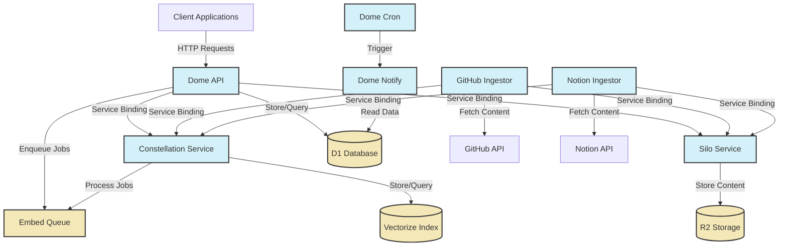
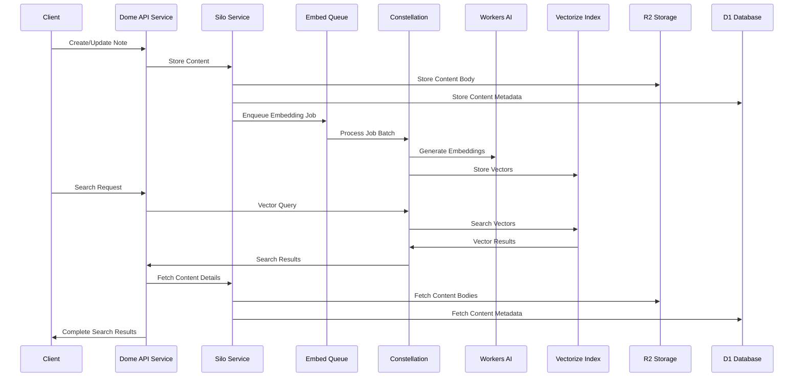
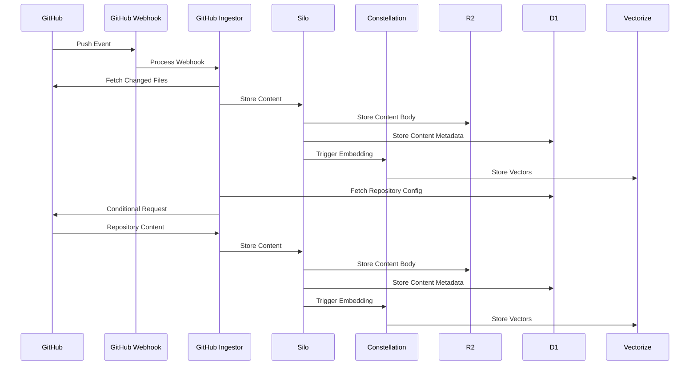

# Dome Architecture Overview

## 1. Introduction

This document provides a comprehensive overview of the Dome application architecture. It explains the system's high-level design, describes each service and its responsibilities, illustrates data flows, and documents key design decisions.

## 2. System Architecture

The Dome application follows a microservices architecture built on Cloudflare Workers. The system consists of several specialized services that communicate through typed interfaces, queues, and shared data stores.

### 2.1 High-Level Architecture

### 2.2 Key Components

#### 2.2.1 Core Services

| Service             | Description                                 | Responsibilities                                                                                                                                             |
| ------------------- | ------------------------------------------- | ------------------------------------------------------------------------------------------------------------------------------------------------------------ |
| **Dome API**        | Primary entry point for client applications | - Handle HTTP requests - Authenticate users - Coordinate with other services - Manage user data                                                     |
| **Silo**            | Unified content storage service             | - Store content in R2 - Manage content metadata in D1 - Provide multiple upload paths - Enable content deduplication                                |
| **Constellation**   | Embedding and vector search service         | - Generate embeddings with Workers AI - Store vectors in Vectorize - Provide vector search capabilities - Process embedding jobs asynchronously     |
| **GitHub Ingestor** | Service for ingesting GitHub repositories   | - Fetch content from GitHub repositories - Process and store content in Silo - Trigger embedding generation - Handle webhooks for real-time updates |
| **Notion Ingestor** | Service for ingesting Notion content        | - Fetch content from Notion - Process and store content in Silo - Trigger embedding generation                                                         |

#### 2.2.2 Storage and Queues

| Component                | Type            | Purpose                                               |
| ------------------------ | --------------- | ----------------------------------------------------- |
| **D1 Database**          | SQL database    | Store structured data like notes, users, and metadata |
| **R2 Storage**           | Object storage  | Store content bodies (text, code, etc.)               |
| **Vectorize**            | Vector database | Store and query embeddings for semantic search        |
| **Embed Queue**          | Workers Queue   | Process embedding jobs asynchronously                 |
| **Content Events Queue** | Workers Queue   | Process content creation/update events                |

#### 2.2.3 Supporting Services

| Service         | Description            | Responsibilities                                                   |
| --------------- | ---------------------- | ------------------------------------------------------------------ |
| **Dome Notify** | Notification service   | - Send notifications to users - Process scheduled notifications |
| **Dome Cron**   | Scheduled task service | - Trigger periodic tasks - Manage scheduled jobs                |

## 3. Service Interactions and Data Flow

### 3.1 Content Creation and Embedding Flow

### 3.2 GitHub Repository Ingestion Flow

## 4. Key Design Decisions

### 4.1 Microservices Architecture

**Decision**: Adopt a microservices architecture with specialized services.

**Rationale**:

- **Separation of Concerns**: Each service has a clear, focused responsibility.
- **Independent Scaling**: Services can be scaled independently based on demand.
- **Technology Flexibility**: Different services can use different technologies as needed.
- **Team Autonomy**: Different teams can work on different services independently.

**Trade-offs**:

- Increased complexity in service coordination
- Need for robust service discovery and communication
- Potential for distributed system challenges

### 4.2 Cloudflare Workers Platform

**Decision**: Build all services on Cloudflare Workers.

**Rationale**:

- **Global Distribution**: Automatic deployment to edge locations worldwide.
- **Low Latency**: Requests are processed close to users.
- **Serverless Model**: No server management, automatic scaling.
- **Integrated Services**: Native integration with D1, R2, Vectorize, and Queues.

**Trade-offs**:

- CPU and memory constraints of the Workers runtime
- Limited execution time for requests
- Vendor lock-in to Cloudflare ecosystem

### 4.3 Service Binding for Inter-Service Communication

**Decision**: Use Cloudflare Service Bindings for inter-service communication.

**Rationale**:

- **Type Safety**: Strongly typed interfaces between services.
- **Simplified Authentication**: No need for API keys or tokens between services.
- **Reduced Latency**: Direct service-to-service communication without HTTP overhead.
- **Simplified Deployment**: No need to manage service discovery.

**Trade-offs**:

- Limited to Cloudflare Workers ecosystem
- Less flexibility compared to standard HTTP APIs
- Potential for tight coupling between services

### 4.4 Asynchronous Processing with Queues

**Decision**: Use Workers Queues for asynchronous processing of resource-intensive operations.

**Rationale**:

- **Improved Responsiveness**: User-facing operations remain fast.
- **Better Resource Utilization**: Heavy operations are processed in the background.
- **Resilience**: Failed operations can be retried automatically.
- **Batching**: Multiple operations can be batched for efficiency.

**Trade-offs**:

- Increased system complexity
- Need for robust error handling and dead-letter queues
- Eventual consistency model

### 4.5 Centralized Embedding Service

**Decision**: Create a dedicated Constellation service for embedding and vector search operations.

**Rationale**:

- **Centralized Logic**: Embedding and vector search logic is centralized in one service.
- **Resource Optimization**: Heavy AI operations are offloaded from user-facing services.
- **Consistent Implementation**: One implementation for all embedding needs.
- **Simplified Evolution**: Changes to embedding logic only need to be made in one place.

**Trade-offs**:

- Single point of failure for embedding operations
- Potential bottleneck for high-volume embedding needs
- Dependency on Workers AI service

### 4.6 Content Deduplication in Silo

**Decision**: Implement content deduplication in the Silo service.

**Rationale**:

- **Storage Efficiency**: Reduces storage requirements for duplicate content.
- **Bandwidth Optimization**: Reduces bandwidth usage for uploads.
- **Consistent Content**: Ensures consistent representation of identical content.
- **Cost Reduction**: Reduces R2 storage costs.

**Trade-offs**:

- Increased complexity in content management
- Need for robust content hashing
- Potential for hash collisions

## 5. Cross-Cutting Concerns

### 5.1 Authentication and Authorization

The Dome application uses a JWT-based authentication system:

- **Authentication**: Users authenticate with email/password or OAuth providers.
- **JWT Tokens**: Authenticated sessions use JWT tokens for subsequent requests.
- **Service-to-Service**: Internal services use Service Bindings for authentication.
- **Authorization**: Access control is enforced at the API layer based on user roles and ownership.

### 5.2 Error Handling

The application follows a consistent error handling approach:

- **Standardized Error Format**: All errors follow a consistent format.
- **Error Types**: Errors are categorized by type (validation, not found, unauthorized, etc.).
- **Error Propagation**: Errors are properly propagated between services.
- **Client-Friendly Messages**: Error messages are user-friendly and actionable.

### 5.3 Logging and Monitoring

The application implements comprehensive logging and monitoring:

- **Structured Logging**: All services use structured logging with consistent fields.
- **Centralized Logs**: Logs are collected and analyzed centrally.
- **Metrics Collection**: Key metrics are tracked for performance and usage.
- **Alerting**: Alerts are configured for anomalies and errors.
- **Dashboards**: Monitoring dashboards provide visibility into system performance.

### 5.4 Security

Security is implemented at multiple levels:

- **Authentication**: Robust user authentication with JWT.
- **Authorization**: Fine-grained access control for resources.
- **Data Encryption**: Sensitive data is encrypted at rest and in transit.
- **Input Validation**: All user inputs are validated and sanitized.
- **Rate Limiting**: API endpoints are protected with rate limiting.
- **Audit Logging**: Security-relevant events are logged for audit purposes.

## 6. Future Directions

### 6.1 Planned Enhancements

- **Hybrid Search**: Combining vector search with traditional text search for better results.
- **Re-ranking**: Implementing re-ranking of search results for improved relevance.
- **Summarization**: Adding summarization capabilities for search results.
- **Multi-model Support**: Supporting multiple embedding models for different use cases.
- **Cross-user Search**: Implementing secure cross-user search capabilities.

### 6.2 Scalability Considerations

- **Queue Scaling**: Adjusting queue concurrency and batch sizes for higher throughput.
- **Database Sharding**: Implementing sharding strategies for D1 as data grows.
- **Caching Layer**: Adding caching for frequently accessed data.
- **Read Replicas**: Implementing read replicas for high-read scenarios.
- **Content Partitioning**: Partitioning content by user or organization for better scalability.

## 7. Conclusion

The Dome application architecture provides a solid foundation for a scalable, maintainable, and performant system. By leveraging Cloudflare's edge computing platform and adopting a microservices approach, the architecture achieves a good balance of separation of concerns, performance, and developer experience.

The architecture is designed to evolve over time, with clear interfaces between services and a focus on asynchronous processing for resource-intensive operations. This approach allows the system to scale efficiently and adapt to changing requirements.
