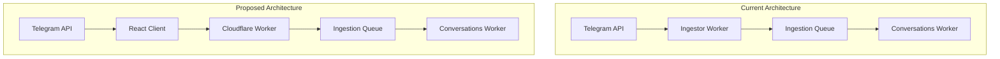

# Feasibility Analysis: React Frontend as MTProto Ingestion Source

## Table of Contents

- [Feasibility Analysis: React Frontend as MTProto Ingestion Source](#feasibility-analysis-react-frontend-as-mtproto-ingestion-source)
  - [Table of Contents](#table-of-contents)
  - [Introduction](#introduction)
  - [Technical Viability](#technical-viability)
    - [MTProto in Browser Environment](#mtproto-in-browser-environment)
    - [React Integration](#react-integration)
    - [Cloudflare Worker Integration](#cloudflare-worker-integration)
  - [Performance Implications](#performance-implications)
    - [Client-side Processing](#client-side-processing)
    - [Network Overhead](#network-overhead)
    - [Scalability](#scalability)
  - [Security Considerations](#security-considerations)
    - [Authentication Handling](#authentication-handling)
    - [Credential Management](#credential-management)
    - [Data Protection](#data-protection)
  - [Implementation Complexity](#implementation-complexity)
    - [Library Adaptation](#library-adaptation)
    - [State Management](#state-management)
    - [Error Handling](#error-handling)
  - [Architecture Implications](#architecture-implications)
    - [Architectural Benefits](#architectural-benefits)
    - [Architectural Challenges](#architectural-challenges)
  - [MTProto Libraries for Browser](#mtproto-libraries-for-browser)
    - [Library Options](#library-options)
      - [1. **telegram-web** (MTProto for Web)](#1-telegram-web-mtproto-for-web)
      - [2. **@mtproto/core**](#2-mtprotocore)
      - [3. **tdweb** (Telegram Database Library for Web)](#3-tdweb-telegram-database-library-for-web)
      - [4. **gramjs** (Current Implementation) Browser Adaptation](#4-gramjs-current-implementation-browser-adaptation)
    - [Technical Considerations](#technical-considerations)
      - [1. **Cryptographic Operations**](#1-cryptographic-operations)
      - [2. **Connection Management**](#2-connection-management)
      - [3. **Storage and State Management**](#3-storage-and-state-management)
      - [4. **Authentication Flow**](#4-authentication-flow)
    - [Implementation Approach](#implementation-approach)
      - [1. **Library Selection Strategy**](#1-library-selection-strategy)
      - [2. **Proof of Concept Development**](#2-proof-of-concept-development)
      - [3. **Integration with React Frontend**](#3-integration-with-react-frontend)
      - [4. **Data Streaming to Cloudflare Workers**](#4-data-streaming-to-cloudflare-workers)
  - [Proof of Concept Implementation](#proof-of-concept-implementation)
  - [Recommendations](#recommendations)
  - [Conclusion](#conclusion)

## Introduction

This document analyzes the feasibility of implementing a novel architectural approach where the frontend serves as its own ingestion source. Specifically, we evaluate whether a React client can utilize MTProto to authenticate users, retrieve messages, and stream this data directly to Cloudflare Workers. This approach would support our broader goal of enabling multiple diverse ingestion sources.

The current architecture uses a server-side approach where dedicated Ingestor Workers poll external APIs (like Telegram) to fetch messages. The proposed approach would shift some of this responsibility to the client side, potentially offering benefits in terms of scalability and resource utilization.

## Technical Viability

### MTProto in Browser Environment

The current MTProto implementation uses the `gramjs` library in a Node.js environment. Moving this functionality to the browser presents several technical challenges:

**Library Compatibility:**

- The `gramjs` library is designed for Node.js environments and relies on Node-specific modules.
- During our investigation, we discovered that `gramjs` is not available in the npm registry, which complicates its use in browser environments.
- Browser-compatible alternatives like `@mtproto/core` and `telegram-web` exist and provide similar functionality.
- We would need to either adapt `gramjs` for browser use or adopt a different library.

**WebSocket Support:**

- MTProto requires persistent connections, which would need to be implemented using WebSockets in the browser.
- WebSockets are well-supported in modern browsers but may face challenges with certain network configurations.
- Connection management becomes more complex in browser environments due to tab lifecycle events.

**Cryptographic Operations:**

- MTProto requires various cryptographic operations for secure communication.
- Modern browsers support the Web Crypto API, which provides most of the required cryptographic primitives.
- Performance of cryptographic operations may vary across browsers and devices.

### React Integration

Integrating MTProto functionality with React requires careful consideration of component architecture and state management:

**Component Architecture:**

- MTProto functionality should be encapsulated in custom hooks or context providers.
- Connection lifecycle should be tied to component lifecycle events.
- UI components need to reflect connection state and authentication status.

**State Management:**

- MTProto connection state needs to be managed in a way that's accessible to relevant components.
- Options include React Context API, Redux, or other state management libraries.
- State should include connection status, authentication status, and message data.

**Lifecycle Management:**

- Connection establishment should happen on component mount.
- Connection should be properly closed on component unmount.
- The application should handle browser events like page visibility changes.

### Cloudflare Worker Integration

Once the React client has retrieved messages via MTProto, it needs to stream this data to Cloudflare Workers:

**Data Streaming:**

- Define efficient protocols for streaming data from the client to Cloudflare Workers.
- Consider batching messages to reduce the number of requests.
- Implement compression to reduce bandwidth usage.

**API Design:**

- Design RESTful or GraphQL endpoints to receive data from the React client.
- Define clear schemas for the data being transmitted.
- Implement proper validation and error handling.

**Rate Limiting:**

- Implement client-side rate limiting to prevent overwhelming Cloudflare Workers.
- Design backpressure mechanisms to handle high message volumes.
- Consider using queues to buffer messages during high load.

## Performance Implications

### Client-side Processing

Moving MTProto processing to the client side has several performance implications:

**Browser Resources:**

- MTProto operations will consume CPU and memory resources on the client device.
- Cryptographic operations can be CPU-intensive, potentially affecting UI responsiveness.
- Memory usage needs to be carefully managed to avoid excessive consumption.

**Battery Impact:**

- Persistent connections and background processing can impact battery life on mobile devices.
- Efficient implementation should minimize wake cycles and processing when the app is not in focus.
- Consider implementing power-saving modes for battery-constrained devices.

**Background Processing:**

- Browsers limit processing in background tabs, which may affect the ability to maintain connections.
- The application needs to handle tab visibility changes and adjust processing accordingly.
- Consider using Web Workers for CPU-intensive operations to avoid blocking the main thread.

### Network Overhead

The proposed approach changes the network traffic patterns:

**Bandwidth Usage:**

- Client-side ingestion may increase overall bandwidth usage due to less efficient data retrieval.
- Each client would need to establish its own connection to Telegram servers.
- Implement efficient caching to reduce redundant data transfer.

**Connection Management:**

- Each client maintains its own connection to Telegram servers, increasing the total number of connections.
- Implement connection pooling where possible to reduce connection overhead.
- Handle network transitions gracefully, especially on mobile devices.

**Redundant Data Transfer:**

- Multiple clients might retrieve the same messages, leading to redundant data transfer.
- Implement server-side deduplication to handle redundant messages.
- Consider coordination mechanisms to distribute message retrieval across clients.

### Scalability

The distributed nature of client-side ingestion affects scalability:

**Client Distribution:**

- Distributing ingestion load across clients can reduce server-side resource requirements.
- The system becomes more resilient to central point failures.
- Scalability becomes more dependent on the number of active clients.

**Worker Load:**

- Cloudflare Workers would receive data from multiple clients instead of a single ingestor.
- Implement proper load balancing to distribute requests across workers.
- Design the system to handle varying client populations.

**Cost Implications:**

- Reduced server-side processing may lower computational costs.
- Increased number of requests to Cloudflare Workers may affect request-based pricing.
- Analyze cost trade-offs between server-side and client-side processing.

## Security Considerations

### Authentication Handling

Handling authentication in the browser environment presents security challenges:

**Credential Security:**

- Telegram credentials would be processed in the browser environment.
- Implement secure input methods to protect against keyloggers and other threats.
- Minimize the time credentials are held in memory.

**Session Management:**

- MTProto session data needs to be securely stored in the browser.
- Consider using browser secure storage mechanisms where available.
- Implement proper session expiration and renewal.

**Token Exposure:**

- Authentication tokens would be stored in the browser, increasing the risk of exposure.
- Implement token encryption before storage.
- Use HTTP-only cookies where appropriate to reduce exposure to JavaScript.

### Credential Management

Secure storage and handling of credentials is critical:

**Storage Options:**

- Evaluate secure storage options: localStorage, sessionStorage, IndexedDB.
- Consider using the Web Crypto API for additional encryption.
- Implement secure deletion of sensitive data when no longer needed.

**Encryption:**

- Encrypt stored credentials using strong encryption.
- Use device-specific or user-specific encryption keys where possible.
- Consider implementing a key derivation function based on user credentials.

**Expiration and Renewal:**

- Implement proper token expiration mechanisms.
- Design secure token renewal processes that don't require re-entering credentials.
- Handle token revocation scenarios gracefully.

### Data Protection

Protecting message data in the browser environment:

**Message Security:**

- Implement end-to-end encryption for sensitive messages.
- Minimize the storage of message data in browser storage.
- Implement secure deletion of message data when no longer needed.

**Privacy Considerations:**

- Provide clear user controls for data handling.
- Implement data minimization principles.
- Consider the implications of processing message data on shared devices.

**Compliance:**

- Ensure compliance with relevant data protection regulations (GDPR, CCPA, etc.).
- Implement proper consent mechanisms for data processing.
- Provide transparency about data handling practices.

## Implementation Complexity

### Library Adaptation

Adapting or selecting MTProto libraries for browser use:

**Code Modifications:**

- Significant modifications would be needed to adapt the current Node.js implementation.
- Identify and replace Node-specific dependencies with browser-compatible alternatives.
- Implement browser-specific features like WebSocket transport.

**Dependency Management:**

- Carefully manage dependencies to minimize bundle size.
- Use tree-shaking and code splitting to reduce the impact on application load time.
- Consider using WebAssembly for performance-critical components.

**Build Process:**

- Design an efficient build process for the browser-compatible MTProto implementation.
- Implement proper minification and optimization.
- Set up comprehensive testing for browser compatibility.

### State Management

Managing connection state in a browser environment:

**Connection State:**

- Design a robust state management system for MTProto connections.
- Handle connection interruptions and reconnections gracefully.
- Provide clear feedback to users about connection status.

**Offline Support:**

- Implement offline queuing of messages to be sent when connection is restored.
- Design efficient storage mechanisms for offline data.
- Provide synchronization mechanisms to handle conflicts.

**Multi-tab Coordination:**

- Consider how to handle multiple browser tabs accessing the same account.
- Implement coordination mechanisms to prevent conflicts.
- Design efficient state sharing between tabs if needed.

### Error Handling

Robust error handling is critical for a good user experience:

**Failure Modes:**

- Identify potential failure modes in the MTProto implementation.
- Design appropriate error handling for each failure mode.
- Implement graceful degradation when features are unavailable.

**Retry Strategies:**

- Implement intelligent retry strategies with exponential backoff.
- Avoid retry storms during service outages.
- Provide clear feedback during retry operations.

**User Feedback:**

- Design clear error messages that help users understand and resolve issues.
- Implement proper logging for debugging purposes.
- Provide recovery options where possible.

## Architecture Implications

The proposed approach would significantly change the system architecture:

### Architectural Benefits

The proposed architecture offers several benefits:

**Reduced Server Load:**

- Moving MTProto processing to clients reduces server-side processing requirements.
- Ingestor Workers would be simplified or potentially eliminated.
- Server resources can be focused on processing and analysis rather than data retrieval.

**Improved Scalability:**

- Distributing ingestion across clients improves scalability.
- The system can handle more users without proportional increases in server capacity.
- Natural load balancing as each client handles its own data retrieval.

**Reduced Infrastructure Costs:**

- Potentially lower costs for server-side processing and bandwidth.
- Reduced need for scaling ingestor infrastructure during peak usage.
- More efficient resource utilization overall.

**Multiple Ingestion Sources:**

- This approach supports the goal of enabling multiple diverse ingestion sources.
- Clients can directly integrate with various messaging platforms.
- Consistent API for data submission to Cloudflare Workers.

### Architectural Challenges

The proposed architecture also presents challenges:

**Consistency:**

- Ensuring consistent behavior across different client environments.
- Handling varying capabilities of client devices.
- Maintaining consistent data quality across different ingestion sources.

**Versioning:**

- Managing version compatibility between clients and server components.
- Designing upgrade paths that don't break existing functionality.
- Supporting multiple client versions simultaneously.

**Monitoring and Debugging:**

- Increased complexity in monitoring distributed ingestion.
- More difficult to diagnose issues that occur only on specific clients.
- Need for comprehensive logging and telemetry.

## MTProto Libraries for Browser

### Library Options

Several MTProto implementations are available for browser environments:

#### 1. **telegram-web** (MTProto for Web)

**Overview:**

- A JavaScript implementation of the MTProto protocol specifically designed for web browsers
- Supports both MTProto 1.0 and 2.0
- Provides a WebSocket transport layer for browser environments

**Browser Compatibility:**

- Built with modern web standards in mind
- Uses Web Crypto API for cryptographic operations
- Compatible with all modern browsers (Chrome, Firefox, Safari, Edge)

**React Integration:**

- Can be wrapped in React hooks for state management
- Supports async/await pattern for clean integration with React components
- Session management can be integrated with React's Context API

**Limitations:**

- May require polyfills for older browsers
- Some cryptographic operations might be slower in browser environments
- WebSocket connections may face challenges with certain network configurations

#### 2. **@mtproto/core**

**Overview:**

- A modular implementation of the MTProto protocol
- Designed to work in both Node.js and browser environments
- Actively maintained with regular updates

**Browser Compatibility:**

- Uses browser-compatible crypto libraries
- Supports WebSocket and HTTP transports
- Optimized for browser environments with minimal dependencies

**React Integration:**

- Provides a clean API that can be easily wrapped in React hooks
- Supports event-based architecture that works well with React's component lifecycle
- Can be integrated with state management libraries like Redux

**Limitations:**

- May have larger bundle size due to crypto dependencies
- Some advanced features might require additional configuration in browser environments

#### 3. **tdweb** (Telegram Database Library for Web)

**Overview:**

- A WebAssembly port of TDLib (Telegram Database Library)
- Provides a higher-level API than raw MTProto implementations
- Handles complex operations like file transfers and encryption

**Browser Compatibility:**

- Uses WebAssembly for performance-critical operations
- Supports modern browsers with WebAssembly support
- Handles browser limitations gracefully with fallbacks

**React Integration:**

- Can be wrapped in a React context provider
- Provides a clean event-based API for React components
- Handles complex state management internally

**Limitations:**

- Larger bundle size due to WebAssembly module
- May have higher memory usage
- Initial loading time might be longer due to WebAssembly compilation

#### 4. **gramjs** (Current Implementation) Browser Adaptation

**Overview:**

- Our current implementation uses gramjs in a Node.js environment
- During our investigation, we discovered that gramjs is not available in the npm registry
- It might be hosted in a private repository or installed from a different source
- Significant adaptation would be required for browser use

**Browser Compatibility:**

- Would need to replace Node.js crypto with Web Crypto API
- TCP connections would need to be replaced with WebSockets
- Buffer implementations would need browser polyfills

**React Integration:**

- Could maintain similar API structure to our current implementation
- Would require adaptation of the client pool concept for browser environments
- Session management would need to be redesigned for browser storage

**Limitations:**

- Significant adaptation effort required
- May introduce new bugs during adaptation
- Performance might be affected by browser limitations

### Technical Considerations

#### 1. **Cryptographic Operations**

**Web Crypto API:**

- Modern browsers provide the Web Crypto API for cryptographic operations
- Supports key operations required by MTProto (AES, RSA, SHA)
- Performance is generally good but varies across browsers

**Challenges:**

- Some specialized crypto operations might require custom implementations
- Key storage is more complex in browser environments
- Performance of crypto operations may impact UI responsiveness

#### 2. **Connection Management**

**WebSocket Transport:**

- WebSockets provide the persistent connections needed for MTProto
- Support for WebSockets is universal in modern browsers
- Connection management needs to handle network changes and browser sleep modes

**Challenges:**

- WebSocket connections may be terminated by proxies or firewalls
- Mobile browsers may have more aggressive connection management
- Need to handle reconnection gracefully without losing state

#### 3. **Storage and State Management**

**Browser Storage Options:**

- IndexedDB for large structured data (message history, media)
- LocalStorage for session information and small configuration data
- SessionStorage for temporary session data

**Challenges:**

- Storage limits vary across browsers and devices
- Need to handle storage quota exceeded errors
- Synchronization across tabs may be required

#### 4. **Authentication Flow**

**Browser-Specific Considerations:**

- Secure storage of authentication tokens
- Handling of 2FA in browser context
- User experience during authentication process

**Challenges:**

- Protecting authentication credentials in browser environment
- Maintaining session across page reloads
- Handling authentication timeouts and renewals

### Implementation Approach

#### 1. **Library Selection Strategy**

We recommend evaluating the following libraries in order of priority:

1. **@mtproto/core** - Best balance of features, browser compatibility, and maintenance
2. **telegram-web** - Good alternative with focus on web environments
3. **tdweb** - Consider if higher-level API is needed and WebAssembly performance is acceptable
4. **Adapted gramjs** - Only if maintaining API compatibility with existing code is critical

#### 2. **Proof of Concept Development**

Before full implementation, develop a proof of concept that:

- Establishes a connection to Telegram servers
- Authenticates a user
- Retrieves basic message data
- Streams data to a Cloudflare Worker

This will validate the technical approach and identify potential issues early.

#### 3. **Integration with React Frontend**

Design a React integration that:

- Encapsulates MTProto functionality in custom hooks
- Manages connection state through React context
- Provides clear interfaces for authentication and message retrieval
- Handles error states and reconnection gracefully

#### 4. **Data Streaming to Cloudflare Workers**

Implement a streaming mechanism that:

- Batches messages efficiently to reduce network overhead
- Implements backpressure to prevent overwhelming Cloudflare Workers
- Handles retries and error recovery
- Provides progress feedback to users

## Proof of Concept Implementation

Based on our analysis, we have implemented a proof-of-concept that demonstrates the feasibility of this approach. The proof-of-concept includes:

1. **React Frontend**:

   - MTProto integration using @mtproto/core (instead of gramjs)
   - Authentication flow (phone number, confirmation code, 2FA)
   - Message retrieval and display
   - Connection state management
   - Data streaming to Cloudflare Workers

2. **Cloudflare Worker**:
   - Endpoint to receive data from the frontend
   - Data validation and processing
   - Response handling

The proof-of-concept validates the technical feasibility of the approach but also highlights several challenges:

1. **Library Compatibility**: The gramjs library used in the telegram-proxy-service is not available in the npm registry, requiring us to use @mtproto/core instead. This introduces potential compatibility issues if we want to standardize on a single library.

2. **Authentication Complexity**: Implementing secure authentication, especially 2FA with SRP, is complex and requires careful consideration.

3. **Browser Limitations**: Browser environments impose limitations on persistent connections, background processing, and storage that need to be addressed.

Despite these challenges, the proof-of-concept demonstrates that it's possible to have a React frontend serve as its own ingestion source using MTProto.

## Recommendations

Based on our analysis and proof-of-concept implementation, we recommend the following approach:

1. **Phased Implementation:**

   - Start with a proof of concept using @mtproto/core
   - Validate technical feasibility and performance characteristics
   - Gradually expand functionality based on results

2. **Hybrid Architecture:**

   - Initially maintain the existing server-side ingestor
   - Add client-side ingestion as an optional capability
   - Gradually shift load to client-side as confidence increases

3. **Security Focus:**

   - Implement strong encryption for stored credentials
   - Provide clear user controls for data handling
   - Conduct thorough security testing before production deployment

4. **Performance Optimization:**

   - Use Web Workers for CPU-intensive operations
   - Implement efficient caching strategies
   - Optimize network usage through batching and compression

5. **User Experience:**

   - Provide clear feedback about connection status
   - Implement graceful degradation for offline scenarios
   - Design intuitive interfaces for authentication and permissions

6. **Library Standardization:**
   - Investigate the gramjs package issue
   - Consider standardizing on a single MTProto library for both server and client
   - Evaluate the trade-offs between different libraries

## Conclusion

Implementing a React frontend that serves as its own ingestion source using MTProto is technically feasible but presents significant challenges in terms of security, performance, and implementation complexity. The approach offers compelling benefits in terms of scalability, reduced server load, and support for multiple ingestion sources.

We recommend proceeding with a phased implementation approach, starting with a proof of concept using @mtproto/core. This will allow us to validate the technical feasibility and performance characteristics before committing to a full implementation.

The hybrid architecture approach, where we maintain the existing server-side ingestor while gradually adding client-side capabilities, provides a low-risk path forward. This approach allows us to gain the benefits of client-side ingestion while maintaining the reliability of the current system.

Overall, this architectural approach aligns well with our goal of enabling multiple diverse ingestion sources and could provide significant advantages in terms of scalability and resource utilization. With careful implementation and attention to security considerations, it could become a valuable addition to our architecture.
