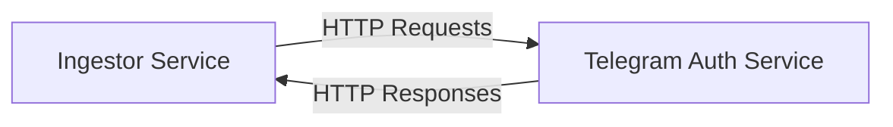
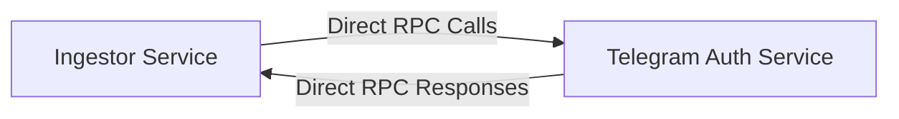

# Cloudflare Service Bindings Implementation Plan

## Overview

This document outlines the plan for implementing Cloudflare service bindings between the ingestor and telegram-auth services using the RPC style with WorkerEntrypoint. This will replace the current HTTP-based communication with direct function calls, providing better performance and security.

## Current Architecture

Currently, the ingestor service communicates with the telegram-auth service via HTTP requests:



The ingestor service uses a `TelegramAuthClient` class that makes HTTP requests to the telegram-auth service's endpoints, particularly the `/sessions/user/:userId` endpoint to fetch Telegram sessions.

## Target Architecture

We'll replace this with direct RPC-style communication using Cloudflare service bindings:



## Implementation Steps

### 1. Refactor Telegram-Auth Service to Use WorkerEntrypoint

#### 1.1. Create a WorkerEntrypoint Class

We'll refactor the telegram-auth service to extend the WorkerEntrypoint class, exposing methods that match our current API endpoints:

```typescript
// services/auth-telegram/src/index.ts
import { WorkerEntrypoint } from "cloudflare:workers";
import { SessionManager } from './lib/session-manager';
import { ApiResponse } from '@communicator/common';

export default class TelegramAuthWorker extends WorkerEntrypoint {
  // Keep the existing Hono app for HTTP requests
  async fetch(request) {
    // Initialize the Hono app and handle HTTP requests
    // This maintains backward compatibility
    // ...existing Hono app code...
  }

  // RPC methods for service bindings
  async getSessionByUserId(userId: number): Promise<{
    sessionString: string;
    sessionId: string;
    expiresAt: string;
  }> {
    const sessionManager = new SessionManager(
      this.env.DB,
      this.env.SESSION_SECRET
    );
    
    try {
      // Get session for user
      const { sessionString, sessionId, expiresAt } = await sessionManager.getSessionByUserId(userId);
      
      // Log access
      await sessionManager.logAccess(
        sessionId,
        'ingestor-service', // Service ID
        'get_session',
        true,
        undefined,
        'internal-service-binding' // IP address
      );
      
      return {
        sessionString,
        sessionId,
        expiresAt: expiresAt.toISOString()
      };
    } catch (error) {
      // Log failed access if we have a session ID
      if (error.sessionId) {
        await sessionManager.logAccess(
          error.sessionId,
          'ingestor-service',
          'get_session',
          false,
          error.message,
          'internal-service-binding'
        );
      }
      
      throw error;
    }
  }

  async listSessions(userId: number) {
    // Implement the listSessions method
    // Similar to the existing /sessions/list/:userId endpoint
    // ...
  }

  async revokeSession(sessionId: string) {
    // Implement the revokeSession method
    // Similar to the existing /sessions/:sessionId DELETE endpoint
    // ...
  }
}
```

#### 1.2. Update Telegram-Auth Service Dependencies

Update the package.json to include the necessary dependencies:

```json
{
  "dependencies": {
    "cloudflare:workers": "latest",
    // ...existing dependencies...
  }
}
```

### 2. Modify Ingestor Service to Use Service Binding

#### 2.1. Update Ingestor's wrangler.toml

Add the service binding to the ingestor's wrangler.toml:

```toml
name = "ingestor"
main = "src/index.ts"
compatibility_date = "2023-04-15"

# Service bindings
[[services]]
binding = "TELEGRAM_AUTH"
service = "auth-telegram"

[vars]
ENVIRONMENT = "development"
# Remove the TELEGRAM_AUTH_SERVICE_ENDPOINT as it's no longer needed
# TELEGRAM_AUTH_SERVICE_ENDPOINT = "https://auth-telegram.example.com/api/telegram-auth"
TELEGRAM_AUTH_SERVICE_API_KEY = ""
TELEGRAM_SERVICE_ID = "ingestor-service"
TELEGRAM_MAX_RETRIES = "3"
TELEGRAM_RETRY_DELAY = "2000"
TELEGRAM_SESSION_CACHE_TTL = "300000"

# Environment-specific configurations
[env.production]
vars = {
  ENVIRONMENT = "production",
}

[env.staging]
vars = {
  ENVIRONMENT = "staging",
}
```

#### 2.2. Refactor TelegramAuthClient

Update the TelegramAuthClient to use the service binding instead of HTTP requests:

```typescript
// services/ingestor/src/clients/telegram-auth-client.ts
import { ApiResponse } from '@communicator/common';

/**
 * Interface for Telegram session data
 */
export interface TelegramSession {
  sessionString: string;
  userId: number;
  expiresAt: string;
}

/**
 * Interface for Telegram auth client configuration
 */
export interface TelegramAuthClientConfig {
  telegramAuth: any; // Service binding
  serviceId: string;
  retryAttempts?: number;
  retryDelay?: number;
}

/**
 * Client for interacting with the Telegram Authentication Service
 */
export class TelegramAuthClient {
  private config: TelegramAuthClientConfig;
  private sessionCache: Map<number, TelegramSession> = new Map();

  /**
   * Create a new TelegramAuthClient
   * @param config Client configuration
   */
  constructor(config: TelegramAuthClientConfig) {
    this.config = {
      retryAttempts: 3,
      retryDelay: 1000,
      ...config
    };
  }

  /**
   * Get a Telegram session for a user
   * @param userId User ID
   * @returns Telegram session
   */
  async getSession(userId: number): Promise<TelegramSession> {
    // Check cache first
    const cachedSession = this.sessionCache.get(userId);
    if (cachedSession && this.isSessionValid(cachedSession)) {
      return cachedSession;
    }

    // Fetch from auth service using service binding
    const session = await this.fetchSession(userId);
    
    // Cache the session
    this.sessionCache.set(userId, session);
    
    return session;
  }

  /**
   * Check if a session is valid (not expired)
   * @param session Telegram session
   * @returns True if session is valid
   */
  private isSessionValid(session: TelegramSession): boolean {
    const expiresAt = new Date(session.expiresAt);
    const now = new Date();
    
    // Consider session invalid if it expires in less than 5 minutes
    const fiveMinutes = 5 * 60 * 1000;
    return expiresAt.getTime() - now.getTime() > fiveMinutes;
  }

  /**
   * Fetch a session from the auth service
   * @param userId User ID
   * @returns Telegram session
   */
  private async fetchSession(userId: number): Promise<TelegramSession> {
    let lastError: Error | null = null;
    
    // Retry logic
    for (let attempt = 0; attempt < this.config.retryAttempts!; attempt++) {
      try {
        // Use service binding to directly call the method
        const sessionData = await this.config.telegramAuth.getSessionByUserId(userId);
        
        return {
          sessionString: sessionData.sessionString,
          userId: userId,
          expiresAt: sessionData.expiresAt
        };
      } catch (error) {
        lastError = error instanceof Error ? error : new Error(String(error));
        
        // Don't wait on the last attempt
        if (attempt < this.config.retryAttempts! - 1) {
          await new Promise(resolve => setTimeout(resolve, this.config.retryDelay!));
        }
      }
    }
    
    throw lastError || new Error('Failed to get session after multiple attempts');
  }

  /**
   * Refresh a session for a user
   * @param userId User ID
   * @returns Refreshed Telegram session
   */
  async refreshSession(userId: number): Promise<TelegramSession> {
    // Remove from cache
    this.sessionCache.delete(userId);
    
    // Fetch fresh session
    return this.fetchSession(userId);
  }

  /**
   * Clear the session cache
   */
  clearCache(): void {
    this.sessionCache.clear();
  }

  /**
   * Revoke a session
   * @param sessionId Session ID
   */
  async revokeSession(sessionId: string): Promise<void> {
    await this.config.telegramAuth.revokeSession(sessionId);
  }
}
```

#### 2.3. Update Ingestor Service Initialization

Update the ingestor service to use the service binding:

```typescript
// services/ingestor/src/index.ts
// ...existing imports...

/**
 * Environment bindings type
 */
type Bindings = {
  ENVIRONMENT?: string;
  TELEGRAM_API_ID?: string;
  TELEGRAM_API_HASH?: string;
  TELEGRAM_AUTH?: any; // Service binding
  TELEGRAM_AUTH_SERVICE_API_KEY?: string;
  TELEGRAM_SERVICE_ID?: string;
  TELEGRAM_MAX_RETRIES?: string;
  TELEGRAM_RETRY_DELAY?: string;
  TELEGRAM_SESSION_CACHE_TTL?: string;
};

// ...existing code...

/**
 * Initialize Telegram integration
 */
app.use('*', async (c, next) => {
  try {
    // Get Telegram config from environment
    const telegramConfig = getTelegramConfig(c.env);
    
    // Initialize Telegram auth client with service binding
    const telegramAuthClient = new TelegramAuthClient({
      telegramAuth: c.env.TELEGRAM_AUTH, // Use service binding
      serviceId: telegramConfig.serviceId,
      retryAttempts: telegramConfig.maxRetries,
      retryDelay: telegramConfig.retryDelay
    });
    
    // Initialize Telegram service
    const telegramService = new TelegramService({
      telegramApiId: telegramConfig.apiId,
      telegramApiHash: telegramConfig.apiHash,
      authClient: telegramAuthClient,
      maxRetries: telegramConfig.maxRetries,
      retryDelay: telegramConfig.retryDelay
    });
    
    // Initialize Telegram controller
    const telegramController = new TelegramController(telegramService);
    
    // Store in context for route handlers
    c.set('telegramController', telegramController);
  } catch (error) {
    console.warn('Failed to initialize Telegram integration:', error);
    // Continue without Telegram integration
  }
  
  await next();
});

// ...existing code...
```

#### 2.4. Update Telegram Config

Update the telegram config to remove the endpoint:

```typescript
// services/ingestor/src/config/telegram-config.ts
/**
 * Telegram configuration
 */
export interface TelegramConfig {
  /**
   * Telegram API ID (from my.telegram.org)
   */
  apiId: number;
  
  /**
   * Telegram API Hash (from my.telegram.org)
   */
  apiHash: string;
  
  /**
   * Service ID for identifying this service to the Telegram Auth Service
   */
  serviceId: string;
  
  /**
   * Maximum number of retries for API calls
   */
  maxRetries: number;
  
  /**
   * Delay between retries in milliseconds
   */
  retryDelay: number;
  
  /**
   * Session cache TTL in milliseconds
   */
  sessionCacheTtl: number;
}

/**
 * Get Telegram configuration from environment variables
 * @param env Environment variables
 * @returns Telegram configuration
 */
export function getTelegramConfig(env: Record<string, string | undefined>): TelegramConfig {
  // Required environment variables
  const requiredVars = [
    'TELEGRAM_API_ID',
    'TELEGRAM_API_HASH',
    'TELEGRAM_SERVICE_ID'
  ];
  
  // Check for missing required variables
  const missingVars = requiredVars.filter(varName => !env[varName]);
  if (missingVars.length > 0) {
    throw new Error(`Missing required environment variables: ${missingVars.join(', ')}`);
  }
  
  return {
    apiId: parseInt(env.TELEGRAM_API_ID!, 10),
    apiHash: env.TELEGRAM_API_HASH!,
    serviceId: env.TELEGRAM_SERVICE_ID!,
    maxRetries: parseInt(env.TELEGRAM_MAX_RETRIES || '3', 10),
    retryDelay: parseInt(env.TELEGRAM_RETRY_DELAY || '2000', 10),
    sessionCacheTtl: parseInt(env.TELEGRAM_SESSION_CACHE_TTL || '300000', 10) // 5 minutes default
  };
}
```

### 3. Update Infrastructure Configuration

#### 3.1. Update Pulumi Infrastructure

Update the infrastructure code to set up the service binding:

```typescript
// infrastructure/src/workers.ts
import * as pulumi from '@pulumi/pulumi';
import * as cloudflare from '@pulumi/cloudflare';
import * as fs from 'fs';
import * as path from 'path';

/**
 * Deploy a TypeScript Cloudflare Worker
 *
 * @param name The name of the worker
 * @param scriptPath The path to the worker script
 * @param options Additional options for the worker
 * @returns The deployed worker
 */
export function deployWorker(
  name: string,
  scriptPath: string,
  options: {
    accountId: string;
    routes?: string[];
    serviceBindings?: { name: string; service: string }[];
  }
): cloudflare.WorkerScript {
  // Create the worker script
  const worker = new cloudflare.WorkerScript(name, {
    name,
    accountId: options.accountId,
    content: fs.readFileSync(scriptPath, 'utf8'),
    serviceBindings: options.serviceBindings,
  });

  // Create routes for the worker if specified
  if (options.routes && options.routes.length > 0) {
    for (let i = 0; i < options.routes.length; i++) {
      const route = options.routes[i];
      new cloudflare.WorkerRoute(`${name}-route-${i}`, {
        zoneId: options.accountId,
        pattern: route,
        scriptName: worker.name,
      });
    }
  }

  return worker;
}

// ...existing code...
```

#### 3.2. Update Dev Environment Configuration

Update the dev environment configuration to set up the service binding:

```typescript
// infrastructure/src/environments/dev.ts
import * as pulumi from '@pulumi/pulumi';
import { deployWorker } from '../workers';

// Load configuration
const config = new pulumi.Config();
const accountId = config.require('cloudflare:accountId');

/**
 * Deploy the development environment
 */
export function dev() {
  // Deploy the auth-telegram worker
  const authTelegramWorker = deployWorker('auth-telegram-dev', '../services/auth-telegram/dist/index.js', {
    accountId,
    routes: [
      // Example route - update as needed
      // 'auth-telegram-dev.your-domain.com/*',
    ],
  });

  // Deploy the ingestor worker with service binding to auth-telegram
  const ingestorWorker = deployWorker('ingestor-dev', '../services/ingestor/dist/index.js', {
    accountId,
    routes: [
      // Example route - update as needed
      // 'ingestor-dev.your-domain.com/*',
    ],
    serviceBindings: [
      {
        name: 'TELEGRAM_AUTH',
        service: authTelegramWorker.name,
      },
    ],
  });

  // Export the worker details
  return {
    authTelegramWorker: {
      name: authTelegramWorker.name,
    },
    ingestorWorker: {
      name: ingestorWorker.name,
    },
  };
}
```

### 4. Local Development Support

For local development, we need to ensure that the service binding works correctly. We have two options:

#### 4.1. Option 1: Use Wrangler for Local Development

Wrangler supports service bindings in local development mode. Update the ingestor's wrangler.toml:

```toml
# services/ingestor/wrangler.toml
name = "ingestor"
main = "src/index.ts"
compatibility_date = "2023-04-15"

# Service bindings
[[services]]
binding = "TELEGRAM_AUTH"
service = "auth-telegram"

# For local development, specify the service's local port
[dev]
port = 8787

# For local development, specify the service binding's local port
[[services.dev]]
binding = "TELEGRAM_AUTH"
port = 8788
```

And update the auth-telegram's wrangler.toml:

```toml
# services/auth-telegram/wrangler.toml
name = "auth-telegram"
main = "src/index.ts"
compatibility_date = "2023-05-18"

# For local development
[dev]
port = 8788
```

#### 4.2. Option 2: Fallback to HTTP for Local Development

If Wrangler's local service binding support is insufficient, we can implement a fallback mechanism:

```typescript
// services/ingestor/src/clients/telegram-auth-client.ts
private async fetchSession(userId: number): Promise<TelegramSession> {
  let lastError: Error | null = null;
  
  // Retry logic
  for (let attempt = 0; attempt < this.config.retryAttempts!; attempt++) {
    try {
      // Check if we have a service binding
      if (this.config.telegramAuth) {
        // Use service binding to directly call the method
        const sessionData = await this.config.telegramAuth.getSessionByUserId(userId);
        
        return {
          sessionString: sessionData.sessionString,
          userId: userId,
          expiresAt: sessionData.expiresAt
        };
      } else if (this.config.endpoint) {
        // Fallback to HTTP for local development
        const url = `${this.config.endpoint}/sessions/user/${userId}`;
        
        const response = await fetch(url, {
          method: 'GET',
          headers: {
            'Authorization': `ApiKey ${this.config.apiKey}`,
            'X-Service-ID': this.config.serviceId,
            'Content-Type': 'application/json'
          }
        });
        
        if (!response.ok) {
          const errorText = await response.text();
          throw new Error(`Failed to get session: ${response.status} ${response.statusText} - ${errorText}`);
        }
        
        const data = await response.json() as ApiResponse<{ sessionString: string; userId: number; expiresAt: string }>;
        
        if (!data.success || !data.data) {
          throw new Error(`Failed to get session: ${data.error?.message || 'Unknown error'}`);
        }
        
        return data.data;
      } else {
        throw new Error('No service binding or endpoint configured');
      }
    } catch (error) {
      lastError = error instanceof Error ? error : new Error(String(error));
      
      // Don't wait on the last attempt
      if (attempt < this.config.retryAttempts! - 1) {
        await new Promise(resolve => setTimeout(resolve, this.config.retryDelay!));
      }
    }
  }
  
  throw lastError || new Error('Failed to get session after multiple attempts');
}
```

## Testing Plan

1. **Unit Tests**: Update unit tests for both services to account for the new service binding approach.
2. **Integration Tests**: Create integration tests that verify the service binding works correctly.
3. **Local Development Testing**: Test the local development setup to ensure it works correctly.
4. **Production Testing**: Deploy to a staging environment and verify the service binding works correctly.

## Deployment Plan

1. Deploy the updated auth-telegram service
2. Deploy the updated ingestor service with the service binding
3. Verify that the service binding works correctly
4. If any issues arise, roll back to the HTTP-based approach

## Conclusion

This implementation plan provides a comprehensive approach to replacing the HTTP-based communication between the ingestor and telegram-auth services with Cloudflare service bindings using the RPC style with WorkerEntrypoint. This will provide better performance and security while maintaining compatibility with the existing codebase.