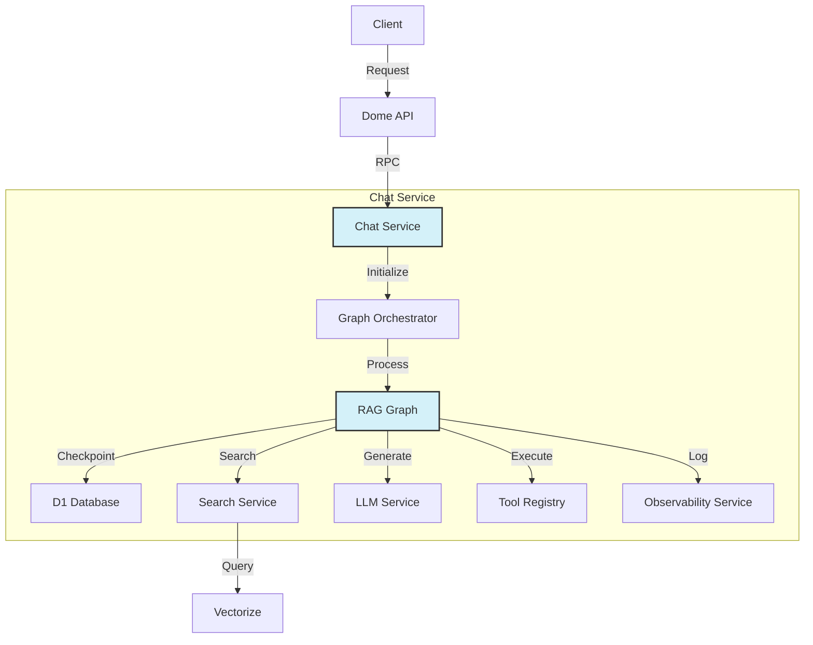
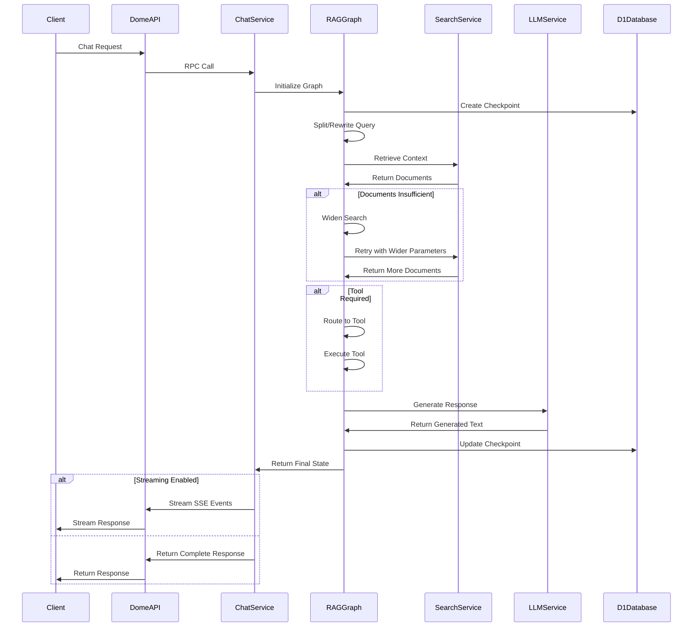
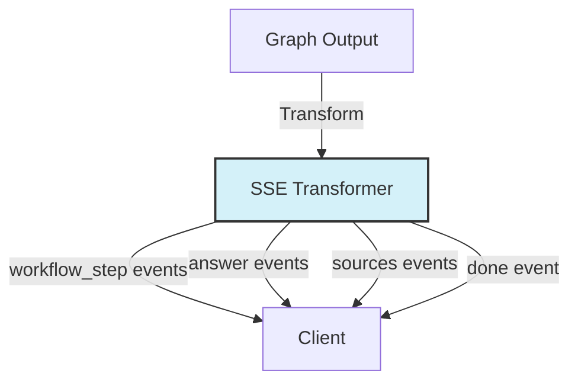
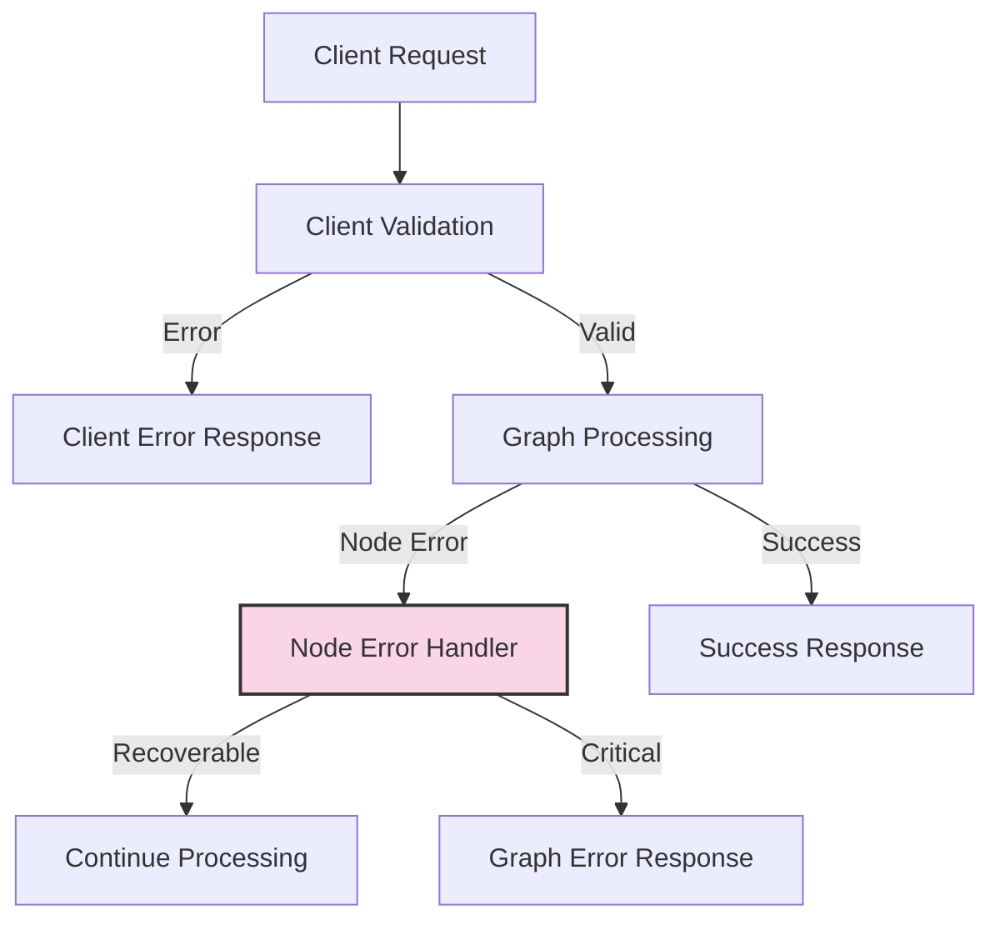
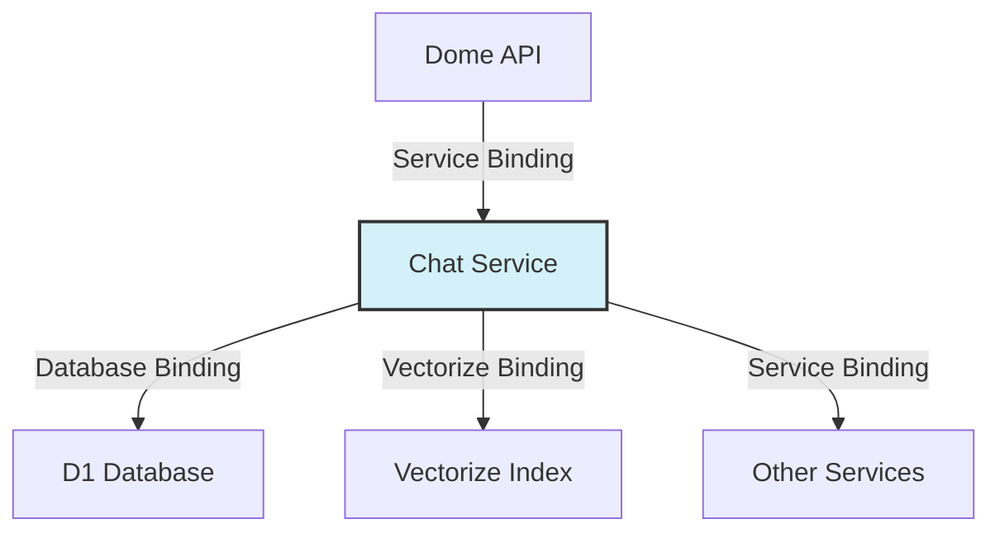
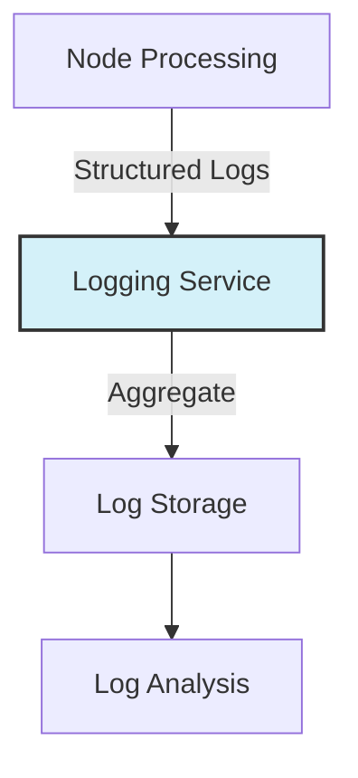

# Chat Service Architecture

This document provides a comprehensive overview of the Chat Service architecture, including its components, interactions, and data flows.

## 1. System Overview

The Chat Service is a Retrieval-Augmented Generation (RAG) system that enhances AI responses with relevant context from the user's knowledge base. It uses a directed graph architecture to process user queries, retrieve context, and generate accurate responses.

### Key Components



## 2. Component Architecture

### 2.1 Client Interface

The Chat Service exposes a client interface that provides methods for generating responses, streaming responses, and managing chat sessions. The client handles:

- Request validation using Zod schemas
- Error handling and logging
- Metrics collection
- Response formatting

```typescript
class ChatClient {
  async generateResponse(request: ChatRequest): Promise<ChatOrchestratorResponse>;
  async streamResponse(request: ChatRequest): Promise<Response>;
  async resumeChatSession(request: ResumeChatRequest): Promise<Response>;
  // Administrative methods...
}
```

### 2.2 Graph Orchestrator

The Graph Orchestrator is responsible for:

- Initializing the RAG graph
- Setting up checkpointing
- Configuring state reducers
- Handling state transitions
- Transforming graph output to client responses

```typescript
function buildChatGraph(env: Env) {
  // Create checkpointer
  const checkpointer = new D1Checkpointer(env.D1);

  // Initialize graph
  const graph = new StateGraph<AgentState>()
    // Add nodes
    .addNode('split_rewrite', nodes.splitRewrite)
    .addNode('retrieve', nodes.retrieve)
    .addNode('dynamic_widen', nodes.dynamicWiden)
    .addNode('tool_router', nodes.toolRouter)
    .addNode('run_tool', nodes.runTool)
    .addNode('generate_answer', nodes.generateAnswer)
    
    // Add edges and conditional routing
    // ...
    
  // Add state change listener for logging
  graph.onStateChange((oldState, newState, nodeName) => {
    // Update metadata and log state transitions
  });
  
  // Compile with checkpointer and reducers
  return graph.compile({
    checkpointer,
    reducers: {
      // State reduction logic
    },
  });
}
```

### 2.3 RAG Graph

The RAG Graph is a directed graph of specialized processing nodes. Each node has a specific responsibility and can pass control to different subsequent nodes based on its output.

Key nodes include:
- **Split/Rewrite**: Analyzes and potentially rewrites user queries
- **Retrieve**: Fetches relevant documents based on the query
- **Dynamic Widen**: Adjusts search parameters to improve retrieval results
- **Tool Router**: Determines if specialized tools are needed
- **Run Tool**: Executes selected tools
- **Generate Answer**: Creates the final response using an LLM

For detailed documentation of each node, see [GRAPH_NODES.md](./GRAPH_NODES.md).

### 2.4 Search Service

The Search Service is responsible for retrieving relevant documents based on user queries. It:

- Interfaces with Vectorize for semantic search
- Ranks and filters documents by relevance
- Supports dynamic parameter adjustment
- Extracts source metadata for attribution

```typescript
class SearchService {
  async search(options: SearchOptions): Promise<Document[]>;
  static rankAndFilterDocuments(docs: Document[], minRelevance: number): Document[];
  static extractSourceMetadata(docs: Document[]): SourceMetadata[];
}
```

### 2.5 LLM Service

The LLM Service manages interactions with Large Language Models. It:

- Constructs prompts with context and tool results
- Handles token counting and limits
- Processes LLM responses
- Tracks usage metrics

```typescript
class LlmService {
  async generateResponse(messages: Message[], options: LlmOptions): Promise<string>;
  async countTokens(text: string): Promise<number>;
}
```

### 2.6 Tool Registry

The Tool Registry manages specialized tools that can be executed during chat processing. It:

- Registers available tools
- Provides tool lookup by name
- Handles tool execution and error handling

```typescript
class ToolRegistry {
  static getTool(name: string): Tool | null;
  static registerTool(name: string, tool: Tool): void;
}

interface Tool {
  execute(input: unknown, env: Env): Promise<unknown>;
}
```

### 2.7 Observability Service

The Observability Service provides comprehensive logging, metrics, and tracing. It:

- Creates and manages trace and span IDs
- Records timing information
- Logs key events
- Tracks LLM and retrieval metrics

```typescript
class ObservabilityService {
  static startSpan(env: Env, traceId: string, name: string, state: AgentState): string;
  static endSpan(env: Env, traceId: string, spanId: string, name: string, startState: AgentState, endState: AgentState, durationMs: number): void;
  static logEvent(env: Env, traceId: string, spanId: string, name: string, attributes: Record<string, any>): void;
  static logRetrieval(env: Env, traceId: string, spanId: string, query: string, results: any[], durationMs: number): void;
}
```

## 3. Data Flow

### 3.1 Request Processing Flow



### 3.2 State Transitions

The state object flows through the graph, with each node updating specific portions:

1. **Initial State**: Created from the client request
2. **Split/Rewrite**: Adds `originalQuery` and `rewrittenQuery` to `tasks`
3. **Retrieve**: Adds retrieved documents to `docs` and updates widening flags
4. **Dynamic Widen**: Updates `wideningAttempts` and widening parameters
5. **Tool Router**: Adds `toolToRun` to `tasks`
6. **Run Tool**: Adds tool results to `toolResults` in `tasks`
7. **Generate Answer**: Adds generated text to `generatedText`
8. **Final State**: Transformed into client response

### 3.3 Streaming Response Flow

For streaming responses, the graph output is transformed into Server-Sent Events (SSE):



Event types include:
- `workflow_step`: Indicates the current processing step
- `answer`: Contains generated text (may be incremental)
- `sources`: Contains attribution information for retrieved documents
- `done`: Indicates processing is complete
- `error`: Contains error information if processing failed

## 4. Error Handling Architecture

The Chat Service implements a comprehensive error handling strategy:

### 4.1 Error Handling Layers



1. **Client Layer**: Validates requests and handles RPC errors
2. **Graph Layer**: Manages graph-level errors and checkpointing
3. **Node Layer**: Handles node-specific errors with fallbacks
4. **Service Layer**: Handles errors in external service calls

### 4.2 Error Recording

Errors are recorded in the state metadata:

```typescript
metadata: {
  errors: [
    {
      node: string;      // Node where error occurred
      message: string;   // Error message
      timestamp: number; // When the error occurred
    }
  ]
}
```

### 4.3 Error Recovery

The system supports several recovery mechanisms:

1. **Node Fallbacks**: Nodes provide default outputs on error
2. **Checkpointing**: Processing can resume from last successful checkpoint
3. **Graceful Degradation**: System can continue with reduced functionality

## 5. Deployment Architecture

### 5.1 Service Deployment

The Chat Service is deployed as a Cloudflare Worker with the following bindings:

```toml
# Example wrangler.toml
name = "chat"
main = "src/index.ts"

[[d1_databases]]
binding = "DB"
database_name = "chat_checkpoints"

[[vectorize_indexes]]
binding = "VECTORIZE"
index_name = "knowledge_base"

[vars]
ENVIRONMENT = "production"
```

### 5.2 Integration Points



## 6. Performance Considerations

### 6.1 Token Management

The system carefully manages token usage to optimize performance and cost:

1. **Document Truncation**: Documents are truncated to fit within token limits
2. **Token Budgeting**: Token allocation is managed across different components
3. **Model Selection**: Different models can be selected based on requirements

### 6.2 Caching Strategy

The system implements several caching strategies:

1. **Checkpoint Caching**: Graph state is cached in D1 for resumable processing
2. **Vector Caching**: Vector embeddings are cached in Vectorize
3. **Response Caching**: Common responses can be cached for reuse

### 6.3 Optimization Techniques

Performance optimizations include:

1. **Parallel Processing**: Some operations can be performed in parallel
2. **Early Filtering**: Documents are filtered early to reduce processing
3. **Incremental Processing**: Streaming enables incremental response delivery

## 7. Security Architecture

### 7.1 Data Isolation

User data is isolated through:

1. **User ID Partitioning**: All queries include user ID for data separation
2. **Permission Checking**: Access control checks on data retrieval
3. **Scoped Searches**: Searches are scoped to user's data

### 7.2 Consent Management

The system includes consent management features:

1. **Consent Recording**: User consent is recorded with duration
2. **Data Retention**: Data is retained based on consent duration
3. **Data Deletion**: User data can be deleted on request

## 8. Monitoring and Observability

### 8.1 Logging Architecture



### 8.2 Metrics Collection

Key metrics collected include:

1. **Execution Time**: Per node and total processing time
2. **Token Usage**: Prompt and completion tokens used
3. **Retrieval Performance**: Document count and relevance scores
4. **Error Rates**: Errors by type and location
5. **Request Volume**: Requests per user and total

### 8.3 Distributed Tracing

The system implements distributed tracing:

1. **Trace Context**: Trace and span IDs flow through the system
2. **Span Creation**: Each node creates spans for its processing
3. **Event Recording**: Key events are recorded within spans
4. **Trace Visualization**: Traces can be visualized for analysis

## 9. Future Architecture Considerations

### 9.1 Scalability Improvements

Potential scalability improvements include:

1. **Worker Sharding**: Distributing processing across multiple workers
2. **Parallel Node Execution**: Running independent nodes in parallel
3. **Distributed Checkpointing**: More robust checkpoint storage

### 9.2 Feature Enhancements

Planned feature enhancements include:

1. **Multi-Modal Support**: Handling images and other media types
2. **Advanced Tool Integration**: More sophisticated tool execution
3. **Personalization**: Enhanced user-specific response tailoring