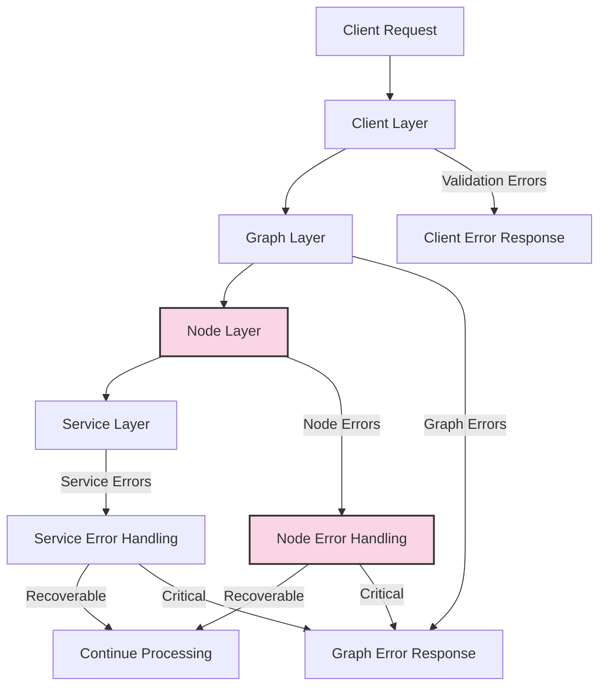
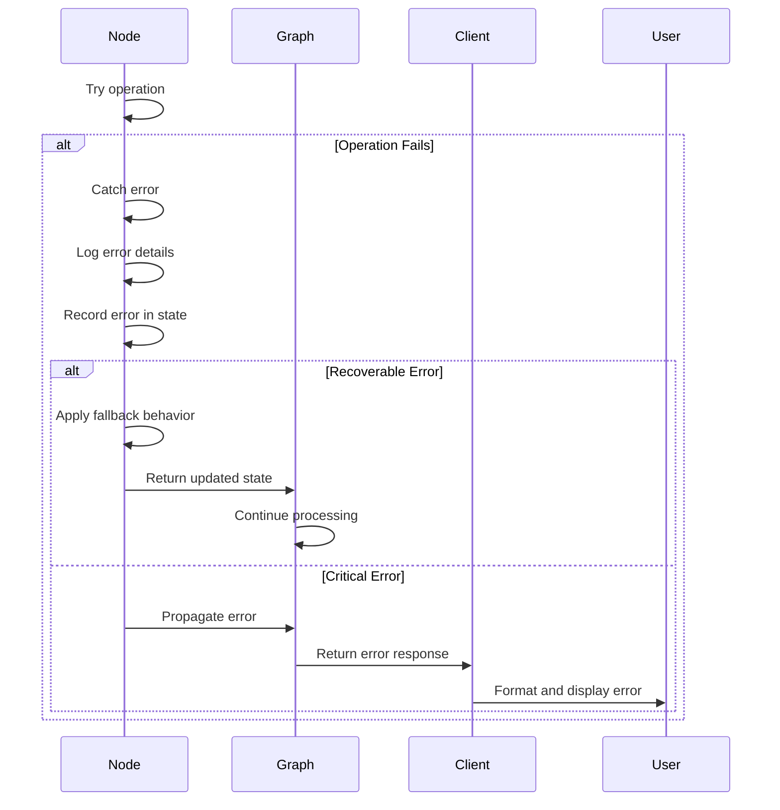

# Chat Service Error Handling

This document describes the error handling strategies implemented in the Chat Service, including how errors are detected, propagated, reported, and recovered from.

## 1. Error Handling Philosophy

The Chat Service follows these core principles for error handling:

1. **Resilience**: The system should continue functioning even when components fail
2. **Transparency**: Errors should be clearly logged and reported
3. **Graceful Degradation**: Functionality should degrade gracefully rather than fail completely
4. **Recoverability**: The system should provide mechanisms to recover from errors
5. **Observability**: Errors should be traceable and diagnosable

## 2. Error Handling Architecture

### 2.1 Error Handling Layers

The Chat Service implements a multi-layered approach to error handling:



1. **Client Layer**: Handles request validation and RPC errors
2. **Graph Layer**: Manages graph-level errors and checkpointing
3. **Node Layer**: Handles node-specific errors with fallbacks
4. **Service Layer**: Handles errors in external service calls (LLM, Search, etc.)

### 2.2 Error Types

The Chat Service handles several categories of errors:

| Error Category        | Description                      | Examples                                    | Handling Strategy                        |
| --------------------- | -------------------------------- | ------------------------------------------- | ---------------------------------------- |
| Validation Errors     | Invalid input data               | Missing required fields, invalid data types | Return 400 Bad Request with details      |
| Authentication Errors | User identity issues             | Missing user ID, invalid credentials        | Return 401 Unauthorized                  |
| Authorization Errors  | Permission issues                | Insufficient permissions                    | Return 403 Forbidden                     |
| Resource Errors       | Missing or unavailable resources | Document not found, service unavailable     | Graceful degradation, fallbacks          |
| Processing Errors     | Errors during processing         | LLM generation failure, search failure      | Node-specific error handling             |
| System Errors         | Infrastructure issues            | Database connection failure                 | Retry with backoff, fallback to defaults |

## 3. Error Handling Implementation

### 3.1 Error Recording in State

Errors are recorded in the state metadata to provide a complete error history:

```typescript
metadata: {
  errors: [
    {
      node: string;      // Node where error occurred
      message: string;   // Error message
      timestamp: number; // When the error occurred
    }
  ]
}
```

This approach allows:

- Tracking multiple errors across the processing pipeline
- Understanding the sequence of errors
- Diagnosing cascading failures

### 3.2 Node-Level Error Handling

Each node implements its own error handling strategy. For example, the retrieve node:

```typescript
try {
  // Call the search service to retrieve documents
  const docs = await searchService.search(searchOptions);

  // Process results and update state
  // ...
} catch (error) {
  logger.error(
    {
      errorMessage: error instanceof Error ? error.message : String(error),
      userId,
    },
    'Error retrieving context',
  );

  // Log the error event with minimal info
  ObservabilityService.logEvent(env, traceId, spanId, 'retrieval_error', {
    userId,
    errorMessage: error instanceof Error ? error.message : String(error),
  });

  // Create error state with empty docs
  const errorState = updateStateWithTiming(
    { ...state, docs: [] },
    'retrieve',
    executionTime,
    spanId,
  );

  // Add error information and return
  return addErrorToState(
    errorState,
    'retrieve',
    error instanceof Error ? error.message : String(error),
  );
}
```

Key aspects of node-level error handling:

1. **Catch and Log**: Errors are caught and logged with context
2. **Observability**: Error events are recorded for tracing
3. **Fallback Behavior**: Empty document list provided as fallback
4. **Error Recording**: Error details added to state metadata
5. **Timing Information**: Execution time still recorded for metrics

### 3.3 Error Helper Utilities

The Chat Service includes several helper utilities for consistent error handling:

#### 3.3.1 addErrorToState

```typescript
/**
 * Add an error to the state metadata
 */
export function addErrorToState(
  state: AgentState,
  nodeName: string,
  errorMessage: string,
): AgentState {
  return {
    ...state,
    metadata: {
      ...state.metadata,
      errors: [
        ...(state.metadata?.errors || []),
        {
          node: nodeName,
          message: errorMessage,
          timestamp: Date.now(),
        },
      ],
    },
  };
}
```

#### 3.3.2 logError

```typescript
/**
 * Log an error with context
 */
export function logError(error: unknown, message: string, context?: Record<string, any>): void {
  const logger = getLogger();
  const errorObj = {
    err: error,
    ...(context || {}),
  };

  logger.error(errorObj, message);

  // Track error metrics
  metrics.increment('errors', 1, {
    errorType: error instanceof Error ? error.constructor.name : 'unknown',
    ...(context ? { context: JSON.stringify(context) } : {}),
  });
}
```

### 3.4 Client-Side Error Handling

The client implements comprehensive error handling for RPC calls:

```typescript
try {
  // Validate request
  const validatedRequest = chatRequestSchema.parse(request);

  // Call the chat orchestrator directly via RPC
  const response = await this.binding.generateChatResponse(validatedRequest);

  // Process response
  // ...

  return result;
} catch (error) {
  logError(error, 'Error generating chat response via RPC', {
    userId: request.userId,
  });

  // Track error metrics
  metrics.increment(`${this.metricsPrefix}.generate_response.errors`, 1, {
    errorType: error instanceof Error ? error.constructor.name : 'unknown',
  });

  throw error;
}
```

## 4. Error Propagation

### 4.1 Error Propagation Flow

Errors propagate through the system as follows:



### 4.2 Error Response Format

When errors are propagated to the client, they follow a consistent format:

```typescript
interface ErrorResponse {
  error: {
    message: string;
    code: string;
    details?: any;
  };
}
```

For streaming responses, error events are sent as SSE:

```
event: error
data: {"message":"An error occurred during processing","code":"processing_error"}
```

## 5. Error Recovery Strategies

### 5.1 Checkpointing and Resumption

The Chat Service uses checkpointing to enable recovery from errors:

```typescript
// Create checkpointer
const checkpointer = new D1Checkpointer(env.D1);

// Initialize graph with checkpointer
const graph = new StateGraph<AgentState>()
  // ...
  .compile({
    checkpointer,
    // ...
  });
```

This allows:

1. **Session Resumption**: Conversations can be resumed after interruptions
2. **Error Recovery**: Processing can restart from the last valid state
3. **Debugging**: Intermediate states can be inspected for troubleshooting

### 5.2 Retry Mechanisms

The system implements several retry mechanisms:

1. **Exponential Backoff**: Retries with increasing delays
2. **Circuit Breaking**: Prevents cascading failures by failing fast after multiple errors
3. **Fallback Services**: Alternative services used when primary services fail

Example retry implementation:

```typescript
async function withRetry<T>(operation: () => Promise<T>, options: RetryOptions): Promise<T> {
  let lastError: Error | undefined;

  for (let attempt = 1; attempt <= options.maxAttempts; attempt++) {
    try {
      return await operation();
    } catch (error) {
      lastError = error instanceof Error ? error : new Error(String(error));

      if (attempt < options.maxAttempts) {
        const delay = Math.min(
          options.baseDelayMs * Math.pow(options.backoffFactor, attempt - 1),
          options.maxDelayMs,
        );

        await new Promise(resolve => setTimeout(resolve, delay));
      }
    }
  }

  throw lastError;
}
```

### 5.3 Graceful Degradation

The system implements graceful degradation strategies:

1. **Empty Document Fallback**: Return empty document list on retrieval failure
2. **Default Response Generation**: Generate generic response on LLM failure
3. **Feature Disabling**: Disable advanced features while maintaining core functionality

## 6. Error Monitoring and Alerting

### 6.1 Error Logging

Errors are logged with structured context:

```typescript
logger.error(
  {
    errorMessage: error.message,
    userId,
    query,
    component: 'retrieve',
    traceId,
    spanId,
  },
  'Error retrieving context',
);
```

### 6.2 Error Metrics

Error metrics are collected for monitoring:

```typescript
metrics.increment('chat.errors', 1, {
  errorType: error.constructor.name,
  component: 'retrieve',
  isRecoverable: true,
});
```

### 6.3 Error Tracing

Errors are recorded in distributed traces:

```typescript
ObservabilityService.logEvent(env, traceId, spanId, 'retrieval_error', {
  userId,
  errorMessage: error.message,
  isRecoverable: true,
});
```

## 7. Best Practices for Error Handling

When implementing error handling in the Chat Service, follow these best practices:

### 7.1 For Node Developers

1. **Catch Specific Errors**: Catch and handle specific error types when possible
2. **Provide Fallbacks**: Always provide fallback behavior for recoverable errors
3. **Log Context**: Include relevant context in error logs
4. **Update State**: Record errors in state metadata
5. **Preserve Timing**: Record execution time even when errors occur
6. **Test Error Paths**: Write tests for error scenarios

### 7.2 For Client Developers

1. **Validate Early**: Validate requests before sending to avoid preventable errors
2. **Handle RPC Errors**: Implement proper handling for RPC communication errors
3. **Present Clearly**: Display error messages clearly to users
4. **Suggest Recovery**: Provide recovery suggestions when possible
5. **Track Metrics**: Collect error metrics for monitoring

### 7.3 For Service Operators

1. **Monitor Error Rates**: Set up alerts for unusual error patterns
2. **Analyze Trends**: Look for patterns in error occurrences
3. **Review Logs**: Regularly review error logs for insights
4. **Update Documentation**: Keep error handling documentation current
5. **Improve Recovery**: Continuously improve recovery mechanisms
