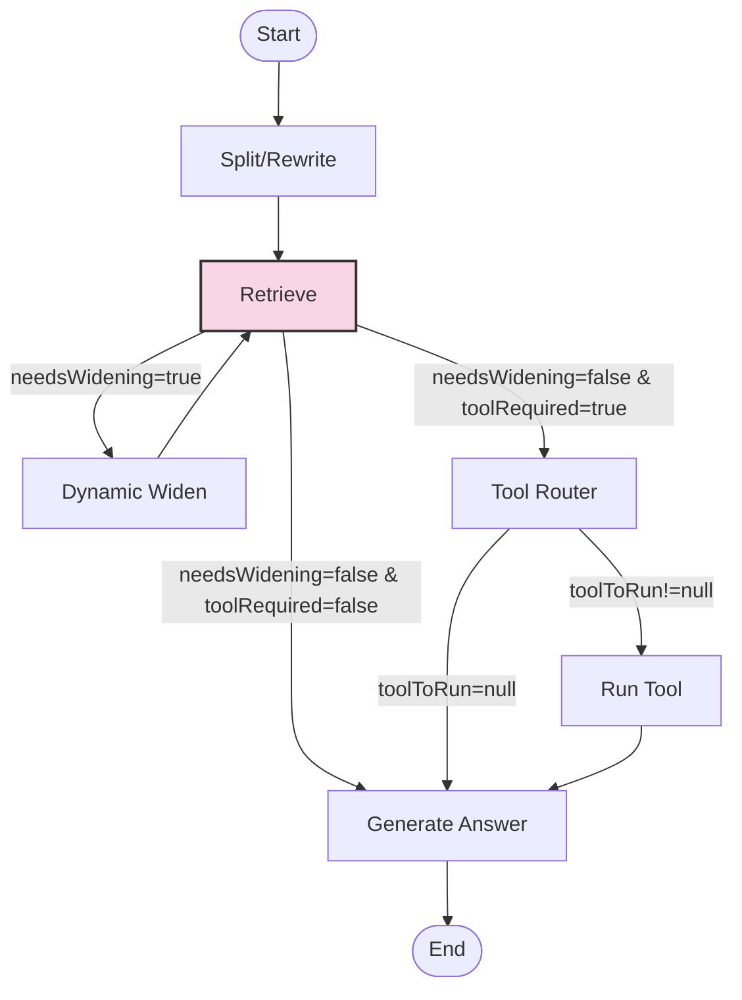

# Chat RAG Graph Node Documentation

This document provides detailed documentation for the nodes in the Chat RAG Graph system, with a particular focus on the retrieve node.

## 1. Graph Architecture Overview

The Chat RAG Graph is a directed graph of specialized processing nodes that work together to analyze user queries, retrieve relevant context, and generate accurate responses. Each node has a specific responsibility and can pass control to different subsequent nodes based on its output.



## 2. Node Responsibilities

### 2.1 Split/Rewrite Node

**Purpose**: Analyzes the user's query and potentially rewrites it to improve retrieval effectiveness.

**Inputs**:
- User messages from the conversation history

**Outputs**:
- Original query extracted from the last user message
- Rewritten query (if applicable)

**Side Effects**:
- Updates state with timing and token count information
- Logs query analysis details

### 2.2 Retrieve Node

**Purpose**: Fetches relevant documents based on the query to provide context for the response.

**Inputs**:
- User ID
- Original or rewritten query
- Configuration options (max context items, etc.)
- Widening attempts count (if applicable)

**Outputs**:
- Retrieved documents with relevance scores
- Flag indicating if search widening is needed
- Updated widening attempts count

**Side Effects**:
- Logs retrieval metrics
- Updates state with timing and token count information
- Records observability data for tracing

**Detailed Implementation**:

The retrieve node is a critical component of the RAG system that fetches relevant documents to enhance the AI's response. Here's how it works:

1. **Initialization**:
   - Creates a search service instance from environment bindings
   - Sets up logging and observability with trace/span IDs
   - Extracts configuration options from state

2. **Query Processing**:
   - Gets the user ID and query from state
   - Logs the query for debugging purposes
   - Determines search parameters based on widening attempts

3. **Search Execution**:
   - Calls the search service with appropriate parameters
   - Logs the number of documents retrieved and their relevance scores
   - Records retrieval metrics for observability

4. **Document Processing**:
   - Calculates token counts for retrieved documents
   - Truncates documents to fit within token limits based on model configuration
   - Ranks and filters documents by relevance score
   - Limits the total number of documents to control token usage

5. **State Management**:
   - Updates state with processed documents
   - Sets flags for search widening if needed
   - Records execution time and token counts
   - Finalizes observability spans

6. **Error Handling**:
   - Catches and logs any errors during retrieval
   - Returns empty document list on error
   - Adds error information to state metadata
   - Ensures observability spans are properly closed

**Key Features**:

- **Dynamic Token Management**: Adjusts document truncation based on model context limits
- **Relevance-Based Filtering**: Ranks and filters documents by relevance score
- **Widening Detection**: Determines if search parameters need to be widened
- **Comprehensive Observability**: Detailed logging and tracing throughout the process
- **Robust Error Handling**: Graceful degradation on failure

**Configuration Parameters**:

The retrieve node's behavior can be configured through several parameters:

- `maxContextItems`: Maximum number of documents to retrieve
- `minRelevance`: Minimum relevance score for documents (adjusted during widening)
- `expandSynonyms`: Whether to expand query with synonyms (enabled during widening)
- `includeRelated`: Whether to include related documents (enabled during widening)
- `maxTokensPerDoc`: Maximum tokens allowed per document
- `maxDocsTokens`: Maximum total tokens for all documents

### 2.3 Dynamic Widen Node

**Purpose**: Adjusts search parameters to improve retrieval results when initial results are insufficient.

**Inputs**:
- Current widening attempts count
- Original and rewritten queries

**Outputs**:
- Incremented widening attempts count
- Updated search parameters

**Side Effects**:
- Logs widening strategy details
- Updates state with timing information

### 2.4 Tool Router Node

**Purpose**: Determines if specialized tools are needed to answer the query and which tool to use.

**Inputs**:
- Required tools list from previous analysis
- Original query

**Outputs**:
- Selected tool to run (if applicable)

**Side Effects**:
- Logs tool selection details
- Updates state with timing information

### 2.5 Run Tool Node

**Purpose**: Executes the selected tool to gather additional information.

**Inputs**:
- Tool name to run
- Original query (for parameter extraction)

**Outputs**:
- Tool execution results
- Error information (if applicable)

**Side Effects**:
- Logs tool execution details
- Updates state with timing information
- May interact with external systems

### 2.6 Generate Answer Node

**Purpose**: Creates the final response using an LLM, incorporating retrieved context and tool results.

**Inputs**:
- User messages
- Retrieved documents
- Tool results (if applicable)
- Configuration options

**Outputs**:
- Generated response text

**Side Effects**:
- Logs generation metrics
- Updates state with timing and token count information
- Records LLM usage metrics

## 3. State Management

The graph uses a shared state object that flows between nodes. Each node can read from and update this state. The state includes:

```typescript
interface AgentState {
  // User information
  userId: string;

  // Conversation history
  messages: Message[];

  // Configuration options
  options: {
    enhanceWithContext: boolean;
    maxContextItems: number;
    includeSourceInfo: boolean;
    maxTokens: number;
    temperature?: number;
    modelId?: string;
  };

  // Intermediate processing data
  tasks?: {
    originalQuery?: string;
    rewrittenQuery?: string;
    requiredTools?: string[];
    toolResults?: ToolResult[];
    needsWidening?: boolean;
    wideningAttempts?: number;
    toolToRun?: string | null;
    queryAnalysis?: QueryAnalysis;
    // Additional fields...
  };

  // Retrieved documents
  docs?: Document[];

  // Generated content
  generatedText?: string;

  // Metadata for tracking and debugging
  metadata?: {
    startTime?: number;
    nodeTimings?: Record<string, number>;
    tokenCounts?: Record<string, number>;
    currentNode?: string;
    isFinalState?: boolean;
    errors?: Array<{
      node: string;
      message: string;
      timestamp: number;
    }>;
    traceId?: string;
    spanId?: string;
    executionTimeMs?: number;
  };
}
```

## 4. Routing Logic

The graph uses conditional routing to determine the flow between nodes:

1. After the **Retrieve** node:
   - If `needsWidening` is true, route to **Dynamic Widen**
   - If a tool is required, route to **Tool Router**
   - Otherwise, route to **Generate Answer**

2. After the **Tool Router** node:
   - If a tool was selected (`toolToRun` is not null), route to **Run Tool**
   - Otherwise, route to **Generate Answer**

3. After **Dynamic Widen**, always return to **Retrieve** with updated parameters

4. After **Run Tool**, always proceed to **Generate Answer**

## 5. Error Handling

Each node implements robust error handling to ensure the graph can continue processing even if individual nodes encounter issues:

1. **Catch and Log**: Errors are caught, logged with detailed context, and added to state metadata
2. **Graceful Degradation**: Nodes provide fallback behavior when possible (e.g., empty document list on retrieval failure)
3. **Error Propagation**: Critical errors that prevent further processing are propagated to the client
4. **Observability**: All errors are recorded with tracing information for debugging

## 6. Observability

The graph includes comprehensive observability features:

1. **Structured Logging**: Detailed logs at each processing step
2. **Timing Metrics**: Execution time recorded for each node
3. **Token Counting**: Token usage tracked throughout the process
4. **Distributed Tracing**: Trace and span IDs for end-to-end request tracking
5. **Event Recording**: Key events recorded for analysis

## 7. Checkpointing

The graph supports state checkpointing to enable:

1. **Resumable Processing**: Long-running conversations can be paused and resumed
2. **Fault Tolerance**: Processing can recover from failures
3. **Debugging**: Intermediate states can be inspected for troubleshooting

## 8. Best Practices for Node Development

When developing new nodes or modifying existing ones:

1. **Single Responsibility**: Each node should have a clear, focused purpose
2. **Comprehensive Logging**: Log inputs, outputs, and key decisions
3. **Error Handling**: Implement robust error handling with fallbacks
4. **Performance Optimization**: Minimize token usage and execution time
5. **Observability**: Include timing, token counting, and tracing
6. **Testing**: Write unit tests for node logic
7. **Documentation**: Document inputs, outputs, and side effects