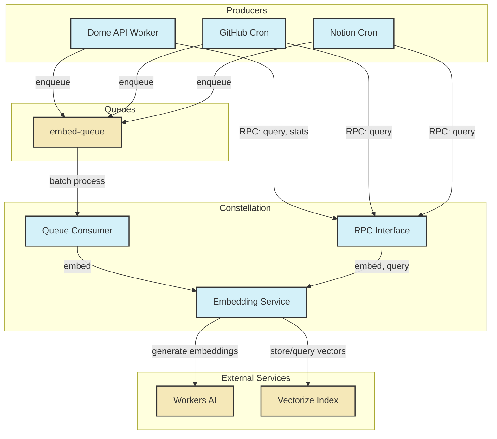
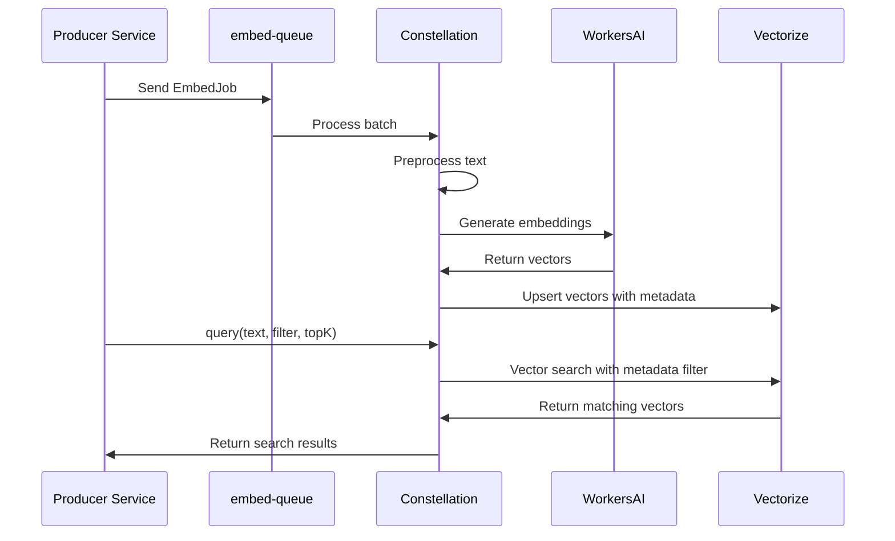

# Constellation Service Documentation

## 1. Service Overview

### Purpose

Constellation is a dedicated Cloudflare Worker that provides asynchronous embedding and vector search capabilities for the Dome application. It serves as a centralized service for generating vector embeddings from text content and performing semantic searches using these embeddings.

### Key Features

- Consumes raw-text jobs from a Workers Queue and converts them into vector embeddings
- Stores embeddings in a Vectorize index with appropriate metadata
- Exposes a typed RPC interface for on-demand embedding, vector search, and statistics
- Processes embedding jobs in batches for optimal throughput
- Supports metadata filtering for targeted vector searches
- Provides a centralized place to evolve the embedding model and metadata schema

### Goals and Non-Goals

|                          | ✅ In Scope                                         | ❌ Out of Scope                                  |
| ------------------------ | --------------------------------------------------- | ------------------------------------------------ |
| **Embedding Generation** | Async, high-throughput ingestion via queue consumer |                                                  |
| **Bulk Processing**      | Bulk back-fills (GitHub repo, Notion export)        |                                                  |
| **API Surface**          | Single RPC surface (`embed`, `query`, `stats`)      |                                                  |
| **Search Filtering**     | Equality-filter search on Vectorize metadata        |                                                  |
| **Advanced Search**      |                                                     | Re-ranking, summarization, hybrid BM25 pipelines |

## 2. Architecture

### High-Level Architecture



### Component Breakdown

#### Queue Consumer

The queue consumer processes batches of embedding jobs from the `embed-queue`. It extracts the text content, preprocesses it, generates embeddings using Workers AI, and stores the resulting vectors in the Vectorize index.

#### RPC Interface

The RPC interface exposes methods for on-demand embedding, vector search, and statistics. This interface is used by other services through Cloudflare service bindings.

#### Embedding Service

The embedding service handles the core functionality of preprocessing text, generating embeddings, and managing the Vectorize index. It's used by both the queue consumer and the RPC interface.

### Integration with Other Services

| Service         | Integration Type  | Purpose                                                                            |
| --------------- | ----------------- | ---------------------------------------------------------------------------------- |
| Dome API        | Service Binding   | Dome API calls Constellation's RPC methods for vector search and embedding         |
| GitHub Ingestor | Service Binding   | GitHub Ingestor calls Constellation's RPC methods for embedding repository content |
| Notion Ingestor | Service Binding   | Notion Ingestor calls Constellation's RPC methods for embedding Notion content     |
| Workers AI      | AI Binding        | Constellation uses Workers AI to generate embeddings                               |
| Vectorize       | Vectorize Binding | Constellation stores and queries vectors in the Vectorize index                    |
| Embed Queue     | Queue Consumer    | Constellation processes embedding jobs from the queue                              |

## 3. Data Model

### Queue Message Format

```typescript
interface EmbedJob {
  userId: string;
  noteId: string;
  text: string; // ≤ 8 kB preferred
  created: number; // ms since epoch
  version: number; // embedding version
}
```

#### Queue Consumer Example

This example uses the `AbstractQueue` pattern so each queue has a thin
wrapper class that handles validation and parsing. Cross-service queues are
exported by the service that produces them so consumers can import them
directly.

```typescript
import { NewContentQueue } from '@dome/silo/queues';
import type { EmbedJob } from '../src/schemas';

export async function enqueueJob(env: Env, job: EmbedJob) {
  const queue = new NewContentQueue(env.EMBED_QUEUE);
  await queue.send(job);
}

export async function processBatch(batch: MessageBatch<unknown>, env: Env) {
  const parsed = NewContentQueue.parseBatch(batch);

  for (const msg of parsed.messages) {
    await env.CONSTELLATION.embed(msg.body);
  }
}
```

### Vector Metadata

```typescript
interface NoteVectorMeta {
  userId: string;
  noteId: string;
  createdAt: number; // s since epoch
  version: number;
}
```

### Vectorize Index Configuration

The Vectorize index is configured with the following metadata indexes:

```bash
wrangler vectorize create-metadata-index notes_index \
  --property-name userId    --type string
wrangler vectorize create-metadata-index notes_index \
  --property-name noteId    --type string
wrangler vectorize create-metadata-index notes_index \
  --property-name version   --type number
```

### Data Flow



## 4. API Reference

### RPC Methods

#### `embed(job)`

**Purpose**: Embed a single note immediately. This is a rare operation, as most embeddings are processed through the queue.

**Parameters**:

```typescript
interface EmbedJob {
  userId: string;
  noteId: string;
  text: string; // ≤ 8 kB preferred
  created: number; // ms since epoch
  version: number; // embedding version
}
```

**Returns**: `Promise<void>`

**Example**:

```typescript
// Embed a single note immediately
await env.CONSTELLATION.embed({
  userId: 'user-123',
  noteId: 'note-456',
  text: 'This is a test note',
  created: Date.now(),
  version: 1,
});
```

**Error Handling**:

- Text too large: Returns error
- AI service unavailable: Returns error with retry information
- Vectorize error: Returns error with details

#### `query(text, filter, topK)`

**Purpose**: Perform a vector/text similarity search with optional metadata filtering.

**Parameters**:

```typescript
// First parameter: text to search for
text: string;

// Second parameter: metadata filter
filter: Partial<NoteVectorMeta>;

// Third parameter: number of results to return
topK?: number; // default: 10
```

**Returns**:

```typescript
interface QueryResult {
  matches: Array<{
    id: string;
    score: number;
    metadata: NoteVectorMeta;
  }>;
}
```

**Example**:

```typescript
// Search for similar notes from a specific user
const results = await env.CONSTELLATION.query(
  'machine learning techniques',
  { userId: 'user-123' },
  5,
);

// Process results
for (const match of results.matches) {
  console.log(`Match: ${match.id}, Score: ${match.score}`);
  console.log(`Note ID: ${match.metadata.noteId}`);
}
```

**Error Handling**:

- Invalid query: Returns validation error
- Vectorize error: Returns error with details

#### `stats()`

**Purpose**: Retrieve lightweight health and statistics information about the Vectorize index.

**Parameters**: None

**Returns**:

```typescript
interface StatsResult {
  vectors: number; // Total number of vectors in the index
  dimension: number; // Dimension of the vectors
}
```

**Example**:

```typescript
// Get index statistics
const stats = await env.CONSTELLATION.stats();
console.log(`Vectors: ${stats.vectors}, Dimension: ${stats.dimension}`);
```

### Error Handling

The Constellation service follows the standard error handling approach defined in the error handling standards document. All errors are returned in a consistent format:

```json
{
  "error": {
    "code": "ERROR_CODE",
    "message": "Human-readable error message",
    "details": {
      // Optional additional information
    }
  }
}
```

Common error codes:

- `VALIDATION_ERROR`: Invalid request parameters
- `AI_SERVICE_ERROR`: Error from Workers AI service
- `VECTORIZE_ERROR`: Error from Vectorize service
- `INTERNAL_ERROR`: Unexpected server error

## 5. Configuration

### Environment Variables

| Variable      | Description            | Required | Default |
| ------------- | ---------------------- | -------- | ------- |
| `LOG_LEVEL`   | Logging level          | No       | `info`  |
| `VERSION`     | Service version        | No       | `1.0.0` |
| `ENVIRONMENT` | Deployment environment | No       | `prod`  |
| `SILO`        | RPC binding to the Silo service           | Yes | - |
| `EMBED_DEAD`  | Dead letter queue for failed embedding jobs | Yes | - |
| `VECTORIZE`   | Vectorize index used for storing embeddings | Yes | - |
| `AI`          | Workers AI binding for embedding generation | Yes | - |

### Wrangler Configuration

```toml
name = "constellation"
main = "src/constellation.ts"

[[queues.consumers]]
queue = "embed-queue"
max_batch_size = 10

vectorize_binding = "VECTORIZE"
ai_binding = "AI"

[vars]
LOG_LEVEL = "info"
VERSION = "1.0.0"
ENVIRONMENT = "prod"
```

### Secrets Management

The Constellation service does not require any secrets for its operation. The Workers AI and Vectorize bindings are managed by Cloudflare and do not require explicit credentials.

## 6. Deployment

### Deployment Process

1. Build the service:

   ```bash
   just build-pkg constellation
   ```

2. Deploy to Cloudflare:

   ```bash
   just deploy-pkg constellation
   ```

3. Configure Vectorize metadata indexes (if not already done):
   ```bash
   wrangler vectorize create-metadata-index notes_index --property-name userId --type string
   wrangler vectorize create-metadata-index notes_index --property-name noteId --type string
   wrangler vectorize create-metadata-index notes_index --property-name version --type number
   ```

### Required Resources

- Cloudflare Workers account with access to:
  - Workers AI
  - Vectorize
  - Workers Queues

### Rollout Strategy

1. **Deploy Constellation Service**: Deploy the service and verify it's operational
2. **Update Producer Services**: Update services to enqueue embedding jobs instead of inline embedding
3. **Replace Direct Vectorize Calls**: Update services to use Constellation's RPC methods instead of direct Vectorize calls
4. **Monitor Queue Depth**: Adjust batch size and concurrency as needed
5. **Remove Legacy Code**: Remove legacy embedding code paths from other services

## 7. Monitoring and Observability

### Key Metrics

| Metric                           | Description                              | Alert Threshold     |
| -------------------------------- | ---------------------------------------- | ------------------- |
| `constellation.embed.count`      | Number of embeddings generated           | N/A (tracking only) |
| `constellation.embed.latency_ms` | Embedding generation latency             | > 1000ms            |
| `constellation.query.count`      | Number of queries performed              | N/A (tracking only) |
| `constellation.query.latency_ms` | Query latency                            | > 500ms             |
| `constellation.queue.depth`      | Queue depth                              | > 1000              |
| `constellation.queue.lag_ms`     | Time between job creation and processing | > 60000ms           |
| `constellation.errors.count`     | Number of errors                         | > 0                 |

Metrics are exported with the `constellation.` prefix. Alert definitions for these
metrics can be found in
[monitoring/alerts.yaml](../../services/constellation/monitoring/alerts.yaml).

### Logging

The Constellation service uses structured logging with the following key events:

- Queue batch processing
- Embedding generation
- Vector search
- Error conditions

Logs are formatted as JSON with consistent fields:

```json
{
  "timestamp": "2025-04-20T22:54:31.123Z",
  "level": "info",
  "service": "constellation",
  "component": "queue",
  "message": "Processed embedding batch",
  "batchSize": 10,
  "processingTimeMs": 850
}
```

### Alerts

- **High Queue Depth**: Alert if the queue depth exceeds a threshold
- **High Queue Lag**: Alert if the time between job creation and processing exceeds a threshold
- **High Error Rate**: Alert if the error rate exceeds a threshold
- **AI Service Errors**: Alert if there are persistent errors from the Workers AI service
- **Vectorize Errors**: Alert if there are persistent errors from the Vectorize service

See the full alert rules in [monitoring/alerts.yaml](../../services/constellation/monitoring/alerts.yaml).

## 8. Troubleshooting

### Common Issues

#### Issue 1: High Queue Depth

**Symptoms**:

- Queue depth increases steadily
- Embedding jobs are processed with significant delay

**Possible Causes**:

- Insufficient queue consumer concurrency
- Workers AI rate limiting
- Vectorize write throughput limitations

**Resolution Steps**:

1. Check the queue consumer logs for errors or warnings
2. Increase the queue consumer concurrency if needed
3. Adjust the batch size to optimize throughput
4. Check for AI service rate limiting and adjust accordingly
5. Monitor Vectorize performance and optimize if needed

#### Issue 2: Embedding Quality Issues

**Symptoms**:

- Poor search results
- Unexpected matches
- Missing expected matches

**Possible Causes**:

- Text preprocessing issues
- Embedding model limitations
- Incorrect metadata filtering

**Resolution Steps**:

1. Check the text preprocessing logic
2. Verify the embedding model is appropriate for the content
3. Test with different query formulations
4. Check metadata filters for correctness
5. Consider adjusting the topK parameter

#### Issue 3: High Latency

**Symptoms**:

- Slow query responses
- Timeouts in calling services

**Possible Causes**:

- Vectorize index size too large
- Complex metadata filters
- Workers AI service latency

**Resolution Steps**:

1. Monitor query latency metrics
2. Optimize metadata filters
3. Consider index partitioning for large datasets
4. Implement caching for frequent queries
5. Adjust timeout settings in calling services

### Debugging Techniques

- **Log Analysis**: Review structured logs for error patterns and performance issues
- **Metrics Inspection**: Check metrics for anomalies in latency, error rates, etc.
- **Test Queries**: Use curl or Postman to make test queries to the API
- **Queue Inspection**: Check queue depths and processing rates in the Cloudflare dashboard
- **Vectorize Dashboard**: Use the Vectorize dashboard to inspect index health and performance

### Recovery Procedures

- **Queue Purging**: In case of persistent queue issues, consider purging and reprocessing
- **Index Rebuilding**: If the Vectorize index becomes corrupted, it may need to be rebuilt
- **Service Rollback**: If a deployment causes issues, roll back to the previous version
- **Batch Reprocessing**: For data quality issues, consider reprocessing affected batches

## 9. Development

### Local Development Setup

1. Install dependencies:

   ```bash
   pnpm install
   ```

2. Set up local Vectorize index:

   ```bash
   wrangler vectorize create notes_index --dimensions 1536
   ```

3. Run the service locally:

   ```bash
   just dev constellation
   ```

4. For queue consumer testing:
   ```bash
   cd services/constellation
   wrangler dev --queue-consumer
   ```
   This command starts the worker in queue-consumer mode so batches from
   `embed-queue` are processed locally.

### Testing

The Constellation service includes comprehensive tests:

- Unit tests for text preprocessing
- Integration tests for embedding generation
- End-to-end tests for the complete embedding and search flow

Run tests with:

```bash
just test-pkg constellation
```

### Common Development Tasks

- **Updating the Embedding Model**: Update the model reference in the embedding service
- **Adding New Metadata Fields**: Add new fields to the metadata schema and create corresponding indexes
- **Optimizing Preprocessing**: Improve the text preprocessing logic for better embedding quality
- **Adding New Query Types**: Implement new query types or filtering options

## 10. References

- [Embedding Service Design](../EMBEDDING_SERVICE.md)
- [Error Handling Standards](../standards/error-handling.md)
- [Logging Standards](../standards/logging.md)
- [Cloudflare Workers AI Documentation](https://developers.cloudflare.com/workers-ai/)
- [Cloudflare Vectorize Documentation](https://developers.cloudflare.com/vectorize/)
- [Cloudflare Queues Documentation](https://developers.cloudflare.com/queues/)
