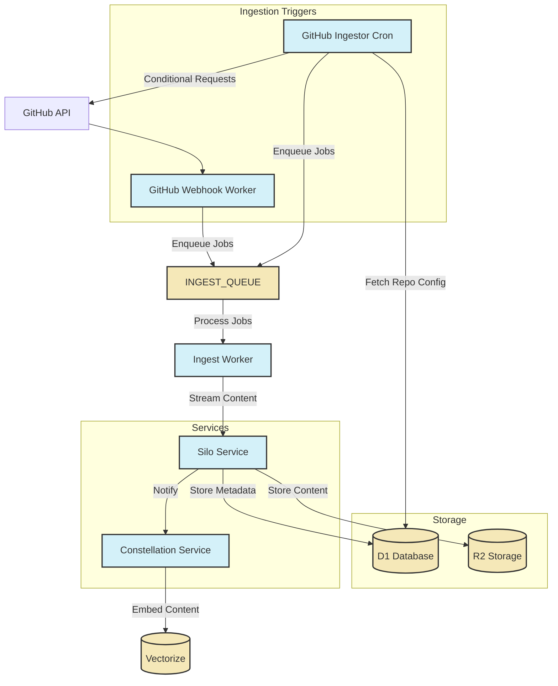
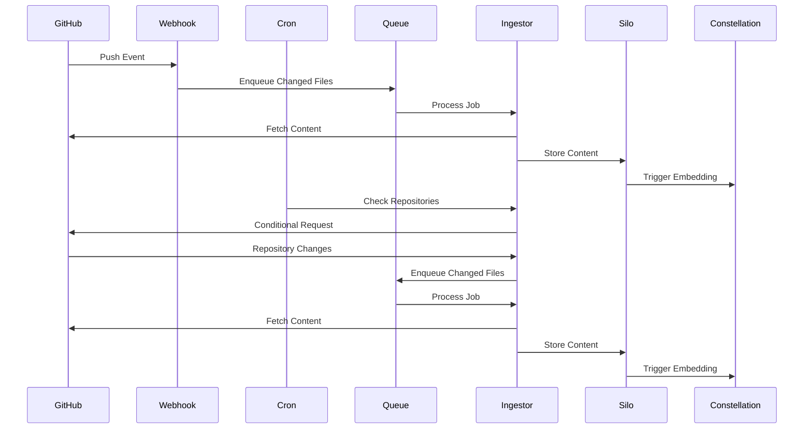

# GitHub Ingestor Service Documentation

## 1. Service Overview

### Purpose

The GitHub Ingestor is a Cloudflare Worker responsible for ingesting code repositories from GitHub, processing them, and storing them in the Silo service. It serves as a critical component in the content ingestion pipeline, enabling efficient and reliable ingestion of code repositories for search and analysis.

### Key Features

- Efficient ingestion of GitHub repositories via webhooks and scheduled fallback
- Processing of repository content to make it suitable for embedding
- Deduplication of content to optimize storage usage
- Streaming and chunking of large repositories to stay within Worker limits
- Proper error handling and retry mechanisms
- Support for both public and private repositories through GitHub App integration

### Goals and Non-Goals

|                         | ✅ In Scope                                                           | ❌ Out of Scope                    |
| ----------------------- | --------------------------------------------------------------------- | ---------------------------------- |
| **Ingestion Triggers**  | Webhook-driven ingestion<br>Scheduled fallback ingestion              | Manual UI for repository selection |
| **Content Processing**  | Code file extraction<br>Metadata extraction<br>Content chunking       | Code analysis and linting          |
| **Storage Integration** | Store content in Silo<br>Trigger embeddings in Constellation          | Direct vector operations           |
| **Repository Types**    | Public repositories<br>Private repositories (via GitHub App)          | Enterprise GitHub instances        |
| **Error Handling**      | Retries with exponential backoff<br>Dead letter queue for failed jobs | Complex recovery workflows         |

## 2. Architecture

### High-Level Architecture



### Component Breakdown

#### Webhook Handler

The webhook handler receives events from GitHub (such as push events) and enqueues jobs for processing. This enables near real-time updates when repositories change.

#### Cron Handler

The cron handler periodically checks for repositories that need to be synced and enqueues jobs for processing. This serves as a fallback for missed webhooks and handles initial repository ingestion.

#### Queue Processor

The queue processor consumes jobs from the ingest queue, fetches content from GitHub, processes it, and stores it in the Silo service.

#### GitHub API Client

The GitHub API client handles communication with the GitHub API, including authentication, rate limiting, and conditional requests.

#### Common Ingestion Contract

The common ingestion contract defines a standard interface for content ingestion, allowing for future expansion to other content sources.

### Integration with Other Services

| Service       | Integration Type | Purpose                                           |
| ------------- | ---------------- | ------------------------------------------------- |
| Silo          | Service Binding  | Store processed content from GitHub repositories  |
| Constellation | Service Binding  | Trigger embedding generation for ingested content |
| GitHub API    | HTTP Client      | Fetch repository content and metadata             |
| D1 Database   | D1 Binding       | Store repository configuration and sync status    |
| Ingest Queue  | Queue Binding    | Process ingestion jobs asynchronously             |

## 3. Data Model

### Database Schema

```sql
-- Main repository configuration table
CREATE TABLE provider_repositories (
  id TEXT PRIMARY KEY,                -- ulid/uuid
  userId TEXT NOT NULL,               -- User who added this repository (NULL for system repos)
  provider TEXT NOT NULL,             -- 'github', 'linear', 'notion'
  owner TEXT NOT NULL,                -- Repository owner/organization
  repo TEXT NOT NULL,                 -- Repository name
  branch TEXT NOT NULL DEFAULT 'main',-- Branch to monitor (GitHub only)
  lastSyncedAt INTEGER,               -- Last successful sync timestamp (epoch seconds)
  lastCommitSha TEXT,                 -- Last processed commit SHA (GitHub only)
  etag TEXT,                          -- ETag for conditional requests
  rateLimitReset INTEGER,             -- When rate limit resets (epoch seconds)
  retryCount INTEGER DEFAULT 0,       -- Number of failed attempts
  nextRetryAt INTEGER,                -- When to retry after failure (epoch seconds)
  isPrivate BOOLEAN NOT NULL DEFAULT false, -- Whether the repo is private
  includePatterns TEXT,               -- JSON array of glob patterns to include (null = all)
  excludePatterns TEXT,               -- JSON array of glob patterns to exclude
  createdAt INTEGER NOT NULL,         -- When this config was created (epoch seconds)
  updatedAt INTEGER NOT NULL,         -- When this config was last updated (epoch seconds)
  UNIQUE (userId, provider, owner, repo) -- Prevent duplicates per user
);

-- Authentication credentials for providers
CREATE TABLE provider_credentials (
  id TEXT PRIMARY KEY,                -- ulid/uuid
  userId TEXT NOT NULL,               -- User who owns these credentials
  provider TEXT NOT NULL,             -- 'github', 'linear', 'notion'
  installationId TEXT,                -- GitHub App installation ID
  accessToken TEXT,                   -- User access token (encrypted)
  refreshToken TEXT,                  -- Refresh token (encrypted)
  tokenExpiry INTEGER,                -- When the token expires (epoch seconds)
  createdAt INTEGER NOT NULL,         -- When these credentials were created (epoch seconds)
  updatedAt INTEGER NOT NULL,         -- When these credentials were last updated (epoch seconds)
  UNIQUE (userId, provider)           -- One credential set per user per provider
);

-- Content blob deduplication table
CREATE TABLE content_blobs (
  sha TEXT PRIMARY KEY,               -- Content SHA-1 hash
  size INTEGER NOT NULL,              -- Content size in bytes
  r2Key TEXT NOT NULL UNIQUE,         -- R2 storage key
  mimeType TEXT NOT NULL,             -- Content MIME type
  createdAt INTEGER NOT NULL          -- When this blob was created (epoch seconds)
);
```

### Key Data Structures

```typescript
// Common ingestion contract
interface ItemMetadata {
  id: string;
  path: string;
  sha: string;
  size: number;
  mimeType: string;
  provider: string;
  repoId: string;
  userId: string | null;
  [key: string]: any; // Additional provider-specific metadata
}

interface ContentItem {
  metadata: ItemMetadata;
  getContent(): Promise<ReadableStream | string>;
}

interface IngestorConfig {
  id: string;
  userId: string | null;
  provider: string;
  [key: string]: any; // Provider-specific configuration
}

interface Ingestor {
  // Get configuration for this ingestor
  getConfig(): IngestorConfig;

  // List all items that need to be ingested
  listItems(): Promise<ItemMetadata[]>;

  // Get content for a specific item
  fetchContent(metadata: ItemMetadata): Promise<ContentItem>;

  // Check if an item has changed since last sync
  hasChanged(metadata: ItemMetadata): Promise<boolean>;

  // Update sync status after successful ingestion
  updateSyncStatus(metadata: ItemMetadata): Promise<void>;
}

// GitHub-specific ingestor configuration
interface GitHubIngestorConfig extends IngestorConfig {
  owner: string;
  repo: string;
  branch: string;
  lastCommitSha?: string;
  etag?: string;
  includePatterns?: string[];
  excludePatterns?: string[];
}
```

### Data Flow



## 4. API Reference

### Webhook Handler

The webhook handler receives events from GitHub and processes them accordingly.

#### Supported Events

| Event Type                  | Description                      | Action                               |
| --------------------------- | -------------------------------- | ------------------------------------ |
| `push`                      | Repository push event            | Enqueue changed files for processing |
| `installation`              | GitHub App installation event    | Store installation credentials       |
| `installation_repositories` | Repository added to installation | Add repository to configuration      |

#### Webhook Verification

The webhook handler verifies the webhook signature using the GitHub webhook secret:

```typescript
// Verify webhook signature
const payload = await request.json();
const signature = request.headers.get('x-hub-signature-256');

if (!signature || !verifyGitHubWebhook(payload, signature, env.GITHUB_WEBHOOK_SECRET)) {
  return new Response('Invalid signature', { status: 401 });
}
```

### Cron Handler

The cron handler runs periodically to check for repositories that need to be synced.

#### Cron Schedule

The cron handler runs every hour by default, as configured in `wrangler.toml`:

```toml
[triggers]
crons = ["0 * * * *"]
```

#### Repository Selection

The cron handler selects repositories for syncing based on the following criteria:

- Repositories that have never been synced
- Repositories that haven't been synced in the last hour
- Repositories that had failed syncs and are due for retry

```sql
SELECT id, userId, owner, repo, branch, lastSyncedAt, lastCommitSha, etag,
       isPrivate, includePatterns, excludePatterns, retryCount
FROM provider_repositories
WHERE provider = 'github'
AND (
  lastSyncedAt IS NULL
  OR lastSyncedAt < ?
  OR (nextRetryAt IS NOT NULL AND nextRetryAt < ?)
)
LIMIT 50
```

### Queue Processor

The queue processor consumes jobs from the ingest queue and processes them.

#### Job Types

| Job Type     | Description                  | Parameters                               |
| ------------ | ---------------------------- | ---------------------------------------- |
| `repository` | Process an entire repository | `repoId`, `owner`, `repo`, `branch`      |
| `file`       | Process a specific file      | `repoId`, `owner`, `repo`, `path`, `sha` |

#### Processing Steps

1. Fetch repository configuration from database
2. Get authentication token (if needed for private repositories)
3. Create appropriate ingestor instance
4. List items to be ingested (or get specific file)
5. For each item:
   a. Check if the item has changed
   b. Fetch content if changed
   c. Store content in Silo
   d. Update sync status

### GitHub API Client

The GitHub API client handles communication with the GitHub API.

#### Key Methods

| Method           | Purpose                | Parameters                          |
| ---------------- | ---------------------- | ----------------------------------- |
| `getRepository`  | Get repository details | `owner`, `repo`                     |
| `getCommit`      | Get commit details     | `owner`, `repo`, `ref`              |
| `getTree`        | Get repository tree    | `owner`, `repo`, `sha`, `recursive` |
| `getBlob`        | Get file blob          | `owner`, `repo`, `sha`              |
| `compareCommits` | Compare commits        | `owner`, `repo`, `base`, `head`     |

#### Authentication

The GitHub API client supports multiple authentication methods:

- GitHub App installation tokens for private repositories
- Personal access tokens for user-specific access
- No authentication for public repositories (with rate limiting)

#### Rate Limiting

The GitHub API client handles rate limiting by:

- Tracking rate limit information from API responses
- Backing off when rate limits are reached
- Storing rate limit reset times in the database
- Using conditional requests with ETags to reduce API usage

## 5. Configuration

### Environment Variables

| Variable                | Description                      | Required | Default |
| ----------------------- | -------------------------------- | -------- | ------- |
| `GITHUB_APP_ID`         | GitHub App ID for authentication | Yes      | -       |
| `GITHUB_PRIVATE_KEY`    | GitHub App private key           | Yes      | -       |
| `GITHUB_WEBHOOK_SECRET` | Secret for webhook verification  | Yes      | -       |
| `GITHUB_TOKEN`          | Service account token (fallback) | No       | -       |
| `LOG_LEVEL`             | Logging level                    | No       | `info`  |
| `VERSION`               | Service version                  | No       | `1.0.0` |
| `ENVIRONMENT`           | Deployment environment           | No       | `prod`  |

### Wrangler Configuration

```toml
name = "github-ingestor"
main = "src/index.ts"
compatibility_date = "2023-10-30"

# Trigger the worker every hour as fallback
[triggers]
crons = ["0 * * * *"]

# D1 Database
[[d1_databases]]
binding = "DB"
database_name = "github-ingestor"
database_id = "your-database-id"

# Service bindings
[[services]]
binding = "SILO"
service = "silo"
environment = "production"

# Queues
[[queues.producers]]
binding = "INGEST_QUEUE"
queue = "ingest-queue"

[[queues.consumers]]
binding = "INGEST_QUEUE"
queue = "ingest-queue"
max_batch_size = 10
max_batch_timeout = 30
max_retries = 5

[[queues.producers]]
binding = "DEAD_LETTER_QUEUE"
queue = "ingest-dead-letter"

# Environment variables
[vars]
LOG_LEVEL = "info"
VERSION = "1.0.0"
ENVIRONMENT = "prod"
```

### Secrets Management

The GitHub Ingestor service requires the following secrets:

- `GITHUB_APP_ID`: The ID of the GitHub App
- `GITHUB_PRIVATE_KEY`: The private key of the GitHub App
- `GITHUB_WEBHOOK_SECRET`: The secret used to verify webhook signatures
- `GITHUB_TOKEN`: A service account token for fallback authentication

These secrets should be set using Wrangler secrets:

```bash
wrangler secret put GITHUB_APP_ID
wrangler secret put GITHUB_PRIVATE_KEY
wrangler secret put GITHUB_WEBHOOK_SECRET
wrangler secret put GITHUB_TOKEN
```

## 6. Deployment

### Deployment Process

1. Build the service:

   ```bash
   just build-pkg github-ingestor
   ```

2. Deploy to Cloudflare:

   ```bash
   just deploy-pkg github-ingestor
   ```

3. Apply database migrations:

   ```bash
   just db-migrate-prod github-ingestor
   ```

4. Configure GitHub App:
   - Create a GitHub App with the required permissions
   - Generate a private key
   - Configure the webhook URL to point to the deployed worker
   - Set the webhook secret

### Required Resources

- Cloudflare Workers account with access to:
  - D1 database
  - Workers Queues
  - Service bindings
- GitHub account with permission to create GitHub Apps

### Rollout Strategy

1. **Deploy Infrastructure**: Set up D1 database, queues, and service bindings
2. **Deploy Worker**: Deploy the GitHub Ingestor worker
3. **Configure GitHub App**: Create and configure the GitHub App
4. **Test with Public Repositories**: Verify functionality with public repositories
5. **Enable Private Repository Access**: Install the GitHub App on private repositories
6. **Monitor and Scale**: Monitor performance and adjust configuration as needed

## 7. Monitoring and Observability

### Key Metrics

| Metric                     | Description                              | Alert Threshold     |
| -------------------------- | ---------------------------------------- | ------------------- |
| `github.webhook.count`     | Number of webhook events received        | N/A (tracking only) |
| `github.webhook.errors`    | Number of webhook processing errors      | > 0                 |
| `github.cron.repositories` | Number of repositories processed by cron | N/A (tracking only) |
| `github.cron.errors`       | Number of cron processing errors         | > 0                 |
| `github.queue.depth`       | Queue depth                              | > 1000              |
| `github.queue.errors`      | Queue processing errors                  | > 0                 |
| `github.api.rate_limit`    | GitHub API rate limit remaining          | < 100               |
| `github.api.errors`        | GitHub API errors                        | > 10                |
| `github.content.bytes`     | Total bytes processed                    | N/A (tracking only) |
| `github.content.files`     | Total files processed                    | N/A (tracking only) |

### Logging

The GitHub Ingestor service uses structured logging with the following key events:

- Webhook event reception and processing
- Cron job execution
- Queue job processing
- GitHub API interactions
- Content processing and storage
- Error conditions

Logs are formatted as JSON with consistent fields:

```json
{
  "timestamp": "2025-04-20T22:54:31.123Z",
  "level": "info",
  "service": "github-ingestor",
  "component": "webhook",
  "message": "Processed push event",
  "owner": "example-org",
  "repo": "example-repo",
  "commitSha": "abc123",
  "filesChanged": 5
}
```

### Alerts

- **Webhook Errors**: Alert if webhook processing errors occur
- **Cron Errors**: Alert if cron job errors occur
- **Queue Depth**: Alert if queue depth exceeds threshold
- **API Rate Limiting**: Alert if API rate limits are consistently being hit
- **Processing Errors**: Alert if content processing errors exceed threshold

## 8. Troubleshooting

### Common Issues

#### Issue 1: Webhook Events Not Being Processed

**Symptoms**:

- Webhook events are sent by GitHub but not processed
- No logs for webhook events
- Repository changes not being ingested

**Possible Causes**:

- Webhook URL misconfiguration
- Webhook signature verification failure
- GitHub App permissions issues

**Resolution Steps**:

1. Verify the webhook URL in the GitHub App settings
2. Check that the webhook secret is correctly set
3. Verify the GitHub App has the required permissions
4. Check the worker logs for any errors
5. Test with a manual repository dispatch event

#### Issue 2: Rate Limiting Issues

**Symptoms**:

- Increased error rates for GitHub API calls
- Slow or incomplete repository processing
- Rate limit exceeded errors in logs

**Possible Causes**:

- Too many repositories being processed simultaneously
- Inefficient API usage (not using conditional requests)
- GitHub API rate limits too low for the workload

**Resolution Steps**:

1. Implement or improve conditional requests with ETags
2. Reduce the number of repositories processed in parallel
3. Optimize API usage to reduce the number of calls
4. Consider upgrading GitHub plan for higher rate limits
5. Implement more aggressive backoff strategies

#### Issue 3: Large Repository Processing Failures

**Symptoms**:

- Large repositories fail to process completely
- Worker timeouts or memory errors
- Incomplete content in Silo

**Possible Causes**:

- Worker CPU time limits exceeded
- Worker memory limits exceeded
- Too many files being processed at once

**Resolution Steps**:

1. Implement chunking for large repositories
2. Process repositories in smaller batches
3. Implement proper yielding between operations
4. Use streaming for large file content
5. Optimize memory usage in the worker

### Debugging Techniques

- **Log Analysis**: Review structured logs for error patterns
- **Metrics Inspection**: Check metrics for anomalies in processing rates, error rates, etc.
- **Queue Inspection**: Check queue depths and processing rates in the Cloudflare dashboard
- **Manual API Testing**: Use curl or Postman to test GitHub API endpoints directly
- **Webhook Testing**: Use GitHub's webhook delivery replay feature to test webhook processing

### Recovery Procedures

- **Queue Reprocessing**: If queue processing fails, messages can be retried automatically or manually
- **Repository Resyncing**: Force a full resync of a repository by clearing its sync status
- **Dead Letter Processing**: Process failed jobs from the dead letter queue
- **Service Rollback**: If a deployment causes issues, roll back to the previous version

## 9. Development

### Local Development Setup

1. Install dependencies:

   ```bash
   pnpm install
   ```

2. Set up local D1 database:

   ```bash
   just db-migrate-local github-ingestor
   ```

3. Run the service locally:

   ```bash
   just dev github-ingestor
   ```

4. For webhook testing, use a tool like ngrok to expose your local server:

   ```bash
   ngrok http 8787
   ```

5. For queue consumer testing:
   ```bash
   wrangler dev --queue-consumer
   ```

### Testing

The GitHub Ingestor service includes comprehensive tests:

- Unit tests for individual components
- Integration tests for GitHub API client
- End-to-end tests for the complete ingestion flow

Run tests with:

```bash
just test-pkg github-ingestor
```

### Common Development Tasks

- **Adding Support for New File Types**: Update the file type detection and processing logic
- **Improving Content Chunking**: Enhance the content chunking algorithm for better embedding results
- **Adding New Webhook Events**: Implement handlers for additional GitHub webhook events
- **Optimizing API Usage**: Improve conditional requests and rate limit handling

## 10. References

- [GitHub Ingestor Design](../GITHUB_INGESTOR_DESIGN.md)
- [GitHub Ingestor Implementation Plan](../GITHUB_INGESTOR_IMPLEMENTATION_PLAN.md)
- [Error Handling Standards](../standards/error-handling.md)
- [Logging Standards](../standards/logging.md)
- [GitHub API Documentation](https://docs.github.com/en/rest)
- [GitHub Webhooks Documentation](https://docs.github.com/en/developers/webhooks-and-events/webhooks)
- [GitHub Apps Documentation](https://docs.github.com/en/developers/apps)
