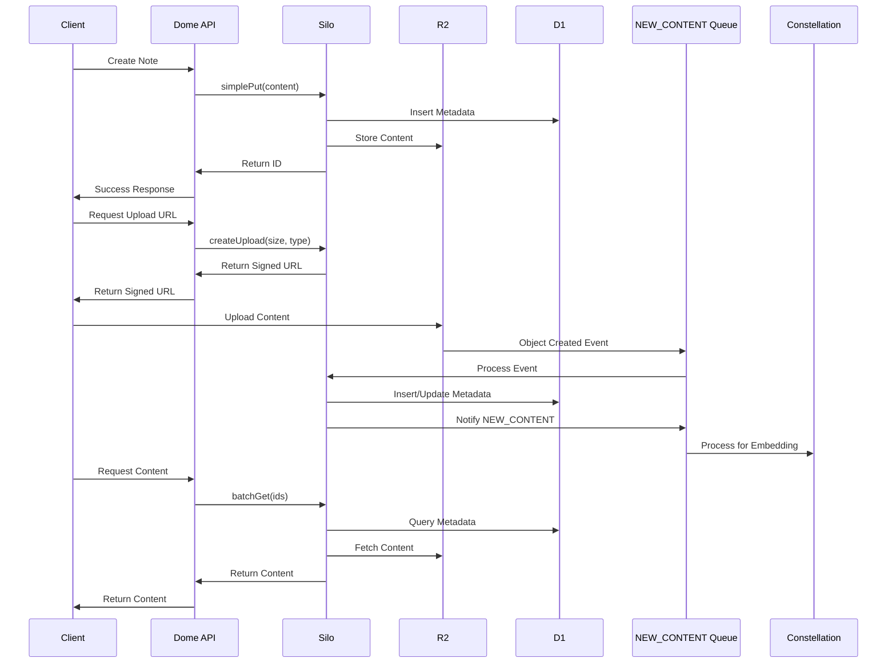

# Silo Service Documentation

## 1. Service Overview

### Purpose

Silo is a unified content storage worker designed to ingest, catalog, and serve user-generated and public content. It acts as a centralized storage layer for the Dome application, providing efficient and reliable content storage and retrieval capabilities.

### Key Features

- Persists content bodies (≤ 100 MiB) in R2 and metadata in D1
- Supports multiple content kinds (`note`, `code`, `article`, etc.)
- Provides multiple upload paths (small sync API, direct-to-R2 POST, async bulk via queue)
- Enables event-driven updates to downstream services like Constellation (for embeddings)
- Offers fast batch reads for RAG operations
- Implements content deduplication for storage efficiency

### Goals and Non-Goals

|                          | ✅ In Scope                                                                                         | ❌ Out of Scope                                       |
| ------------------------ | --------------------------------------------------------------------------------------------------- | ----------------------------------------------------- |
| **Content Storage**      | Persist content bodies (≤ 100 MiB) in R2 and metadata in D1                                         |                                                       |
| **Content Types**        | Multiple content kinds (`note`, `code`, `article`, etc.)                                            | Fine-grained ACL (handled by Dome-Auth)               |
| **Upload Paths**         | Small sync API (`simplePut`)<br>Signed direct-to-R2 POST (browser)<br>Async bulk via `INGEST_QUEUE` | Client-side resumable multipart UI                    |
| **Event-driven Updates** | Notifications to Constellation (embeddings)                                                         | Legacy `EMBED_QUEUE`                                  |
| **Content Retrieval**    | Fast batch reads for RAG (`/batchGet`)                                                              | Complex full-text search (delegated to Constellation) |

## 2. Architecture

### High-Level Architecture

```mermaid
graph TD
  subgraph Client
    A1[User / Browser] -- small note -->|simplePut| G(Dome‑API)
    A2 -- big file -->|pre‑signed form<br>PUT /r2| R2[(Bucket)]
  end

  subgraph Gateway
    G -- auth+rate‑limit --> SiloHTTP[/Silo · RPC bridge/]
  end

  subgraph Silo
    SiloHTTP -- write D1 · sign form --> D1[(SQLite)] & R2
    R2 -- object-create --> OCQ[CONTENT_EVENTS queue]
    OCQ -- worker.consume --> OCW(ObjectCreated handler)
    OCW -->|INSERT| D1
    OCW -->|send| FanOutQ[NEW_CONTENT queue]
  end

  subgraph Constellation
    FanOutQ --> Embeder
    D1 <--> Embeder
  end

  classDef res fill:#f5f5f5,stroke:#bbb;
  class A1,A2,G,SiloHTTP,OCW,Embeder res
```

### Component Breakdown

#### RPC Interface

The Silo service exposes a typed RPC interface through Cloudflare service bindings. This interface is used by the Dome API service to store and retrieve content.

#### Content Storage

Content bodies are stored in R2, while metadata is stored in D1. This separation allows for efficient storage of large content items while maintaining fast queries on metadata.

#### Queue Consumer

The Silo service includes a queue consumer that processes object-created events from R2. This ensures that all content uploaded directly to R2 is properly cataloged in D1.

#### Event Notification

When new content is created or updated, Silo sends notifications to downstream services (like Constellation) through a fan-out queue. This enables event-driven processing of content.

### Integration with Other Services

| Service         | Integration Type | Purpose                                                             |
| --------------- | ---------------- | ------------------------------------------------------------------- |
| Dome API        | Service Binding  | Dome API calls Silo's RPC methods to store and retrieve content     |
| Constellation   | Queue            | Silo notifies Constellation of new content for embedding generation |
| GitHub Ingestor | Service Binding  | GitHub Ingestor uses Silo to store repository content               |
| Notion Ingestor | Service Binding  | Notion Ingestor uses Silo to store Notion content                   |

## 3. Data Model

### Database Schema

```sql
CREATE TABLE contents (
  id          TEXT PRIMARY KEY,      -- ulid / uuid
  userId      TEXT,                  -- NULL for public objects
  contentType TEXT NOT NULL,         -- 'note'|'code'|'article'…
  size        INTEGER NOT NULL,
  r2Key       TEXT NOT NULL UNIQUE,
  sha256      TEXT,                  -- optional integrity / de‑dup
  createdAt   INTEGER NOT NULL,      -- epoch s
  version     INTEGER DEFAULT 1
);
CREATE INDEX idx_contents_userId        ON contents(userId);
CREATE INDEX idx_contents_contentType   ON contents(contentType);
CREATE INDEX idx_contents_createdAt     ON contents(createdAt);
```

### Key Data Structures

```typescript
// Content item metadata
interface ContentMetadata {
  id: string;
  userId: string | null;
  contentType: 'note' | 'code' | 'article' | string;
  size: number;
  r2Key: string;
  sha256?: string;
  createdAt: number;
  version: number;
}

// SimplePut request
interface SimplePutRequest {
  id?: string;
  contentType?: 'note' | 'code' | 'text/plain';
  content: string | ArrayBuffer;
  userId?: string;
  metadata?: Record<string, any>;
}

// CreateUpload request
interface CreateUploadRequest {
  contentType?: 'note' | 'code' | 'text/plain';
  size: number;
  metadata?: Record<string, any>;
  expirationSeconds?: number;
  sha256?: string;
  userId?: string;
}

// BatchGet request
interface BatchGetRequest {
  ids: string[];
  userId?: string;
}
```

### Data Flow



## 4. API Reference

### RPC Methods

#### `simplePut(params)`

**Purpose**: Synchronously store a small content item (≤ 1 MiB) in R2 and metadata in D1.

**Parameters**:

```typescript
interface SimplePutParams {
  id?: string; // Optional ID (generated if not provided)
  contentType?: 'note' | 'code' | 'text/plain'; // Default: 'note'
  content: string | ArrayBuffer; // Content to store (≤ 1 MiB)
  userId?: string; // User ID (from auth context if not provided)
  metadata?: Record<string, any>; // Optional additional metadata
}
```

**Returns**:

```typescript
interface SimplePutResult {
  id: string; // The ID of the stored content
}
```

**Example**:

```typescript
// Store a simple note
const result = await env.SILO.simplePut({
  content: 'This is a test note',
  contentType: 'note',
});
console.log(`Stored note with ID: ${result.id}`);
```

**Error Handling**:

- Content too large (> 1 MiB): Returns 400 error
- Invalid content type: Returns 400 error
- Storage failure: Returns 500 error

#### `createUpload(params)`

**Purpose**: Generate a pre-signed POST policy for direct browser-to-R2 uploads of large content.

**Parameters**:

```typescript
interface CreateUploadParams {
  contentType?: 'note' | 'code' | 'text/plain'; // Default: 'note'
  size: number; // Expected content size in bytes
  metadata?: Record<string, any>; // Optional additional metadata
  expirationSeconds?: number; // URL expiration time (default: 900s)
  sha256?: string; // Optional content hash for integrity check
  userId?: string; // User ID (from auth context if not provided)
}
```

**Returns**:

```typescript
interface CreateUploadResult {
  id: string; // Generated content ID
  uploadUrl: string; // Pre-signed POST URL
  formData: Record<string, string>; // Form fields to include in the POST
}
```

**Example**:

```typescript
// Create an upload URL for a large file
const result = await env.SILO.createUpload({
  contentType: 'code',
  size: 5 * 1024 * 1024, // 5 MiB
});

// Client-side usage of the result
const formData = new FormData();
Object.entries(result.formData).forEach(([key, value]) => {
  formData.append(key, value);
});
formData.append('file', fileBlob);

await fetch(result.uploadUrl, {
  method: 'POST',
  body: formData,
});
```

**Error Handling**:

- Invalid size (≤ 0 or > 100 MiB): Returns 400 error
- Invalid content type: Returns 400 error
- R2 policy creation failure: Returns 500 error

#### `batchGet(params)`

**Purpose**: Efficiently retrieve multiple content items in a single request.

**Parameters**:

```typescript
interface BatchGetParams {
  ids: string[]; // Array of content IDs to retrieve
  userId?: string; // User ID for access control
}
```

**Returns**:

```typescript
interface BatchGetResult {
  [id: string]: {
    id: string;
    userId: string | null;
    contentType: string;
    size: number;
    createdAt: number;
    body?: string; // Content body (for small items)
    url?: string; // Pre-signed URL (for large items)
  };
}
```

**Example**:

```typescript
// Retrieve multiple content items
const result = await env.SILO.batchGet({
  ids: ['id1', 'id2', 'id3'],
});

// Process the results
for (const [id, content] of Object.entries(result)) {
  if (content.body) {
    console.log(`Content ${id}: ${content.body}`);
  } else if (content.url) {
    console.log(`Large content ${id} available at: ${content.url}`);
  }
}
```

**Error Handling**:

- Invalid IDs: Returns 400 error
- Access denied: Silently excludes unauthorized content
- Content not found: Silently excludes missing content

#### `delete(params)`

**Purpose**: Delete a content item and its metadata.

**Parameters**:

```typescript
interface DeleteParams {
  id: string; // ID of the content to delete
  userId?: string; // User ID for access control
}
```

**Returns**:

```typescript
interface DeleteResult {
  success: boolean;
}
```

**Example**:

```typescript
// Delete a content item
const result = await env.SILO.delete({
  id: 'content-id-to-delete',
});

if (result.success) {
  console.log('Content deleted successfully');
}
```

**Error Handling**:

- Content not found: Returns 404 error
- Access denied: Returns 403 error
- Deletion failure: Returns 500 error

#### `stats()`

**Purpose**: Retrieve storage statistics for the Silo service.

**Parameters**: None

**Returns**:

```typescript
interface StatsResult {
  contentCount: number; // Total number of content items
  totalBytes: number; // Total storage used in bytes
  contentTypes: {
    // Breakdown by content type
    [type: string]: {
      count: number;
      bytes: number;
    };
  };
}
```

**Example**:

```typescript
// Get storage statistics
const stats = await env.SILO.stats();
console.log(`Total content: ${stats.contentCount} items, ${stats.totalBytes} bytes`);
```

### Error Handling

The Silo service follows the standard error handling approach defined in the error handling standards document. All errors are returned in a consistent format:

```json
{
  "error": {
    "code": "ERROR_CODE",
    "message": "Human-readable error message",
    "details": {
      // Optional additional information
    }
  }
}
```

Common error codes:

- `VALIDATION_ERROR`: Invalid request parameters
- `NOT_FOUND`: Content not found
- `FORBIDDEN`: Access denied
- `INTERNAL_ERROR`: Unexpected server error

## 5. Configuration

### Environment Variables

| Variable      | Description            | Required | Default |
| ------------- | ---------------------- | -------- | ------- |
| `LOG_LEVEL`   | Logging level          | No       | `info`  |
| `VERSION`     | Service version        | No       | `1.0.0` |
| `ENVIRONMENT` | Deployment environment | No       | `prod`  |

### Wrangler Configuration

```toml
name = "silo"
main = "src/index.ts"

[[kv_namespaces]]
binding = "CACHE"
id = "..."

[[r2_buckets]]
binding = "BUCKET"
bucket_name = "silo-content"

[[d1_databases]]
binding = "DB"
database_name = "silo"

[[queues.producers]]
binding = "NEW_CONTENT"
queue = "new-content"

[[queues.consumers]]
binding = "CONTENT_EVENTS"
queue = "content-events"

[vars]
LOG_LEVEL = "info"
VERSION = "1.0.0"
ENVIRONMENT = "prod"
```

### Secrets Management

The Silo service does not require any secrets for its operation. Authentication and authorization are handled by the Dome API service, which passes the authenticated user ID to Silo.

## 6. Deployment

### Deployment Process

1. Build the service:

   ```bash
   just build-pkg silo
   ```

2. Deploy to Cloudflare:

   ```bash
   just deploy-pkg silo
   ```

3. Apply database migrations:
   ```bash
   just db-migrate-prod silo
   ```

### Required Resources

- Cloudflare Workers account with access to:
  - D1 database
  - R2 bucket
  - Workers Queues
  - KV namespace (optional, for caching)

### Rollout Strategy

1. **Create Resources**: Set up the required R2 bucket, D1 database, and queues.
2. **Add R2 Notification Rule**: Configure R2 to send object-created events to the content-events queue.
3. **Deploy Silo Worker**: Deploy the Silo worker with feature flags if needed.
4. **Update Dome API**: Update the Dome API service to route content operations to Silo.
5. **Migrate Existing Content**: If needed, migrate existing content to the new storage system.
6. **Enable Direct Upload UI**: Once the basic functionality is verified, enable the browser direct upload UI.
7. **Monitor and Optimize**: Monitor performance and make adjustments as needed.

## 7. Monitoring and Observability

### Key Metrics

| Metric                     | Description             | Alert Threshold     |
| -------------------------- | ----------------------- | ------------------- |
| `silo.upload.bytes`        | Total bytes uploaded    | N/A (tracking only) |
| `silo.db.write.latency_ms` | Database write latency  | > 500ms             |
| `silo.queue.batch_size`    | Queue batch size        | N/A (tracking only) |
| `silo.queue.errors`        | Queue processing errors | > 0                 |
| `silo.r2.get.latency_ms`   | R2 read latency         | > 1000ms            |

### Logging

The Silo service uses structured logging with the following key events:

- Content creation/update
- Upload URL generation
- Content retrieval
- Queue processing
- Error conditions

Logs are formatted as JSON with consistent fields:

```json
{
  "timestamp": "2025-04-20T22:54:31.123Z",
  "level": "info",
  "service": "silo",
  "component": "rpc",
  "message": "Content stored successfully",
  "contentId": "01F8Z6ARNVT4SSRRF3J1XKHRPG",
  "contentType": "note",
  "size": 1024,
  "userId": "user_01F8Z6ARNVT4SSRRF3J1XKHRPG"
}
```

### Alerts

- **High Error Rate**: Alert if the error rate exceeds a threshold
- **Queue Depth**: Alert if the queue depth grows beyond a threshold
- **Latency Spikes**: Alert if latency metrics exceed thresholds
- **Storage Growth**: Alert if storage usage grows abnormally fast

## 8. Troubleshooting

### Common Issues

#### Issue 1: Content Not Found After Upload

**Symptoms**:

- Content is not found when trying to retrieve it shortly after upload
- No error is returned from the upload operation

**Possible Causes**:

- Queue processing delay for direct uploads
- Database write failure
- R2 object-created event not triggered

**Resolution Steps**:

1. Check the queue consumer logs for errors
2. Verify that the content exists in R2 using the Cloudflare dashboard
3. Check that the R2 notification rule is properly configured
4. Retry the retrieval after a short delay

#### Issue 2: Large Upload Failures

**Symptoms**:

- Direct uploads of large files fail
- Browser console shows CORS errors or HTTP 403 errors

**Possible Causes**:

- Pre-signed URL expired
- Form data not correctly formatted
- CORS not properly configured on R2 bucket
- File size exceeds the limit specified in the pre-signed policy

**Resolution Steps**:

1. Check that the upload is initiated within the expiration time (default 15 minutes)
2. Verify that all required form fields are included in the upload
3. Check R2 bucket CORS configuration
4. Verify that the actual file size matches the size specified in the createUpload request

#### Issue 3: Queue Processing Errors

**Symptoms**:

- Content metadata missing in D1
- Downstream services not receiving content notifications

**Possible Causes**:

- Queue consumer errors
- Database connection issues
- Malformed queue messages

**Resolution Steps**:

1. Check the queue consumer logs for errors
2. Verify D1 database connectivity
3. Check for queue backlog in the Cloudflare dashboard
4. Manually trigger reprocessing if needed

### Debugging Techniques

- **Log Analysis**: Review structured logs for error patterns
- **Metrics Inspection**: Check metrics for anomalies in latency, error rates, etc.
- **Direct R2/D1 Inspection**: Use the Cloudflare dashboard to directly inspect storage
- **Test Requests**: Use curl or Postman to make test requests to the API
- **Queue Inspection**: Check queue depths and processing rates in the Cloudflare dashboard

### Recovery Procedures

- **Queue Reprocessing**: If queue processing fails, messages can be retried automatically or manually
- **Database Restoration**: If D1 data is corrupted, it can be restored from backups
- **Content Reindexing**: If metadata and content get out of sync, a reindexing job can be run
- **Service Rollback**: If a deployment causes issues, roll back to the previous version

## 9. Development

### Local Development Setup

1. Install dependencies:

   ```bash
   pnpm install
   ```

2. Set up local D1 database:

   ```bash
   just db-migrate-local silo
   ```

3. Run the service locally:
   ```bash
   just dev silo
   ```

### Testing

The Silo service includes comprehensive tests:

- Unit tests for individual components
- Integration tests for the RPC interface
- End-to-end tests for the complete content lifecycle

Run tests with:

```bash
just test-pkg silo
```

### Common Development Tasks

- **Adding a New RPC Method**: Add the method to the worker class and implement the handler
- **Modifying the Database Schema**: Create a new migration in the migrations directory
- **Adding a New Content Type**: Update the content type enum and validation logic
- **Optimizing Performance**: Add caching for frequently accessed content

## 10. References

- [Silo Implementation Plan](../SILO_IMPLEMENTATION_PLAN.md)
- [Error Handling Standards](../standards/error-handling.md)
- [Logging Standards](../standards/logging.md)
- [Cloudflare R2 Documentation](https://developers.cloudflare.com/r2/)
- [Cloudflare D1 Documentation](https://developers.cloudflare.com/d1/)
- [Cloudflare Queues Documentation](https://developers.cloudflare.com/queues/)
