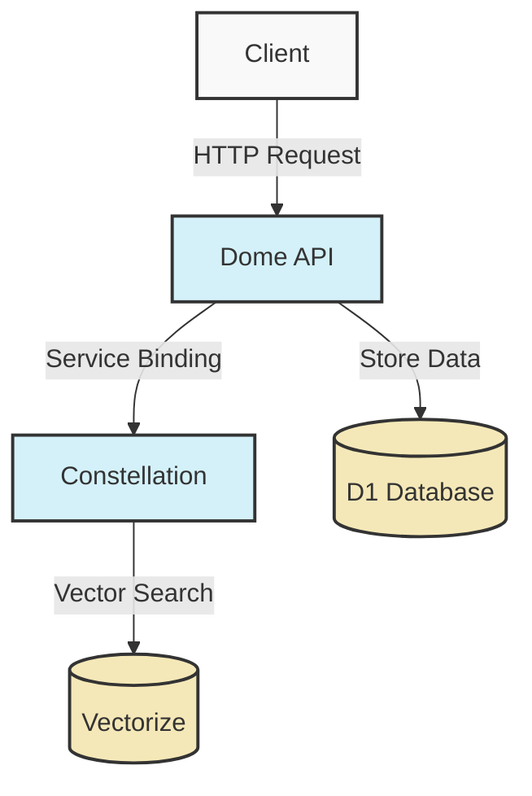

# Documentation Style Guide

This document defines the standards and best practices for documentation across the Dome project. Following these guidelines ensures consistent, comprehensive, and maintainable documentation.

## 1. Purpose and Scope

### Purpose

The purpose of this style guide is to establish consistent standards for all documentation in the Dome project. Well-structured documentation helps developers understand the system, reduces onboarding time, and serves as a reliable reference for both current and future team members.

### Scope

This style guide applies to all documentation in the Dome project, including:

- Architecture documentation
- Service documentation
- API documentation
- Developer guides
- Operational guides
- Standards and templates

## 2. Documentation Structure

The Dome project documentation is organized into the following structure:

```
docs/
├── architecture/         # System architecture documentation
│   ├── overview.md       # High-level architecture overview
│   ├── data-flow.md      # Data flow diagrams and explanations
│   └── design-decisions.md # Key design decisions and rationales
├── services/             # Service-specific documentation
│   ├── silo.md           # Silo service documentation
│   ├── constellation.md  # Constellation service documentation
│   ├── github-ingestor.md # GitHub Ingestor service documentation
│   └── dome-api.md       # Dome API service documentation
├── api/                  # API documentation
│   ├── standards.md      # API documentation standards
│   ├── dome-api/         # Dome API OpenAPI specifications
│   ├── silo/             # Silo API OpenAPI specifications
│   └── constellation/    # Constellation API OpenAPI specifications
├── guides/               # Developer guides
│   ├── setup.md          # Setup guide
│   ├── development-workflow.md # Development workflow guide
│   ├── testing.md        # Testing guide
│   └── deployment.md     # Deployment guide
├── operations/           # Operational guides
│   ├── monitoring.md     # Monitoring guide
│   └── error-handling.md # Error handling guide
├── standards/            # Standards documentation
│   ├── documentation.md  # This document
│   ├── error-handling.md # Error handling standards
│   ├── logging.md        # Logging standards
│   └── api.md            # API standards
└── templates/            # Documentation templates
    ├── service-documentation.md # Service documentation template
    └── api-documentation.md     # API documentation template
```

## 3. Writing Style

### General Guidelines

- **Be clear and concise**: Use simple, direct language. Avoid unnecessary words.
- **Use present tense**: Write in present tense rather than future or past tense.
- **Use active voice**: Use active voice instead of passive voice whenever possible.
- **Be consistent**: Use consistent terminology throughout the documentation.
- **Avoid jargon**: Explain technical terms and acronyms when they are first used.
- **Use second person**: Address the reader directly using "you" rather than "the user" or "the developer."

### Tone

- **Professional but approachable**: Maintain a professional tone while being conversational and approachable.
- **Instructional**: Focus on providing clear instructions and explanations.
- **Objective**: Avoid subjective statements or opinions.

### Terminology

- Use consistent terminology for key concepts and components.
- Maintain a glossary of terms if necessary.
- Capitalize proper nouns and product names correctly (e.g., "Cloudflare Workers" not "cloudflare workers").

## 4. Markdown Formatting

All documentation should be written in Markdown format. Follow these guidelines for consistent formatting:

### Headings

- Use `#` for document title (H1)
- Use `##` for major sections (H2)
- Use `###` for subsections (H3)
- Use `####` for sub-subsections (H4)
- Never skip heading levels (e.g., don't go from H2 to H4)
- Use title case for headings (e.g., "Document Title" not "Document title")

### Code Blocks

- Use triple backticks (```) with language specification for code blocks
- Use single backticks (`) for inline code
- Specify the language for syntax highlighting:

```typescript
// Example TypeScript code block
function example(): string {
  return 'Hello, world!';
}
```

### Lists

- Use `-` for unordered lists
- Use `1.`, `2.`, etc. for ordered lists
- Use consistent indentation for nested lists (2 spaces)

### Tables

- Use standard Markdown table syntax
- Include a header row
- Align columns for readability:

| Column 1 | Column 2 | Column 3 |
| -------- | -------- | -------- |
| Value 1  | Value 2  | Value 3  |
| Value 4  | Value 5  | Value 6  |

### Links

- Use descriptive link text (not "click here")
- Use relative links for internal documentation
- Use absolute links for external resources

### Images

- Include alt text for all images
- Use descriptive filenames
- Place images in an `assets` directory if needed
- Keep image file sizes reasonable

## 5. Mermaid Diagrams

Use Mermaid diagrams for visualizing architecture, workflows, and processes. Mermaid diagrams are preferred because they are:

- Version-controllable (text-based)
- Easily editable
- Rendered directly in GitHub and other Markdown viewers

### When to Use Diagrams

- System architecture overviews
- Service interactions
- Data flows
- State machines
- Sequence diagrams for complex interactions
- Decision trees

### Diagram Types

- **Flowchart**: For processes and workflows
- **Sequence Diagram**: For interaction sequences
- **Class Diagram**: For data models and relationships
- **State Diagram**: For state machines
- **Entity Relationship Diagram**: For database schemas

### Diagram Styling

- Keep diagrams simple and focused
- Use consistent styling across diagrams
- Include a title and brief description
- Use color sparingly and meaningfully

### Example Mermaid Diagram



## 6. Document Structure

Each document should follow a consistent structure:

1. **Title**: Clear, descriptive title at the top of the document
2. **Introduction**: Brief overview of what the document covers
3. **Main Content**: Organized into logical sections with clear headings
4. **Conclusion/Summary**: Wrap-up or next steps (if applicable)
5. **Related Documents**: Links to related documentation (if applicable)

### Service Documentation Structure

Service documentation should follow the template defined in `docs/templates/service-documentation.md`.

### API Documentation Structure

API documentation should follow the OpenAPI/Swagger specification as defined in `docs/standards/api.md`.

## 7. Documentation Maintenance

### When to Update Documentation

- When implementing new features
- When making significant changes to existing features
- When fixing bugs that affect documented behavior
- When improving or clarifying existing documentation
- When addressing feedback from users

### Review Process

- All documentation changes should be reviewed as part of the pull request process
- Reviews should check for:
  - Technical accuracy
  - Adherence to this style guide
  - Clarity and completeness
  - Spelling and grammar

### Version Control

- Documentation should be version-controlled alongside code
- Use meaningful commit messages for documentation changes
- Group documentation changes with related code changes when possible

## 8. Best Practices

### Do's

- **Keep documentation up-to-date**: Documentation should reflect the current state of the system.
- **Use examples**: Provide concrete examples to illustrate concepts.
- **Consider the audience**: Write with your target audience in mind.
- **Be specific**: Provide specific details rather than vague generalizations.
- **Use visuals**: Include diagrams, screenshots, or other visuals when they help explain concepts.

### Don'ts

- **Don't duplicate information**: Link to existing documentation instead of duplicating it.
- **Don't use slang or colloquialisms**: Maintain a professional tone.
- **Don't make assumptions about the reader's knowledge**: Provide context or links to prerequisite information.
- **Don't use ambiguous language**: Be clear and specific.
- **Don't write overly long paragraphs**: Break text into manageable chunks.

## 9. Tools and Resources

### Recommended Tools

- **Visual Studio Code**: With Markdown preview and linting extensions
- **Mermaid Live Editor**: For creating and testing Mermaid diagrams
- **Grammarly**: For checking spelling and grammar
- **Markdown linters**: For ensuring consistent formatting

### Resources

- [GitHub Flavored Markdown Specification](https://github.github.com/gfm/)
- [Mermaid Documentation](https://mermaid-js.github.io/mermaid/#/)
- [Google Developer Documentation Style Guide](https://developers.google.com/style)

## 10. Conclusion

Following these documentation standards will ensure that the Dome project documentation remains consistent, comprehensive, and maintainable. Well-structured documentation is a critical component of a successful project, enabling efficient development, easier onboarding, and better understanding of the system for all stakeholders.
