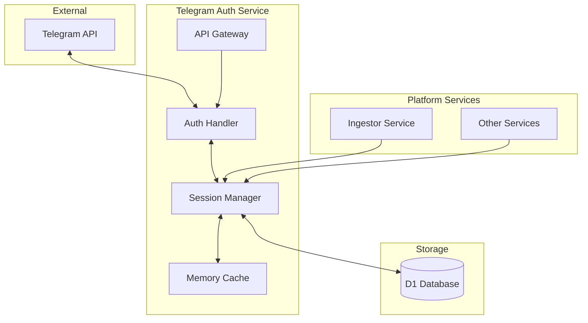
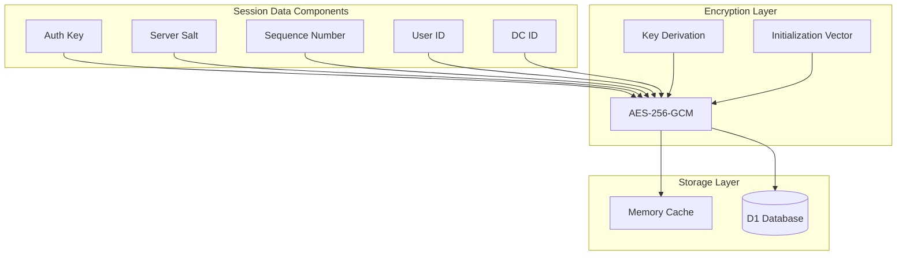
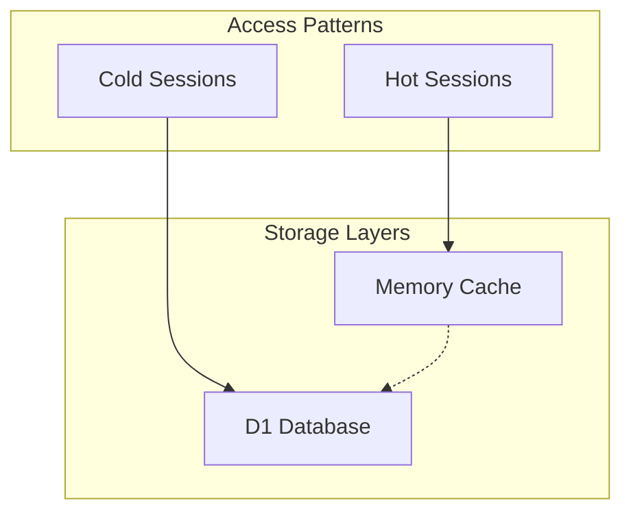
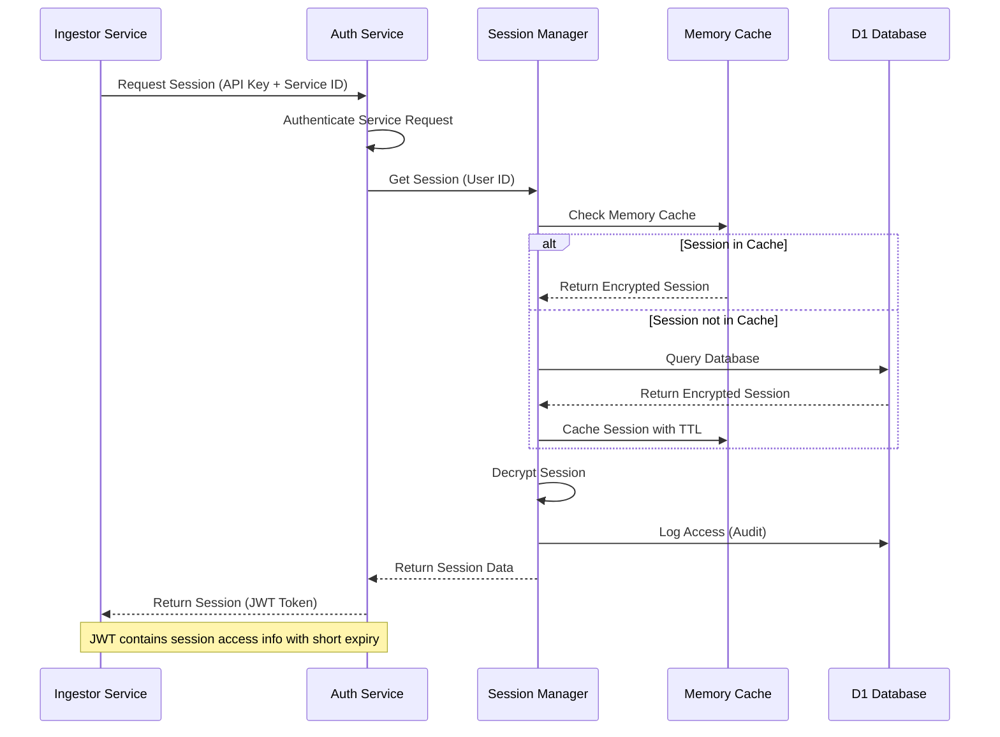
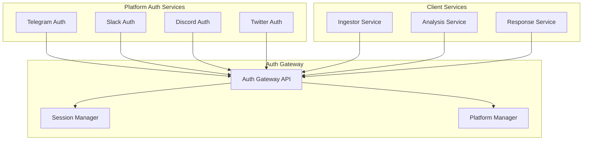

# Telegram Authentication Service Architecture

## Table of Contents

1. [Introduction](#introduction)
2. [Library Selection for MTProto Protocol](#library-selection-for-mtproto-protocol)
3. [Service Architecture](#service-architecture)
4. [API Endpoints Structure](#api-endpoints-structure)
5. [Database Schema](#database-schema)
6. [Secure Session Storage and Access](#secure-session-storage-and-access)
7. [Integration Points](#integration-points)
8. [Security Considerations](#security-considerations)
9. [Implementation Plan](#implementation-plan)
10. [Code Structure](#code-structure)
11. [Example Implementation Snippets](#example-implementation-snippets)
12. [Future Platform Authentication Services](#future-platform-authentication-services)

## Introduction

The Telegram Authentication Service is designed to be the first component in a larger platform services authentication system. This service enables user account authentication with Telegram using the MTProto protocol, providing secure session management for other services in the platform.

The service will handle the complete authentication flow with Telegram, including sending authentication codes, verifying codes, and securely storing session data for future use by other services, particularly the ingestion service.

## Library Selection for MTProto Protocol

After evaluating available TypeScript libraries for Telegram MTProto, **GramJS** is recommended for the following reasons:

- **Well-maintained** with active development and community support
- **Strong TypeScript support** with proper type definitions
- **Implements MTProto 2.0** protocol required for user authentication
- **Supports user account authentication** (not just bot accounts)
- **Lightweight** compared to alternatives like tdlib-wasm
- **Good documentation** and examples for authentication flows

Other options considered:

- telegram-mtproto: Less actively maintained
- tdlib-wasm: Heavier due to WebAssembly, overkill for authentication only
- airgram: More complex than needed for authentication purposes

## Service Architecture



### Components

1. **API Gateway**:

   - Exposes RESTful endpoints for authentication operations
   - Handles request validation and response formatting
   - Implements rate limiting and security measures

2. **Auth Handler**:

   - Integrates with GramJS to communicate with Telegram API
   - Manages authentication flows (sending code, verifying code)
   - Handles error cases and retries

3. **Session Manager**:

   - Stores and retrieves session data securely
   - Provides interface for other services to access authenticated sessions
   - Handles session expiration and refresh

4. **Memory Cache**:

   - In-memory cache for frequently accessed sessions
   - Improves performance by reducing database queries
   - Automatically expires entries based on TTL

5. **D1 Database**:
   - Primary persistent storage for all sessions
   - Stores encrypted session data and metadata
   - Maintains audit logs for security and compliance

## API Endpoints Structure

```
/api/telegram-auth/
├── /send-code
│   POST: Initiates authentication by sending code to user's device
├── /verify-code
│   POST: Verifies the code and establishes session
├── /sessions
│   GET: Lists active sessions (admin only)
│   DELETE: Terminates a session
├── /status
│   GET: Checks authentication status
└── /health
    GET: Service health check
```

### Endpoint Details

#### POST /api/telegram-auth/send-code

Request:

```json
{
  "phoneNumber": "+1234567890"
}
```

Response:

```json
{
  "success": true,
  "data": {
    "phoneCodeHash": "abc123...",
    "isCodeViaApp": true,
    "timeout": 120
  }
}
```

#### POST /api/telegram-auth/verify-code

Request:

```json
{
  "phoneNumber": "+1234567890",
  "phoneCodeHash": "abc123...",
  "code": "12345"
}
```

Response:

```json
{
  "success": true,
  "data": {
    "sessionId": "user123_session456",
    "expiresAt": "2025-05-14T21:42:30.000Z"
  }
}
```

#### GET /api/telegram-auth/sessions

Response:

```json
{
  "success": true,
  "data": {
    "sessions": [
      {
        "id": "user123_session456",
        "userId": 123,
        "createdAt": "2025-04-14T21:42:30.000Z",
        "expiresAt": "2025-05-14T21:42:30.000Z",
        "lastUsedAt": "2025-04-14T21:42:30.000Z",
        "isActive": true
      }
    ]
  }
}
```

#### DELETE /api/telegram-auth/sessions/:id

Response:

```json
{
  "success": true,
  "data": {
    "message": "Session revoked successfully"
  }
}
```

#### GET /api/telegram-auth/status

Response:

```json
{
  "success": true,
  "data": {
    "authenticated": true,
    "userId": 123,
    "sessionExpiresAt": "2025-05-14T21:42:30.000Z"
  }
}
```

## Database Schema

### D1 Database Tables

#### `telegram_users` Table

```sql
CREATE TABLE telegram_users (
  id INTEGER PRIMARY KEY,
  phone_number TEXT NOT NULL UNIQUE,
  telegram_id BIGINT,
  first_name TEXT,
  last_name TEXT,
  username TEXT,
  access_level INTEGER DEFAULT 1,
  is_blocked BOOLEAN DEFAULT FALSE,
  created_at TIMESTAMP DEFAULT CURRENT_TIMESTAMP,
  updated_at TIMESTAMP DEFAULT CURRENT_TIMESTAMP
);
```

#### `telegram_sessions` Table

```sql
CREATE TABLE telegram_sessions (
  id TEXT PRIMARY KEY,
  user_id INTEGER NOT NULL,
  encrypted_data BLOB NOT NULL,
  iv TEXT NOT NULL,
  version INTEGER NOT NULL DEFAULT 1,
  created_at TIMESTAMP DEFAULT CURRENT_TIMESTAMP,
  updated_at TIMESTAMP DEFAULT CURRENT_TIMESTAMP,
  last_used_at TIMESTAMP,
  expires_at TIMESTAMP,
  is_active BOOLEAN DEFAULT TRUE,
  device_info TEXT,
  ip_address TEXT,
  FOREIGN KEY (user_id) REFERENCES telegram_users(id)
);
```

#### `telegram_session_access_logs` Table

```sql
CREATE TABLE telegram_session_access_logs (
  id INTEGER PRIMARY KEY AUTOINCREMENT,
  session_id TEXT NOT NULL,
  service_name TEXT NOT NULL,
  action TEXT NOT NULL,
  timestamp TIMESTAMP DEFAULT CURRENT_TIMESTAMP,
  ip_address TEXT,
  success BOOLEAN,
  error_message TEXT,
  FOREIGN KEY (session_id) REFERENCES telegram_sessions(id)
);
```

## Secure Session Storage and Access

### Session Data Structure and Encryption

The Telegram MTProto session data contains sensitive information including:

- Authentication keys
- Server salts
- Sequence numbers
- User identifiers

This data requires strong protection both at rest and in transit:



### Encryption Implementation

1. **Key Derivation**:

   - Master key stored in Cloudflare Worker environment variables
   - Per-session derived keys using PBKDF2 with high iteration count
   - Unique salt per session

2. **Encryption Algorithm**:
   - AES-256-GCM for authenticated encryption
   - Provides both confidentiality and integrity verification
   - Unique IV (Initialization Vector) for each encryption operation

### Storage Strategy

The architecture employs a two-layered storage approach to balance security, performance, and durability:



1. **Layer 1: Memory Cache (Fastest)**

   - In-memory cache within the Worker
   - Stores only the most active sessions
   - Short TTL (5-15 minutes)
   - No persistence across worker invocations

2. **Layer 2: D1 Database (Durable)**
   - Primary persistent storage for all sessions
   - Complete session history and metadata
   - Encrypted session data with IV stored separately
   - Full audit trail of session usage

### Secure Access Patterns for Other Services

The architecture provides secure access to sessions for other services through a well-defined API:



### Service-to-Service Authentication

1. **API Key Authentication**:

   - Each service has a unique API key for accessing the auth service
   - Keys are rotated regularly and stored securely

2. **JWT-based Session Access**:
   - Short-lived JWT tokens (5-15 minutes) for session access
   - Contains scoped permissions for what the service can do with the session
   - Signed with a separate key from the session encryption key

## Integration Points

### Integration with Ingestor Service

The Ingestor Service will use the Telegram Authentication Service to:

1. Obtain authenticated sessions for accessing Telegram
2. Periodically refresh sessions as needed
3. Handle authentication errors and retry flows

```typescript
// Example integration in Ingestor Service
import { TelegramSessionManager } from '@communicator/telegram-auth';

// Initialize session manager
const sessionManager = new TelegramSessionManager({
  endpoint: 'https://telegram-auth.example.com/api/telegram-auth',
});

// Get session for a user
const session = await sessionManager.getSession(userId);

// Use session with GramJS to fetch messages
const client = new TelegramClient(session, apiId, apiHash);
await client.connect();
const messages = await client.getMessages('channel_name', { limit: 100 });
```

### Integration with Other Platform Services

Other services can use a similar pattern to access authenticated Telegram sessions when needed. The authentication service provides a client SDK that abstracts the complexity of session management and authentication.

Key integration points include:

1. **Session Acquisition**:

   - Services request sessions by user ID
   - Auth service handles authentication if needed
   - Sessions are returned ready to use with GramJS

2. **Session Lifecycle Management**:

   - Automatic session refresh when expired
   - Graceful handling of authentication errors
   - Session revocation when no longer needed

3. **Error Handling**:
   - Standardized error responses
   - Retry mechanisms with exponential backoff
   - Fallback options for critical operations

## Security Considerations

1. **Secure Storage of Sensitive Data**:

   - Auth keys and session data stored encrypted in D1
   - Use of Cloudflare Workers' encrypted environment variables for API credentials
   - Encryption at rest and in transit for all sensitive data

2. **Access Control**:

   - JWT-based authentication for admin endpoints
   - Rate limiting to prevent brute force attacks
   - IP-based restrictions for sensitive operations
   - Granular permissions for different service types

3. **Session Security**:

   - Regular rotation of session keys
   - Automatic session termination after inactivity
   - Ability to revoke sessions remotely
   - Session binding to specific services or operations

4. **Data Protection**:

   - Minimal data collection and storage
   - Compliance with data protection regulations
   - Secure transmission with TLS
   - Data retention policies for logs and sessions

5. **Security Monitoring and Alerting**:

   - Monitor for unusual access patterns
   - Alert on multiple failed decryption attempts
   - Complete audit trail of all session operations
   - Regular security reviews and penetration testing

6. **Telegram-Specific Security**:
   - Handling of Telegram's security notifications
   - Management of login location restrictions
   - Compliance with Telegram's terms of service
   - Protection against API abuse and rate limiting

## Implementation Plan

The implementation of the Telegram Authentication Service will be divided into four phases:

### Phase 1: Core Authentication (2 weeks)

1. **Project Setup**:

   - Create service structure using Hono framework
   - Set up development environment and testing framework
   - Configure Cloudflare D1 database

2. **GramJS Integration**:

   - Implement basic Telegram client wrapper
   - Create authentication flow (send code, verify code)
   - Handle error cases and retries

3. **Database Schema**:

   - Create database migration scripts
   - Implement user and session tables
   - Set up basic CRUD operations

4. **Basic API Endpoints**:
   - Implement send-code endpoint
   - Implement verify-code endpoint
   - Create health check endpoint

### Phase 2: Session Management (2 weeks)

1. **Session Storage**:

   - Implement encryption utilities
   - Create session manager class
   - Set up memory cache for sessions

2. **Session Lifecycle**:

   - Implement session creation and retrieval
   - Add session expiration handling
   - Create session refresh mechanism

3. **API Endpoints**:

   - Implement sessions listing endpoint
   - Add session revocation endpoint
   - Create status check endpoint

4. **Logging and Monitoring**:
   - Set up access logging
   - Implement basic monitoring
   - Create error handling middleware

### Phase 3: Security Enhancements (1 week)

1. **Access Control**:

   - Implement API key authentication
   - Add JWT-based session access
   - Create rate limiting middleware

2. **Security Hardening**:

   - Enhance encryption with key rotation
   - Implement IP-based restrictions
   - Add additional validation and sanitization

3. **Monitoring and Alerting**:

   - Set up anomaly detection
   - Create alerting for security events
   - Implement comprehensive logging

4. **Security Review**:
   - Conduct code review for security issues
   - Perform penetration testing
   - Address identified vulnerabilities

### Phase 4: Integration and Documentation (1 week)

1. **Client SDK**:

   - Create TypeScript client library
   - Implement session management utilities
   - Add error handling and retries

2. **Integration with Ingestor**:

   - Connect with Ingestor Service
   - Test end-to-end authentication flow
   - Optimize performance and reliability

3. **Documentation**:

   - Create API documentation
   - Write integration guides
   - Document security considerations

4. **Deployment**:
   - Deploy to development environment
   - Conduct integration testing
   - Prepare for production deployment

## Code Structure

```
services/telegram-auth/
├── src/
│   ├── index.ts                  # Main entry point
│   ├── routes/
│   │   ├── index.ts              # Route definitions
│   │   ├── auth.ts               # Authentication routes
│   │   └── sessions.ts           # Session management routes
│   ├── handlers/
│   │   ├── auth-handler.ts       # Telegram auth logic
│   │   └── session-handler.ts    # Session management logic
│   ├── lib/
│   │   ├── telegram-client.ts    # GramJS client wrapper
│   │   └── session-manager.ts    # Session management utilities
│   ├── models/
│   │   ├── user.ts               # User data model
│   │   └── session.ts            # Session data model
│   ├── middleware/
│   │   ├── auth.ts               # Authentication middleware
│   │   └── rate-limit.ts         # Rate limiting middleware
│   └── utils/
│       ├── crypto.ts             # Encryption utilities
│       └── validation.ts         # Input validation
├── migrations/
│   ├── 001_create_users_table.sql
│   ├── 002_create_sessions_table.sql
│   └── 003_create_access_logs_table.sql
├── tests/
│   ├── unit/
│   │   ├── auth-handler.test.ts
│   │   └── session-manager.test.ts
│   └── integration/
│       ├── auth-flow.test.ts
│       └── session-management.test.ts
├── wrangler.toml                 # Wrangler configuration
├── package.json                  # Package configuration
└── tsconfig.json                 # TypeScript configuration
```

### Key Files and Directories

1. **src/index.ts**:

   - Main entry point for the service
   - Hono app configuration
   - Route registration
   - Middleware setup

2. **src/routes/**:

   - API route definitions
   - Request validation
   - Response formatting
   - Error handling

3. **src/handlers/**:

   - Business logic for authentication and session management
   - Integration with GramJS
   - Database operations
   - Error handling

4. **src/lib/**:

   - Core functionality
   - Telegram client wrapper
   - Session management utilities
   - Reusable components

5. **src/models/**:

   - Data models
   - Type definitions
   - Database schema representations
   - Validation rules

6. **src/middleware/**:

   - Authentication middleware
   - Rate limiting
   - Logging
   - Error handling

7. **src/utils/**:

   - Utility functions
   - Encryption helpers
   - Validation utilities
   - Common helpers

8. **migrations/**:

   - Database migration scripts
   - Schema versioning
   - Data migration utilities

9. **tests/**:
   - Unit tests
   - Integration tests
   - Test utilities
   - Mock data

## Example Implementation Snippets

### Auth Routes (routes/auth.ts)

```typescript
import { Hono } from 'hono';
import { zValidator } from '@hono/zod-validator';
import { z } from 'zod';
import { TelegramAuthHandler } from '../handlers/auth-handler';
import { SessionManager } from '../lib/session-manager';
import { ApiResponse } from '@communicator/common';

// Environment bindings
type Bindings = {
  TELEGRAM_API_ID: string;
  TELEGRAM_API_HASH: string;
  SESSION_SECRET: string;
  DB: D1Database;
};

// Create router
const router = new Hono<{ Bindings: Bindings }>();

// Send code endpoint
const sendCodeSchema = z.object({
  phoneNumber: z.string().min(6).max(15),
});

router.post('/send-code', zValidator('json', sendCodeSchema), async c => {
  const { phoneNumber } = c.req.valid('json');

  const authHandler = new TelegramAuthHandler(c.env.TELEGRAM_API_ID, c.env.TELEGRAM_API_HASH);

  try {
    const result = await authHandler.sendAuthCode(phoneNumber);

    const response: ApiResponse = {
      success: true,
      data: result,
    };

    return c.json(response);
  } catch (error) {
    console.error(`Error sending code: ${error.message}`);

    const response: ApiResponse = {
      success: false,
      error: {
        code: error.code || 'INTERNAL_SERVER_ERROR',
        message: error.message || 'An unexpected error occurred',
      },
    };

    return c.json(response, error.status || 500);
  }
});

// Verify code endpoint
const verifyCodeSchema = z.object({
  phoneNumber: z.string().min(6).max(15),
  phoneCodeHash: z.string().min(1),
  code: z.string().min(1).max(10),
});

router.post('/verify-code', zValidator('json', verifyCodeSchema), async c => {
  const { phoneNumber, phoneCodeHash, code } = c.req.valid('json');

  const authHandler = new TelegramAuthHandler(c.env.TELEGRAM_API_ID, c.env.TELEGRAM_API_HASH);

  const sessionManager = new SessionManager(c.env.DB, c.env.SESSION_SECRET);

  try {
    // Verify the code with Telegram
    const { sessionString, userId } = await authHandler.verifyAuthCode(
      phoneNumber,
      phoneCodeHash,
      code,
    );

    // Save the session
    const sessionId = await sessionManager.saveSession(userId, sessionString);

    // Calculate expiration date (30 days from now)
    const expiresAt = new Date();
    expiresAt.setDate(expiresAt.getDate() + 30);

    const response: ApiResponse = {
      success: true,
      data: {
        sessionId,
        expiresAt: expiresAt.toISOString(),
      },
    };

    return c.json(response);
  } catch (error) {
    console.error(`Error verifying code: ${error.message}`);

    const response: ApiResponse = {
      success: false,
      error: {
        code: error.code || 'INTERNAL_SERVER_ERROR',
        message: error.message || 'An unexpected error occurred',
      },
    };

    return c.json(response, error.status || 500);
  }
});

export default router;
```

### Encryption Utilities (utils/crypto.ts)

```typescript
import { subtle } from 'crypto';

export async function encrypt(
  data: string,
  masterKey: string,
  salt: string,
): Promise<{ encryptedData: string; iv: string }> {
  // Import the master key
  const key = await importKey(masterKey);

  // Derive a key for this specific encryption
  const derivedKey = await deriveKey(key, salt);

  // Generate a random IV
  const iv = crypto.getRandomValues(new Uint8Array(12));

  // Encrypt the data
  const encoder = new TextEncoder();
  const dataBuffer = encoder.encode(data);

  const encryptedBuffer = await subtle.encrypt(
    {
      name: 'AES-GCM',
      iv,
    },
    derivedKey,
    dataBuffer,
  );

  // Convert to Base64 for storage
  const encryptedArray = new Uint8Array(encryptedBuffer);
  const encryptedBase64 = btoa(String.fromCharCode(...encryptedArray));
  const ivBase64 = btoa(String.fromCharCode(...iv));

  return {
    encryptedData: encryptedBase64,
    iv: ivBase64,
  };
}

export async function decrypt(
  encryptedData: string,
  iv: string,
  masterKey: string,
  salt: string,
): Promise<string> {
  // Import the master key
  const key = await importKey(masterKey);

  // Derive the same key used for encryption
  const derivedKey = await deriveKey(key, salt);

  // Convert from Base64
  const encryptedBytes = atob(encryptedData);
  const encryptedBuffer = new Uint8Array(encryptedBytes.length);
  for (let i = 0; i < encryptedBytes.length; i++) {
    encryptedBuffer[i] = encryptedBytes.charCodeAt(i);
  }

  const ivBytes = atob(iv);
  const ivBuffer = new Uint8Array(ivBytes.length);
  for (let i = 0; i < ivBytes.length; i++) {
    ivBuffer[i] = ivBytes.charCodeAt(i);
  }

  // Decrypt the data
  const decryptedBuffer = await subtle.decrypt(
    {
      name: 'AES-GCM',
      iv: ivBuffer,
    },
    derivedKey,
    encryptedBuffer,
  );

  // Convert back to string
  const decoder = new TextDecoder();
  return decoder.decode(decryptedBuffer);
}

async function importKey(keyString: string): Promise<CryptoKey> {
  const encoder = new TextEncoder();
  const keyData = encoder.encode(keyString);

  return await subtle.importKey('raw', keyData, { name: 'PBKDF2' }, false, ['deriveKey']);
}

async function deriveKey(masterKey: CryptoKey, salt: string): Promise<CryptoKey> {
  const encoder = new TextEncoder();
  const saltBuffer = encoder.encode(salt);

  return await subtle.deriveKey(
    {
      name: 'PBKDF2',
      salt: saltBuffer,
      iterations: 100000,
      hash: 'SHA-256',
    },
    masterKey,
    { name: 'AES-GCM', length: 256 },
    false,
    ['encrypt', 'decrypt'],
  );
}
```

### Client SDK (telegram-auth-client.ts)

```typescript
// @communicator/telegram-auth-client

export class TelegramAuthClient {
  private endpoint: string;
  private apiKey: string;
  private serviceId: string;

  constructor(config: { endpoint: string; apiKey: string; serviceId: string }) {
    this.endpoint = config.endpoint;
    this.apiKey = config.apiKey;
    this.serviceId = config.serviceId;
  }

  async getSession(userId: string): Promise<{
    sessionString: string;
    sessionId: string;
    expiresAt: Date;
  }> {
    const response = await fetch(`${this.endpoint}/api/telegram-auth/sessions/user/${userId}`, {
      method: 'GET',
      headers: {
        Authorization: `ApiKey ${this.apiKey}`,
        'X-Service-ID': this.serviceId,
        'Content-Type': 'application/json',
      },
    });

    if (!response.ok) {
      const error = await response.json();
      throw new Error(`Failed to get session: ${error.error?.message || response.statusText}`);
    }

    const data = await response.json();
    return {
      sessionString: data.data.sessionString,
      sessionId: data.data.sessionId,
      expiresAt: new Date(data.data.expiresAt),
    };
  }

  async useSessionWithGramJS(userId: string): Promise<TelegramClient> {
    const { sessionString } = await this.getSession(userId);

    // Create a StringSession from the session string
    const session = new StringSession(sessionString);

    // Create a TelegramClient with the session
    const client = new TelegramClient(
      session,
      parseInt(process.env.TELEGRAM_API_ID || '0', 10),
      process.env.TELEGRAM_API_HASH || '',
      {
        connectionRetries: 3,
      },
    );

    // Connect the client
    await client.connect();

    return client;
  }
}
```

## Future Platform Authentication Services

This Telegram Authentication Service is designed to be the first component in a larger platform services authentication system. The architecture is modular and can be extended to support other platforms:

### Common Authentication Service Pattern



### Extending to Other Platforms

The architecture can be extended to other platforms by:

1. **Creating Platform-Specific Auth Services**:

   - Each platform gets its own authentication service
   - Services follow the same pattern but implement platform-specific protocols
   - Common interfaces for session management

2. **Unified Auth Gateway**:

   - Single entry point for all authentication services
   - Consistent API for client services
   - Platform-agnostic session management

3. **Shared Components**:
   - Common encryption utilities
   - Shared session management patterns
   - Unified logging and monitoring

### Next Platform Candidates

1. **Slack Authentication Service**:

   - OAuth-based authentication
   - Token management and refresh
   - User and workspace mapping

2. **Discord Authentication Service**:

   - OAuth-based authentication
   - Bot and user authentication modes
   - Guild and channel permissions

3. **Twitter Authentication Service**:
   - OAuth 2.0 authentication
   - API key management
   - Rate limit handling

### Unified Authentication Gateway

As more platform-specific authentication services are added, a unified Authentication Gateway will be developed to:

1. **Provide a Single Entry Point**:

   - Consistent API for all platforms
   - Platform-agnostic session management
   - Unified error handling

2. **Manage Cross-Platform Users**:

   - Link accounts across platforms
   - Unified user profiles
   - Cross-platform permissions

3. **Centralize Security**:
   - Consistent security policies
   - Unified monitoring and alerting
   - Centralized audit logging

This modular approach allows for incremental development and deployment of authentication services for different platforms while maintaining a consistent architecture and security model.
