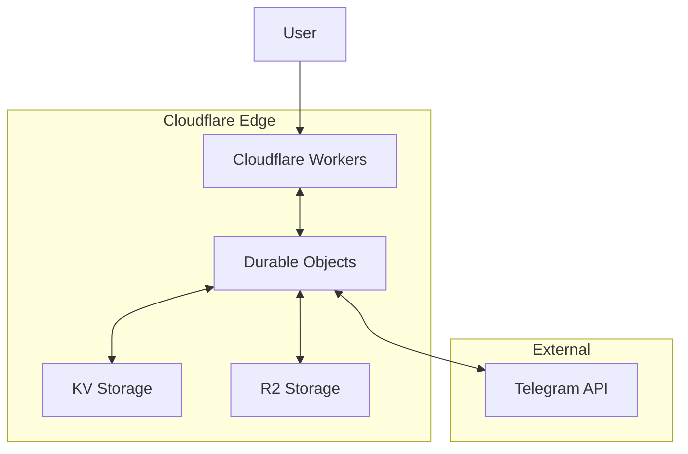

# Telegram Proxy Service Using Cloudflare Durable Objects

This document explores an alternative approach to implementing the Telegram Proxy Service using Cloudflare Durable Objects, keeping the entire solution within the Cloudflare ecosystem.

## Overview

Cloudflare Durable Objects provide:

- **Global uniqueness**: Each object has a globally unique ID
- **Strong consistency**: Requests to the same object are processed sequentially
- **Durable storage**: Built-in persistent storage
- **Coordination across requests**: Long-lived objects that maintain state

These features make Durable Objects a potential alternative to the Kubernetes-based approach for implementing the Telegram Proxy Service.

## Architecture



## Key Components

### 1. TelegramSessionDO (Durable Object)

This Durable Object would manage a single Telegram session, handling the WebSocket connection to Telegram and maintaining the session state.

```typescript
export class TelegramSessionDO implements DurableObject {
  private state: DurableObjectState;
  private telegramClient: TelegramClient | null = null;
  private sessionData: any = null;
  private lastActivity: number = Date.now();
  private env: Env;

  constructor(state: DurableObjectState, env: Env) {
    this.state = state;
    this.env = env;

    // Set up storage
    this.state.blockConcurrencyWhile(async () => {
      this.sessionData = await this.state.storage.get('sessionData');
      const lastActivity = await this.state.storage.get('lastActivity');
      if (lastActivity) {
        this.lastActivity = lastActivity;
      }
    });
  }

  async fetch(request: Request): Promise<Response> {
    // Update last activity time
    this.lastActivity = Date.now();
    await this.state.storage.put('lastActivity', this.lastActivity);

    const url = new URL(request.url);
    const path = url.pathname.split('/').filter(Boolean);

    // Handle different operations based on the path
    switch (path[0]) {
      case 'connect':
        return await this.handleConnect(request);
      case 'send-code':
        return await this.handleSendCode(request);
      case 'verify-code':
        return await this.handleVerifyCode(request);
      case 'execute':
        return await this.handleExecute(request);
      case 'status':
        return await this.handleStatus(request);
      default:
        return new Response('Not found', { status: 404 });
    }
  }

  async handleConnect(request: Request): Promise<Response> {
    // Initialize Telegram client if not already done
    if (!this.telegramClient) {
      const { apiId, apiHash } = await request.json();

      try {
        // Create a new Telegram client
        // Note: This is conceptual as the actual Telegram client library
        // would need to be adapted to work in the Workers runtime
        this.telegramClient = new TelegramClient(
          new StringSession(this.sessionData?.session || ''),
          parseInt(apiId, 10),
          apiHash,
          {
            connectionRetries: 3,
            useWSS: true,
          },
        );

        // Connect to Telegram
        await this.telegramClient.connect();

        // Store session data
        if (this.telegramClient.session) {
          const sessionString = this.telegramClient.session.save();
          this.sessionData = {
            session: sessionString,
            lastUpdated: Date.now(),
          };
          await this.state.storage.put('sessionData', this.sessionData);
        }

        return new Response(
          JSON.stringify({
            success: true,
            connected: true,
          }),
          {
            headers: { 'Content-Type': 'application/json' },
          },
        );
      } catch (error) {
        return new Response(
          JSON.stringify({
            success: false,
            error: error.message,
          }),
          {
            status: 500,
            headers: { 'Content-Type': 'application/json' },
          },
        );
      }
    } else {
      return new Response(
        JSON.stringify({
          success: true,
          connected: true,
          alreadyConnected: true,
        }),
        {
          headers: { 'Content-Type': 'application/json' },
        },
      );
    }
  }

  async handleSendCode(request: Request): Promise<Response> {
    try {
      // Ensure client is connected
      if (!this.telegramClient || !this.telegramClient.connected) {
        return new Response(
          JSON.stringify({
            success: false,
            error: 'Client not connected',
          }),
          {
            status: 400,
            headers: { 'Content-Type': 'application/json' },
          },
        );
      }

      const { phoneNumber } = await request.json();

      // Send authentication code
      const result = await this.telegramClient.sendCode({
        apiId: this.telegramClient.apiId,
        apiHash: this.telegramClient.apiHash.toString(),
        phoneNumber,
      });

      return new Response(
        JSON.stringify({
          success: true,
          data: {
            phoneCodeHash: result.phoneCodeHash,
            isCodeViaApp: result.type?._ === 'auth.sentCodeTypeApp',
            timeout: result.timeout || 120,
          },
        }),
        {
          headers: { 'Content-Type': 'application/json' },
        },
      );
    } catch (error) {
      return new Response(
        JSON.stringify({
          success: false,
          error: error.message,
        }),
        {
          status: 500,
          headers: { 'Content-Type': 'application/json' },
        },
      );
    }
  }

  async handleVerifyCode(request: Request): Promise<Response> {
    try {
      // Ensure client is connected
      if (!this.telegramClient || !this.telegramClient.connected) {
        return new Response(
          JSON.stringify({
            success: false,
            error: 'Client not connected',
          }),
          {
            status: 400,
            headers: { 'Content-Type': 'application/json' },
          },
        );
      }

      const { phoneNumber, phoneCodeHash, code } = await request.json();

      // Sign in with the code
      await this.telegramClient.invoke({
        _: 'auth.signIn',
        phoneNumber,
        phoneCodeHash,
        phoneCode: code,
      });

      // Get user information
      const me = await this.telegramClient.getMe();

      // Update session data
      if (this.telegramClient.session) {
        const sessionString = this.telegramClient.session.save();
        this.sessionData = {
          session: sessionString,
          userId: typeof me.id === 'number' ? me.id : parseInt(String(me.id), 10),
          phoneNumber,
          firstName: typeof me.firstName === 'string' ? me.firstName : undefined,
          lastName: typeof me.lastName === 'string' ? me.lastName : undefined,
          username: typeof me.username === 'string' ? me.username : undefined,
          lastUpdated: Date.now(),
        };
        await this.state.storage.put('sessionData', this.sessionData);
      }

      return new Response(
        JSON.stringify({
          success: true,
          data: {
            userId: this.sessionData.userId,
            firstName: this.sessionData.firstName,
            lastName: this.sessionData.lastName,
            username: this.sessionData.username,
          },
        }),
        {
          headers: { 'Content-Type': 'application/json' },
        },
      );
    } catch (error) {
      return new Response(
        JSON.stringify({
          success: false,
          error: error.message,
        }),
        {
          status: 500,
          headers: { 'Content-Type': 'application/json' },
        },
      );
    }
  }

  async handleExecute(request: Request): Promise<Response> {
    try {
      // Ensure client is connected
      if (!this.telegramClient || !this.telegramClient.connected) {
        return new Response(
          JSON.stringify({
            success: false,
            error: 'Client not connected',
          }),
          {
            status: 400,
            headers: { 'Content-Type': 'application/json' },
          },
        );
      }

      const { method, params } = await request.json();

      // Execute the requested method
      const result = await this.telegramClient[method](...params);

      // Update session data if needed
      if (this.telegramClient.session) {
        const sessionString = this.telegramClient.session.save();
        if (this.sessionData.session !== sessionString) {
          this.sessionData.session = sessionString;
          this.sessionData.lastUpdated = Date.now();
          await this.state.storage.put('sessionData', this.sessionData);
        }
      }

      return new Response(
        JSON.stringify({
          success: true,
          data: result,
        }),
        {
          headers: { 'Content-Type': 'application/json' },
        },
      );
    } catch (error) {
      return new Response(
        JSON.stringify({
          success: false,
          error: error.message,
        }),
        {
          status: 500,
          headers: { 'Content-Type': 'application/json' },
        },
      );
    }
  }

  async handleStatus(request: Request): Promise<Response> {
    return new Response(
      JSON.stringify({
        success: true,
        data: {
          connected: this.telegramClient?.connected || false,
          lastActivity: this.lastActivity,
          userId: this.sessionData?.userId,
          username: this.sessionData?.username,
        },
      }),
      {
        headers: { 'Content-Type': 'application/json' },
      },
    );
  }
}
```

### 2. TelegramSessionManager Worker

This Worker would manage the creation and access to TelegramSessionDO instances.

```typescript
export interface Env {
  TELEGRAM_SESSION: DurableObjectNamespace;
  TELEGRAM_API_ID: string;
  TELEGRAM_API_HASH: string;
  SESSION_SECRET: string;
}

export default {
  async fetch(request: Request, env: Env, ctx: ExecutionContext): Promise<Response> {
    const url = new URL(request.url);
    const path = url.pathname.split('/').filter(Boolean);

    // Handle different operations based on the path
    if (path[0] === 'api' && path[1] === 'telegram-proxy') {
      switch (path[2]) {
        case 'sessions':
          return await handleSessions(request, env);
        case 'auth':
          return await handleAuth(request, env);
        case 'messages':
          return await handleMessages(request, env);
        case 'health':
          return new Response(
            JSON.stringify({
              status: 'ok',
              timestamp: new Date().toISOString(),
            }),
            {
              headers: { 'Content-Type': 'application/json' },
            },
          );
        default:
          return new Response('Not found', { status: 404 });
      }
    }

    return new Response('Not found', { status: 404 });
  },
};

async function handleSessions(request: Request, env: Env): Promise<Response> {
  const url = new URL(request.url);
  const path = url.pathname.split('/').filter(Boolean);

  // Create a new session
  if (request.method === 'POST' && path.length === 3) {
    // Generate a unique ID for the session
    const sessionId = crypto.randomUUID();

    // Create a new Durable Object for this session
    const id = env.TELEGRAM_SESSION.idFromName(sessionId);
    const obj = env.TELEGRAM_SESSION.get(id);

    // Initialize the session
    const initResponse = await obj.fetch(
      new Request(`https://dummy/connect`, {
        method: 'POST',
        headers: { 'Content-Type': 'application/json' },
        body: JSON.stringify({
          apiId: env.TELEGRAM_API_ID,
          apiHash: env.TELEGRAM_API_HASH,
        }),
      }),
    );

    const initResult = await initResponse.json();

    if (!initResult.success) {
      return new Response(
        JSON.stringify({
          success: false,
          error: initResult.error,
        }),
        {
          status: 500,
          headers: { 'Content-Type': 'application/json' },
        },
      );
    }

    return new Response(
      JSON.stringify({
        success: true,
        data: {
          sessionId,
        },
      }),
      {
        headers: { 'Content-Type': 'application/json' },
      },
    );
  }

  // Get session status
  if (request.method === 'GET' && path.length === 4) {
    const sessionId = path[3];

    // Get the Durable Object for this session
    const id = env.TELEGRAM_SESSION.idFromName(sessionId);
    const obj = env.TELEGRAM_SESSION.get(id);

    // Get session status
    const statusResponse = await obj.fetch(
      new Request(`https://dummy/status`, {
        method: 'GET',
      }),
    );

    return statusResponse;
  }

  // Delete a session
  if (request.method === 'DELETE' && path.length === 4) {
    const sessionId = path[3];

    // Get the Durable Object for this session
    const id = env.TELEGRAM_SESSION.idFromName(sessionId);
    const obj = env.TELEGRAM_SESSION.get(id);

    // Delete the session
    // Note: This doesn't actually delete the Durable Object,
    // but it can reset its state or mark it as deleted
    const deleteResponse = await obj.fetch(
      new Request(`https://dummy/delete`, {
        method: 'POST',
      }),
    );

    return deleteResponse;
  }

  return new Response('Method not allowed', { status: 405 });
}

async function handleAuth(request: Request, env: Env): Promise<Response> {
  const url = new URL(request.url);
  const path = url.pathname.split('/').filter(Boolean);

  // Send authentication code
  if (request.method === 'POST' && path[3] === 'send-code') {
    const { sessionId, phoneNumber } = await request.json();

    // Get the Durable Object for this session
    const id = env.TELEGRAM_SESSION.idFromName(sessionId);
    const obj = env.TELEGRAM_SESSION.get(id);

    // Send the code
    const sendCodeResponse = await obj.fetch(
      new Request(`https://dummy/send-code`, {
        method: 'POST',
        headers: { 'Content-Type': 'application/json' },
        body: JSON.stringify({ phoneNumber }),
      }),
    );

    return sendCodeResponse;
  }

  // Verify authentication code
  if (request.method === 'POST' && path[3] === 'verify-code') {
    const { sessionId, phoneNumber, phoneCodeHash, code } = await request.json();

    // Get the Durable Object for this session
    const id = env.TELEGRAM_SESSION.idFromName(sessionId);
    const obj = env.TELEGRAM_SESSION.get(id);

    // Verify the code
    const verifyCodeResponse = await obj.fetch(
      new Request(`https://dummy/verify-code`, {
        method: 'POST',
        headers: { 'Content-Type': 'application/json' },
        body: JSON.stringify({ phoneNumber, phoneCodeHash, code }),
      }),
    );

    return verifyCodeResponse;
  }

  return new Response('Method not allowed', { status: 405 });
}

async function handleMessages(request: Request, env: Env): Promise<Response> {
  const url = new URL(request.url);
  const path = url.pathname.split('/').filter(Boolean);

  // Get messages
  if (request.method === 'GET' && path[3] === 'poll') {
    const sessionId = request.headers.get('X-Session-ID');
    const chatId = path[4];
    const limit = url.searchParams.get('limit') || '100';
    const cursor = url.searchParams.get('cursor');

    if (!sessionId) {
      return new Response(
        JSON.stringify({
          success: false,
          error: 'Session ID is required',
        }),
        {
          status: 400,
          headers: { 'Content-Type': 'application/json' },
        },
      );
    }

    // Get the Durable Object for this session
    const id = env.TELEGRAM_SESSION.idFromName(sessionId);
    const obj = env.TELEGRAM_SESSION.get(id);

    // Execute the getMessages method
    const executeResponse = await obj.fetch(
      new Request(`https://dummy/execute`, {
        method: 'POST',
        headers: { 'Content-Type': 'application/json' },
        body: JSON.stringify({
          method: 'getMessages',
          params: [
            chatId,
            { limit: parseInt(limit, 10), offsetId: cursor ? parseInt(cursor, 10) : 0 },
          ],
        }),
      }),
    );

    return executeResponse;
  }

  // Send a message
  if (request.method === 'POST' && path[3] === 'send') {
    const sessionId = request.headers.get('X-Session-ID');
    const chatId = path[4];
    const { message } = await request.json();

    if (!sessionId) {
      return new Response(
        JSON.stringify({
          success: false,
          error: 'Session ID is required',
        }),
        {
          status: 400,
          headers: { 'Content-Type': 'application/json' },
        },
      );
    }

    // Get the Durable Object for this session
    const id = env.TELEGRAM_SESSION.idFromName(sessionId);
    const obj = env.TELEGRAM_SESSION.get(id);

    // Execute the sendMessage method
    const executeResponse = await obj.fetch(
      new Request(`https://dummy/execute`, {
        method: 'POST',
        headers: { 'Content-Type': 'application/json' },
        body: JSON.stringify({
          method: 'sendMessage',
          params: [chatId, { message }],
        }),
      }),
    );

    return executeResponse;
  }

  return new Response('Method not allowed', { status: 405 });
}
```

### 3. Integration with Cloudflare Workers

The auth-telegram Worker would communicate with the TelegramSessionManager Worker:

```typescript
// In services/auth-telegram/src/lib/telegram-client.ts

import { TelegramClient } from 'telegram';
import { StringSession } from 'telegram/sessions';

export class TelegramClientWrapper {
  private apiId: number;
  private apiHash: string;
  private sessionId: string | null = null;

  constructor(apiId: string, apiHash: string) {
    this.apiId = parseInt(apiId, 10);
    this.apiHash = apiHash;
  }

  async sendAuthCode(phoneNumber: string): Promise<SendCodeResult> {
    // Create a new session if we don't have one
    if (!this.sessionId) {
      const createSessionResponse = await fetch(
        `${TELEGRAM_PROXY_URL}/api/telegram-proxy/sessions`,
        {
          method: 'POST',
          headers: {
            'Content-Type': 'application/json',
            Authorization: `Bearer ${API_KEY}`,
          },
        },
      );

      const createSessionResult = await createSessionResponse.json();

      if (!createSessionResult.success) {
        throw new Error(createSessionResult.error?.message || 'Failed to create session');
      }

      this.sessionId = createSessionResult.data.sessionId;
    }

    // Send the authentication code
    const response = await fetch(`${TELEGRAM_PROXY_URL}/api/telegram-proxy/auth/send-code`, {
      method: 'POST',
      headers: {
        'Content-Type': 'application/json',
        Authorization: `Bearer ${API_KEY}`,
      },
      body: JSON.stringify({
        sessionId: this.sessionId,
        phoneNumber,
      }),
    });

    const data = await response.json();

    if (!data.success) {
      throw new Error(data.error?.message || 'Failed to send authentication code');
    }

    return data.data;
  }

  // Other methods similarly updated to use the proxy
}
```

## Advantages of Durable Objects Approach

1. **Simplified Infrastructure**: Everything stays within the Cloudflare ecosystem, eliminating the need for external infrastructure.

2. **Global Distribution**: Durable Objects are globally distributed, providing low-latency access from anywhere.

3. **Automatic Scaling**: Cloudflare handles the scaling of Durable Objects automatically.

4. **Simplified Deployment**: No need to manage Kubernetes, Redis, or other infrastructure components.

5. **Cost Efficiency**: Potentially lower costs compared to running dedicated infrastructure.

## Challenges and Limitations

1. **WebSocket Compatibility**: While Durable Objects can maintain WebSocket connections, there may still be limitations in how they interact with the Telegram MTProto protocol.

2. **Resource Constraints**: Durable Objects have CPU and memory limits that may impact performance for heavy workloads.

3. **Library Compatibility**: The Telegram client library (GramJS) may require significant adaptation to work within the Durable Objects environment.

4. **Long-Running Connections**: Durable Objects may not be ideal for maintaining very long-lived connections, as they are designed for request-response patterns.

5. **Storage Limitations**: Durable Objects have storage limits that may impact the ability to store large amounts of session data.

## Implementation Approach

### Phase 1: Proof of Concept

1. Create a simplified version of the Telegram client that works within Durable Objects
2. Implement basic authentication flow (send code, verify code)
3. Test with simple message retrieval

### Phase 2: Full Implementation

1. Implement complete Telegram client functionality
2. Add session management and persistence
3. Implement message polling and sending
4. Add error handling and retry logic

### Phase 3: Integration and Optimization

1. Integrate with auth-telegram Worker
2. Optimize performance and resource usage
3. Add monitoring and logging
4. Implement security measures

## Deployment with Pulumi

The Durable Objects approach can still be deployed using Pulumi, but with a simpler configuration:

```typescript
import * as pulumi from '@pulumi/pulumi';
import * as cloudflare from '@pulumi/cloudflare';

// Load configuration
const config = new pulumi.Config();
const accountId = config.require('cloudflare:accountId');
const telegramApiId = config.requireSecret('telegramApiId');
const telegramApiHash = config.requireSecret('telegramApiHash');
const sessionSecret = config.requireSecret('sessionSecret');

// Deploy the Telegram Session Manager Worker
const telegramSessionManager = new cloudflare.WorkerScript('telegram-session-manager', {
  name: 'telegram-session-manager',
  accountId: accountId,
  content: fs.readFileSync('../services/telegram-session-manager/dist/index.js', 'utf8'),
  plainTextBindings: [
    {
      name: 'TELEGRAM_API_ID',
      text: telegramApiId,
    },
    {
      name: 'TELEGRAM_API_HASH',
      text: telegramApiHash,
    },
    {
      name: 'SESSION_SECRET',
      text: sessionSecret,
    },
  ],
  durableObjectsBindings: [
    {
      name: 'TELEGRAM_SESSION',
      className: 'TelegramSessionDO',
    },
  ],
});

// Deploy the auth-telegram worker
const authTelegramWorker = new cloudflare.WorkerScript('auth-telegram', {
  name: 'auth-telegram',
  accountId: accountId,
  content: fs.readFileSync('../services/auth-telegram/dist/index.js', 'utf8'),
  plainTextBindings: [
    {
      name: 'TELEGRAM_PROXY_URL',
      text: `https://telegram-session-manager.${accountId}.workers.dev`,
    },
  ],
});

// Export the worker details
export const outputs = {
  telegramSessionManager: {
    name: telegramSessionManager.name,
  },
  authTelegramWorker: {
    name: authTelegramWorker.name,
  },
};
```

## Conclusion

The Durable Objects approach offers a compelling alternative to the Kubernetes-based solution, keeping the entire infrastructure within the Cloudflare ecosystem. While there are challenges to overcome, particularly around library compatibility and WebSocket support, the simplified infrastructure and deployment make it worth exploring.

For a production implementation, a hybrid approach might be optimal:

1. Use Durable Objects for session management and coordination
2. Use a lightweight proxy service (possibly on Cloudflare Workers for Platforms) for the actual Telegram API communication

This would combine the benefits of Durable Objects for state management with a dedicated service for handling the WebSocket connections to Telegram.
