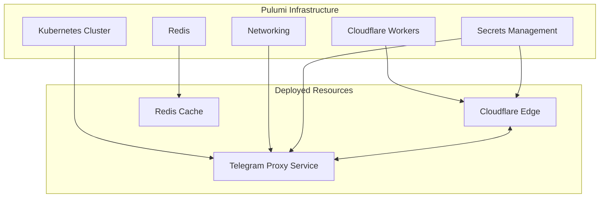

# Deploying Telegram Proxy Service with Pulumi

This document outlines how to deploy the Telegram Proxy Service using Pulumi alongside the existing Cloudflare Workers stack.

## Overview

We'll extend the current Pulumi infrastructure to deploy:

1. A Kubernetes cluster on DigitalOcean
2. A Redis instance for session management
3. The Telegram Proxy Service as Kubernetes resources
4. Necessary networking and security components
5. Integration with the existing Cloudflare Workers

## Infrastructure Architecture



## Required Pulumi Packages

Add these dependencies to your `infrastructure/package.json`:

```json
{
  "dependencies": {
    "@pulumi/cloudflare": "^4.13.0",
    "@pulumi/pulumi": "^3.60.1",
    "@pulumi/digitalocean": "^4.19.0",
    "@pulumi/kubernetes": "^3.30.1",
    "@pulumi/docker": "^4.4.1",
    "@pulumi/random": "^4.13.0"
  }
}
```

## Implementation Plan

### 1. Update Project Structure

```
infrastructure/
├── src/
│   ├── index.ts                 # Entry point
│   ├── environments/
│   │   ├── dev.ts               # Dev environment
│   │   ├── staging.ts           # Staging environment
│   │   └── production.ts        # Production environment
│   ├── workers/                 # Cloudflare Workers
│   │   ├── index.ts             # Worker exports
│   │   └── deploy.ts            # Worker deployment functions
│   └── telegram-proxy/          # Telegram Proxy Service
│       ├── index.ts             # Proxy exports
│       ├── cluster.ts           # Kubernetes cluster
│       ├── redis.ts             # Redis deployment
│       ├── service.ts           # Proxy service deployment
│       └── networking.ts        # Networking configuration
└── Pulumi.yaml                  # Pulumi project file
```

### 2. Kubernetes Cluster Configuration

Create a new file `infrastructure/src/telegram-proxy/cluster.ts`:

```typescript
import * as pulumi from '@pulumi/pulumi';
import * as digitalocean from '@pulumi/digitalocean';

export interface ClusterOptions {
  name: string;
  region: string;
  nodeSize: string;
  nodeCount: number;
  kubernetesVersion?: string;
  tags?: string[];
}

export function createKubernetesCluster(options: ClusterOptions) {
  const cluster = new digitalocean.KubernetesCluster(`${options.name}-cluster`, {
    region: options.region,
    version: options.kubernetesVersion || 'latest',
    nodePool: {
      name: `${options.name}-pool`,
      size: options.nodeSize,
      nodeCount: options.nodeCount,
      autoScale: true,
      minNodes: 1,
      maxNodes: options.nodeCount * 2,
    },
    tags: options.tags || [],
  });

  // Export the kubeconfig
  const kubeconfig = cluster.kubeConfigs[0].rawConfig;

  return {
    cluster,
    kubeconfig,
  };
}
```

### 3. Redis Configuration

Create a new file `infrastructure/src/telegram-proxy/redis.ts`:

```typescript
import * as pulumi from '@pulumi/pulumi';
import * as digitalocean from '@pulumi/digitalocean';
import * as kubernetes from '@pulumi/kubernetes';
import * as random from '@pulumi/random';

export interface RedisOptions {
  name: string;
  region: string;
  size: string;
  nodeCount?: number;
  kubeconfig: pulumi.Output<string>;
}

export function deployRedis(options: RedisOptions) {
  // Generate a random password for Redis
  const redisPassword = new random.RandomPassword(`${options.name}-redis-password`, {
    length: 20,
    special: false,
  });

  // Create a DigitalOcean Redis cluster
  const redis = new digitalocean.DatabaseCluster(`${options.name}-redis`, {
    engine: 'redis',
    version: '6',
    region: options.region,
    size: options.size,
    nodeCount: options.nodeCount || 1,
    privateNetworkUuid: pulumi.output(
      digitalocean.getVpcs({
        region: options.region,
      }),
    ).vpcs[0].id,
  });

  // Create a Kubernetes provider using the cluster's kubeconfig
  const k8sProvider = new kubernetes.Provider(`${options.name}-k8s-provider`, {
    kubeconfig: options.kubeconfig,
  });

  // Create a Kubernetes secret for Redis credentials
  const redisSecret = new kubernetes.core.v1.Secret(
    `${options.name}-redis-secret`,
    {
      metadata: {
        name: 'redis-credentials',
      },
      stringData: {
        host: redis.host,
        port: redis.port.apply(port => port.toString()),
        password: redisPassword.result,
      },
    },
    { provider: k8sProvider },
  );

  return {
    redis,
    redisSecret,
    redisPassword: redisPassword.result,
  };
}
```

### 4. Telegram Proxy Service Deployment

Create a new file `infrastructure/src/telegram-proxy/service.ts`:

```typescript
import * as pulumi from '@pulumi/pulumi';
import * as kubernetes from '@pulumi/kubernetes';
import * as docker from '@pulumi/docker';

export interface ProxyServiceOptions {
  name: string;
  environment: string;
  kubeconfig: pulumi.Output<string>;
  redisSecretName: pulumi.Output<string>;
  telegramApiId: pulumi.Output<string>;
  telegramApiHash: pulumi.Output<string>;
  jwtSecret: pulumi.Output<string>;
  replicas?: number;
  dockerImageTag?: string;
  dockerRegistry?: string;
}

export function deployTelegramProxyService(options: ProxyServiceOptions) {
  // Create a Kubernetes provider using the cluster's kubeconfig
  const k8sProvider = new kubernetes.Provider(`${options.name}-k8s-provider`, {
    kubeconfig: options.kubeconfig,
  });

  // Build and push Docker image
  const imageName = options.dockerRegistry
    ? `${options.dockerRegistry}/telegram-proxy:${options.dockerImageTag || 'latest'}`
    : `telegram-proxy:${options.dockerImageTag || 'latest'}`;

  const image = new docker.Image(`${options.name}-image`, {
    imageName: imageName,
    build: {
      context: '../scripts/telegram-proxy-service',
      dockerfile: '../scripts/telegram-proxy-service/Dockerfile',
    },
    registry: options.dockerRegistry
      ? {
          server: options.dockerRegistry,
          username: pulumi.config.requireSecret('dockerUsername'),
          password: pulumi.config.requireSecret('dockerPassword'),
        }
      : undefined,
  });

  // Create Kubernetes namespace
  const namespace = new kubernetes.core.v1.Namespace(
    `${options.name}-namespace`,
    {
      metadata: {
        name: `telegram-proxy-${options.environment}`,
      },
    },
    { provider: k8sProvider },
  );

  // Create Kubernetes secrets for Telegram API credentials
  const telegramSecret = new kubernetes.core.v1.Secret(
    `${options.name}-telegram-secret`,
    {
      metadata: {
        name: 'telegram-credentials',
        namespace: namespace.metadata.name,
      },
      stringData: {
        TELEGRAM_API_ID: options.telegramApiId,
        TELEGRAM_API_HASH: options.telegramApiHash,
      },
    },
    { provider: k8sProvider },
  );

  // Create Kubernetes secret for JWT
  const jwtSecret = new kubernetes.core.v1.Secret(
    `${options.name}-jwt-secret`,
    {
      metadata: {
        name: 'jwt-secret',
        namespace: namespace.metadata.name,
      },
      stringData: {
        JWT_SECRET: options.jwtSecret,
      },
    },
    { provider: k8sProvider },
  );

  // Create Kubernetes deployment
  const deployment = new kubernetes.apps.v1.Deployment(
    `${options.name}-deployment`,
    {
      metadata: {
        name: 'telegram-proxy',
        namespace: namespace.metadata.name,
      },
      spec: {
        replicas: options.replicas || 3,
        selector: {
          matchLabels: {
            app: 'telegram-proxy',
          },
        },
        template: {
          metadata: {
            labels: {
              app: 'telegram-proxy',
            },
          },
          spec: {
            containers: [
              {
                name: 'telegram-proxy',
                image: image.imageName,
                ports: [
                  {
                    containerPort: 3000,
                    name: 'http',
                  },
                ],
                env: [
                  {
                    name: 'NODE_ENV',
                    value: options.environment,
                  },
                  {
                    name: 'PORT',
                    value: '3000',
                  },
                  {
                    name: 'TELEGRAM_API_ID',
                    valueFrom: {
                      secretKeyRef: {
                        name: telegramSecret.metadata.name,
                        key: 'TELEGRAM_API_ID',
                      },
                    },
                  },
                  {
                    name: 'TELEGRAM_API_HASH',
                    valueFrom: {
                      secretKeyRef: {
                        name: telegramSecret.metadata.name,
                        key: 'TELEGRAM_API_HASH',
                      },
                    },
                  },
                  {
                    name: 'JWT_SECRET',
                    valueFrom: {
                      secretKeyRef: {
                        name: jwtSecret.metadata.name,
                        key: 'JWT_SECRET',
                      },
                    },
                  },
                  {
                    name: 'REDIS_HOST',
                    valueFrom: {
                      secretKeyRef: {
                        name: options.redisSecretName,
                        key: 'host',
                      },
                    },
                  },
                  {
                    name: 'REDIS_PORT',
                    valueFrom: {
                      secretKeyRef: {
                        name: options.redisSecretName,
                        key: 'port',
                      },
                    },
                  },
                  {
                    name: 'REDIS_PASSWORD',
                    valueFrom: {
                      secretKeyRef: {
                        name: options.redisSecretName,
                        key: 'password',
                      },
                    },
                  },
                ],
                resources: {
                  limits: {
                    cpu: '1',
                    memory: '1Gi',
                  },
                  requests: {
                    cpu: '500m',
                    memory: '512Mi',
                  },
                },
                livenessProbe: {
                  httpGet: {
                    path: '/health',
                    port: 'http',
                  },
                  initialDelaySeconds: 30,
                  periodSeconds: 10,
                },
                readinessProbe: {
                  httpGet: {
                    path: '/health',
                    port: 'http',
                  },
                  initialDelaySeconds: 5,
                  periodSeconds: 5,
                },
              },
            ],
          },
        },
      },
    },
    { provider: k8sProvider },
  );

  // Create Kubernetes service
  const service = new kubernetes.core.v1.Service(
    `${options.name}-service`,
    {
      metadata: {
        name: 'telegram-proxy',
        namespace: namespace.metadata.name,
      },
      spec: {
        selector: {
          app: 'telegram-proxy',
        },
        ports: [
          {
            port: 80,
            targetPort: 3000,
            protocol: 'TCP',
          },
        ],
        type: 'ClusterIP',
      },
    },
    { provider: k8sProvider },
  );

  // Create Kubernetes ingress
  const ingress = new kubernetes.networking.v1.Ingress(
    `${options.name}-ingress`,
    {
      metadata: {
        name: 'telegram-proxy-ingress',
        namespace: namespace.metadata.name,
        annotations: {
          'kubernetes.io/ingress.class': 'nginx',
          'cert-manager.io/cluster-issuer': 'letsencrypt-prod',
        },
      },
      spec: {
        rules: [
          {
            host: `telegram-proxy-${options.environment}.example.com`,
            http: {
              paths: [
                {
                  path: '/',
                  pathType: 'Prefix',
                  backend: {
                    service: {
                      name: service.metadata.name,
                      port: {
                        number: 80,
                      },
                    },
                  },
                },
              ],
            },
          },
        ],
        tls: [
          {
            hosts: [`telegram-proxy-${options.environment}.example.com`],
            secretName: 'telegram-proxy-tls',
          },
        ],
      },
    },
    { provider: k8sProvider },
  );

  return {
    namespace,
    deployment,
    service,
    ingress,
    serviceUrl: pulumi.interpolate`https://telegram-proxy-${options.environment}.example.com`,
  };
}
```

### 5. Networking Configuration

Create a new file `infrastructure/src/telegram-proxy/networking.ts`:

```typescript
import * as pulumi from '@pulumi/pulumi';
import * as digitalocean from '@pulumi/digitalocean';
import * as cloudflare from '@pulumi/cloudflare';

export interface NetworkingOptions {
  name: string;
  environment: string;
  region: string;
  domainName: string;
  cloudflareZoneId: string;
  cloudflareAccountId: string;
}

export function configureNetworking(options: NetworkingOptions) {
  // Create a VPC for the Kubernetes cluster
  const vpc = new digitalocean.Vpc(`${options.name}-vpc`, {
    name: `${options.name}-${options.environment}`,
    region: options.region,
    ipRange: '10.10.0.0/16',
  });

  // Create a Cloudflare DNS record for the Telegram Proxy Service
  const dnsRecord = new cloudflare.Record(`${options.name}-dns`, {
    zoneId: options.cloudflareZoneId,
    name: `telegram-proxy-${options.environment}`,
    value: pulumi.interpolate`${options.name}-${options.environment}.${options.domainName}`,
    type: 'CNAME',
    ttl: 3600,
    proxied: true,
  });

  // Create a Cloudflare Spectrum application for the Telegram Proxy Service
  const spectrumApp = new cloudflare.SpectrumApplication(`${options.name}-spectrum`, {
    zoneId: options.cloudflareZoneId,
    protocol: 'tcp/22',
    dns: {
      type: 'CNAME',
      name: `telegram-proxy-${options.environment}`,
    },
    originDirect: [`tcp://telegram-proxy-${options.environment}.${options.domainName}:22`],
    edgeIps: {
      type: 'dynamic',
      connectivity: 'all',
    },
    proxyProtocol: false,
    tlsOptions: {
      clientAuthentication: 'none',
    },
  });

  return {
    vpc,
    dnsRecord,
    spectrumApp,
  };
}
```

### 6. Main Telegram Proxy Module

Create a new file `infrastructure/src/telegram-proxy/index.ts`:

```typescript
import * as pulumi from '@pulumi/pulumi';
import * as random from '@pulumi/random';
import { createKubernetesCluster } from './cluster';
import { deployRedis } from './redis';
import { deployTelegramProxyService } from './service';
import { configureNetworking } from './networking';

export interface TelegramProxyOptions {
  name: string;
  environment: string;
  region: string;
  nodeSize: string;
  nodeCount: number;
  redisSize: string;
  domainName: string;
  cloudflareZoneId: string;
  cloudflareAccountId: string;
  telegramApiId: string;
  telegramApiHash: string;
  replicas?: number;
}

export function deployTelegramProxy(options: TelegramProxyOptions) {
  // Generate a random JWT secret
  const jwtSecret = new random.RandomPassword(`${options.name}-jwt-secret`, {
    length: 32,
    special: true,
  });

  // Create Kubernetes cluster
  const { cluster, kubeconfig } = createKubernetesCluster({
    name: options.name,
    region: options.region,
    nodeSize: options.nodeSize,
    nodeCount: options.nodeCount,
    tags: [`${options.environment}`, 'telegram-proxy'],
  });

  // Configure networking
  const networking = configureNetworking({
    name: options.name,
    environment: options.environment,
    region: options.region,
    domainName: options.domainName,
    cloudflareZoneId: options.cloudflareZoneId,
    cloudflareAccountId: options.cloudflareAccountId,
  });

  // Deploy Redis
  const { redis, redisSecret } = deployRedis({
    name: options.name,
    region: options.region,
    size: options.redisSize,
    kubeconfig,
  });

  // Deploy Telegram Proxy Service
  const proxyService = deployTelegramProxyService({
    name: options.name,
    environment: options.environment,
    kubeconfig,
    redisSecretName: redisSecret.metadata.name,
    telegramApiId: pulumi.output(options.telegramApiId),
    telegramApiHash: pulumi.output(options.telegramApiHash),
    jwtSecret: jwtSecret.result,
    replicas: options.replicas,
  });

  return {
    cluster,
    redis,
    proxyService,
    networking,
    serviceUrl: proxyService.serviceUrl,
  };
}
```

### 7. Update Environment Configuration

Update `infrastructure/src/environments/dev.ts` to include the Telegram Proxy Service:

```typescript
import * as pulumi from '@pulumi/pulumi';
import { deployWorker } from '../workers';
import { deployTelegramProxy } from '../telegram-proxy';

// Load configuration
const config = new pulumi.Config();
const accountId = config.require('cloudflare:accountId');
const zoneId = config.require('cloudflare:zoneId');
const domainName = config.require('domain');
const telegramApiId = config.requireSecret('telegramApiId');
const telegramApiHash = config.requireSecret('telegramApiHash');

/**
 * Deploy the development environment
 */
export function dev() {
  // Deploy the Telegram Proxy Service
  const telegramProxy = deployTelegramProxy({
    name: 'telegram-proxy',
    environment: 'dev',
    region: 'nyc1',
    nodeSize: 's-2vcpu-4gb',
    nodeCount: 2,
    redisSize: 'db-s-1vcpu-1gb',
    domainName,
    cloudflareZoneId: zoneId,
    cloudflareAccountId: accountId,
    telegramApiId: telegramApiId.get(),
    telegramApiHash: telegramApiHash.get(),
    replicas: 2,
  });

  // Deploy the auth-telegram worker
  const authTelegramWorker = deployWorker(
    'auth-telegram-dev',
    '../services/auth-telegram/dist/index.js',
    {
      accountId,
      routes: [
        // Example route - update as needed
        // 'auth-telegram-dev.your-domain.com/*',
      ],
      // Add environment variables for the Telegram Proxy Service URL
      environmentVariables: {
        TELEGRAM_PROXY_URL: telegramProxy.serviceUrl,
      },
    },
  );

  // Deploy the ingestor worker with service binding to auth-telegram
  const ingestorWorker = deployWorker('ingestor-dev', '../services/ingestor/dist/index.js', {
    accountId,
    routes: [
      // Example route - update as needed
      // 'ingestor-dev.your-domain.com/*',
    ],
    serviceBindings: [
      {
        name: 'TELEGRAM_AUTH',
        service: authTelegramWorker.name,
      },
    ],
    // Add environment variables for the Telegram Proxy Service URL
    environmentVariables: {
      TELEGRAM_PROXY_URL: telegramProxy.serviceUrl,
    },
  });

  // Export the worker and proxy details
  return {
    authTelegramWorker: {
      name: authTelegramWorker.name,
    },
    ingestorWorker: {
      name: ingestorWorker.name,
    },
    telegramProxy: {
      serviceUrl: telegramProxy.serviceUrl,
    },
  };
}
```

### 8. Update Worker Deployment Function

Update `infrastructure/src/workers.ts` to support environment variables:

```typescript
import * as pulumi from '@pulumi/pulumi';
import * as cloudflare from '@pulumi/cloudflare';
import * as fs from 'fs';
import * as path from 'path';

/**
 * Deploy a TypeScript Cloudflare Worker
 *
 * @param name The name of the worker
 * @param scriptPath The path to the worker script
 * @param options Additional options for the worker
 * @returns The deployed worker
 */
export function deployWorker(
  name: string,
  scriptPath: string,
  options: {
    accountId: string;
    routes?: string[];
    serviceBindings?: { name: string; service: pulumi.Input<string> }[];
    environmentVariables?: Record<string, pulumi.Input<string>>;
  },
): cloudflare.WorkerScript {
  // Create the worker script
  const worker = new cloudflare.WorkerScript(name, {
    name,
    accountId: options.accountId,
    content: fs.readFileSync(scriptPath, 'utf8'),
    serviceBindings: options.serviceBindings,
    plainTextBindings: options.environmentVariables
      ? Object.entries(options.environmentVariables).map(([key, value]) => ({
          name: key,
          text: value,
        }))
      : undefined,
  });

  // Create routes for the worker if specified
  if (options.routes && options.routes.length > 0) {
    for (let i = 0; i < options.routes.length; i++) {
      const route = options.routes[i];
      new cloudflare.WorkerRoute(`${name}-route-${i}`, {
        zoneId: options.accountId,
        pattern: route,
        scriptName: worker.name,
      });
    }
  }

  return worker;
}
```

## Deployment Instructions

1. **Set up Pulumi configuration**:

```bash
# Initialize Pulumi stack if not already done
cd infrastructure
pulumi stack init dev

# Set required configuration values
pulumi config set cloudflare:accountId <your-cloudflare-account-id>
pulumi config set cloudflare:zoneId <your-cloudflare-zone-id>
pulumi config set domain example.com
pulumi config set --secret telegramApiId <your-telegram-api-id>
pulumi config set --secret telegramApiHash <your-telegram-api-hash>
pulumi config set --secret dockerUsername <your-docker-username>
pulumi config set --secret dockerPassword <your-docker-password>

# Set DigitalOcean token
pulumi config set digitalocean:token <your-digitalocean-token> --secret
```

2. **Deploy the infrastructure**:

```bash
pulumi up
```

3. **Verify the deployment**:

```bash
# Get the Telegram Proxy Service URL
pulumi stack output telegramProxy.serviceUrl

# Get the Kubernetes cluster kubeconfig
pulumi stack output kubeconfig > ~/.kube/telegram-proxy-config
export KUBECONFIG=~/.kube/telegram-proxy-config
kubectl get pods -n telegram-proxy-dev
```

## Integration with Cloudflare Workers

The Cloudflare Workers will communicate with the Telegram Proxy Service using the URL provided in the environment variables. Update the auth-telegram Worker code to use the proxy service instead of directly connecting to Telegram:

```typescript
// In services/auth-telegram/src/lib/telegram-client.ts

import { TelegramClient } from 'telegram';
import { StringSession } from 'telegram/sessions';

export class TelegramClientWrapper {
  private apiId: number;
  private apiHash: string;
  private proxyUrl: string;

  constructor(apiId: string, apiHash: string) {
    this.apiId = parseInt(apiId, 10);
    this.apiHash = apiHash;
    this.proxyUrl = TELEGRAM_PROXY_URL; // This is set by Pulumi
  }

  async sendAuthCode(phoneNumber: string): Promise<SendCodeResult> {
    // Use the proxy service instead of direct Telegram connection
    const response = await fetch(`${this.proxyUrl}/api/v1/auth/send-code`, {
      method: 'POST',
      headers: {
        'Content-Type': 'application/json',
        Authorization: `Bearer ${API_KEY}`,
      },
      body: JSON.stringify({ phoneNumber }),
    });

    const data = await response.json();

    if (!data.success) {
      throw new Error(data.error?.message || 'Failed to send authentication code');
    }

    return data.data;
  }

  // Other methods similarly updated to use the proxy
}
```

## Scaling Considerations

The Pulumi configuration includes several parameters that can be adjusted for scaling:

1. **Kubernetes Cluster**:

   - `nodeCount`: Number of nodes in the cluster
   - `nodeSize`: Size of each node

2. **Redis**:

   - `redisSize`: Size of the Redis instance

3. **Telegram Proxy Service**:
   - `replicas`: Number of service replicas

For production environments, consider:

- Increasing node count and size
- Using a larger Redis instance with high availability
- Increasing the number of service replicas
- Setting up auto-scaling based on CPU/memory usage

## Monitoring and Maintenance

Add monitoring resources to your Pulumi configuration:

```typescript
// In infrastructure/src/telegram-proxy/monitoring.ts
import * as kubernetes from '@pulumi/kubernetes';

export function setupMonitoring(namespace: pulumi.Output<string>, provider: kubernetes.Provider) {
  // Deploy Prometheus
  const prometheus = new kubernetes.helm.v3.Chart(
    'prometheus',
    {
      chart: 'prometheus',
      version: '15.5.3',
      namespace: namespace,
      fetchOpts: {
        repo: 'https://prometheus-community.github.io/helm-charts',
      },
    },
    { provider },
  );

  // Deploy Grafana
  const grafana = new kubernetes.helm.v3.Chart(
    'grafana',
    {
      chart: 'grafana',
      version: '6.32.2',
      namespace: namespace,
      fetchOpts: {
        repo: 'https://grafana.github.io/helm-charts',
      },
      values: {
        adminPassword: 'your-secure-password', // Use a secret in production
        datasources: {
          'datasources.yaml': {
            apiVersion: 1,
            datasources: [
              {
                name: 'Prometheus',
                type: 'prometheus',
                url: 'http://prometheus-server',
                access: 'proxy',
                isDefault: true,
              },
            ],
          },
        },
      },
    },
    { provider },
  );

  return {
    prometheus,
    grafana,
  };
}
```

## Conclusion

This Pulumi deployment plan allows you to deploy the Telegram Proxy Service alongside your existing Cloudflare Workers stack. The infrastructure is designed to be scalable, maintainable, and secure, with proper integration between the Cloudflare edge and the Kubernetes-based proxy service.

By using Pulumi for both the Cloudflare Workers and the Telegram Proxy Service, you maintain a single source of truth for your infrastructure, making it easier to manage and deploy changes across your entire stack.
