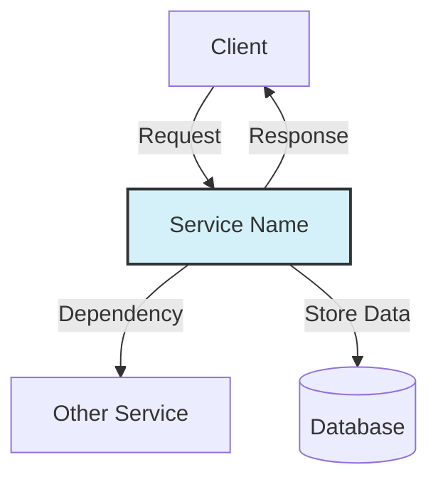
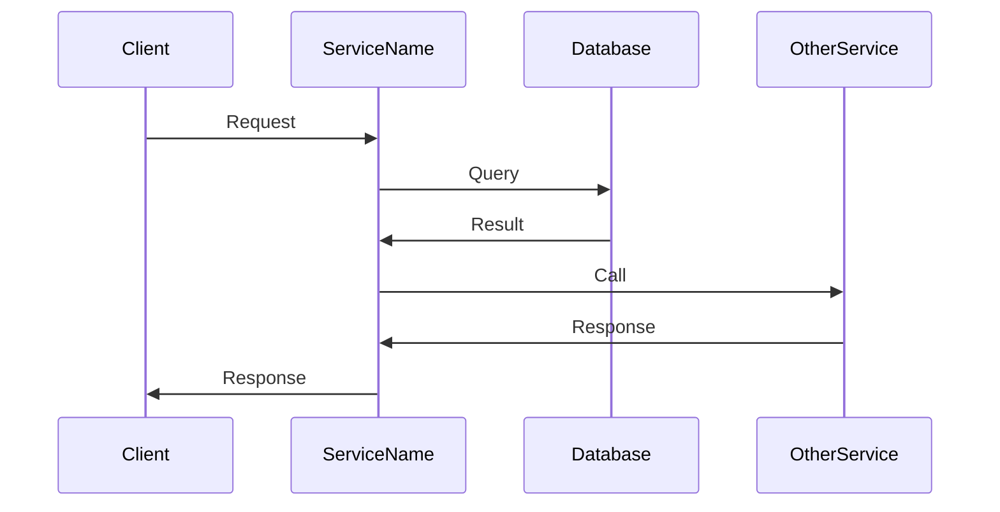

# [Service Name] Service Documentation

## 1. Service Overview

### Purpose

[Provide a clear, concise description of the service's purpose and its role in the overall system.]

### Key Features

- [Feature 1]
- [Feature 2]
- [Feature 3]

### Goals and Non-Goals

|          | ✅ In Scope      | ❌ Out of Scope      |
| -------- | ---------------- | -------------------- |
| [Area 1] | [In-scope items] | [Out-of-scope items] |
| [Area 2] | [In-scope items] | [Out-of-scope items] |
| [Area 3] | [In-scope items] | [Out-of-scope items] |

## 2. Architecture

### High-Level Architecture



[Explain the high-level architecture diagram, describing the main components and their interactions.]

### Component Breakdown

#### [Component 1]

[Describe the component's purpose, responsibilities, and implementation details.]

#### [Component 2]

[Describe the component's purpose, responsibilities, and implementation details.]

### Integration with Other Services

| Service     | Integration Type             | Purpose                  |
| ----------- | ---------------------------- | ------------------------ |
| [Service 1] | [Service Binding/Queue/etc.] | [Purpose of integration] |
| [Service 2] | [Service Binding/Queue/etc.] | [Purpose of integration] |

## 3. Data Model

### Database Schema

```sql
-- Example schema
CREATE TABLE [table_name] (
  id TEXT PRIMARY KEY,
  field1 TEXT NOT NULL,
  field2 INTEGER,
  createdAt INTEGER NOT NULL
);

CREATE INDEX idx_[table_name]_field1 ON [table_name](field1);
```

[Explain the database schema, including tables, fields, relationships, and indexes.]

### Key Data Structures

```typescript
// Example TypeScript interface
interface ExampleData {
  id: string;
  field1: string;
  field2?: number;
  createdAt: number;
}
```

[Describe the key data structures used by the service, including their purpose and usage.]

### Data Flow



[Explain the data flow diagram, describing how data moves through the service.]

## 4. API Reference

### RPC Methods

#### `method1(params)`

**Purpose**: [Describe what this method does]

**Parameters**:

```typescript
interface Method1Params {
  param1: string;
  param2?: number;
}
```

**Returns**:

```typescript
interface Method1Result {
  result1: string;
  result2: number;
}
```

**Example**:

```typescript
// Example usage
const result = await env.SERVICE_NAME.method1({
  param1: 'value',
  param2: 42,
});
```

**Error Handling**:

- [Error condition 1]: [Error response]
- [Error condition 2]: [Error response]

#### `method2(params)`

[Repeat the above structure for each method]

### Error Handling

[Describe how errors are handled by the service, including error types, error responses, and retry mechanisms.]

## 5. Configuration

### Environment Variables

| Variable     | Description   | Required | Default         |
| ------------ | ------------- | -------- | --------------- |
| `VARIABLE_1` | [Description] | Yes/No   | [Default value] |
| `VARIABLE_2` | [Description] | Yes/No   | [Default value] |

### Wrangler Configuration

```toml
# Example wrangler.toml
name = "service-name"
main = "src/index.ts"

[[kv_namespaces]]
binding = "KV_BINDING"
id = "..."

[[d1_databases]]
binding = "DB"
database_name = "database-name"

[[queues.producers]]
binding = "QUEUE_BINDING"
queue = "queue-name"

[vars]
ENVIRONMENT = "production"
```

[Explain the Wrangler configuration, including bindings, environment variables, and other settings.]

### Secrets Management

[Describe how secrets are managed for this service, including how to set up and rotate secrets.]

## 6. Deployment

### Deployment Process

1. [Step 1]
2. [Step 2]
3. [Step 3]

### Required Resources

- [Resource 1]
- [Resource 2]
- [Resource 3]

### Rollout Strategy

[Describe the recommended rollout strategy for this service, including phased deployment, testing, and verification steps.]

## 7. Monitoring and Observability

### Key Metrics

| Metric            | Description   | Alert Threshold |
| ----------------- | ------------- | --------------- |
| `service.metric1` | [Description] | [Threshold]     |
| `service.metric2` | [Description] | [Threshold]     |

### Logging

[Describe the logging approach for this service, including log levels, key log events, and how to access logs.]

### Alerts

[Describe the alerts configured for this service, including what triggers them and how to respond.]

## 8. Troubleshooting

### Common Issues

#### Issue 1: [Description]

**Symptoms**:

- [Symptom 1]
- [Symptom 2]

**Possible Causes**:

- [Cause 1]
- [Cause 2]

**Resolution Steps**:

1. [Step 1]
2. [Step 2]
3. [Step 3]

#### Issue 2: [Description]

[Repeat the above structure for each common issue]

### Debugging Techniques

[Describe techniques for debugging issues with this service, including how to use logs, metrics, and other tools.]

### Recovery Procedures

[Describe procedures for recovering from failures, including rollbacks, data recovery, and service restarts.]

## 9. Development

### Local Development Setup

[Describe how to set up a local development environment for this service.]

### Testing

[Describe how to test this service, including unit tests, integration tests, and end-to-end tests.]

### Common Development Tasks

[Describe common development tasks for this service, such as adding new features, modifying existing features, and fixing bugs.]

## 10. References

- [Link to related documentation 1]
- [Link to related documentation 2]
- [Link to related documentation 3]
