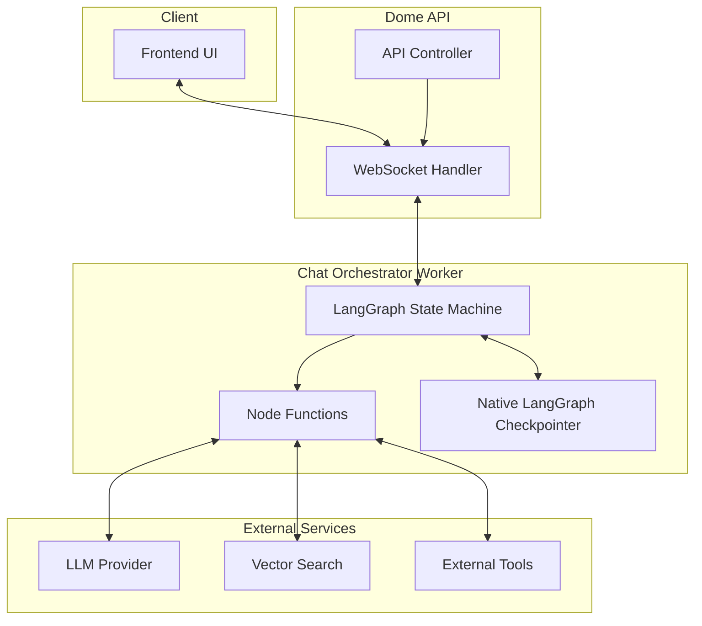
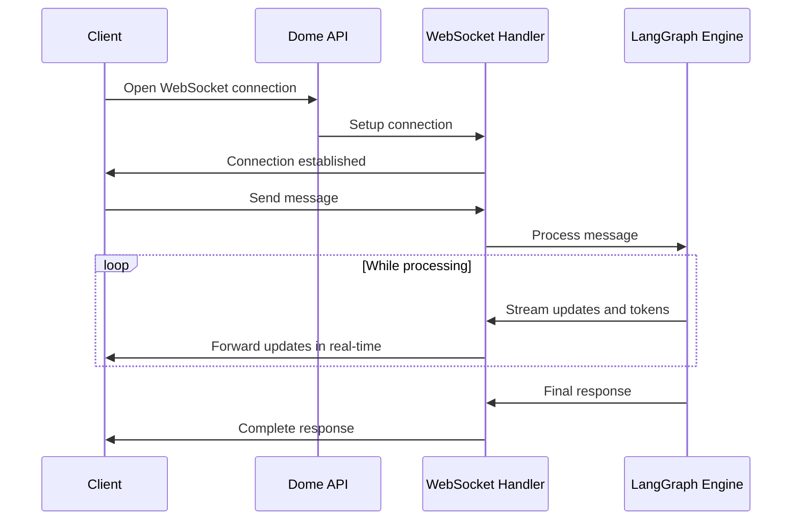
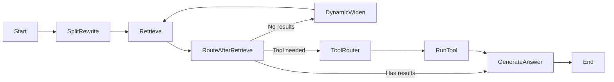
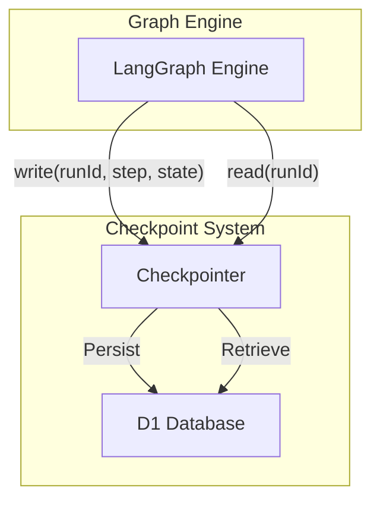
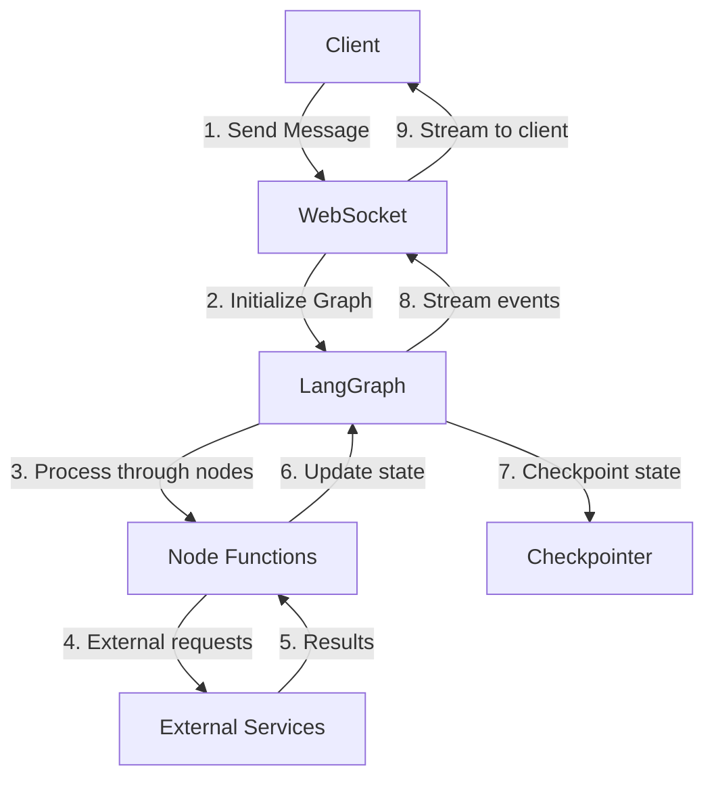
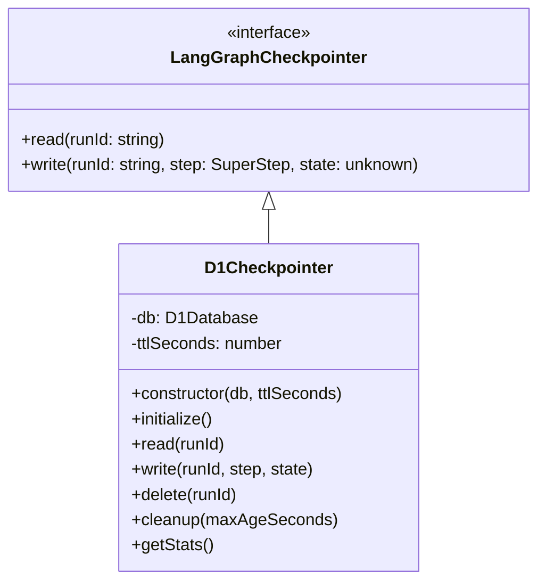
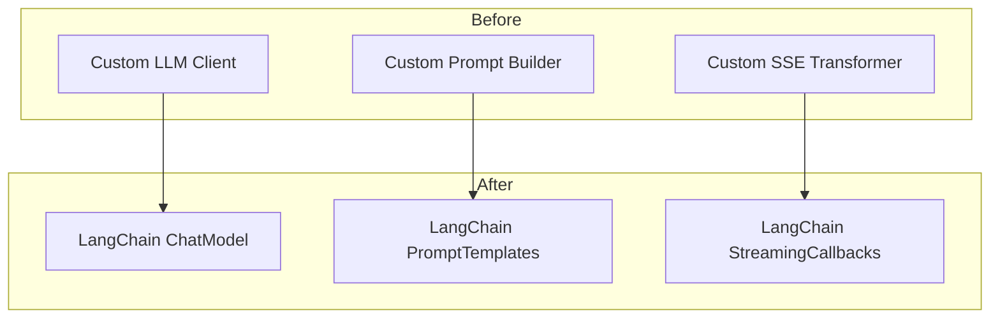
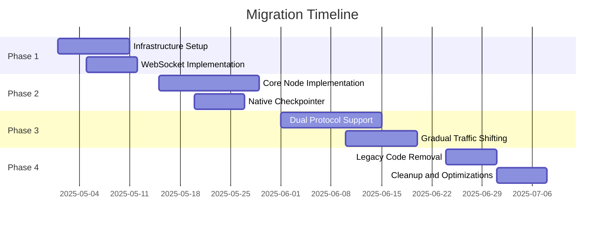

# Chat Service Refactoring Architecture Plan

## 1. Executive Summary

This document presents an architectural plan for refactoring the Dome Chat Service to fully embrace Langchain's native capabilities. The goal is to create a more maintainable, extensible system with improved performance, leveraging modern tools and patterns. This plan focuses on the high-level architectural decisions rather than implementation details.

## 2. Current Architecture Assessment

### 2.1 Current State

The existing chat implementation consists of:
- **ChatController**: Handles HTTP requests and input validation
- **ChatService**: Orchestrates chat flow in a linear process
- **PromptBuilder**: Builds prompts with retrieved context
- **LlmClient**: Interfaces with the AI service
- **SearchService**: Retrieves relevant documents

The current flow is linear and monolithic:
1. Validate input
2. Retrieve context (optional)
3. Build prompt with context
4. Call LLM
5. Return response

The current streaming implementation uses Server-Sent Events (SSE) with a custom transformer that handles token streaming from the LLM service.

### 2.2 Limitations

- **Monolithic design**: Tightly coupled components with limited separation of concerns
- **Limited extensibility**: Difficult to add new features or modify the flow
- **Custom streaming**: Uses custom SSE transformer rather than Langchain's built-in streaming
- **Custom checkpointing**: Uses bespoke D1 implementation instead of leveraging Langchain's checkpointing
- **Server-Sent Events**: One-way communication is limited compared to WebSockets
- **Redundant LLM implementation**: Duplicates logic that Langchain already provides

## 3. Target Architecture

### 3.1 Architecture Overview



### 3.2 Key Components

#### 3.2.1 WebSocket Handler

A new WebSocket implementation that:
- Establishes bidirectional communication with clients
- Handles message parsing and validation
- Manages connection lifecycle and error states
- Provides efficient streaming with reduced overhead



#### 3.2.2 LangGraph State Machine

Fully leverage Langchain's native `StateGraph` implementation:
- Define state interfaces aligned with Langchain patterns
- Implement specialized node functions
- Configure conditional routing logic
- Use reducers for state management
- Leverage built-in streaming capabilities



#### 3.2.3 Native Checkpointer

Implement Langchain's built-in `@langchain/langgraph-checkpoint` interface:
- Use D1 as the persistence layer
- Support conversation resumption
- Enable multi-turn conversation history
- Provide efficient state serialization/deserialization



#### 3.2.4 Consolidated LLM Service

Adopt Langchain's built-in LLM client abstractions:
- Use `ChatCloudflareWorkers` adapter for Cloudflare AI platform
- Leverage Langchain's token management and retry logic
- Use streaming functionality provided by Langchain
- Support model switching and fallbacks

### 3.3 Data Flow



## 4. WebSocket Implementation

### 4.1 WebSocket Protocol Design

The WebSocket communication will use a structured message format with event types:

```typescript
// Client-to-server messages
interface ClientMessage {
  type: 'message' | 'feedback' | 'abort' | 'resume';
  payload: {
    // Different payload structures based on type
    messageId?: string;
    content?: string;
    conversationId?: string;
    feedback?: {
      rating: number;
      comments?: string;
    };
  };
}

// Server-to-client messages
interface ServerMessage {
  type: 'workflow_step' | 'token' | 'sources' | 'error' | 'complete';
  payload: {
    // Different payload structures based on type
    step?: string;
    token?: string;
    text?: string;
    sources?: Source[];
    error?: {
      code: string;
      message: string;
    };
  };
}
```

### 4.2 Benefits Over SSE

1. **Bidirectional Communication**: Enables client feedback during generation
2. **Reduced Overhead**: Lower header overhead compared to SSE
3. **Connection State Management**: Built-in handling of connection state
4. **Native Error Handling**: Better error recovery mechanisms
5. **Improved Performance**: More efficient binary data transmission

### 4.3 Compatibility Strategy

To ensure a smooth transition:
- Implement a dual-protocol period where both SSE and WebSockets are supported
- Add protocol negotiation in the API to detect client capabilities
- Create an SSE-to-WebSocket adapter for backward compatibility

## 5. Langchain Native Checkpointer Implementation

### 5.1 Architecture



### 5.2 Schema Design

```sql
CREATE TABLE IF NOT EXISTS checkpoints (
  run_id TEXT PRIMARY KEY,
  conversation_id TEXT NOT NULL,
  user_id TEXT NOT NULL,
  step TEXT NOT NULL,
  state_json TEXT NOT NULL,
  created_at INTEGER NOT NULL,
  updated_at INTEGER NOT NULL
);

CREATE INDEX idx_checkpoints_conversation_id ON checkpoints(conversation_id);
CREATE INDEX idx_checkpoints_user_id ON checkpoints(user_id);
CREATE INDEX idx_checkpoints_updated_at ON checkpoints(updated_at);
```

### 5.3 State Management Strategy

- **Incremental Updates**: Store only state differences to minimize storage requirements
- **TTL Management**: Implement automatic cleanup of old checkpoints
- **Cache Layer**: Add in-memory caching for frequently accessed state
- **Compression**: Implement optional compression for large state objects

## 6. LLM Service Consolidation

### 6.1 Langchain Integration



### 6.2 Model Configuration

```typescript
// Example configuration pattern
interface ModelConfiguration {
  provider: 'cloudflare' | 'openai' | 'anthropic';
  model: string;
  temperature: number;
  maxTokens: number;
  streaming: boolean;
  timeout: number;
  fallbacks?: {
    models: string[];
    maxAttempts: number;
  };
}
```

### 6.3 Integrated Callbacks

- Leverage Langchain's callback system for observability
- Connect callbacks to metrics and logging systems
- Implement custom callbacks for specialized business logic

## 7. Migration Strategy

### 7.1 Phased Approach



### 7.2 Incremental Implementation

1. **Shadow Mode**: Run new implementation in parallel, compare results without affecting users
2. **Feature Flags**: Enable new system for specific user segments
3. **Percentage Rollout**: Gradually increase traffic to new system
4. **Full Cutover**: Complete transition after stability is confirmed

### 7.3 Rollback Plan

- Maintain dual systems during transition
- Implement quick-switch capability in the API layer
- Ensure data compatibility between systems

## 8. Architecture Decisions and Tradeoffs

### 8.1 WebSockets vs. SSE

| Factor | WebSockets | SSE | Decision Rationale |
|--------|------------|-----|-------------------|
| Bidirectional | Yes | No | WebSockets enable client feedback during generation |
| Connection overhead | Moderate | High | WebSockets have lower overhead per message |
| Browser support | Excellent | Excellent | Both have good support, not a deciding factor |
| Implementation complexity | Moderate | Low | The additional complexity is justified by the benefits |
| Scalability | Excellent | Good | WebSockets scale better with proper implementation |

### 8.2 Native vs. Custom Checkpointer

| Factor | Native | Custom | Decision Rationale |
|--------|--------|--------|-------------------|
| Maintenance | Low | High | Using native reduces long-term maintenance burden |
| Integration | Seamless | Complex | Native interfaces directly with Langchain internals |
| Flexibility | Moderate | High | Some flexibility is traded for standardization |
| Performance | Optimized | Variable | Native implementation is optimized by Langchain team |
| Future-proof | Yes | No | Will automatically benefit from upstream improvements |

### 8.3 Consolidated LLM Service

| Factor | Langchain | Custom | Decision Rationale |
|--------|-----------|--------|-------------------|
| Feature set | Comprehensive | Limited | Langchain offers more built-in capabilities |
| Development speed | Fast | Slow | Leveraging existing code accelerates development |
| Control | Medium | High | Sufficient control while reducing maintenance |
| Ecosystem integration | Strong | Weak | Better integration with other Langchain components |
| Community support | Active | None | Benefits from community improvements and fixes |

## 9. Performance Considerations

### 9.1 Scaling Strategy

- **Worker Isolation**: Deploy on dedicated workers for resource isolation
- **Connection Management**: Implement connection pooling for external services
- **State Size Optimization**: Prune conversation history to manage memory usage
- **Caching Layer**: Implement strategic caching of common responses

### 9.2 Resource Optimization

- Implement token budget management
- Use streaming to reduce time-to-first-token
- Optimize checkpoint frequency based on conversation dynamics
- Implement background checkpointing to avoid blocking the main flow

## 10. Security and Compliance

### 10.1 WebSocket Security

- Implement authentication token validation for all WebSocket connections
- Apply rate limiting on connection establishment
- Implement message validation to prevent malicious inputs
- Set appropriate timeouts for inactive connections

### 10.2 Data Protection

- Ensure all persisted state is properly sanitized
- Implement TTL for all user data
- Provide user data export and deletion capabilities
- Enable audit logging for all operations

## 11. Observability

### 11.1 Metrics

- **Connection metrics**: Connection count, duration, errors
- **Message metrics**: Message count, size, processing time
- **LLM metrics**: Token usage, latency, error rates
- **Node metrics**: Execution time per node, success/failure rates
- **Checkpoint metrics**: Size, read/write latency, cache hit ratio

### 11.2 Logging Strategy

- Implement structured logging for all components
- Add correlation IDs for tracing requests across services
- Log key state transitions with sanitized data
- Implement sampling for high-volume events

## 12. Conclusion

This architectural plan provides a comprehensive blueprint for refactoring the Chat Service to fully embrace Langchain's native capabilities. By adopting WebSockets, implementing native checkpointers, and consolidating the LLM service, we will create a more maintainable, extensible, and performant system.

The phased migration approach ensures minimal disruption while providing clear rollback paths. This refactoring will position the Chat Service for future growth and improvement, allowing easier integration of new features and capabilities.