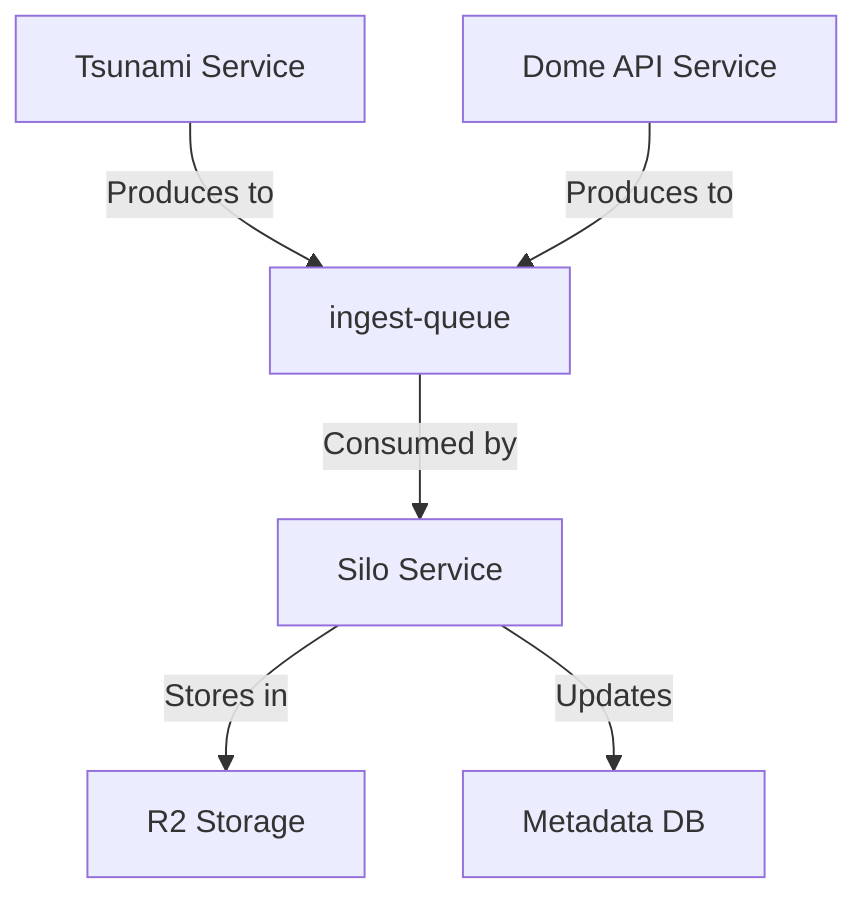

# Queue-Based Content Ingestion System Design

This document outlines the plan for implementing a queue-based ingestion system where the silo service consumes from an `ingest-queue` and both tsunami and dome-api act as producers.

## Current Architecture

Currently, content ingestion works as follows:

1. **Silo Service**:

   - Already has queue processing capabilities in its `queue` method
   - Currently processes two queues:
     - `silo-content-uploaded`: For R2 object-created events
     - `enriched-content`: For enriched content from AI processor
   - Exposes RPC methods like `simplePut` for direct content ingestion

2. **Tsunami Service**:

   - Ingests content from external sources (GitHub repositories)
   - Directly calls Silo's RPC methods to store content

3. **Dome API Service**:
   - Handles user-generated content
   - Directly calls Silo's RPC methods to store content

## Proposed Architecture

We'll implement a queue-based ingestion system with the following components:



## Implementation Plan

### 1. Use Existing SimplePut Schema for Ingest Queue

We'll use the existing `siloSimplePutSchema` for the ingest queue messages, as it already contains all the necessary fields:

```typescript
// In packages/common/src/types/siloContent.ts (already exists)
export const siloSimplePutSchema = z.object({
  id: z.string().optional(),
  category: ContentCategoryEnum.default('note'),
  mimeType: MimeTypeSchema.default('text/markdown'),
  content: z.union([z.string(), z.instanceof(ArrayBuffer)]).refine(
    val => {
      // Check if content is not empty
      if (typeof val === 'string') {
        return val.length > 0;
      }
      return val.byteLength > 0;
    },
    {
      message: 'Content cannot be empty',
    },
  ),
  userId: z.string().optional(),
  metadata: z.record(z.string(), z.any()).optional(),
});

export type SiloSimplePutInput = z.input<typeof siloSimplePutSchema>;
```

### 2. Update Silo Service to Consume from Ingest Queue

Modify the Silo service to process messages from the ingest queue:

```typescript
// In services/silo/src/index.ts
async queue(batch: MessageBatch<R2Event | EnrichedContentMessage | SiloSimplePutInput>) {
  await wrap(
    { op: 'queue', queue: batch.queue, size: batch.messages.length, ...this.env },
    async () => {
      try {
        // Determine which queue we're processing
        if (batch.queue === 'silo-content-uploaded') {
          // Existing code for processing R2 events
          // ...
        } else if (batch.queue === 'enriched-content') {
          // Existing code for processing enriched content
          // ...
        } else if (batch.queue === 'ingest-queue') {
          // Process ingest queue messages
          const promises = batch.messages.map(async message => {
            try {
              // Validate the message
              const ingestMessage = siloSimplePutSchema.parse(message.body);

              // Process the ingest message
              await this.services.content.processIngestMessage(ingestMessage);

              // Acknowledge the message
              message.ack();
            } catch (error) {
              getLogger().error(
                { error, messageId: message.id },
                'Error processing ingest queue message',
              );

              // Acknowledge the message to avoid retries for validation errors
              if (error instanceof z.ZodError) {
                message.ack();
              } else {
                throw error; // Allow retry for other errors
              }
            }
          });

          await Promise.all(promises);
        } else {
          getLogger().warn({ queue: batch.queue }, 'Unknown queue');
        }
      } catch (error) {
        metrics.increment('silo.queue.errors', 1);
        logError(getLogger(), error, 'Queue processing error', { queue: batch.queue });
        throw error; // Allow retry
      }
    },
  );
}
```

### 3. Add Content Controller Method to Process Ingest Messages

Add a new method to the ContentController to process ingest messages:

```typescript
// In services/silo/src/controllers/contentController.ts
async processIngestMessage(message: SiloSimplePutInput): Promise<void> {
  try {
    const { userId, content, category, mimeType, metadata } = message;
    const id = message.id ?? ulid();

    logger.info(
      {
        id,
        userId,
        category,
        mimeType,
        contentSize: this.contentSize(content),
      },
      'Processing ingest queue message',
    );

    // Store the content in R2
    const r2Key = this.buildR2Key('content', id);
    await this.r2Service.putObject(
      r2Key,
      content,
      this.buildMetadata({ userId, category, mimeType, custom: metadata }),
    );

    // Update metrics
    metrics.increment('silo.ingest_queue.processed');

    // The R2 event will trigger metadata creation via the silo-content-uploaded queue
    logger.info({ id, userId, category, mimeType }, 'Content ingested successfully');
  } catch (error) {
    metrics.increment('silo.ingest_queue.errors');
    logError(logger, error, 'Error processing ingest queue message', { messageId: message.id });
    throw error;
  }
}
```

### 4. Update Tsunami Service to Use Ingest Queue

Modify the Tsunami service to send content to the ingest queue instead of using RPC:

```typescript
// In services/tsunami/src/services/siloService.ts
export class SiloService {
  constructor(private env: Env) {}

  async upload(contents: SiloSimplePutInput[]): Promise<string[]> {
    const results = await Promise.all(contents.map(c => this.uploadSingle(c)));
    return results.map(r => r.id);
  }

  async uploadSingle(content: SiloSimplePutInput): Promise<SiloSimplePutResponse> {
    const id = content.id || ulid();
    const createdAt = Math.floor(Date.now() / 1000);

    // Create a message for the ingest queue
    const message: SiloSimplePutInput = {
      id,
      userId: content.userId || null,
      content: content.content,
      category: content.category || 'note',
      mimeType: content.mimeType || 'text/markdown',
      metadata: content.metadata,
    };

    // Send the message to the ingest queue
    await this.env.INGEST_QUEUE.send(message);

    // Return a response with the ID
    return {
      id,
      category: content.category || 'note',
      mimeType: content.mimeType || 'text/markdown',
      size:
        typeof content.content === 'string'
          ? new TextEncoder().encode(content.content).length
          : content.content.byteLength,
      createdAt,
    };
  }
}
```

### 5. Update Dome API Service to Use Ingest Queue

Modify the Dome API service to send content to the ingest queue:

```typescript
// In services/dome-api/src/controllers/siloController.ts
async ingest(c: Context<{ Bindings: Bindings; Variables: UserIdContext }>): Promise<Response> {
  try {
    this.logger.info({ path: c.req.path, method: c.req.method }, 'Note ingestion started');

    // Validate request body
    const body = await c.req.json();
    this.logger.info({ requestBody: body }, 'Received ingest request data');
    const validatedData = ingestSchema.parse(body);
    this.logger.info({ ingestRequest: validatedData }, 'Validated Ingest data');

    // Get user ID from context (set by middleware)
    const userId = c.get('userId');

    // Generate title if not provided
    const title = validatedData.title || validatedData.content.split('\n')[0].substring(0, 50);

    // Create a message for the ingest queue
    const message: SiloSimplePutInput = {
      userId,
      content: validatedData.content,
      category: (validatedData.category || 'note') as ContentCategory,
      mimeType: validatedData.mimeType || 'text/markdown',
      metadata: {
        title,
        ...validatedData.metadata,
      },
    };

    // Send the message to the ingest queue
    await c.env.INGEST_QUEUE.send(message);

    // Return success response
    return c.json(
      {
        success: true,
      },
      201,
    );
  } catch (error) {
    // Error handling code...
  }
}
```

### 6. Update Wrangler Configuration

Update the wrangler.toml files to include the new queue binding:

```toml
# In services/silo/wrangler.toml
[[queues.consumers]]
queue = "ingest-queue"
max_batch_size = 10
max_batch_timeout = 5
max_retries = 3

# In services/tsunami/wrangler.toml
[[queues.producers]]
queue = "ingest-queue"
binding = "INGEST_QUEUE"

# In services/dome-api/wrangler.toml
[[queues.producers]]
queue = "ingest-queue"
binding = "INGEST_QUEUE"
```

### 7. Update Environment Types

Update the environment types in each service to include the new queue bindings:

```typescript
// In services/silo/src/types.ts
interface Env {
  // Existing bindings...
  INGEST_QUEUE: Queue<SiloSimplePutInput>;
}

// In services/tsunami/src/types.ts
interface Env {
  // Existing bindings...
  INGEST_QUEUE: Queue<SiloSimplePutInput>;
}

// In services/dome-api/src/types.ts
interface Bindings {
  // Existing bindings...
  INGEST_QUEUE: Queue<SiloSimplePutInput>;
}
```

### 8. Remove RPC Methods from Silo Service

Since we're completely replacing the RPC methods with the queue-based approach, we'll need to remove the `simplePut` method from the Silo service:

```typescript
// In services/silo/src/index.ts
// Remove the following method:
async simplePut(data: SiloSimplePutInput): Promise<SiloSimplePutResponse> {
  // ...
}
```

## Benefits of This Approach

1. **Decoupling**: Services are decoupled, allowing them to operate independently
2. **Batch Processing**: Silo can process content in batches, improving efficiency
3. **Resilience**: Queue-based architecture provides better resilience to failures
4. **Scalability**: Easier to scale as load increases
5. **Consistency**: Unified ingestion path for all content sources

## Implementation Considerations

1. **Queue Sizing**: Configure appropriate queue sizes based on expected load
2. **Error Handling**: Implement robust error handling for queue operations
3. **Monitoring**: Add metrics and logging for queue operations
4. **Testing**: Thoroughly test the new queue-based ingestion path

## Next Steps

1. Update the Silo service to consume from the ingest queue
2. Modify Tsunami and Dome API to produce to the ingest queue
3. Update configuration and environment types
4. Remove the RPC methods from Silo service
5. Test the new ingestion flow
6. Monitor performance and make adjustments as needed
