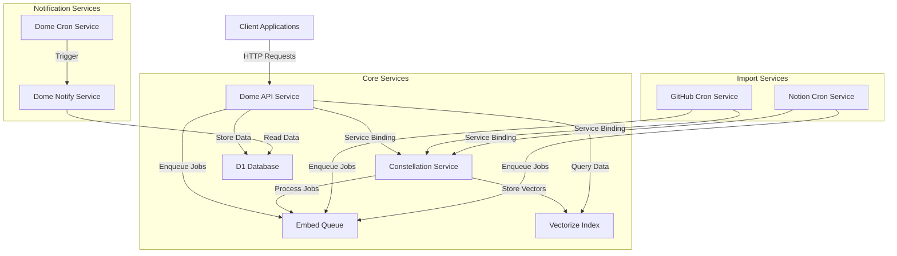

# Dome Service Layer Architecture

This document provides an overview of the service layer architecture in the Dome application, focusing on the relationships between services and their responsibilities.

## Overview

The Dome application follows a microservices architecture using Cloudflare Workers. Each service is responsible for a specific domain of functionality, with clear interfaces and boundaries. Services communicate with each other through service bindings, queues, and shared data stores.

## Service Architecture



## Service Descriptions

### Core Services

#### Dome API Service

The Dome API Service is the primary entry point for client applications. It provides RESTful endpoints for managing notes, performing searches, and handling user data.

**Responsibilities:**
- Expose HTTP endpoints for client applications
- Handle authentication and authorization
- Manage note CRUD operations
- Coordinate with other services for specialized operations
- Enqueue embedding jobs for text processing

**Key Integrations:**
- Constellation Service: For embedding and vector search operations
- D1 Database: For storing structured data
- Embed Queue: For asynchronous embedding processing

[Learn more about the Dome API Service](./dome-api/README.md)

#### Constellation Service

The Constellation Service is a dedicated worker for embedding and vector search operations. It provides a typed RPC interface for other services to interact with.

**Responsibilities:**
- Process embedding jobs from the queue
- Generate vector embeddings using Workers AI
- Store and retrieve vectors from the Vectorize index
- Provide vector search capabilities

**Key Integrations:**
- Workers AI: For generating embeddings
- Vectorize Index: For storing and querying vectors
- Embed Queue: For consuming embedding jobs

[Learn more about the Constellation Service](./constellation/README.md)

### Import Services

#### GitHub Cron Service

The GitHub Cron Service periodically imports content from GitHub repositories for embedding and search.

**Responsibilities:**
- Fetch content from GitHub repositories
- Parse and normalize content
- Enqueue embedding jobs for processing

#### Notion Cron Service

The Notion Cron Service periodically imports content from Notion workspaces for embedding and search.

**Responsibilities:**
- Fetch content from Notion workspaces
- Parse and normalize content
- Enqueue embedding jobs for processing

### Notification Services

#### Dome Notify Service

The Dome Notify Service handles sending notifications to users based on various triggers.

**Responsibilities:**
- Send email notifications
- Send in-app notifications
- Handle notification preferences

#### Dome Cron Service

The Dome Cron Service handles scheduled tasks and periodic operations.

**Responsibilities:**
- Trigger periodic tasks
- Clean up stale data
- Generate reports

## Service Layer Design Principles

The Dome service layer follows these key design principles:

1. **Single Responsibility**: Each service has a clear, focused responsibility
2. **Loose Coupling**: Services interact through well-defined interfaces
3. **Asynchronous Processing**: Heavy operations are offloaded to background processing
4. **Typed Interfaces**: All service interfaces are strongly typed
5. **Centralized Concerns**: Cross-cutting concerns like embedding are centralized in dedicated services

## Service Communication Patterns

### Service Bindings

Service bindings provide a type-safe RPC interface between workers. This is the primary method for synchronous service-to-service communication.

Example:
```typescript
// In wrangler.toml
[[services]]
binding = "CONSTELLATION"
service = "constellation"
environment = "production"

// In code
const results = await env.CONSTELLATION.query(searchText, filter, topK);
```

### Queues

Queues are used for asynchronous processing and background jobs. They provide a way to offload heavy operations from user-facing services.

Example:
```typescript
// Enqueue a job
await env.EMBED_QUEUE.send({
  userId: "user123",
  noteId: "note456",
  text: "Content to embed",
  created: Date.now(),
  version: 1,
});

// Process a job (in consumer)
export default {
  async queue(batch, env) {
    for (const message of batch.messages) {
      await processJob(message.body);
    }
  }
};
```

### Shared Data Stores

Services share data through structured data stores like D1 Database and Vectorize. Each service is responsible for a specific domain of data.

## Service Development Guidelines

When developing or modifying services:

1. **Maintain Clear Boundaries**: Keep service responsibilities clear and focused
2. **Document Interfaces**: Ensure all service interfaces are well-documented
3. **Handle Failures Gracefully**: Implement proper error handling and retries
4. **Monitor Performance**: Add metrics and logging for observability
5. **Test Thoroughly**: Write unit and integration tests for service functionality
6. **Consider Scale**: Design services to scale horizontally when possible

## Migration Considerations

When migrating between service architectures:

1. **Phased Approach**: Use a phased migration approach to minimize risk
2. **Parallel Operation**: Run old and new systems in parallel during transition
3. **Feature Flags**: Use feature flags to control migration rollout
4. **Monitoring**: Implement comprehensive monitoring during migration
5. **Rollback Plan**: Always have a clear rollback plan in case of issues

For more details on the migration from the previous architecture to the current one, see the [Constellation Migration Plan](./constellation/MIGRATION.md).