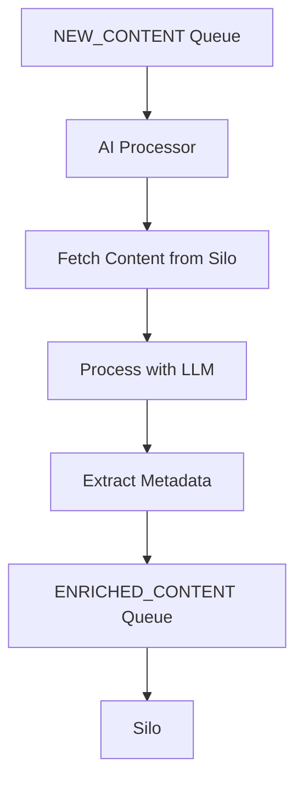

# AI Processor Service

A service that processes content from Silo using AI to extract metadata such as summaries, TODOs, reminders, and topics.

## Overview

The AI Processor service listens to the `NEW_CONTENT` queue for new content notifications, processes the content using LLM, and publishes the enriched metadata to the `ENRICHED_CONTENT` queue for consumption by other services.



## Features

- Content summarization
- TODO extraction with priorities and due dates
- Reminder extraction with times
- Topic/category identification
- Content type-specific processing (notes, code, articles)
- Stateless processing architecture

## Configuration

The service is configured via environment variables in `wrangler.toml`:

- `LOG_LEVEL`: Logging level (debug, info, warn, error)
- `ENVIRONMENT`: Deployment environment (dev, staging, prod)
- `VERSION`: Service version

## Development

### Prerequisites

- Node.js 18+
- pnpm
- Wrangler CLI

### Setup

```bash
# Install dependencies
pnpm install

# Build the service
pnpm build

# Run locally
pnpm dev
```

### Deployment

```bash
# Deploy to dev environment
pnpm deploy:dev

# Deploy to staging environment
pnpm deploy:staging

# Deploy to production environment
pnpm deploy:prod
```

## Architecture

### Components

- **Queue Consumer**: Processes messages from the `NEW_CONTENT` queue
- **LLM Service**: Processes content with AI using content type-specific prompts
- **Silo Service**: Fetches content from the Silo service

### Processing Flow

1. Receive message from `NEW_CONTENT` queue
2. Fetch content from Silo
3. Process content with LLM based on content type
4. Extract metadata (summary, TODOs, reminders, topics)
5. Publish enriched metadata to `ENRICHED_CONTENT` queue
6. Silo consumes the enriched metadata and updates the content metadata

## Content Type Processing

The service uses different prompts for different content types:

- **Notes**: Extracts summaries, TODOs, reminders, and topics
- **Code**: Extracts description, TODOs from comments, key components, and language/framework information
- **Articles**: Extracts summary, key points, topics, and entities

## Error Handling

- Failed content fetching: Retries via queue retry mechanism
- LLM processing errors: Returns minimal metadata with error information
- Queue processing errors: Logs errors and allows queue retry mechanism to work