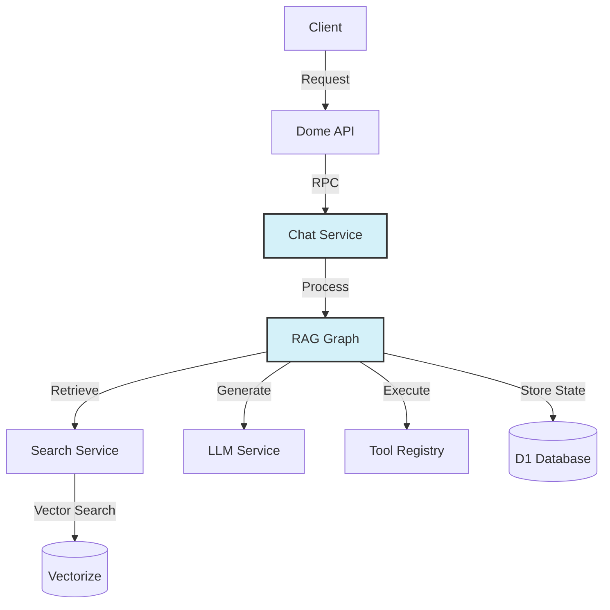
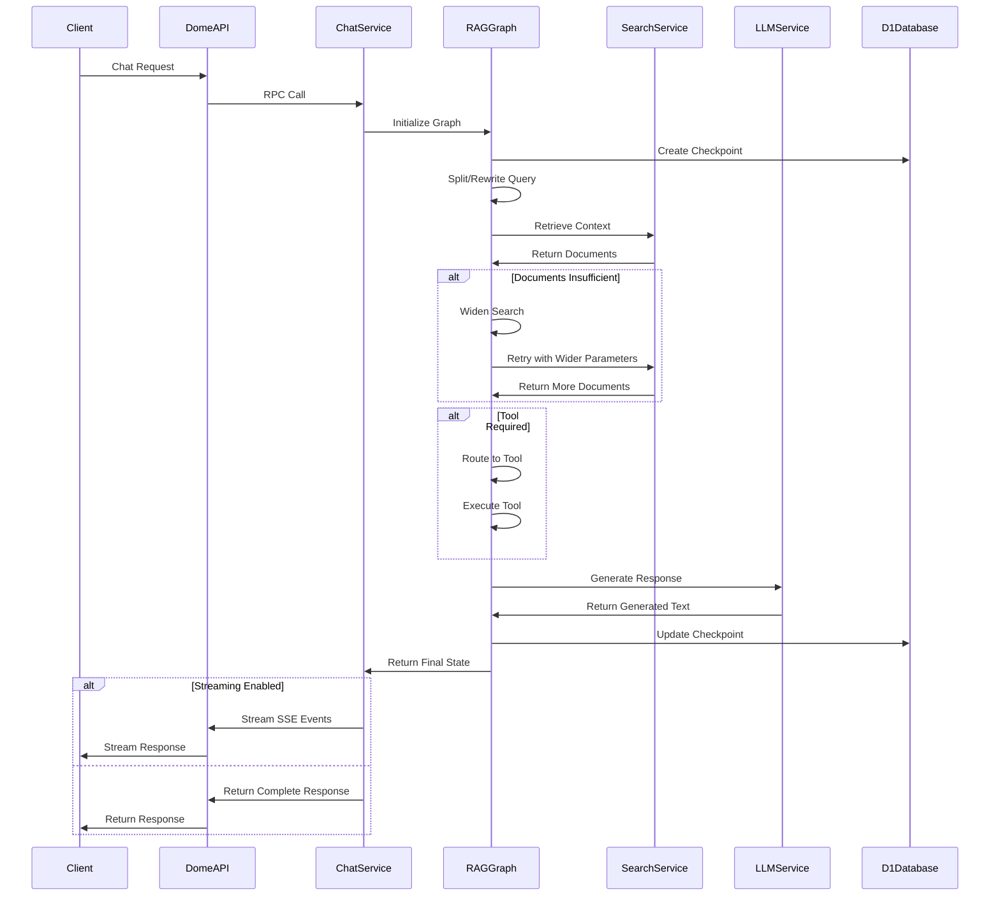

# Chat Service

## 1. Service Overview

### Purpose

The Chat Service is a core component of the Dome platform that provides conversational AI capabilities with Retrieval-Augmented Generation (RAG). It orchestrates the process of analyzing user queries, retrieving relevant context, and generating accurate, contextually-aware responses.

### Key Features

- **Retrieval-Augmented Generation (RAG)**: Enhances responses with relevant context from the user's knowledge base
- **Streaming Responses**: Supports real-time streaming of AI responses
- **Modular Graph Architecture**: Uses a directed graph of specialized nodes for flexible processing
- **Context Widening**: Dynamically adjusts search parameters to improve retrieval results
- **Tool Integration**: Can detect when specialized tools are needed and execute them
- **Observability**: Comprehensive logging, metrics, and tracing throughout the processing pipeline
- **Error Resilience**: Robust error handling at each processing step

### Goals and Non-Goals

|          | ✅ In Scope      | ❌ Out of Scope      |
| -------- | ---------------- | -------------------- |
| Functionality | Conversational AI with RAG, tool execution, context management | General-purpose AI, training custom models |
| Performance | Optimized retrieval, efficient token usage, response streaming | Real-time voice processing, video analysis |
| Integration | Cloudflare Workers, D1 database, Vectorize | Direct integration with external AI providers |
| Security | User data isolation, consent management | End-to-end encryption, advanced threat detection |

## 2. Architecture

### High-Level Architecture



The Chat Service follows a modular architecture centered around a directed graph of specialized processing nodes. When a request is received, it flows through this graph, with each node performing a specific function such as query analysis, context retrieval, tool execution, or response generation.

### Component Breakdown

#### RAG Graph

The core of the Chat Service is the RAG (Retrieval-Augmented Generation) Graph, which orchestrates the flow of processing through specialized nodes. The graph is implemented using LangChain's StateGraph, which manages state transitions and checkpointing.

Key nodes in the graph include:
- **Split/Rewrite**: Analyzes and potentially rewrites user queries for better retrieval
- **Retrieve**: Fetches relevant documents based on the query
- **Dynamic Widen**: Adjusts search parameters to improve retrieval results
- **Tool Router**: Determines if specialized tools are needed
- **Run Tool**: Executes selected tools
- **Generate Answer**: Creates the final response using an LLM

#### Client API

The Chat Service exposes a client API that provides methods for generating responses, streaming responses, and managing chat sessions. The client handles validation, error handling, and metrics tracking.

#### Search Service

Responsible for retrieving relevant documents based on user queries. It interfaces with Vectorize for semantic search and supports features like relevance scoring, document ranking, and search parameter adjustment.

#### LLM Service

Manages interactions with Large Language Models, handling prompt construction, token counting, and response processing. It supports different models and configurations.

### Integration with Other Services

| Service     | Integration Type             | Purpose                  |
| ----------- | ---------------------------- | ------------------------ |
| Dome API | Service Binding | Entry point for client requests |
| Vectorize | Database Binding | Vector storage for semantic search |
| D1 Database | Database Binding | State persistence and checkpointing |
| Logging Service | Package Import | Structured logging and observability |
| Metrics Service | Package Import | Performance and usage metrics |

## 3. Data Model

### Key Data Structures

```typescript
// Core state interface for the RAG graph
interface AgentState {
  // User information
  userId: string;

  // Conversation history
  messages: Message[];

  // Configuration options
  options: {
    enhanceWithContext: boolean;
    maxContextItems: number;
    includeSourceInfo: boolean;
    maxTokens: number;
    temperature?: number;
    modelId?: string;
  };

  // Intermediate processing data
  tasks?: {
    originalQuery?: string;
    rewrittenQuery?: string;
    requiredTools?: string[];
    toolResults?: ToolResult[];
    needsWidening?: boolean;
    wideningAttempts?: number;
    toolToRun?: string | null;
    queryAnalysis?: QueryAnalysis;
    // Additional task-related fields
  };

  // Retrieved documents
  docs?: Document[];

  // Generated content
  generatedText?: string;

  // Metadata for tracking and debugging
  metadata?: {
    startTime?: number;
    nodeTimings?: Record<string, number>;
    tokenCounts?: Record<string, number>;
    currentNode?: string;
    isFinalState?: boolean;
    errors?: Array<{
      node: string;
      message: string;
      timestamp: number;
    }>;
    traceId?: string;
    spanId?: string;
    executionTimeMs?: number;
  };
}
```

### Data Flow



## 4. API Reference

### Client API

The Chat Service exposes a client API for integration with other services:

```typescript
class ChatClient {
  // Generate a complete response
  async generateResponse(request: ChatRequest): Promise<ChatOrchestratorResponse>;
  
  // Stream a response as Server-Sent Events
  async streamResponse(request: ChatRequest): Promise<Response>;
  
  // Resume an existing chat session
  async resumeChatSession(request: ResumeChatRequest): Promise<Response>;
  
  // Administrative methods
  async getCheckpointStats(): Promise<any>;
  async cleanupCheckpoints(): Promise<{ deletedCount: number }>;
  async getDataRetentionStats(): Promise<any>;
  async cleanupExpiredData(): Promise<any>;
  async deleteUserData(userId: string): Promise<{ deletedCount: number }>;
  async recordConsent(
    userId: string,
    dataCategory: string,
    durationDays: number,
  ): Promise<{ success: boolean }>;
}
```

### Request Format

```typescript
interface ChatRequest {
  userId: string;
  messages: Array<{
    role: 'user' | 'assistant' | 'system';
    content: string;
    timestamp?: number;
  }>;
  options: {
    enhanceWithContext?: boolean;
    maxContextItems?: number;
    includeSourceInfo?: boolean;
    maxTokens?: number;
    temperature?: number;
    modelId?: string;
  };
  stream?: boolean;
  runId?: string;
}
```

### Response Format

```typescript
interface ChatOrchestratorResponse {
  response: string;
  sources?: Array<{
    id: string;
    title: string;
    source: string;
    url?: string | null;
    relevanceScore: number;
  }>;
  metadata?: {
    executionTimeMs: number;
    nodeTimings: Record<string, number>;
    tokenCounts: Record<string, number>;
  };
}
```

## 5. Configuration

### Environment Variables

| Variable     | Description   | Required | Default         |
| ------------ | ------------- | -------- | --------------- |
| `CHAT_MODEL` | Default LLM model to use | No | "gpt-4o" |
| `CHAT_TEMPERATURE` | Default temperature for LLM | No | 0.7 |
| `MAX_CONTEXT_TOKENS` | Maximum tokens for context | No | 8000 |
| `CHECKPOINT_TTL_SECONDS` | Time-to-live for checkpoints | No | 3600 |
| `ENABLE_TRACING` | Enable detailed tracing | No | false |
| `MIN_RELEVANCE_SCORE` | Minimum relevance score for docs | No | 0.7 |

## 6. Development

### Local Development Setup

1. Clone the repository
2. Install dependencies with `pnpm install`
3. Build the service with `pnpm build`
4. Run tests with `pnpm test`
5. Start the development server with `pnpm dev`

### Testing

The Chat Service includes several types of tests:

- **Unit Tests**: Test individual components in isolation
- **Integration Tests**: Test interactions between components
- **End-to-End Tests**: Test the complete request/response flow

Run tests with:

```bash
pnpm test
```

## 7. References

- [Chat RAG Graph Nodes Documentation](../docs/CHAT_RAG_GRAPH_NODES.md)
- [Chat RAG Graph Technical Documentation](../docs/CHAT_RAG_GRAPH_TECHNICAL_DOCUMENTATION.md)
- [LangChain StateGraph Documentation](https://js.langchain.com/docs/modules/chains/langgraph/)
- [Cloudflare Workers Documentation](https://developers.cloudflare.com/workers/)
