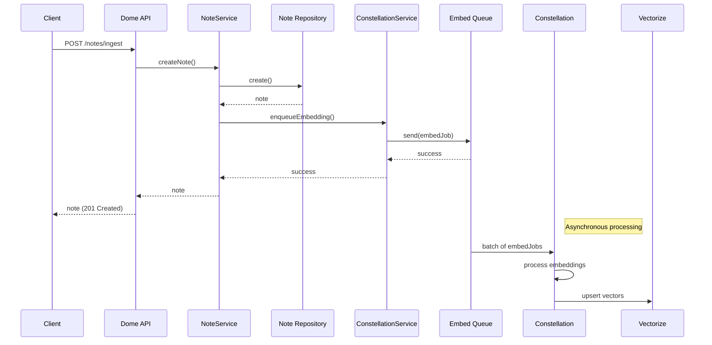
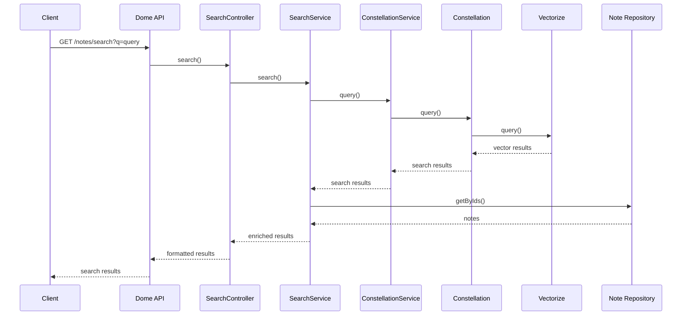
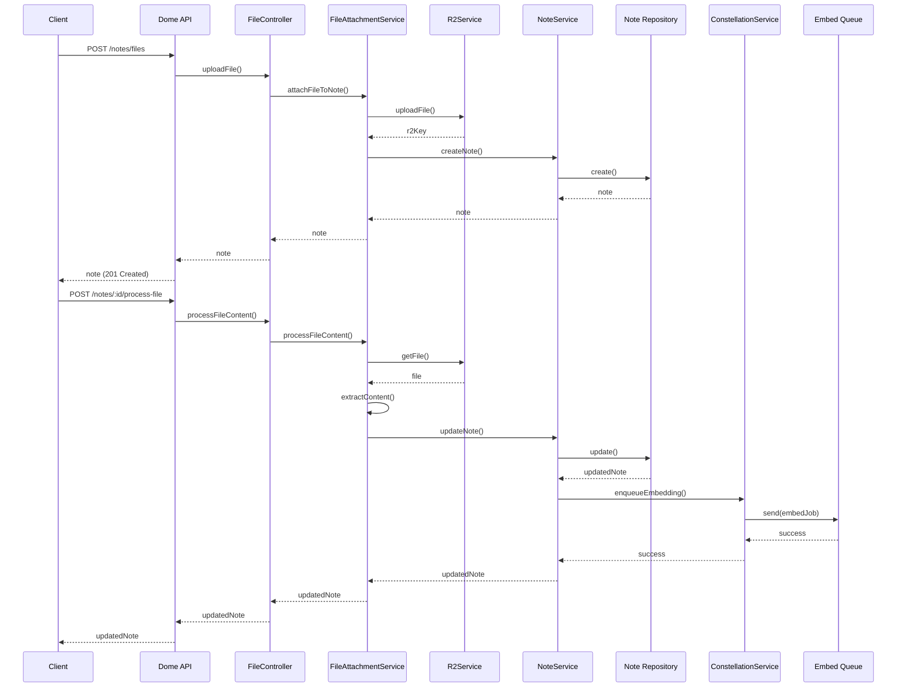
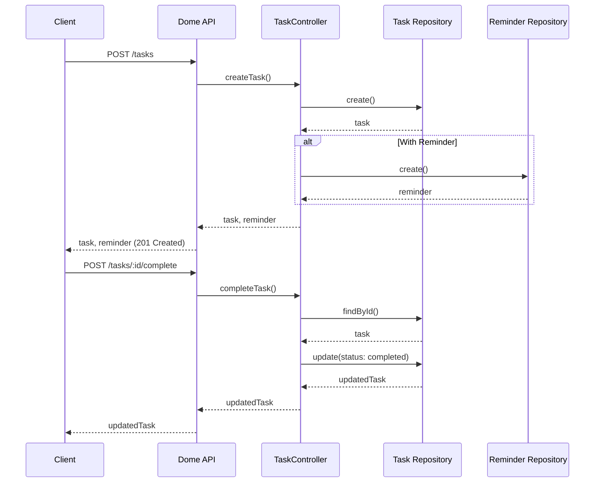
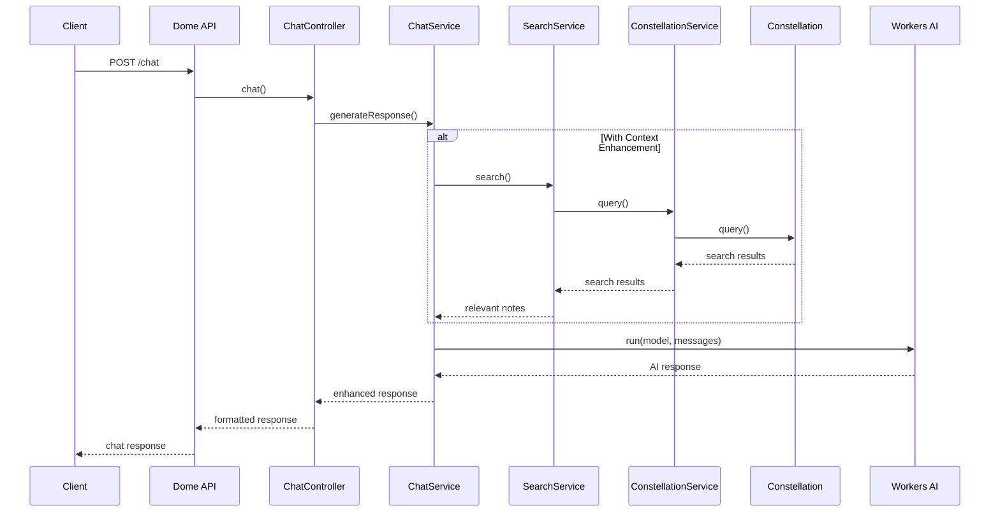

# Dome API Architecture

This document provides a detailed overview of the Dome API service architecture, including its components, data flow, and integration with other services.

## Table of Contents

- [Dome API Architecture](#dome-api-architecture)
  - [Table of Contents](#table-of-contents)
  - [Overview](#overview)
  - [System Architecture](#system-architecture)
  - [Component Architecture](#component-architecture)
    - [Key Components](#key-components)
  - [Data Model](#data-model)
    - [Notes](#notes)
    - [Note Pages (for large documents)](#note-pages-for-large-documents)
    - [Tasks](#tasks)
    - [Reminders](#reminders)
  - [Integration with Constellation](#integration-with-constellation)
    - [Service Binding Configuration](#service-binding-configuration)
    - [Constellation Service Interface](#constellation-service-interface)
    - [Benefits of the Integration](#benefits-of-the-integration)
  - [Key Flows](#key-flows)
    - [Note Creation and Embedding](#note-creation-and-embedding)
    - [Semantic Search](#semantic-search)
    - [File Attachment Processing](#file-attachment-processing)
    - [Task Management](#task-management)
    - [Chat with RAG](#chat-with-rag)

## Overview

The Dome API service is a Cloudflare Worker that serves as the primary interface for client applications to interact with the Dome system. It provides endpoints for managing notes, tasks, files, performing vector searches, and handling user data.

The service has been designed with a layered architecture that separates concerns and promotes maintainability. It integrates with the Constellation embedding service for vector embedding and search operations.

## System Architecture

The Dome API service is part of a larger system that includes several components:

```
┌─────────────────┐     ┌─────────────────┐     ┌─────────────────┐
│                 │     │                 │     │                 │
│  Client Apps    │────▶│    Dome API     │────▶│  Constellation  │
│                 │     │                 │     │                 │
└─────────────────┘     └─────────────────┘     └─────────────────┘
                               │  │                     │
                               │  │                     │
                               │  │                     ▼
                               │  │              ┌─────────────────┐
                               │  │              │                 │
                               │  │              │    Vectorize    │
                               │  │              │                 │
                               │  │              └─────────────────┘
                               │  │
                               │  ▼
                        ┌─────────────────┐
                        │                 │
                        │   D1 Database   │
                        │                 │
                        └─────────────────┘
                               │
                               ▼
                        ┌─────────────────┐
                        │                 │
                        │    R2 Storage   │
                        │                 │
                        └─────────────────┘
```

## Component Architecture

The Dome API service follows a layered architecture:

```
┌─────────────────────────────────────────────────────────┐
│                     API Endpoints                        │
└───────────────────────────┬─────────────────────────────┘
                            │
┌───────────────────────────▼─────────────────────────────┐
│                     Controllers                          │
└───────────────────────────┬─────────────────────────────┘
                            │
┌───────────────────────────▼─────────────────────────────┐
│                     Service Layer                        │
│                                                         │
│  ┌─────────────────┐    ┌─────────────────────────────┐ │
│  │   Note Service  │    │  Constellation Service      │ │
│  └────────┬────────┘    └─────────────┬───────────────┘ │
│           │                           │                 │
│  ┌────────▼────────┐    ┌─────────────▼───────────────┐ │
│  │  Task Service   │    │  File Attachment Service    │ │
│  └────────┬────────┘    └─────────────┬───────────────┘ │
│           │                           │                 │
│  ┌────────▼────────┐    ┌─────────────▼───────────────┐ │
│  │  Chat Service   │    │  Search Service             │ │
│  └────────┬────────┘    └─────────────┬───────────────┘ │
│           │                           │                 │
└───────────┼───────────────────────────┼─────────────────┘
            │                           │
┌───────────▼───────────┐   ┌───────────▼───────────────┐
│      Repositories     │   │      External Services     │
│                       │   │                           │
│  ┌─────────────────┐  │   │  ┌─────────────────────┐  │
│  │ Note Repository │  │   │  │ Constellation      │  │
│  └─────────────────┘  │   │  └─────────────────────┘  │
│                       │   │                           │
│  ┌─────────────────┐  │   │  ┌─────────────────────┐  │
│  │ Task Repository │  │   │  │ Workers AI          │  │
│  └─────────────────┘  │   │  └─────────────────────┘  │
│                       │   │                           │
│  ┌─────────────────┐  │   │  ┌─────────────────────┐  │
│  │ Reminder Repo   │  │   │  │ R2 Storage          │  │
│  └─────────────────┘  │   │  └─────────────────────┘  │
│                       │   │                           │
└───────────┬───────────┘   └───────────────────────────┘
            │
┌───────────▼───────────┐
│      D1 Database      │
└───────────────────────┘
```

### Key Components

1. **API Endpoints**: RESTful endpoints for client interactions

   - Defined in `src/index.ts`
   - Uses Hono framework for routing and middleware

2. **Controllers**: Handle HTTP requests and responses

   - Note Controller: `src/controllers/noteController.ts`
   - Task Controller: `src/controllers/taskController.ts`
   - File Controller: `src/controllers/fileController.ts`
   - Search Controller: `src/controllers/searchController.ts`
   - Chat Controller: `src/controllers/chatController.ts`

3. **Service Layer**: Business logic implementation

   - Note Service: `src/services/noteService.ts`
   - Task Service: `src/services/taskService.ts`
   - File Attachment Service: `src/services/fileAttachmentService.ts`
   - Search Service: `src/services/searchService.ts`
   - Chat Service: `src/services/chatService.ts`
   - Constellation Service: `src/services/constellationService.ts`

4. **Repositories**: Data access layer

   - Note Repository: `src/repositories/noteRepository.ts`
   - Task Repository: `src/repositories/taskRepository.ts`
   - Reminder Repository: `src/repositories/reminderRepository.ts`

5. **External Services**:

   - Constellation: Vector embedding and search
   - Workers AI: AI model access
   - R2 Storage: File storage

6. **Database**: D1 SQLite database for structured data

## Data Model

The Dome API service uses the following data models:

### Notes

```
┌─────────────────────┐
│       notes         │
├─────────────────────┤
│ id                  │
│ userId              │
│ title               │
│ body                │
│ contentType         │
│ r2Key               │
│ metadata            │
│ createdAt           │
│ updatedAt           │
│ embeddingStatus     │
└─────────────────────┘
```

### Note Pages (for large documents)

```
┌─────────────────────┐
│     note_pages      │
├─────────────────────┤
│ id                  │
│ noteId              │
│ pageNum             │
│ content             │
│ createdAt           │
└─────────────────────┘
```

### Tasks

```
┌─────────────────────┐
│       tasks         │
├─────────────────────┤
│ id                  │
│ userId              │
│ title               │
│ description         │
│ status              │
│ priority            │
│ dueDate             │
│ createdAt           │
│ updatedAt           │
│ completedAt         │
└─────────────────────┘
```

### Reminders

```
┌─────────────────────┐
│     reminders       │
├─────────────────────┤
│ id                  │
│ taskId              │
│ remindAt            │
│ delivered           │
│ deliveryMethod      │
│ createdAt           │
└─────────────────────┘
```

## Integration with Constellation

The Dome API service integrates with the Constellation embedding service through a service binding, which provides a typed RPC interface for embedding and vector search operations.

### Service Binding Configuration

The service binding is configured in `wrangler.toml`:

```toml
[[services]]
binding = "CONSTELLATION"
service = "constellation"
environment = "production"
```

### Constellation Service Interface

```typescript
interface ConstellationService {
  /**
   * Embed a single note immediately (synchronous, use sparingly)
   */
  embed(job: EmbedJob): Promise<void>;

  /**
   * Perform a vector similarity search
   */
  query(
    text: string,
    filter?: Partial<NoteVectorMeta>,
    topK?: number,
  ): Promise<VectorSearchResult[]>;

  /**
   * Get statistics about the vector index
   */
  stats(): Promise<VectorIndexStats>;
}
```

### Benefits of the Integration

- **Separation of Concerns**: Embedding and vector search logic is encapsulated in a dedicated service
- **Scalability**: Asynchronous processing of embedding jobs through queues
- **Performance**: Offloading heavy AI operations from the user-facing API
- **Maintainability**: Centralized embedding logic makes updates and improvements easier

## Key Flows

### Note Creation and Embedding



### Semantic Search



### File Attachment Processing



### Task Management



### Chat with RAG


