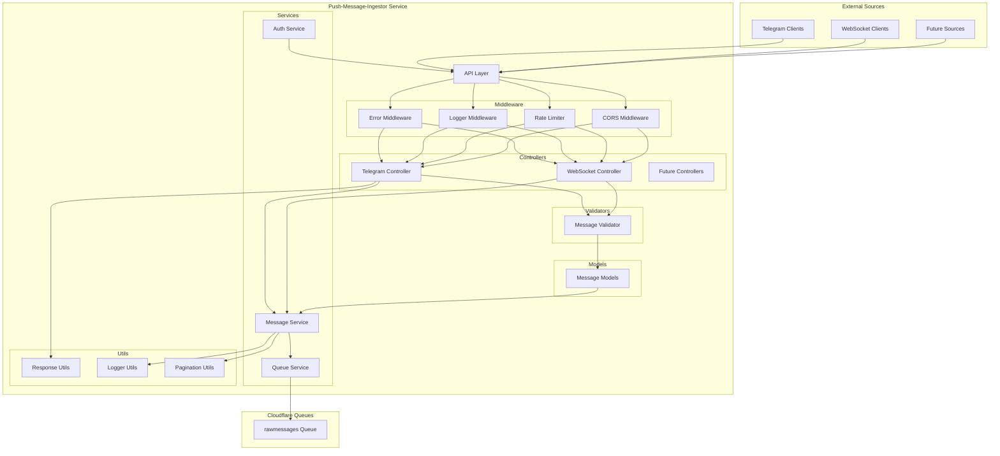

# Push Message Ingestor Service Architecture

This document provides a detailed overview of the architecture for the Push Message Ingestor service, explaining its components, integration points, and extension mechanisms.

## 1. Service Overview

The Push Message Ingestor Service is a Cloudflare Worker that serves as an entry point for external messages into the Communicator system. Unlike the polling-based ingestor service, this service provides endpoints that external systems can push messages to directly.

### Primary Responsibilities

- Receive messages pushed from external sources (starting with Telegram)
- Validate and normalize incoming messages
- Publish validated messages to the `rawmessages` queue
- Provide authentication and authorization mechanisms
- Support multiple message sources and formats
- Provide monitoring and error handling

## 2. Component Architecture

The service follows a clean architecture pattern with clear separation of concerns:



### Component Descriptions

#### API Layer (`src/index.ts`)

The API layer is built using the Hono framework and is responsible for:

- Defining HTTP endpoints for receiving messages
- Routing requests to appropriate controllers
- Implementing middleware (error handling, logging, CORS, rate limiting)
- Handling authentication and authorization (future)

```typescript
// Example from src/index.ts
const app = new Hono<{ Bindings: Bindings }>();

// Global middleware
app.use("*", errorMiddleware);
app.use("*", honoLogger((str) => {
  logger.info(str);
}));
app.use("*", cors({
  origin: '*',
  allowHeaders: ['Content-Type', 'Authorization', 'X-API-Key'],
  allowMethods: ['GET', 'POST', 'OPTIONS'],
  maxAge: 86400,
}));
app.use("*", createRateLimitMiddleware(60000, 100));

app.post(
  "/publish/telegram/messages",
  zValidator('json', telegramMessageBatchSchema),
  async (c) => {
    const validatedData = c.req.valid('json');
    const messageController = new MessageController(c.env.RAW_MESSAGES_QUEUE);
    return await messageController.publishTelegramMessages(c, validatedData);
  }
);
```

#### Middleware (`src/middleware/`)

The middleware layer provides cross-cutting concerns:

- **Error Middleware**: Centralized error handling with standardized responses
- **Rate Limiting**: Protection against abuse with configurable limits
- **Logging**: Request/response logging with correlation IDs
- **CORS**: Cross-origin resource sharing configuration

```typescript
// Example from src/middleware/errorMiddleware.ts
export const errorMiddleware: MiddlewareHandler = async (c: Context, next: Next) => {
  try {
    // Generate a correlation ID for request tracing
    const correlationId = crypto.randomUUID();
    c.set('correlationId', correlationId);
    
    // Add correlation ID to response headers
    c.header('X-Correlation-ID', correlationId);
    
    await next();
  } catch (error) {
    // Log the error with correlation ID
    const correlationId = c.get('correlationId') || 'unknown';
    logger.error(`Error processing request [${correlationId}]:`, error as Error);
    
    // Format and return standardized error response
    // ...
  }
};
```

#### Controllers (`src/controllers/`)

Controllers handle the HTTP request/response cycle and delegate business logic to services:

- **MessageController**: Handles message-related endpoints
  - Processes validated request data
  - Calls appropriate service methods
  - Uses response utilities for standardized responses
  - Logs important business events

```typescript
// Example from src/controllers/messageController.ts
export class MessageController {
  private messageService: MessageService;

  constructor(queueBinding: Queue<BaseMessage>) {
    this.messageService = new MessageService(queueBinding);
  }

  async publishTelegramMessages(c: Context, body: TelegramMessageBatch): Promise<Response> {
    const correlationId = c.get('correlationId');
    
    try {
      // Log the request
      logger.info('Received request to publish Telegram messages', {
        messageCount: body.messages?.length || 0
      }, correlationId);
      
      // Check if the batch size is too large
      const MAX_BATCH_SIZE = 1000;
      if (body.messages.length > MAX_BATCH_SIZE) {
        return sendValidationErrorResponse(c, `Message batch too large. Maximum allowed: ${MAX_BATCH_SIZE}`);
      }

      // Publish the messages
      const result = await this.messageService.publishTelegramMessages(body, correlationId);

      // Return standardized response
      return sendCreatedResponse(c, {
        message: `Successfully published ${result.count} messages to the queue`,
        count: result.count
      });
    } catch (error) {
      // Error handling is delegated to the error middleware
      throw error;
    }
  }
}
```

#### Services (`src/services/`)

Services implement the core business logic:

- **MessageService**: Core service for processing messages
  - Publishes messages to the queue
  - Handles batch processing with pagination
  - Implements error handling and logging
  - Optimizes performance for large message sets

```typescript
// Example from src/services/messageService.ts
export class MessageService {
  private queueBinding: Queue<BaseMessage>;

  constructor(queueBinding: Queue<BaseMessage>) {
    this.queueBinding = queueBinding;
  }

  async publishTelegramMessages(batch: TelegramMessageBatch, correlationId?: string): Promise<PublishResult> {
    // Handle empty batch gracefully
    if (!batch.messages || batch.messages.length === 0) {
      logger.info('Empty Telegram message batch received', undefined, correlationId);
      return { success: true, count: 0 };
    }

    try {
      // Log the operation
      logger.info(`Publishing ${batch.messages.length} Telegram messages`, undefined, correlationId);
      
      // For large batches, process in smaller chunks to avoid memory issues
      if (batch.messages.length > MAX_BATCH_SIZE) {
        await processBatches(
          batch.messages,
          MAX_BATCH_SIZE,
          async (messageBatch) => {
            await this.queueBinding.sendBatch(messageBatch.map(message => ({ body: message })));
            return [];
          }
        );
      } else {
        // For smaller batches, publish all at once
        await this.queueBinding.sendBatch(batch.messages.map(message => ({ body: message })));
      }
      
      // Return success result
      return { success: true, count: batch.messages.length };
    } catch (error) {
      // Handle and log the error
      logger.error('Failed to publish Telegram messages', { error }, correlationId);
      return { success: false, count: 0, error: `Failed to publish messages: ${error}` };
    }
  }
}
```

#### Models (`src/models/`)

Models define the data structures and validation rules:

- **Message Models**: Define the structure of messages
  - BaseMessage: Common fields for all messages
  - TelegramMessage: Telegram-specific message format
  - MessageBatch: Container for multiple messages

```typescript
// Example from src/models/message.ts
export interface BaseMessage {
  id: string;
  timestamp: string;
  platform: string;
  content: string;
  metadata: Record<string, any>;
}

export interface TelegramMessage extends BaseMessage {
  platform: 'telegram';
  metadata: {
    chatId: string;
    messageId: string;
    // Other Telegram-specific fields
  };
}
```

#### Validators (`src/models/schemas.ts`)

Validators ensure that incoming data meets the required format using Zod schemas:

- **Message Schemas**: Define validation rules for messages
  - Specify required and optional fields
  - Define field types and formats
  - Provide detailed error messages

```typescript
// Example from src/models/schemas.ts
export const telegramMessageSchema = z.object({
  id: z.string({
    required_error: 'Message ID is required',
    invalid_type_error: 'Message ID must be a string'
  }),
  timestamp: z.string({
    required_error: 'Timestamp is required',
    invalid_type_error: 'Timestamp must be a string'
  }),
  platform: z.literal('telegram', {
    required_error: 'Platform is required',
    invalid_type_error: 'Platform must be "telegram"'
  }),
  content: z.string({
    required_error: 'Message body cannot be undefined',
    invalid_type_error: 'Content must be a string'
  }),
  metadata: telegramMetadataSchema
}).strict();

export const telegramMessageBatchSchema = z.object({
  messages: z.array(telegramMessageSchema, {
    required_error: 'Messages array is required',
    invalid_type_error: 'Messages must be an array'
  })
}).strict();
```

#### Utilities (`src/utils/`)

Utilities provide reusable functionality across the service:

- **Response Utilities**: Standardized response formatting
- **Logger Utilities**: Structured logging with correlation IDs
- **Pagination Utilities**: Efficient handling of large data sets

```typescript
// Example from src/utils/responseUtils.ts
export function sendSuccessResponse(c: Context, data: Record<string, any>, status: number = 200): Response {
  const correlationId = c.get('correlationId');
  
  if (correlationId) {
    logger.info('Success response', { data, status }, correlationId);
  }
  
  const response = {
    success: true,
    data
  };
  
  return c.json(response, status);
}

export function sendCreatedResponse(c: Context, data: Record<string, any>): Response {
  return sendSuccessResponse(c, data, 201);
}
```

## 3. Queue Integration

The service integrates with Cloudflare Queues to publish messages for asynchronous processing by other services.

### Queue Configuration

The queue is configured in `wrangler.toml`:

```toml
[[queues.producers]]
queue = "rawmessages"
binding = "RAW_MESSAGES_QUEUE"
```

This creates a binding named `RAW_MESSAGES_QUEUE` that the service can use to publish messages to the `rawmessages` queue.

### Queue Usage

The service uses the queue binding to publish messages with optimized batch processing:

```typescript
// Example from src/services/messageService.ts
async publishMessage(message: BaseMessage, correlationId?: string): Promise<void> {
  try {
    logger.info('Publishing message to queue', { messageId: message.id, platform: message.platform }, correlationId);
    await this.queueBinding.send(message);
    logger.info('Message published successfully', { messageId: message.id }, correlationId);
  } catch (error) {
    logger.error('Failed to publish message to queue', { error, messageId: message.id }, correlationId);
    throw createQueueError(`Failed to publish message: ${error}`, { messageId: message.id });
  }
}

async publishMessages(messages: BaseMessage[], correlationId?: string): Promise<void> {
  // Handle empty arrays gracefully
  if (messages.length === 0) {
    logger.info('No messages to publish', undefined, correlationId);
    return;
  }

  try {
    // For large batches, process in smaller chunks to avoid memory issues
    if (messages.length > MAX_BATCH_SIZE) {
      logger.info(`Processing large batch of ${messages.length} messages in chunks`, undefined, correlationId);
      
      await processBatches(
        messages,
        MAX_BATCH_SIZE,
        async (batch) => {
          logger.info(`Publishing batch of ${batch.length} messages`, undefined, correlationId);
          await this.queueBinding.sendBatch(batch.map(message => ({ body: message })));
          return []; // Return empty array as we don't need results
        }
      );
      
      logger.info(`Successfully published ${messages.length} messages in batches`, undefined, correlationId);
    } else {
      // For smaller batches, publish all at once
      logger.info(`Publishing batch of ${messages.length} messages`, undefined, correlationId);
      await this.queueBinding.sendBatch(messages.map(message => ({ body: message })));
      logger.info(`Successfully published ${messages.length} messages`, undefined, correlationId);
    }
  } catch (error) {
    logger.error('Failed to publish message batch to queue', { error, count: messages.length }, correlationId);
    throw createQueueError(`Failed to publish message batch: ${error}`, { count: messages.length });
  }
}
```

### Message Format

Messages published to the queue follow the `BaseMessage` format:

```typescript
{
  "id": "unique-message-id",
  "timestamp": "2025-04-15T20:55:00.000Z",
  "platform": "telegram",
  "content": "Hello, world!",
  "metadata": {
    // Platform-specific metadata
  }
}
```

This format allows consumers of the queue to process messages regardless of their source platform.

## 4. Extension Points

The service is designed to be extended in several ways:

### 4.1 Adding New Message Sources

To add support for a new message source (e.g., Slack):

1. **Create a new message model** in `src/models/message.ts`:

```typescript
export interface SlackMessage extends BaseMessage {
  platform: 'slack';
  metadata: {
    channelId: string;
    messageId: string;
    // Other Slack-specific fields
  };
}

export interface SlackMessageBatch extends MessageBatch<SlackMessage> {}
```

2. **Implement validators** in `src/models/validators.ts`:

```typescript
export function validateSlackMessage(message: any): { valid: boolean; errors?: string[] } {
  const errors: string[] = [];
  
  // Slack-specific validation rules
  if (!message.metadata?.channelId) errors.push('Channel ID is required in metadata');
  
  // Common validation rules
  if (!message.id) errors.push('Message ID is required');
  
  return {
    valid: errors.length === 0,
    errors: errors.length > 0 ? errors : undefined
  };
}

export function validateSlackMessageBatch(batch: any): { valid: boolean; errors?: string[] } {
  // Similar to validateTelegramMessageBatch but for Slack messages
}
```

3. **Add service methods** in `src/services/messageService.ts`:

```typescript
async publishSlackMessages(batch: SlackMessageBatch): Promise<{ success: boolean; error?: string }> {
  // Validate the batch
  const validation = validateSlackMessageBatch(batch);
  if (!validation.valid) {
    return { success: false, error: validation.errors?.join(', ') };
  }

  // Publish the messages
  await this.publishMessages(batch.messages);
  return { success: true };
}
```

4. **Add controller methods** in `src/controllers/messageController.ts`:

```typescript
async publishSlackMessages(c: Context<{ Bindings: Bindings }>): Promise<Response> {
  try {
    const body = await c.req.json() as SlackMessageBatch;
    const result = await this.messageService.publishSlackMessages(body);
    
    // Format and return response
    if (!result.success) {
      const response: ApiResponse = {
        success: false,
        error: {
          code: 'VALIDATION_ERROR',
          message: result.error || 'Invalid message batch'
        }
      };
      return c.json(response, 400);
    }

    const response: ApiResponse = {
      success: true,
      data: {
        message: `Successfully published ${body.messages.length} messages to the queue`,
        count: body.messages.length
      }
    };
    return c.json(response);
  } catch (error) {
    // Handle errors
  }
}
```

5. **Add a new endpoint** in `src/index.ts`:

```typescript
app.post("/publish/slack/messages", async (c: any) => {
  const messageController = new MessageController(c.env.RAW_MESSAGES_QUEUE);
  return await messageController.publishSlackMessages(c);
});
```

### 4.2 Implementing WebSocket Support

To add WebSocket support for real-time message ingestion:

1. **Create a WebSocket controller** in `src/controllers/websocketController.ts`:

```typescript
export class WebSocketController {
  private messageService: MessageService;
  
  constructor(queueBinding: Bindings['RAW_MESSAGES_QUEUE']) {
    this.messageService = new MessageService(queueBinding);
  }
  
  handleConnection(c: Context<{ Bindings: Bindings }>): Response {
    // Upgrade the connection to WebSocket
    const upgradeHeader = c.req.header('Upgrade');
    if (!upgradeHeader || upgradeHeader !== 'websocket') {
      return c.json({ error: 'Expected Upgrade: websocket' }, 426);
    }
    
    const webSocket = new WebSocketPair();
    const [client, server] = Object.values(webSocket);
    
    // Set up event handlers
    server.accept();
    server.addEventListener('message', async (event) => {
      try {
        const message = JSON.parse(event.data as string);
        // Process the message based on its platform
        if (message.platform === 'telegram') {
          await this.handleTelegramMessage(server, message);
        } else {
          server.send(JSON.stringify({
            success: false,
            error: {
              code: 'VALIDATION_ERROR',
              message: `Unsupported platform: ${message.platform}`
            }
          }));
        }
      } catch (error) {
        // Handle errors
        server.send(JSON.stringify({
          success: false,
          error: {
            code: 'SERVER_ERROR',
            message: error instanceof Error ? error.message : 'Unknown error'
          }
        }));
      }
    });
    
    return new Response(null, {
      status: 101,
      webSocket: client,
    });
  }
  
  private async handleTelegramMessage(socket: WebSocket, message: any): Promise<void> {
    // Validate and publish the message
    const validation = validateTelegramMessage(message);
    if (!validation.valid) {
      socket.send(JSON.stringify({
        success: false,
        error: {
          code: 'VALIDATION_ERROR',
          message: validation.errors?.join(', ') || 'Invalid message'
        }
      }));
      return;
    }
    
    await this.messageService.publishMessage(message);
    socket.send(JSON.stringify({
      success: true,
      data: {
        message: 'Message published successfully',
        id: message.id
      }
    }));
  }
}
```

2. **Add a WebSocket endpoint** in `src/index.ts`:

```typescript
app.get("/ws", (c: any) => {
  const websocketController = new WebSocketController(c.env.RAW_MESSAGES_QUEUE);
  return websocketController.handleConnection(c);
});
```

### 4.3 Adding Cloudflare Access Authentication

To add authentication using Cloudflare Access:

1. **Create an auth service** in `src/services/authService.ts`:

```typescript
export class AuthService {
  /**
   * Validates a Cloudflare Access JWT token
   * @param request The incoming request
   * @returns Whether the token is valid
   */
  async validateToken(request: Request): Promise<boolean> {
    const token = request.headers.get('CF-Access-JWT-Assertion');
    if (!token) {
      return false;
    }
    
    try {
      // Validate the token using Cloudflare Access JWT verification
      // This is a simplified example - actual implementation would verify
      // the token signature, expiration, and claims
      
      // For development environments, you might want to bypass authentication
      if (process.env.ENVIRONMENT === 'development') {
        return true;
      }
      
      // In production, verify the token with Cloudflare Access
      // const response = await fetch('https://your-team.cloudflareaccess.com/cdn-cgi/access/get-identity', {
      //   headers: { 'Cookie': `CF_Authorization=${token}` }
      // });
      // return response.status === 200;
      
      return true; // Placeholder
    } catch (error) {
      console.error('Error validating token:', error);
      return false;
    }
  }
}
```

2. **Create an auth middleware** in `src/middleware/authMiddleware.ts`:

```typescript
import { Context, Next } from 'hono';
import { AuthService } from '../services/authService';
import { Bindings } from '../types';

export async function authMiddleware(c: Context<{ Bindings: Bindings }>, next: Next) {
  const authService = new AuthService();
  const isValid = await authService.validateToken(c.req.raw);
  
  if (!isValid) {
    return c.json({
      success: false,
      error: {
        code: 'UNAUTHORIZED',
        message: 'Authentication required'
      }
    }, 401);
  }
  
  await next();
}
```

3. **Apply the middleware** to protected routes in `src/index.ts`:

```typescript
import { authMiddleware } from './middleware/authMiddleware';

// Apply auth middleware to protected routes
app.use('/publish/*', authMiddleware);
app.use('/ws', authMiddleware);
```

## 5. Deployment and Scaling

The service is deployed as a Cloudflare Worker, which provides:

- Global distribution for low-latency access
- Automatic scaling based on demand
- High availability and fault tolerance

### Deployment Configuration

The service is configured in `wrangler.toml` with environment-specific settings:

```toml
name = "push-message-ingestor"
main = "src/index.ts"
compatibility_date = "2023-04-15"

[vars]
ENVIRONMENT = "development"

[env.production]
vars = { ENVIRONMENT = "production" }

[env.staging]
vars = { ENVIRONMENT = "staging" }

[[queues.producers]]
queue = "rawmessages"
binding = "RAW_MESSAGES_QUEUE"
```

### Deployment Process

The service can be deployed using Wrangler:

```bash
# Build the service
pnpm build

# Deploy to the default environment
wrangler deploy

# Deploy to a specific environment
wrangler deploy --env production
```

## 6. Monitoring and Error Handling

The service includes comprehensive error handling and monitoring:

- **Centralized Error Middleware**: All errors are processed through a single middleware
- **Correlation IDs**: Each request has a unique ID for tracing through logs
- **Structured Logging**: JSON-formatted logs with context for easier analysis
- **Error Classification**: Errors are properly categorized (validation, server, queue)
- **Appropriate Status Codes**: HTTP status codes match the error type
- **Detailed Error Messages**: Clear, actionable error messages
- **Rate Limiting Monitoring**: Track and alert on rate limit violations
- **Performance Metrics**: Log processing times for large batches

Future enhancements may include:

- Integration with Cloudflare Analytics
- Custom metrics for monitoring message throughput
- Alerting for critical errors

## 7. Security Considerations

The service implements several security measures:

### 7.1 Authentication and Authorization
- **Cloudflare Access Authentication**: (Planned) JWT-based authentication
- **API Key Validation**: (Planned) For service-to-service communication
- **Role-Based Access Control**: (Planned) Different permissions for different operations

### 7.2 Request Protection
- **Rate Limiting**: Protection against abuse with configurable limits
- **Batch Size Limits**: Prevent DoS attacks through large payloads
- **CORS Configuration**: Controlled cross-origin access

### 7.3 Data Validation and Sanitization
- **Input Validation**: Strict schema validation using Zod
- **JSON Parsing Error Handling**: Graceful handling of malformed requests
- **Type Checking**: Strong typing throughout the codebase

### 7.4 Secure Error Handling
- **Error Sanitization**: Prevent leaking sensitive information in errors
- **Production-Specific Error Messages**: Generic error messages in production
- **Stack Trace Protection**: Stack traces never exposed in production responses
- **Sensitive Data Filtering**: Automatic filtering of sensitive fields in errors

### 7.5 Logging and Tracing
- **Correlation IDs**: Consistent propagation across all asynchronous operations
- **Structured Logging**: Secure logging practices with sensitive data handling
- **Log Sanitization**: Automatic redaction of sensitive information in production logs
- **Security Event Logging**: All security-related events are properly logged

### 7.6 Data Protection
- **Transient Processing**: No sensitive data stored by the service
- **Secure Transmission**: All data transmitted via HTTPS
- **Minimal Data Collection**: Only necessary data is processed

## 8. Conclusion

The Push Message Ingestor Service provides a flexible and extensible platform for ingesting messages from various sources. Its modular architecture allows for easy addition of new message sources and protocols, while its integration with Cloudflare Queues ensures reliable message delivery.

Future developers can extend the service by following the patterns established in this document, adding new message sources, implementing WebSocket support, or enhancing security with Cloudflare Access authentication.