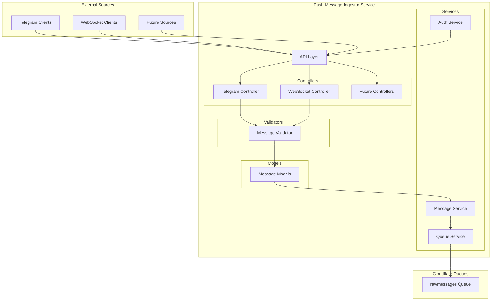

# Push Message Ingestor Service Architecture

This document provides a detailed overview of the architecture for the Push Message Ingestor service, explaining its components, integration points, and extension mechanisms.

## 1. Service Overview

The Push Message Ingestor Service is a Cloudflare Worker that serves as an entry point for external messages into the Communicator system. Unlike the polling-based ingestor service, this service provides endpoints that external systems can push messages to directly.

### Primary Responsibilities

- Receive messages pushed from external sources (starting with Telegram)
- Validate and normalize incoming messages
- Publish validated messages to the `rawmessages` queue
- Provide authentication and authorization mechanisms
- Support multiple message sources and formats
- Provide monitoring and error handling

## 2. Component Architecture

The service follows a clean architecture pattern with clear separation of concerns:



### Component Descriptions

#### API Layer (`src/index.ts`)

The API layer is built using the Hono framework and is responsible for:

- Defining HTTP endpoints for receiving messages
- Routing requests to appropriate controllers
- Implementing middleware (CORS, logging)
- Handling authentication and authorization (future)

```typescript
// Example from src/index.ts
const app = new Hono<{ Bindings: Bindings }>();
app.use("*", logger());
app.use("*", cors());

app.post("/publish/telegram/messages", async (c: any) => {
  const messageController = new MessageController(c.env.RAW_MESSAGES_QUEUE);
  return await messageController.publishTelegramMessages(c);
});
```

#### Controllers (`src/controllers/`)

Controllers handle the HTTP request/response cycle and delegate business logic to services:

- **MessageController**: Handles message-related endpoints
  - Parses request bodies
  - Calls appropriate service methods
  - Formats responses
  - Handles errors

```typescript
// Example from src/controllers/messageController.ts
export class MessageController {
  private messageService: MessageService;

  constructor(queueBinding: Bindings['RAW_MESSAGES_QUEUE']) {
    this.messageService = new MessageService(queueBinding);
  }

  async publishTelegramMessages(c: Context<{ Bindings: Bindings }>): Promise<Response> {
    try {
      const body = await c.req.json() as TelegramMessageBatch;
      const result = await this.messageService.publishTelegramMessages(body);
      // Format and return response
    } catch (error) {
      // Handle errors
    }
  }
}
```

#### Services (`src/services/`)

Services implement the core business logic:

- **MessageService**: Core service for processing messages
  - Validates messages using validators
  - Publishes messages to the queue
  - Handles errors and retries

```typescript
// Example from src/services/messageService.ts
export class MessageService {
  private queueBinding: Queue<BaseMessage>;

  constructor(queueBinding: Queue<BaseMessage>) {
    this.queueBinding = queueBinding;
  }

  async publishTelegramMessages(batch: TelegramMessageBatch): Promise<{ success: boolean; error?: string }> {
    // Validate the batch
    const validation = validateTelegramMessageBatch(batch);
    if (!validation.valid) {
      return { success: false, error: validation.errors?.join(', ') };
    }

    // Publish the messages
    await this.publishMessages(batch.messages);
    return { success: true };
  }
}
```

#### Models (`src/models/`)

Models define the data structures and validation rules:

- **Message Models**: Define the structure of messages
  - BaseMessage: Common fields for all messages
  - TelegramMessage: Telegram-specific message format
  - MessageBatch: Container for multiple messages

```typescript
// Example from src/models/message.ts
export interface BaseMessage {
  id: string;
  timestamp: string;
  platform: string;
  content: string;
  metadata: Record<string, any>;
}

export interface TelegramMessage extends BaseMessage {
  platform: 'telegram';
  metadata: {
    chatId: string;
    messageId: string;
    // Other Telegram-specific fields
  };
}
```

#### Validators (`src/models/validators.ts`)

Validators ensure that incoming data meets the required format:

- **Message Validators**: Validate message format and content
  - Check required fields
  - Validate field formats
  - Return detailed error messages

```typescript
// Example from src/models/validators.ts
export function validateTelegramMessage(message: any): { valid: boolean; errors?: string[] } {
  const errors: string[] = [];

  // Check required fields
  if (!message.id) errors.push('Message ID is required');
  if (!message.timestamp) errors.push('Timestamp is required');
  // More validation rules...

  return {
    valid: errors.length === 0,
    errors: errors.length > 0 ? errors : undefined
  };
}
```

## 3. Queue Integration

The service integrates with Cloudflare Queues to publish messages for asynchronous processing by other services.

### Queue Configuration

The queue is configured in `wrangler.toml`:

```toml
[[queues.producers]]
queue = "rawmessages"
binding = "RAW_MESSAGES_QUEUE"
```

This creates a binding named `RAW_MESSAGES_QUEUE` that the service can use to publish messages to the `rawmessages` queue.

### Queue Usage

The service uses the queue binding to publish messages:

```typescript
// Example from src/services/messageService.ts
async publishMessage(message: BaseMessage): Promise<void> {
  await this.queueBinding.send(message);
}

async publishMessages(messages: BaseMessage[]): Promise<void> {
  if (typeof this.queueBinding.sendBatch === 'function') {
    await this.queueBinding.sendBatch(messages);
  } else {
    await Promise.all(messages.map(message => this.queueBinding.send(message)));
  }
}
```

### Message Format

Messages published to the queue follow the `BaseMessage` format:

```typescript
{
  "id": "unique-message-id",
  "timestamp": "2025-04-15T20:55:00.000Z",
  "platform": "telegram",
  "content": "Hello, world!",
  "metadata": {
    // Platform-specific metadata
  }
}
```

This format allows consumers of the queue to process messages regardless of their source platform.

## 4. Extension Points

The service is designed to be extended in several ways:

### 4.1 Adding New Message Sources

To add support for a new message source (e.g., Slack):

1. **Create a new message model** in `src/models/message.ts`:

```typescript
export interface SlackMessage extends BaseMessage {
  platform: 'slack';
  metadata: {
    channelId: string;
    messageId: string;
    // Other Slack-specific fields
  };
}

export interface SlackMessageBatch extends MessageBatch<SlackMessage> {}
```

2. **Implement validators** in `src/models/validators.ts`:

```typescript
export function validateSlackMessage(message: any): { valid: boolean; errors?: string[] } {
  const errors: string[] = [];
  
  // Slack-specific validation rules
  if (!message.metadata?.channelId) errors.push('Channel ID is required in metadata');
  
  // Common validation rules
  if (!message.id) errors.push('Message ID is required');
  
  return {
    valid: errors.length === 0,
    errors: errors.length > 0 ? errors : undefined
  };
}

export function validateSlackMessageBatch(batch: any): { valid: boolean; errors?: string[] } {
  // Similar to validateTelegramMessageBatch but for Slack messages
}
```

3. **Add service methods** in `src/services/messageService.ts`:

```typescript
async publishSlackMessages(batch: SlackMessageBatch): Promise<{ success: boolean; error?: string }> {
  // Validate the batch
  const validation = validateSlackMessageBatch(batch);
  if (!validation.valid) {
    return { success: false, error: validation.errors?.join(', ') };
  }

  // Publish the messages
  await this.publishMessages(batch.messages);
  return { success: true };
}
```

4. **Add controller methods** in `src/controllers/messageController.ts`:

```typescript
async publishSlackMessages(c: Context<{ Bindings: Bindings }>): Promise<Response> {
  try {
    const body = await c.req.json() as SlackMessageBatch;
    const result = await this.messageService.publishSlackMessages(body);
    
    // Format and return response
    if (!result.success) {
      const response: ApiResponse = {
        success: false,
        error: {
          code: 'VALIDATION_ERROR',
          message: result.error || 'Invalid message batch'
        }
      };
      return c.json(response, 400);
    }

    const response: ApiResponse = {
      success: true,
      data: {
        message: `Successfully published ${body.messages.length} messages to the queue`,
        count: body.messages.length
      }
    };
    return c.json(response);
  } catch (error) {
    // Handle errors
  }
}
```

5. **Add a new endpoint** in `src/index.ts`:

```typescript
app.post("/publish/slack/messages", async (c: any) => {
  const messageController = new MessageController(c.env.RAW_MESSAGES_QUEUE);
  return await messageController.publishSlackMessages(c);
});
```

### 4.2 Implementing WebSocket Support

To add WebSocket support for real-time message ingestion:

1. **Create a WebSocket controller** in `src/controllers/websocketController.ts`:

```typescript
export class WebSocketController {
  private messageService: MessageService;
  
  constructor(queueBinding: Bindings['RAW_MESSAGES_QUEUE']) {
    this.messageService = new MessageService(queueBinding);
  }
  
  handleConnection(c: Context<{ Bindings: Bindings }>): Response {
    // Upgrade the connection to WebSocket
    const upgradeHeader = c.req.header('Upgrade');
    if (!upgradeHeader || upgradeHeader !== 'websocket') {
      return c.json({ error: 'Expected Upgrade: websocket' }, 426);
    }
    
    const webSocket = new WebSocketPair();
    const [client, server] = Object.values(webSocket);
    
    // Set up event handlers
    server.accept();
    server.addEventListener('message', async (event) => {
      try {
        const message = JSON.parse(event.data as string);
        // Process the message based on its platform
        if (message.platform === 'telegram') {
          await this.handleTelegramMessage(server, message);
        } else {
          server.send(JSON.stringify({
            success: false,
            error: {
              code: 'VALIDATION_ERROR',
              message: `Unsupported platform: ${message.platform}`
            }
          }));
        }
      } catch (error) {
        // Handle errors
        server.send(JSON.stringify({
          success: false,
          error: {
            code: 'SERVER_ERROR',
            message: error instanceof Error ? error.message : 'Unknown error'
          }
        }));
      }
    });
    
    return new Response(null, {
      status: 101,
      webSocket: client,
    });
  }
  
  private async handleTelegramMessage(socket: WebSocket, message: any): Promise<void> {
    // Validate and publish the message
    const validation = validateTelegramMessage(message);
    if (!validation.valid) {
      socket.send(JSON.stringify({
        success: false,
        error: {
          code: 'VALIDATION_ERROR',
          message: validation.errors?.join(', ') || 'Invalid message'
        }
      }));
      return;
    }
    
    await this.messageService.publishMessage(message);
    socket.send(JSON.stringify({
      success: true,
      data: {
        message: 'Message published successfully',
        id: message.id
      }
    }));
  }
}
```

2. **Add a WebSocket endpoint** in `src/index.ts`:

```typescript
app.get("/ws", (c: any) => {
  const websocketController = new WebSocketController(c.env.RAW_MESSAGES_QUEUE);
  return websocketController.handleConnection(c);
});
```

### 4.3 Adding Cloudflare Access Authentication

To add authentication using Cloudflare Access:

1. **Create an auth service** in `src/services/authService.ts`:

```typescript
export class AuthService {
  /**
   * Validates a Cloudflare Access JWT token
   * @param request The incoming request
   * @returns Whether the token is valid
   */
  async validateToken(request: Request): Promise<boolean> {
    const token = request.headers.get('CF-Access-JWT-Assertion');
    if (!token) {
      return false;
    }
    
    try {
      // Validate the token using Cloudflare Access JWT verification
      // This is a simplified example - actual implementation would verify
      // the token signature, expiration, and claims
      
      // For development environments, you might want to bypass authentication
      if (process.env.ENVIRONMENT === 'development') {
        return true;
      }
      
      // In production, verify the token with Cloudflare Access
      // const response = await fetch('https://your-team.cloudflareaccess.com/cdn-cgi/access/get-identity', {
      //   headers: { 'Cookie': `CF_Authorization=${token}` }
      // });
      // return response.status === 200;
      
      return true; // Placeholder
    } catch (error) {
      console.error('Error validating token:', error);
      return false;
    }
  }
}
```

2. **Create an auth middleware** in `src/middleware/authMiddleware.ts`:

```typescript
import { Context, Next } from 'hono';
import { AuthService } from '../services/authService';
import { Bindings } from '../types';

export async function authMiddleware(c: Context<{ Bindings: Bindings }>, next: Next) {
  const authService = new AuthService();
  const isValid = await authService.validateToken(c.req.raw);
  
  if (!isValid) {
    return c.json({
      success: false,
      error: {
        code: 'UNAUTHORIZED',
        message: 'Authentication required'
      }
    }, 401);
  }
  
  await next();
}
```

3. **Apply the middleware** to protected routes in `src/index.ts`:

```typescript
import { authMiddleware } from './middleware/authMiddleware';

// Apply auth middleware to protected routes
app.use('/publish/*', authMiddleware);
app.use('/ws', authMiddleware);
```

## 5. Deployment and Scaling

The service is deployed as a Cloudflare Worker, which provides:

- Global distribution for low-latency access
- Automatic scaling based on demand
- High availability and fault tolerance

### Deployment Configuration

The service is configured in `wrangler.toml` with environment-specific settings:

```toml
name = "push-message-ingestor"
main = "src/index.ts"
compatibility_date = "2023-04-15"

[vars]
ENVIRONMENT = "development"

[env.production]
vars = { ENVIRONMENT = "production" }

[env.staging]
vars = { ENVIRONMENT = "staging" }

[[queues.producers]]
queue = "rawmessages"
binding = "RAW_MESSAGES_QUEUE"
```

### Deployment Process

The service can be deployed using Wrangler:

```bash
# Build the service
pnpm build

# Deploy to the default environment
wrangler deploy

# Deploy to a specific environment
wrangler deploy --env production
```

## 6. Monitoring and Error Handling

The service includes comprehensive error handling and logging:

- **Validation Errors**: Detailed error messages for invalid input
- **Service Errors**: Error handling for queue publishing failures
- **Logging**: Console logging for debugging and monitoring

Future enhancements may include:

- Integration with Cloudflare Analytics
- Custom metrics for monitoring message throughput
- Alerting for critical errors

## 7. Security Considerations

The service implements several security measures:

- **Input Validation**: Prevents injection attacks and malformed data
- **CORS Configuration**: Restricts access to trusted domains
- **Authentication**: (Future) Cloudflare Access integration for secure access
- **Rate Limiting**: (Future) Prevents abuse of the API

## 8. Conclusion

The Push Message Ingestor Service provides a flexible and extensible platform for ingesting messages from various sources. Its modular architecture allows for easy addition of new message sources and protocols, while its integration with Cloudflare Queues ensures reliable message delivery.

Future developers can extend the service by following the patterns established in this document, adding new message sources, implementing WebSocket support, or enhancing security with Cloudflare Access authentication.