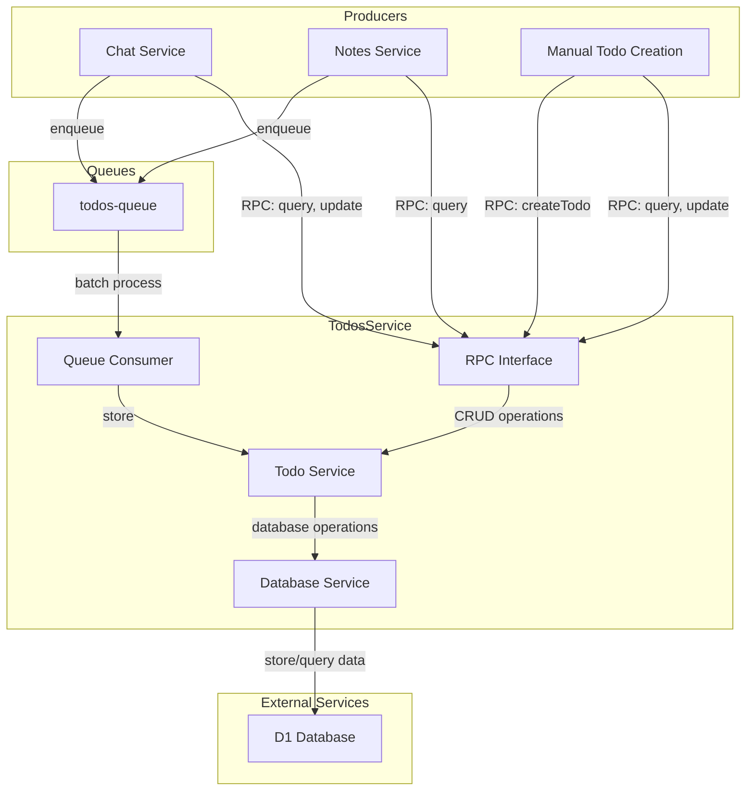
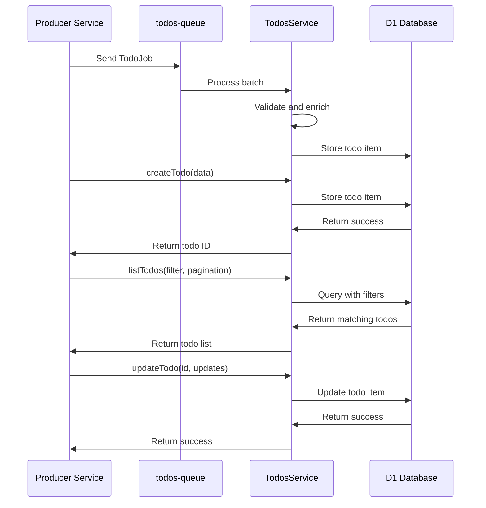

# Todos Service Architecture

## 1. Service Overview

### Purpose

The Todos service is a dedicated Cloudflare Worker that provides asynchronous todo management capabilities for the Dome application. It processes AI-enriched content from user notes to extract and manage todos, and provides a centralized service for todo creation, retrieval, updates, and organization.

### Key Features

- Consumes todo jobs from a Workers Queue with AI-enriched content from user notes
- Stores todos in a D1 database with comprehensive metadata
- Exposes a typed RPC interface for todo CRUD operations
- Processes todo jobs in batches for optimal throughput
- Supports flexible filtering for targeted todo searches
- Provides todo status management (creation, completion, deletion)

### Goals and Non-Goals

|                         | ✅ In Scope                                    | ❌ Out of Scope                             |
| ----------------------- | ---------------------------------------------- | ------------------------------------------- |
| **Todo Processing**     | Async, high-throughput ingestion via queue     | Complex task management systems             |
| **CRUD Operations**     | Create, read, update, delete todos             | Project management capabilities             |
| **API Surface**         | Single RPC surface for todo operations         | Complex workflow automation                 |
| **Search Filtering**    | Status, priority, date, and category filtering | Natural language processing of todo content |
| **Metadata Management** | Status, priority, due dates, categories, tags  | Recurring todos and complex scheduling      |

## 2. Architecture

### High-Level Architecture



### Component Breakdown

#### Queue Consumer

The queue consumer processes batches of todo jobs from the `todos-queue`. It extracts the AI-enriched todo content from user notes, validates it, and stores it in the database.

#### RPC Interface

The RPC interface exposes methods for todo CRUD operations. This interface is used by other services through Cloudflare service bindings.

#### Todo Service

The todo service handles the core business logic for todo management, including validation, enrichment, and applying business rules.

#### Database Service

The database service provides an abstraction over the D1 database, handling all database operations for todo items.

### Integration with Other Services

| Service       | Integration Type | Purpose                                                               |
| ------------- | ---------------- | --------------------------------------------------------------------- |
| Chat Service  | Service Binding  | Chat service calls Todos' RPC methods for querying and updating todos |
| Notes Service | Service Binding  | Notes service calls Todos' RPC methods for querying todos             |
| Todos Queue   | Queue Consumer   | Todos service processes todo jobs from the queue                      |
| D1 Database   | D1 Binding       | Todos service stores and queries data in the D1 database              |

## 3. Data Model

### Database Schema

The database schema for todo items includes comprehensive metadata for effective todo management.

```sql
CREATE TABLE todos (
  id TEXT PRIMARY KEY,              -- Unique identifier for the todo
  user_id TEXT NOT NULL,            -- User who owns the todo

  title TEXT NOT NULL,              -- Short title/summary of the todo
  description TEXT,                 -- Full description/details

  status TEXT NOT NULL,             -- e.g., "pending", "in_progress", "completed", "cancelled"
  priority TEXT NOT NULL,           -- e.g., "low", "medium", "high", "urgent"

  category TEXT,                    -- User-defined category for organization
  tags TEXT,                        -- Comma-separated tags for flexible categorization

  created_at INTEGER NOT NULL,      -- When the todo was created (timestamp)
  updated_at INTEGER NOT NULL,      -- When the todo was last updated (timestamp)
  due_date INTEGER,                 -- When the todo is due (optional timestamp)
  completed_at INTEGER,             -- When the todo was completed (optional timestamp)

  source_note_id TEXT,              -- ID of the note this todo was extracted from (if applicable)
  source_text TEXT,                 -- Original text this todo was extracted from

  ai_generated BOOLEAN NOT NULL,    -- Whether this todo was generated by AI
  confidence REAL,                  -- AI confidence score (0-1) if AI-generated

  estimated_effort TEXT,            -- e.g., "5min", "1h", "2d"
  actionable_steps TEXT,            -- JSON string of AI-suggested breakdown of steps
  context TEXT,                     -- Additional context extracted by AI

  -- Indexes
  INDEX idx_todos_user_id (user_id),
  INDEX idx_todos_status (status),
  INDEX idx_todos_due_date (due_date),
  INDEX idx_todos_priority (priority),
  INDEX idx_todos_category (category),
  INDEX idx_todos_source_note_id (source_note_id)
);
```

TypeScript interface for the database schema:

```typescript
interface TodoItem {
  id: string;
  userId: string;

  title: string;
  description?: string;

  status: TodoStatus;
  priority: TodoPriority;

  category?: string;
  tags?: string; // Stored as comma-separated string

  createdAt: number;
  updatedAt: number;
  dueDate?: number;
  completedAt?: number;

  sourceNoteId?: string;
  sourceText?: string;

  aiGenerated: boolean;
  confidence?: number;

  estimatedEffort?: string;
  actionableSteps?: string; // Stored as JSON string
  context?: string;
}

enum TodoStatus {
  PENDING = 'pending',
  IN_PROGRESS = 'in_progress',
  COMPLETED = 'completed',
  CANCELLED = 'cancelled',
}

enum TodoPriority {
  LOW = 'low',
  MEDIUM = 'medium',
  HIGH = 'high',
  URGENT = 'urgent',
}
```

### Queue Message Format

```typescript
interface TodoJob {
  // Required fields
  userId: string; // User who owns the todo
  sourceNoteId: string; // ID of the note this todo was extracted from
  sourceText: string; // Original text snippet from which the todo was extracted

  // AI-enriched content
  title: string; // AI-generated short title/summary
  description?: string; // AI-generated description/details (optional)
  aiSuggestions?: {
    // Additional AI-derived metadata
    priority?: TodoPriority; // Suggested priority based on content
    dueDate?: number; // Suggested due date based on content
    estimatedEffort?: string; // Suggested effort (e.g., "5min", "1h")
    actionableSteps?: string[]; // Suggested breakdown of steps
    category?: string; // Suggested category
  };

  // Processing metadata
  created: number; // When this job was created (timestamp)
  version: number; // Schema version for forward compatibility
}
```

### Data Flow



## 4. API Reference

### RPC Methods

#### `createTodo(todo)`

**Purpose**: Create a new todo item directly (bypassing the queue).

**Parameters**:

```typescript
interface CreateTodoInput {
  userId: string;
  title: string;
  description?: string;
  status?: TodoStatus;
  priority?: TodoPriority;
  category?: string;
  tags?: string[];
  dueDate?: number;
  sourceNoteId?: string;
  sourceText?: string;
  aiGenerated?: boolean;
}
```

**Returns**:

```typescript
interface CreateTodoResult {
  id: string;
  success: boolean;
}
```

**Example**:

```typescript
// Create a new todo item
const result = await env.TODOS.createTodo({
  userId: 'user-123',
  title: 'Complete project proposal',
  description: 'Draft the project proposal for the Q3 planning meeting',
  priority: 'high',
  dueDate: Date.now() + 7 * 24 * 60 * 60 * 1000, // 1 week from now
});
```

**Error Handling**:

- Validation error: Returns error if required fields are missing
- Database error: Returns error with details

#### `getTodo(id)`

**Purpose**: Retrieve a single todo item by ID.

**Parameters**:

```typescript
id: string;
```

**Returns**:

```typescript
TodoItem | null;
```

**Example**:

```typescript
// Get a specific todo
const todo = await env.TODOS.getTodo('todo-456');
if (todo) {
  console.log(`Todo: ${todo.title}, Status: ${todo.status}`);
}
```

**Error Handling**:

- Not found: Returns null if the todo doesn't exist
- Database error: Returns error with details

#### `listTodos(filter, pagination)`

**Purpose**: List todos with filtering and pagination.

**Parameters**:

```typescript
interface TodoFilter {
  userId: string;
  status?: TodoStatus | TodoStatus[];
  priority?: TodoPriority | TodoPriority[];
  category?: string;
  tags?: string[];
  dueBefore?: number;
  dueAfter?: number;
  createdBefore?: number;
  createdAfter?: number;
  search?: string; // Full-text search
}

interface Pagination {
  limit?: number;
  cursor?: string;
}
```

**Returns**:

```typescript
interface ListTodosResult {
  items: TodoItem[];
  nextCursor?: string;
  totalCount?: number;
}
```

**Example**:

```typescript
// List high-priority todos due this week
const now = Date.now();
const oneWeekFromNow = now + 7 * 24 * 60 * 60 * 1000;

const todos = await env.TODOS.listTodos(
  {
    userId: 'user-123',
    priority: 'high',
    dueAfter: now,
    dueBefore: oneWeekFromNow,
  },
  { limit: 10 },
);

// Process results
for (const todo of todos.items) {
  console.log(`Todo: ${todo.title}, Due: ${new Date(todo.dueDate).toLocaleDateString()}`);
}
```

**Error Handling**:

- Validation error: Returns error if filter is invalid
- Database error: Returns error with details

#### `updateTodo(id, updates)`

**Purpose**: Update an existing todo item.

**Parameters**:

```typescript
id: string;
interface UpdateTodoInput {
  title?: string;
  description?: string;
  status?: TodoStatus;
  priority?: TodoPriority;
  category?: string;
  tags?: string[];
  dueDate?: number | null;
}
```

**Returns**:

```typescript
interface UpdateTodoResult {
  success: boolean;
}
```

**Example**:

```typescript
// Mark a todo as completed
const result = await env.TODOS.updateTodo('todo-456', {
  status: 'completed',
});

if (result.success) {
  console.log('Todo marked as completed');
}
```

**Error Handling**:

- Not found: Returns error if the todo doesn't exist
- Validation error: Returns error if updates are invalid
- Database error: Returns error with details

#### `deleteTodo(id)`

**Purpose**: Delete a todo item.

**Parameters**:

```typescript
id: string;
```

**Returns**:

```typescript
interface DeleteTodoResult {
  success: boolean;
}
```

**Example**:

```typescript
// Delete a todo
const result = await env.TODOS.deleteTodo('todo-456');
if (result.success) {
  console.log('Todo deleted successfully');
}
```

**Error Handling**:

- Not found: Returns error if the todo doesn't exist
- Database error: Returns error with details

#### `batchUpdateTodos(ids, updates)`

**Purpose**: Update multiple todo items at once.

**Parameters**:

```typescript
ids: string[];
interface BatchUpdateInput {
  status?: TodoStatus;
  priority?: TodoPriority;
  category?: string;
  dueDate?: number | null;
}
```

**Returns**:

```typescript
interface BatchUpdateResult {
  success: boolean;
  updatedCount: number;
}
```

**Example**:

```typescript
// Mark multiple todos as completed
const result = await env.TODOS.batchUpdateTodos(['todo-123', 'todo-456', 'todo-789'], {
  status: 'completed',
});

console.log(`Updated ${result.updatedCount} todos`);
```

**Error Handling**:

- Validation error: Returns error if updates are invalid
- Database error: Returns error with details

#### `stats(userId)`

**Purpose**: Get statistics about a user's todos.

**Parameters**:

```typescript
userId: string;
```

**Returns**:

```typescript
interface TodoStats {
  totalCount: number;
  byStatus: Record<TodoStatus, number>;
  byPriority: Record<TodoPriority, number>;
  byCategory: Record<string, number>;
  overdue: number;
  dueToday: number;
  dueThisWeek: number;
}
```

**Example**:

```typescript
// Get todo statistics for a user
const stats = await env.TODOS.stats('user-123');
console.log(`Total todos: ${stats.totalCount}`);
console.log(`Pending: ${stats.byStatus.pending}, Completed: ${stats.byStatus.completed}`);
console.log(`Overdue: ${stats.overdue}, Due today: ${stats.dueToday}`);
```

**Error Handling**:

- Database error: Returns error with details

### Error Handling

The todos service follows the standard error handling approach defined in the error handling standards document. All errors are returned in a consistent format:

```json
{
  "error": {
    "code": "ERROR_CODE",
    "message": "Human-readable error message",
    "details": {
      // Optional additional information
    }
  }
}
```

Common error codes:

- `VALIDATION_ERROR`: Invalid request parameters
- `NOT_FOUND`: Todo item not found
- `UNAUTHORIZED`: User not authorized to access the todo
- `DATABASE_ERROR`: Error from the database service
- `INTERNAL_ERROR`: Unexpected server error

## 5. Configuration

### Environment Variables

| Variable      | Description            | Required | Default |
| ------------- | ---------------------- | -------- | ------- |
| `LOG_LEVEL`   | Logging level          | No       | `info`  |
| `VERSION`     | Service version        | No       | `1.0.0` |
| `ENVIRONMENT` | Deployment environment | No       | `prod`  |

### Wrangler Configuration

```toml
name = "todos"
main = "src/index.ts"

[[queues.consumers]]
queue = "todos-queue"
max_batch_size = 10

[[d1_databases]]
binding = "DB"
database_name = "todos_db"
database_id = "xxxx"

[vars]
LOG_LEVEL = "info"
VERSION = "1.0.0"
ENVIRONMENT = "prod"
```

## 6. Logging and Observability

### Key Metrics

| Metric                   | Description                              | Alert Threshold     |
| ------------------------ | ---------------------------------------- | ------------------- |
| `todos.create.count`     | Number of todos created                  | N/A (tracking only) |
| `todos.update.count`     | Number of todos updated                  | N/A (tracking only) |
| `todos.delete.count`     | Number of todos deleted                  | N/A (tracking only) |
| `todos.query.count`      | Number of queries performed              | N/A (tracking only) |
| `todos.query.latency_ms` | Query latency                            | > 500ms             |
| `todos.queue.depth`      | Queue depth                              | > 1000              |
| `todos.queue.lag_ms`     | Time between job creation and processing | > 60000ms           |
| `todos.errors.count`     | Number of errors                         | > 0                 |

### Logging

The todos service uses structured logging with the following key events:

- Queue batch processing
- Todo creation, updates, and deletions
- Query operations
- Error conditions

Logs are formatted as JSON with consistent fields:

```json
{
  "timestamp": "2025-04-20T22:54:31.123Z",
  "level": "info",
  "service": "todos",
  "component": "queue",
  "message": "Processed todo batch",
  "batchSize": 10,
  "processingTimeMs": 120
}
```

For error logging, additional context will be included:

```json
{
  "timestamp": "2025-04-20T22:55:42.456Z",
  "level": "error",
  "service": "todos",
  "component": "database",
  "message": "Failed to store todo",
  "todoId": "todo-123",
  "userId": "user-456",
  "error": {
    "name": "DatabaseError",
    "message": "Unique constraint violation",
    "stack": "..." // In development only
  }
}
```

### Alerts

- **High Queue Depth**: Alert if the queue depth exceeds a threshold
- **High Queue Lag**: Alert if the time between job creation and processing exceeds a threshold
- **High Error Rate**: Alert if the error rate exceeds a threshold
- **Database Errors**: Alert if there are persistent errors from the D1 database

## 7. Implementation Approach

### Core Classes and Interfaces

The todos service will be implemented with the following core classes and interfaces:

1. **TodosService**: Core business logic for todo management
2. **TodosRepository**: Database operations for todos
3. **QueueConsumer**: Processing of todo jobs from the queue
4. **RPCHandler**: Handling of RPC requests

### Implementation Phases

1. **Phase 1: Database Schema and Setup**

   - Define and create D1 database schema
   - Implement repository layer with CRUD operations

2. **Phase 2: Core Service Logic**

   - Implement TodosService with business logic
   - Implement validation and error handling

3. **Phase 3: Queue Consumer**

   - Implement queue consumer for processing todo jobs
   - Add batch processing capabilities

4. **Phase 4: RPC Interface**

   - Implement RPC methods for CRUD operations
   - Add filtering and pagination support

5. **Phase 5: Testing and Documentation**
   - Write unit and integration tests
   - Complete documentation

### Testing Strategy

1. **Unit Tests**

   - Test individual components in isolation
   - Mock dependencies where appropriate

2. **Integration Tests**

   - Test interactions between components
   - Use test database for database operations

3. **End-to-End Tests**

   - Test complete flows from producer to consumer
   - Verify correct behavior under various conditions

4. **Performance Tests**
   - Test system under load
   - Verify queue processing performance

## 8. Security Considerations

### Data Access Controls

- Todos are scoped to specific users
- All RPC methods validate user ownership of todos
- D1 database access is restricted to the todos service

### Input Validation

- All user inputs are validated before processing
- SQL queries use parameterized statements to prevent SQL injection
- Maximum size limits are enforced for all fields

### Error Information Exposure

- Error messages to clients are sanitized to prevent information leakage
- Detailed error information is logged internally
- Stack traces are only included in development environment

### Audit Logging

- All sensitive operations are logged
- Logs include userIds for accountability
- Creation, updates, and deletions are tracked
